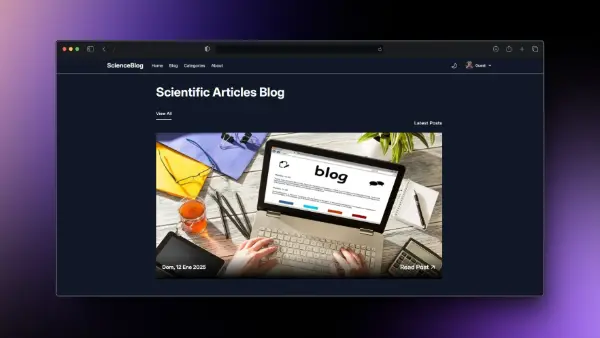

# Blog Articles

Este es un proyecto de blog de artículos científicos desarrollado con Astro. Incluye funcionalidades como inicio de sesión, registro de usuarios, y soporte para artículos con categorías.

<p align="center">
  
</p>

## Estructura del Proyecto

El proyecto está organizado en las siguientes carpetas y archivos:

```
├── astro.config.mjs                # Configuración de Astro
├── db/                             # Configuración y datos iniciales para la base de datos
│   ├── config.ts
│   └── seed.ts
├── dist/                           # Archivos generados durante la construcción del proyecto
├── eslint.config.js                # Configuración de ESLint
├── estructura_proyecto.md          # Documentación de la estructura del proyecto
├── LICENSE                         # Licencia del proyecto
├── package.json                    # Dependencias y scripts del proyecto
├── public/                         # Archivos estáticos
├── src/                            # Código fuente
│   ├── assets/                     # Imágenes y otros recursos
│   ├── components/                 # Componentes Astro reutilizables
│   ├── content/                    # Artículos del blog en formato Markdown
│   ├── layouts/                    # Diseños reutilizables para páginas
│   ├── lib/                        # Lógica auxiliar, como autenticación
│   ├── middleware/                 # Middleware para la API
│   ├── pages/                      # Páginas del sitio
│   └── utils/                      # Utilidades auxiliares
├── tailwind.config.mjs             # Configuración de Tailwind CSS
└── tsconfig.json                   # Configuración de TypeScript
```

## Instalación

Sigue estos pasos para instalar y ejecutar el proyecto en tu entorno local:

1. **Clonar el repositorio:**
   ```bash
   git clone https://github.com/WillJkdev/Blog-Articles.git
   cd blog-articles
   ```

2. **Instalar dependencias:**
   ```bash
   npm install
   ```

3. **Configurar variables de entorno:**
   Crea un archivo `.env` en la raíz del proyecto con el siguiente contenido:
   ```env
   ASTRO_DB_REMOTE_URL=<URL de la base de datos libSQL>
   ASTRO_DB_APP_TOKEN=<Token de autenticación para libSQL>
   ```

4. **Inicializar la base de datos:**
   Si estás utilizando una base de datos remota como Turso, ejecuta:
   ```bash
   astro db push --remote
   ```

5. **Iniciar el servidor de desarrollo:**
   ```bash
   npm run dev
   ```

6. **Construir el proyecto para producción:**
   ```bash
   npm run build
   ```

## Funcionalidades Principales

- **Inicio de sesión y registro:**
  Utiliza [Lucia](https://lucia-auth.com/) para la autenticación y manejo de usuarios.

- **Gestión de artículos:**
  Los artículos se almacenan en formato Markdown dentro de `src/content/blog/`, lo que facilita su creación y edición.

- **Soporte para categorías:**
  Las categorías de los artículos se gestionan dinámicamente.

- **Estilización moderna:**
  Se utiliza [Tailwind CSS](https://tailwindcss.com/) junto con la extensión `@tailwindcss/typography` para el diseño de páginas y artículos.

## Estructura de Código Fuente

### Componentes (`src/components/`)

- **ArticleCard.astro:** Tarjeta para listar artículos.
- **ArticleContent.astro:** Renderizado de contenido de un artículo.
- **Navbar.astro:** Barra de navegación.
- **LoginForm.astro / RegisterForm.astro:** Formularios para inicio de sesión y registro.

### Diseños (`src/layouts/`)

- **MainLayout.astro:** Diseño principal del sitio.
- **SignLayout.astro:** Diseño para páginas de inicio de sesión y registro.
- **BlogLayout.astro:** Diseño para listar artículos del blog.

### Páginas (`src/pages/`)

- **index.astro:** Página principal.
- **signin.astro / signup.astro:** Páginas para inicio de sesión y registro.
- **blog/index.astro:** Página de listado de artículos.
- **blog/[...slug].astro:** Página de detalles de un artículo específico.

## Dependencias

- **Astro:** Framework principal para el desarrollo.
- **Tailwind CSS:** Framework de CSS para estilizar los componentes.
- **Lucia:** Manejo de autenticación.
- **Astro DB:** Integración con bases de datos.
- **Turso:** Base de datos remota basada en libSQL.

## Scripts Disponibles

- `npm run dev`: Inicia el servidor de desarrollo.
- `npm run build`: Construye el proyecto para producción.
- `npm run preview`: Vista previa del proyecto construido.
- `npm run lint`: Ejecuta ESLint para verificar el código.

## Licencia

Este proyecto está bajo la licencia MIT. Consulta el archivo [LICENSE](./LICENSE) para más detalles.

