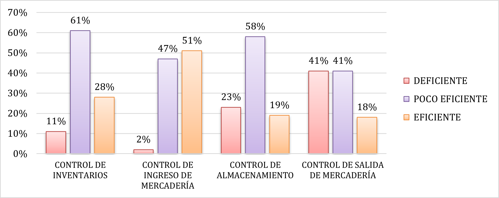
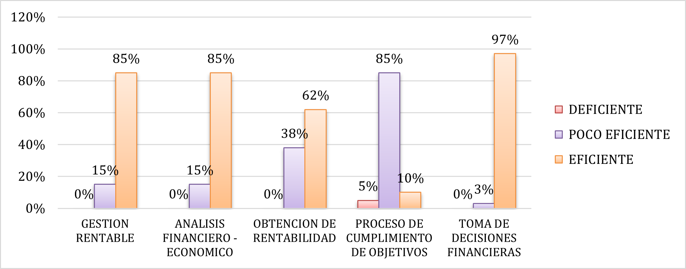

<header class="mb-4 text-sm no-indent">
    

        

            <a href="https://revistas.unjbg.edu.pe/index.php/eyn/issue/view/120" class="text-blue-600">Revista Economía & Negocios</a>
        

        
Vol. 6 Núm. 1, 2024

        

            <strong class="block pt-2">Articulo Original</strong>
        

    

    

        <h1 class="text-xl mb-0">Control de inventarios y gestión rentable en mypes comerciales de calzados</h1>
        <h1>
            Inventory control and profitable management in footwear comercial mypes
        </h1>
    

    

        

            Guselly Stefany Zavaleta Castro*  
            *Autor de correspondencia: 
            <a href="mailto:guzavaletaca@ucvvirtual.edu.pe" class="text-blue-600">guzavaletaca@ucvvirtual.edu.pe</a> - 
            <a href="https://orcid.org/0000-0003-1799-3806" class="text-blue-600">https://orcid.org/0000-0003-1799-3806</a>  
            Universidad César Vallejo. Chimbote, Perú
        

        

            Marjorie Mileny Zavaleta Castro  
            <a href="mailto:mzavaletaca@ucvvirtual.edu.pe" class="text-blue-600">mzavaletaca@ucvvirtual.edu.pe</a> - 
            <a href="https://orcid.org/0000-0001-8913-4061" class="text-blue-600">https://orcid.org/0000-0001-8913-4061</a>  
            Universidad César Vallejo. Chimbote, Perú
        

        

            Jhoansson Victor Manuel Quilia Valerio  
            <a href="mailto:JQUILIAV@ucvvirtual.edu.pe" class="text-blue-600">JQUILIAV@ucvvirtual.edu.pe</a> - 
            <a href="https://orcid.org/0000-0001-8255-2578" class="text-blue-600">https://orcid.org/0000-0001-8255-2578</a>  
            Universidad César Vallejo. Lima, Perú
        

        

            Esta obra está bajo una 
            <a href="https://creativecommons.org/licenses/by/4.0/" class="text-blue-600 underline">Licencia Creative Commons Atribución 4.0 Internacional.</a>
        

        

            Como citar: Zavaleta Castro, G. S., Zavaleta Castro, M. M., &amp; Quilia Valerio, J. V. M. (2024). 
            Control de inventarios y gestión rentable en mypes comerciales de calzados. 
            <em>Economía &amp; Negocios, 6</em>(1), 182-194. 
            <a href="https://www.doi.org/10.33326/27086062.2024.1.1825" class="underline text-blue-600">https://www.doi.org/10.33326/27086062.2024.1.1825</a>
        

        

            CÓDIGO JEL:  
            M40, M41, M42
        

    

</header>

## RESUMEN

La presente investigación analiza el control de inventarios y la gestión rentable en mypes comerciales de
calzados. El objetivo fue identificar la relación entre control de inventarios y la gestión rentable en
las mypes comerciales de calzados de Chimbote, Ancash, 2023. La investigación tuvo un enfoque
cuantitativo, de tipo aplicada y diseño no experimental-transversal y correlacional. La población estuvo
conformada por todos los colaboradores del área administrativa, contable y logística de estas empresas.
Para la muestra, se seleccionaron 40 colaboradores de las áreas citadas; se aplicó un muestreo no
probabilístico por conveniencia. La técnica utilizada fue la encuesta y el instrumento fue un
cuestionario, el cual fue validado por un juicio de expertos y pasó por una prueba de confiabilidad. Los
resultados mostraron que el nivel del control de inventarios fue poco eficiente, mientras que el nivel
de gestión rentable fue eficiente, según los datos analizados. En el análisis inferencial, se reflejó
una sig. bilateral de 0.000 menor a 0.005 y los valores de coeficiente de correlación obtenidos fueron
de 0.750, 0.720, 0.680 y 0.700, lo que indicó que las variables tienen una relación positiva alta. Se
concluyó que el control de inventarios sí se relaciona de forma significativa con la gestión rentable de
mypes comerciales de calzado; esto responde a que en la práctica el control es esencial para asegurar
que la gestión operativa empresarial sea efectuada idóneamente, generando un aumento de rentabilidad.

**_Palabras clave:_** inventario, rentabilidad, toma de
decisiones, finanzas, gestión

## ABSTRACT

This research analyzes inventory control and profitable management in footwear commercial MYPES. The
objective was to identify the relationship between inventory control and profitable management in the
footwear commercial mypes of Chimbote, Ancash, 2023. The research had a quantitative approach, applied
type and non-experimental-cross-sectional and correlational design. The population was made up of all
the collaborators in the administrative, accounting and logistics areas of these companies. For the
sample, 40 collaborators from the aforementioned areas were selected. Non-probabilistic convenience
sampling was applied. The technique used was the survey and the instrument was a questionnaire, which
was validated by an expert judgment and went through a reliability test. The results showed that the
level of inventory control was inefficient while the level of profitable management was efficient,
according to the data analyzed. In the inferential analysis, a sig. bilateral value of 0.000 less than
0.005 and the values of the correlation coefficient obtained were 0.750, 0.720, 0.680 and 0.700, which
indicated that the variables have a high positive relationship. It was concluded that inventory control
is significantly related to the profitable management of footwear commercial mypes, this responds to the
fact that in practice control is essential to ensure that business operational management is carried out
properly, generating an increase in cost effectiveness.

**_Keywords:_** inventory, profitability, decision making,
finance, management

## INTRODUCCIÓN

Las empresas comerciales son las principales fuentes de aportación a la economía de los países, en la
generación de empleos y en la promoción del emprendimiento, teniendo como finalidad el posicionamiento
en el mercado y sector (Lemoine et al., 2020). Estas empresas tienen la constante necesidad de un
crecimiento a base de diferenciarse de otras que brindan el mismo servicio; en consecuencia, definen
estrategias para aumentar los márgenes de ganancia (Izar, 2016). Sin embargo, pese a implementar
estrategias para brindar productos de calidad que logren satisfacer a los clientes y maximizar los
beneficios económicos, existen deficiencias que inciden negativamente en la rentabilidad, la más notable
es el manejo inadecuado de los inventarios, su inversión más significativa (Cano et al., 2015).

El control de las existencias, también conocido como gestión de inventario, es una parte crucial de la
gestión rentable de una empresa en la práctica contable empresarial (Berling & Sonntag, 2022). El
objetivo principal es optimizar el equilibrio entre tener suficiente inventario para satisfacer la
demanda de los clientes y minimizar los costos asociados con el almacenamiento y la gestión del
inventario (Córdova et al., 2022). Los puntos que se destacan en la práctica contable empresarial son
los costos de almacenamiento, debido a que mantener un inventario excesivo puede resultar en altos
costos de almacenamiento, como alquiler de espacio, seguros, mano de obra y mantenimiento. Por otro
lado, un inventario insuficiente puede llevar a pérdida de ventas y clientes insatisfechos. La gestión
adecuada de las existencias busca equilibrar estos costos y minimizarlos al garantizar que el nivel de
inventario sea óptimo para las necesidades del negocio (Nyakam et al., 2022).

Ante lo expuesto, el control de inventarios representa una labor clave para cumplir con los niveles de
ventas que requieren las empresas, por lo que es imprescindible controlar la mercancía que posee desde
el momento de la adquisición hasta su venta (Pulido et al., 2020). Por tal motivo; esta es fundamental
para la buena gestión de las operaciones, solo así se podrá mantener un registro adecuado de los
productos que ingresan y salen del almacén, permitiéndole a la empresa tener una visión clara de la
rotación y el stock de sus productos y, además obtener información veraz y confiable para la posterior
toma de decisiones estratégicas (Cevallos et al., 2022). De la misma forma, permite garantizar que los
productos almacenados estén siempre disponibles, en condiciones óptimas y ubicadas idóneamente (Wagner,
2018).

En ese sentido, es necesario establecer un control efectivo de los inventarios, teniendo en cuenta
herramientas como formatos o registros tanto manuales como sistemáticos que faciliten la revisión de los
procesos que lleva a cabo el área de logística y todo departamento que guarde relación con ella
(Sembiring et al., 2019), puesto que el capital de trabajo y la rotación de activos tienen una directa
incidencia en la rentabilidad de las microempresas (Theodorou et al., 2023). Asimismo, la implementación
de un sistema de control posibilita la efectividad de la gestión de inventarios (De Jesús et al., 2021).
Por otro lado, la ausencia de un control no solo ocasiona pérdidas por sustracciones y deterioro, sino
que debilita la información financiera e impide tomar decisiones oportunas respecto a la compra y venta
(Taparia et al., 2022).

En cuanto a la gestión rentable, este es un proceso o conjunto de operaciones que busca alcanzar los
objetivos planteados por toda empresa a través de instrumentos, estrategias, tácticas o el análisis de
la situación financiera a fin de obtener una mayor rentabilidad (Choy et al., 2023). En ese contexto, es
imprescindible que las micro- y pequeñas empresas cuenten con una gestión efectiva donde la gerencia sea
responsable de planificar, organizar los recursos, dirigir al personal y controlar las operaciones para
el logro de metas (Pérez et al., 2021). Asimismo, para la buena gestión rentable es preciso que los
trabajadores registren los objetivos generales de la empresa para anticipar soluciones ante cualquier
falencia y hacer uso de los activos disponibles sin dejar de darle seguimiento a las operaciones
económicas (Hoyos, 2021).

La gestión también está relacionada de forma directa con la rentabilidad de las empresas, es por ello la
importancia de implementar herramientas que faciliten el proceso y aprovechamiento de los recursos
(Szanto, 2022); en el caso del área de logística es importante efectuar las compras oportunas y poner en
práctica la recepción de productos en buen estado (Marand et al, 2019). Asimismo, la importancia de la
gestión se empareja al hecho de tomar decisiones estratégicas para que las pequeñas empresas puedan
mantener su solvencia económica y mejorar sus niveles de productividad (Ochoa, 2020). Por tal, en su
mayoría, las micro- y pequeñas empresas definen los objetivos antes de llevar a cabo la gestión, esto
con el propósito de darle supervisión a la mercadería utilizada para la venta, utilizando herramientas
de control para aumentar la competitividad dentro del sector donde se desarrollan empresarialmente
(Ramírez et al., 2021).

En ese sentido, la rentabilidad es esencial en el desarrollo de las micro- y pequeñas empresas y está
dividida en rentabilidad económica y rentabilidad financiera (Pardo et al., 2018). La rentabilidad
económica mide la capacidad de los activos para generar beneficios económicos a la empresa, sin
considerar el modo de financiamiento y el costo, puesto que se considera el monto antes de descontar
intereses e impuestos a pagar (Gaytán, 2020); asimismo, es una medida estandarizada que resulta esencial
para conocer los datos de la inversión, tener un parámetro que muestre la eficiencia de la gestión y
ayude en la toma de decisiones futuras (Céspedes, 2021). Y la rentabilidad financiera son los beneficios
dados de la inversión de recursos propios empleados en un periodo determinado y que excluye recursos de
terceros como la deuda financiera, la cual puede mejorar al reducir el activo y aumentar las ventas
(Jagadish & J, 2021).

Por otro lado, muchas de las mypes del Perú registran dificultades para mantener un nivel competitivo y
desarrollarse económicamente debido a problemas financieros que se suscitan porque la gerencia muchas
veces no está calificada para gestionar el negocio y enfrentar los desafíos externos (Colina et al.,
2021). Y es que, el problema que persiste es el inadecuado control de inventarios; esto ocasiona que no
se tenga conocimiento de la cantidad exacta de los productos almacenados, que exista sobrantes y
faltantes de mercadería y que no todos los productos estén aptos o disponibles para la venta, lo que
repercute en los márgenes de ganancias, generando pérdidas cuantiosas (León et al., 2023). A ello se
suma que, al no contar con un sistema de información, no existe un control eficiente de las existencias
(Ramos, 2020).

Bajo este análisis, las micro y pequeñas empresas comerciales abocadas al rubro de calzados de Chimbote,
mostraron ciertas deficiencias en el área de logística como consecuencia del poco control que se maneja
en los inventarios, motivo por el que no se tienen registros de movimientos de los productos almacenados
tanto en su entrada y salida, no se realiza constantemente verificaciones del inventario físico y
tampoco existen registros de los colaboradores que tienen acceso al almacén. Por tal motivo, la gestión
rentable se ha visto afectada al no haber un nivel óptimo de los inventarios, no contar con registros
precisos de los productos mantenidos para la venta y no teniendo información fiable por lo que, fue
disminuyendo la eficiencia al cumplir las demandas del mercado y su rentabilidad prevista.

Por tanto, realizar una investigación correlacional sobre el control de inventarios y la gestión rentable
en las micro- y pequeñas empresas (mypes) comerciales de calzados peruanas es fundamental y relevante
por la identificación de relaciones: ya que en el estudio se busca establecer relaciones entre las
variables. Al encontrar una relación positiva, se puede inferir que un mejor control de inventarios está
asociado con una gestión más rentable. A ello se suma la toma de decisiones informadas producto de los
resultados que proporcionarán data valiosa para la toma decisoria en la gestión empresarial. Si se
demuestra que un buen control de inventarios está relacionado con una gestión rentable, los empresarios
podrían enfocar sus esfuerzos en mejorar sus prácticas de control de inventarios para obtener mejores
resultados financieros.

En ese sentido, el estudio es relevante para la optimización de recursos, ya que un control de
inventarios eficiente puede ayudar a las mypes a optimizar sus recursos y evitar problemas como el
exceso o la falta de inventario. Una investigación correlacional permitiría comprender cómo las
prácticas de control de inventarios se relacionan con la gestión rentable, lo que brindaría orientación
sobre cómo asignar y administrar adecuadamente los recursos disponibles. Asimismo, de forma indirecta
induce a la mejora de la competitividad en el entorno empresarial altamente competitivo, la gestión
eficiente de inventarios marca una diferencia. Si se demuestra que existe una relación, las empresas de
calzados podrían mejorar su capacidad al implementar mejores estrategias de control de inventarios,
maximizando sus ganancias.

Por tanto, el estudio tendrá una contribución al conocimiento académico y empresarial, debido a que este
tipo de investigación en este campo profundizará en ciertos vacíos existentes desde un enfoque
teórico-práctico y empresarial al proporcionar evidencia empírica sobre la relación entre las variables
en las mypes comerciales de calzados. Estos hallazgos podrían ser útiles para futuros estudios y también
para el desarrollo de políticas y prácticas empresariales más efectivas. En síntesis, se justifica la
realización de esta investigación por la relevancia de analizar el control de inventarios y la gestión
rentable en la práctica empresarial ya que, es vital y significativo porque permitirá identificar
relaciones, tomar decisiones informadas, optimizar recursos, mejorar la competitividad y contribuir al
conocimiento en el campo empresarial.

Por lo antes mencionado, el objetivo general del estudio fue identificar la relación entre control de
inventarios y gestión rentable en mypes comerciales de calzados de Chimbote, Ancash, 2023. Del mismo
modo, se establecieron los siguientes objetivos específicos: identificar la relación entre control de
ingreso de mercadería, control de almacenamiento, control de salida de mercadería y gestión rentable en
mypes comerciales de calzados de Chimbote, Ancash, 2023. En ese sentido, se trató de probar la hipótesis
general: El control de inventarios se relaciona con la gestión rentable en mypes comerciales de
calzados, Chimbote, Ancash, 2023. De la misma forma, se plantearon las siguientes hipótesis específicas:
El control de ingreso de mercadería, control de almacenamiento, control de salida de mercadería se
relacionan con la gestión rentable en mypes comerciales de calzados, Ancash, 2023.

## MATERIAL Y MÉTODOS

La investigación se desarrolló bajo un enfoque cuantitativo, debido a la recopilación y análisis de datos
numéricos para obtener conclusiones objetivas y generalizables; de tipo aplicada, ya que busca
proporcionar información relevante y útil para abordar una situación con el objeto de solucionar un
problema específico; diseño no experimental-transversal, debido a que no existió manipulación de las
variables y los datos fueron acopiados en un contexto natural; también fue correlacional porque busca
determinar si existe una asociación estadística entre las variables.

En cuanto a la población, estuvo conformada por todos los colaboradores del área contable, logística y
administrativa de las mypes de calzados de Chimbote, Ancash. En esa línea, para la muestra
representativa, se seleccionó a 45 colaboradores de 10 mypes y se aplicó un muestreo no probabilístico
por conveniencia, debido a que los elementos se eligieron de forma conveniente y accesible para los
investigadores. En este, no se utiliza un proceso aleatorio para elegir los elementos de la población,
sino que se aplicaron los criterios de accesibilidad y tiempo (Hernández y Mendoza, 2018).

La técnica empleada fue la encuesta, dirigida a 40 trabajadores del área contable y administrativa de las
empresas comerciales de calzados selectas. Como instrumento de recolección de datos se recurrió al
cuestionario, el cual fue validado por expertos profesionales, quienes evaluaron y garantizaron la
relevancia, pertinencia y claridad de los ítems; para medir la confiabilidad del instrumento, se aplicó
la prueba alfa de Cronbach, obteniendo un resultado aplicable (Santiesteban, 2018).

Por tanto, los procedimientos llevados a cabo iniciaron con el procesamiento de la data obtenida a través
de la tabulación de encuestas, haciendo uso del programa estadístico SPSS v26 para posteriormente
realizar el análisis descriptivo e inferencial, a fin de describir los niveles de las variables y
corroborar las hipótesis planteadas. En el análisis inferencial, se utilizó la prueba de Rho de Spearman
para conocer la correlación existente entre las variables definidas.

**Tabla 1**

*Matriz de operacionalización de variables*

| Variable 1                       | Variable 2                           |
| -------------------------------- | ------------------------------------ |
| Control de inventarios           | Gestión rentable                     |
| Dimensiones                      | Dimensiones                          |
| Control de ingreso de mercadería | Proceso de cumplimiento de objetivos |
| Control de almacenamiento        | Análisis financiero - económico      |
| Control de salida de mercadería  | Toma de decisiones financieras       |
|                                  | Obtención de rentabilidad            |

## RESULTADOS

Se presentaron los resultados de la investigación, los que mostraron el análisis descriptivo e
inferencial. Estos datos son relevantes para adquirir conocimientos sobre el manejo que llevan las
micro- y pequeñas empresas comerciales de calzados de Chimbote respecto a sus inventarios, sirviendo
como base para proporcionar recomendaciones.

**Figura 1**

*Niveles del control de inventarios y sus dimensiones*

En la figura 1 se exhibe que la tendencia predominante es el nivel poco eficiente para el control de
inventarios (61 %) y sus dimensiones de control de ingreso de mercadería (47 %), control de
almacenamiento (58 %) y control de salida de mercadería (41 %). Estos responden a que las empresas de
calzado presentan deficiencias en el área de logística respecto al control de inventarios, mostrándose
que el nivel de control de almacenamiento y el control de salida es poco eficiente y deficiente. Y como
interpretación de este análisis, es necesario que las empresas implementen políticas o sistemas que les
permita mejorar el control de sus inventarios a fin de mantener un stock sin excesos ni faltas.

**Figura 2**

*Niveles de la gestión rentable y sus dimensiones*

En la figura 2 se exhibe que la tendencia predominante es el nivel eficiente para la variable gestión
rentable (85 %) y sus dimensiones de proceso de cumplimiento de objetivos (10 %), análisis
financiero-económico (85 %), toma de decisiones financieras (97 %) y obtención de rentabilidad (62 %).
Estos datos responden a que las empresas de calzados evidenciaron una buena gestión como consecuencia de
los procesos a los que dieron cumplimiento para generar mayores beneficios económicos. Y como
interpretación de este análisis tenemos que, la eficiente gestión es primordial en toda empresa para
efectuar sus actividades económicas de manera idónea, permitiendo un aumento en las ventas y, por ende,
una rentabilidad beneficiosa.

**Tabla 2**

*Resumen de contrastación de las hipótesis*

| Hipótesis   | Variables                                           | Prueba          | N.º | Sig. Bilateral | Coeficiente correlación |
| ----------- | --------------------------------------------------- | --------------- | --- | -------------- | ----------------------- |
| Hip. Gen.   | Control de inventarios y gestión rentable           | Rho de Spearman | 40  | 0.000          | 0.750                   |
| Hip. Esp. 1 | Control de ingreso de mercadería y gestión rentable | Rho de Spearman | 40  | 0.000          | 0.720                   |
| Hip. Esp. 2 | Control de almacenamiento y gestión rentable        | Rho de Spearman | 40  | 0.000          | 0.680                   |
| Hip. Esp. 3 | Control de salida de mercadería y gestión rentable  | Rho de Spearman | 40  | 0.000          | 0.700                   |

En la tabla 2 se muestra la contrastación de las hipótesis, para la cual se aplicó la prueba de Spearman,
buscando conocer la relación existente entre las variables de estudio, por lo que se estableció una sig.
bilateral de 0.05. En ese sentido, en los resultados se puede observar que el p-valor fue de 0.000 para
todas las hipótesis planteadas, siendo menor a 0,05. Por lo tanto, el control de inventarios, control de
ingreso de mercadería, control de almacenamiento y control de salida de mercadería sí se relacionan de
forma significativa con la gestión rentable de las empresas del sector, siendo esta positiva alta. Y es
determinante porque indican que las empresas del sector pueden mejorar su rentabilidad al prestar
atención y mejorar sus prácticas de control de inventarios y gestión.

## DISCUSIÓN

Bajo el análisis de los resultados de la hipótesis general se determina que el control de inventarios se
relaciona significativamente con la gestión rentable de las micro- y pequeñas empresas comerciales de
calzado; esto responde a que el manejo idóneo del inventario es determinante para una gestión eficiente
de las operaciones empresariales. Estos resultados se asemejan a los resultados de González (2020), en
los que se destaca una relación positiva entre la gestión de inventarios y la rentabilidad, puesto que,
al focalizar los productos relevantes para la empresa con un modelo de gestión, el nivel de servicio y
ventas aumentó considerablemente. Asimismo, los resultados de Zambrano et al. (2021), contrastan que el
capital de trabajo de las empresas comerciales y su rotación inciden positivamente en la rentabilidad
económica, por lo que es importante evaluar la gestión que se realiza y tomar decisiones en base a los
reportes.

En cuanto a los resultados de la hipótesis específica 1, se determina que el control de ingreso de
mercadería se relaciona significativamente con la gestión rentable; esto responde a que es primordial la
supervisión de los productos antes de su ingreso al almacén a fin de optimizarlos y utilizar la
información para la toma de decisiones que permitan un aumento en el rendimiento. Estos resultados
guardan relación con los resultados de Saleem y Asad (2023), quienes exponen que el control de
inventarios se relaciona con la rentabilidad, ya que los recursos juegan un papel crucial en la eficacia
y crecimiento de la empresa y sin un control adecuado la empresa no puede operar o cumplir con la
demanda de los clientes. Asimismo, esto coincide con los de Ruiz et al. (2022), pues el manejo
deficiente de la mercancía al momento de su recepción ocasiona pérdidas en la utilidad e impide la
solvencia de los gastos.

En cuanto a los resultados de la hipótesis específica 2, se determina que el control de almacenamiento se
relaciona significativamente con la gestión rentable; esto responde a que la verificación de las
existencias tanto física como sistemática logra un control más preciso de la mercadería que se tiene
almacenada, lo que proporcionada información para una gestión más viable. En ese sentido, esto se
relaciona con los resultados de Song et al. (2020), en cuanto la gestión de inventarios se asocia a la
rentabilidad, debido a que los modelos para el control de inventarios y la medición de su capacidad
deben ser efectuados para la posterior toma de decisiones que mejoren los ingresos. De igual manera,
estos datos se relacionan con los resultados de Rashid (2023), puesto que el efecto de la gestión de
inventarios en el desarrollo de una empresa resulta positiva cuando se lleva a cabo de forma precisa y
veraz.

En cuanto a los resultados de la hipótesis específica 3, se determina que el control de salida de
mercadería se relaciona significativamente con la gestión rentable; esto responde a que la mercadería
retirada del almacén debe ser supervisada y controlada mediante registros o comprobantes con el
propósito de contar con datos fiables que favorezcan a la gestión rentable. En esa línea, estos
resultados tienen similitud con los resultados de Pulido et al. (2020), quien determina que los
inventarios se relacionan con la rentabilidad, puesto que, los inventarios representan parte fundamental
del capital invertido por estas empresas, el cual es utilizado para satisfacer la demanda del mercado y
mejorar sus ingresos. Asimismo, estos resultados son semejantes a los de Paricahua (2022), puesto que
existe relación positiva entre la gestión logística y la rentabilidad, ya que la administración adecuada
evita problemas en las ventas.

## CONCLUSIONES

Tras una profunda investigación, se concluye que el control de inventario y la gestión rentable de las
micro- y pequeñas empresas comerciales de calzado se relacionan significativamente entre sí; pues el
control de inventarios es esencial para efectuar las operaciones de la manera más acorde y precisa en
estas empresas, dándole cumplimiento a los objetivos planteados y proporcionando información sobre el
estado del stock y rotación de la mercadería; de este modo, se garantiza la optimización de los recursos
y la satisfacción de las necesidades del consumidor, imprescindible para que las ventas prosperen y las
ganancias superen el nivel deseado, permitiendo la solvencia empresarial.

Por otra parte, se concluye que existe una asociación práctica entre el control de ingreso de mercadería,
el control de almacenamiento y el control de salida de mercadería con la gestión rentable de las micro-
y pequeñas empresas comerciales de calzado de Chimbote, Ancash. Esto sucede puesto que, un control poco
eficiente en los inventarios impide la buena gestión de las actividades en estas empresas, retrasando el
alcance de las metas, afectando el análisis de la información financiera y la toma de decisiones, lo que
repercute en la obtención de rentabilidad. Por ello, es de suma relevancia que estas empresas ejecuten
un control más efectivo a través de la implementación de nuevas políticas empresariales, programas
sistemáticos de acuerdo a su necesidad, uso de registros como el Kardex, entre todos, a fin de mejorar
la gestión.

## CONTRIBUCIÓN DE LOS AUTORES

Guselly Stefany Zavaleta Castro: Curación de datos, análisis formal, adquisición de fondos, recursos,
software, redacción: borrador original.

Marjorie Mileny Zavaleta Castro: Conceptualización, investigación, administración del proyecto,
visualización.

Jhoansson Quilia Valerio: Metodología, supervisión, validación, redacción: revisión y edición.

## FUENTE DE FINANCIAMIENTO

Se utilizaron recursos propios para llevar a cabo la presente investigación.

## CONFLICTOS DE INTERÉS

Los autores expresan que no existe conflicto de intereses.

## AGRADECIMIENTOS

No aplica.

## PROCESO DE REVISIÓN

Este estudio ha sido revisado por pares externos en modalidad de doble ciego.

## DECLARACIÓN DE DISPONIBILIDAD DE DATOS

Los datos se encuentran alojados junto a los demás archivos de este artículo, también se pueden pedir al
autor de correspondencia.

## REFERENCIAS

Berling, P. y Sonntag, D. (2022). Inventory control in production-inventory systems with random yield and
rework: The unit-tracking approach. *Production and Operations Management, 31*, 2628-2645. <https://doi.org/10.1111/poms.13706>

Cano, P., Orue, F., Martínez, J., Mayett, Y. y López, G. (2015). Modelo de gestión logística para
pequeñas y medianas empresas en México. *Contaduría y Administración, 60*(1), 181-203. <https://www.sciencedirect.com/science/article/pii/S0186104215721510>

Céspedes, W. (2021). La gestión financiera y su resultado en la rentabilidad de las mypes productoras de
calzado, Carabayllo, Lima, 2021. *Científica Multidisciplinar, 6*(4), 648-664. <https://doi.org/10.37811/cl_rcm.v6i4.2611>

Cevallo, L., Nuñez. J. y Leyva, M. (2022). Modelo de optimización para inventarios, basado en Simulación
Monte Carlo y Algoritmo Metaheurístico Genético. *Universidad y Sociedad, 14*(S6), 448-458. <https://rus.ucf.edu.cu/index.php/rus/article/view/3476>

Choy, W., Alejandría, C. y Ruiz, E. (2023). Gestión empresarial y su influencia en la rentabilidad de la
empresa DYNAMO GROUP E.I.R.L. *Ciencia Latina Revista Científica Multidisciplinar, 7*(1),
5859-5873. <https://doi.org/10.37811/cl_rcm.v7i1.4828>

Colina, F., Josía, I. y Aldana, J. (2021). Impacto del COVID-19 en pequeñas y medianas empresas del Perú.
*Revista de Ciencias Sociales, 27*, 16-31. <https://doi.org/10.31876/rcs.v27i.36991>

Córdova, I., Manguinuri, L., Farfán, S. Romero, R. (2022). La mejora de la rentabilidad mediante el
control de inventario. *Colón Ciencias, Tecnología y Negocios, 9*(2), 32-40. <http://portal.amelica.org/ameli/journal/215/2153488003/2153488003.pdf>

De Jesús, B., Solana, J., Garzón, H. y Ortiz, G. (2021). Análisis comparativo entre modelos de
programación matemática restringida para manejo de inventarios. Caso de estudio en el clúster
manufacturero cartagenero. *Investigación operacional, 42*(1), 84-96. <https://rev-inv-ope.pantheonsorbonne.fr/indice-vol-42-2021>

Gaytán, J. (2020). The business plan and profitability. *Mercados y Negocios*, (42), 131-144. <http://bitly.ws/Bkyv>

González, A. (2020). Un modelo de gestión de inventarios basado en estrategia competitiva. *Ingeniare,
48*(1), 133-142. <http://dx.doi.org/10.4067/S0718-33052020000100133>

Hernández, R. y Mendoza, C. (2018). *Metodología de la investigación: las rutas cuantitativa,
cualitativa y mixta*. Editorial McGraw Hill Education. <http://repositorio.uasb.edu.bo:8080/handle/54000/1292>

Hoyos, C. (2021). Decision-making and effectiveness of business results in times of COVID-19.
*International Review of Management and Marketing, 11*(3), 1-12. <https://econjournals.com/index.php/irmm/article/view/11344>

Izar, J., Ynzunza, C. y Guarneros, O. (2016). Variabilidad de la demanda del tiempo de entrega,
existencias de seguridad y costo del inventario. *Contaduría y Administración, 61*(3), 499-513.
<https://www.sciencedirect.com/science/article/pii/S0186104215001199>

Jagadish, A. y J., S. (2021). Impact of profitability on the business, cash flow and profitability.
*PalArch’s Journal of Archaeology of Egypt/ Egyptology, 18*(8), 4425-4434. <https://archives.palarch.nl/index.php/jae/article/view/9684>

Marand, A., Li, H. y Thorstenson, A. (2019). Joint inventory control and pricing in a service-inventory
system. *International Journal of Production Economics, 209*, 78-91. <https://doi.org/10.1016/j.ijpe.2017.07.008>

Lemoine, F., Delgado, Y. y Hernández, N. (2020). Análisis de la actividad comercial para la
sostenibilidad en los negocios del Cantón Sucre. *Ciencias administrativas*, (15), 97-106. <https://dialnet.unirioja.es/servlet/articulo?codigo=7743265>

León, C., Maguiña, O. y León, F. (2023). Control Interno para la mejora de la rentabilidad empresarial en
Nuevo Chimbote-Perú. *Revista de Ciencias Sociales, 29*(7), 66-76. <https://doi.org/10.31876/rcs.v29i.40447>

Nyakam, D., Hachour, S. y Abouaissa, H. (2022). Inventory Control in Suplly Chain: a Model-Free Approach.
*IFAC-PapersOnLine, 55*(10), 2755-2760. <https://doi.org/10.1016/j.ifacol.2022.10.141>

Ochoa, C., Marrufo, R. y Ibáñez, L. (2020). Gestión de costos como herramienta de la rentabilidad en
pequeñas y medianas empresas. *Espacios, 41*(50), 287-298. <https://www.revistaespacios.com/a20v41n50/a20v41n50p20.pdf>

Pardo, M., Armas, R. y Higuerey, A. (2018). La influencia del capital intelectual sobre la rentabilidad
de las empresas manufactureras ecuatorianas. *Espacios, 39*(51). <https://www.revistaespacios.com/a18v39n51/18395114.html>

Paricahua, H. (2022). Gestión logística y su relación con la rentabilidad de empresas constructoras en la
provincia de San Román, Puno. *Quipukamayoc, 30*(62), 67-75. <https://doi.org/10.15381/quipu.v30i62.22179>

Pérez, R., De Miguel, M. y Sánchez, A. (2021). Mirada a las prácticas de gestión de recursos humanos en
Ecuador. *Revista de Ciencias Sociales, 27*, 246-266. <https://doi.org/10.31876/rcs.v27i.37005>

Pulido, A., Pizarro, A, Padilla, M., Sánchez, M. y De la Rosa, L. (2020). An optimization approach for
inventory costs in probabilistic inventory models: A case study. *Ingeniare, 48*(3), 383-395. <https://www.scielo.cl/pdf/ingeniare/v28n3/0718-3305-ingeniare-28-03-383.pdf>

Ramírez, R., Ríos, J., Lay, N. y Ramírez, R. (2021). Estrategias empresariales y cadena de valor en
mercados sostenibles: Una revisión teórica. *Revista de Ciencias Sociales, 27*, 147-161. <https://doi.org/10.31876/rcs.v27i.36999>

Ramos, C. (2020). La Gestión de Calidad, la Competitividad. El Financiamiento y la Formalización en las
Mype de la Provincia de Sullana, Perú. *Revista Tecnológica Espol - RTE, 32*(1), 79-83. <https://doi.org/10.37815/rte.v32n1.699>

Rashid, A. y Rasheed, R. (2023). Mediation of Inventory Management in the Relationship Between Knowledge
and Firm Performance. *Sage Journals, 13*(2), 1-11. <https://doi.org/10.1177/21582440231164593>

Ruiz, E., Tuanama, M., Soto, S. y Villafuerte, A. (2022). Inventory control in the financial economic
situation of a company. *Sapienza: International Journal of Interdisciplinary Studies, 3*(1),
388-398. <https://doi.org/10.51798/sijis.v3i1.166>

Saleem, S. y Asad, U. (2023). The Pros and Cons of Inventory Control Strategies, and How Does it Affect
the Company’s Performance. *International Journal of Operations Management, 3*(1), 7-14. <https://doi.org/10.18775/ijom.2757-0509.2020.31.4001>

Santiesteban, E. (2018). *Metodología de la investigación para las ciencias contables*. Edacun.
Tepatlaxco de Hidalgo-México.

Sembiring, A., Tampubolon, J., Sitanggang, D., Turnip, M. y Subash (2019). Improvement of Inventory
System USing FIFO Method. *Journal of Physics: Conference Series, 1361*(1), 1-6. <https://iopscience.iop.org/article/10.1088/1742-6596/1361/1/012070>

Song, J., Van, G. y Van, J. (2020). Capacity and Inventory Management: Review, Trends and Projections.
*Manufacturing and Service Operations Management, 22*(1), 36-46. <https://doi.org/10.1287/msom.2019.0798>

Szanto. R. (2022). Intuitive decisión-making and firm performance. *Journal of Decision Systems,
31*(1), 50-59. <https://doi.org/10.1080/12460125.2022.2080796>

Taparia, R., Janardhanan, S. y Gupta, R. (2022). Laguerre function-based model predictive control for
multiple product inventory systems. *International Journal of Systems Science - Operations y
Logistics, 9*(1), 133-142. <https://doi.org/10.1080/23302674.2020.1846094>

Theodorou, E., Spiliotis, E. y Assimakopoulos. (2023). Optimizing inventory control through a data-driven
and model-independent framework. *EURO Journal on Transportation and Logistics, 23*, 1-14. <https://doi.org/10.1016/j.ejtl.2022.100103>

Wagner, M. (2018). Robust Inventory Management: An Optimal Control Approach. *Operations Research,
66*(2), 426-447. <https://doi.org/10.1287/opre.2017.1669>

Zambrano, F., Rivera, C., Quimi, D. y Flores, E. (2021). Factores explicativos de la rentabilidad de las
microempresas: Un estudio aplicado al sector comercio. *INNOVA Research Journal, 6*(3.2), 63-78.
<https://doi.org/10.33890/innova.v6.n3.2.2021.1974>

