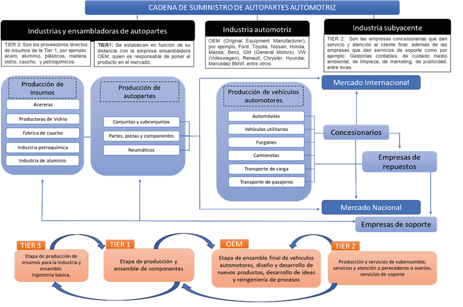
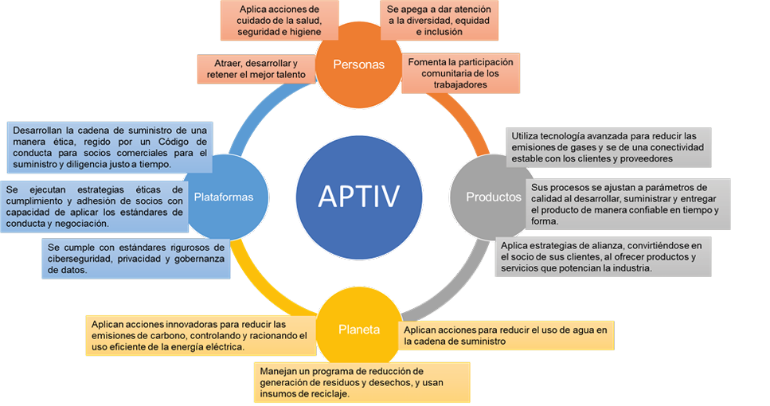

<header class="mb-4 text-sm no-indent">
   

      
<a href="https://revistas.unjbg.edu.pe/index.php/eyn/issue/view/120" class="text-blue-600">Revista Economía & Negocios</a>

      
Vol. 6 Núm. 1, 2024

      
<strong class="block pt-2">Articulo Original</strong>

   

   

      <h1 class="text-xl mb-0">Dimensiones estratégicas de sostenibilidad y resiliencia en la cadena de suministro de la empresa Aptiv</h1>
      <h1>Strategic dimensions of sustainability and resilience in the supply chain of the Aptiv company</h1>
   

   

      

         Patricia Carmina Inzunza-Mejía*  
         * Autor de correspondencia: inzunzap@uas.edu.mx - <a target="_blank" href="https://orcid.org/0000-0001-8789-4972" class="text-blue-600">https://orcid.org/0000-0001-8789-4972</a>  
         Universidad Autónoma de Sinaloa, Facultad de Ciencias Económicas, Administrativas y Tecnológicas. Guamúchil, Sinaloa, México
      

      

         Oracio Valenzuela-Valenzuela  
         oracio@uas.edu.mx - <a target="_blank" href="https://orcid.org/0000-0003-0703-9875" class="text-blue-600">https://orcid.org/0000-0003-0703-9875</a>  
         Universidad Autónoma de Sinaloa, Facultad de Contaduría y Administración. Culiacán, Sinaloa, México
      

      

         Dulce Livier Castro-Cuadras  
         dulce_castro@cbtis45.edu.mx - <a target="_blank" href="https://orcid.org/0000-0002-7431-1210" class="text-blue-600">https://orcid.org/0000-0002-7431-1210</a>  
         Centro de Bachillerato Tecnológico Industrial y de Servicios No. 45, Departamento de Vinculación con el Sector Productivo. Guamúchil, Sinaloa, México
      

      

         Carely Cecilia Cuevas López  
         carelycuevas85@gmail.com - <a target="_blank" href="https://orcid.org/0009-0009-0756-2042" class="text-blue-600">https://orcid.org/0009-0009-0756-2042</a>  
         Universidad Autónoma de Sinaloa, Facultad de Ciencias Económicas, Administrativas y Tecnológicas. Guamúchil, Sinaloa, México
      

      
Esta obra está bajo una <a target="_blank" href="https://creativecommons.org/licenses/by/4.0/" class="text-blue-600">Licencia Creative Commons Atribución 4.0 Internacional.</a>

      

         Como citar: Inzunza-Mejía, P. C., Valenzuela-Valenzuela, O., Castro-Cuadras, D. L., Cuevas-López, C. C. (2024). Dimensiones estratégicas de sostenibilidad y resiliencia en la cadena de suministro de la empresa Aptiv. <em>Economía & Negocios, 6</em>(1), 03-23. <a target="_blank" href="https://www.doi.org/10.33326/27086062.2024.1.1854" class="text-blue-600">https://www.doi.org/10.33326/27086062.2024.1.1854</a>
      

      

         CÓDIGO JEL:  
         M11, M14, M16
      

   

</header>

## RESUMEN

En la presente investigación se analizan las dimensiones estratégicas de la cadena de suministro de la
empresa Aptiv, como modelo de óptimo funcionamiento en la administración de inventarios y los flujos de
suministro que la hacen resiliente y sostenible. El estudio es de enfoque cualitativo, de tipo
exploratorio y descriptivo, bajo un diseño no experimental. Se desarrolló el método analítico para la
revisión de la literatura científica y el de estudio de caso, siguiendo los principios de just in time y
de administración de inventarios. Se implementó el modelo de intervención de práctica profesional, las
técnicas de entrevista semiestructurada y el cuestionario autoadministrado. En conclusión, las
dimensiones social, ambiental, industria de calidad y tecnológica consolidan la cadena de suministro,
haciéndola resiliente y sostenible, mediante la aplicación de estrategias que optimizan la gestión de
inventarios con base en la tecnología, la experiencia y el aprendizaje reforzado de los procesos de
suministro que permiten una distribución sencilla, amigable y resiliente, con acciones de cuidado y
protección al medio ambiente, así como estrategias éticas y de responsabilidad social que fortalecen las
gobernanzas y la relación con sus clientes asociados (Tier 2, Tier 3 y OEM); razón por la que la empresa
no solo perfecciona de manera permanente su estrategia de sostenibilidad, sino que también da
continuidad y seguimiento a las directrices de la Global Reporting Initiative (GRI) para mantener la
aplicación de estándares de calidad; por lo que, desde la perspectiva de gobernanza, se someten a
procesos de evaluación externa para visibilizar su impacto económico, tecnológico, social y ambiental.

**_Palabras clave:_** administración de inventarios, cadena de
suministro, dimensiones estratégicas, empresa Aptiv, práctica profesional

## ABSTRACT

This research analyzes the strategic dimensions of the Aptiv company’s supply chain, as a model of
optimal functioning in inventory management and supply flows that make it resilient and sustainable. The
study has a qualitative approach, exploratory and descriptive, under a non-experimental design. The
analytical method was developed for the review of scientific literature and the case study, following
the principles of just-in-time and inventory management. The intervention model in professional
practice, semi-structured interview techniques and the self-administered questionnaire were implemented.
In conclusion, the social, environmental, quality industry and technological dimensions consolidate the
supply chain, making it resilient and sustainable, through the application of strategies that optimize
inventory management based on technology, experience and reinforced learning of the supply processes
that allow a simple, friendly and resilient distribution, with environmental care and protection
actions, as well as ethical and social responsibility strategies that strengthen governance and the
relationship with its associated customers (Tier 2, Tier 3 and OEM); which is why the company not only
permanently improves its sustainability strategy, but also provides continuity and monitoring of the
guidelines of the Global Reporting Initiative (GRI) to maintain the application of quality standards;
therefore, from a governance perspective, they undergo external evaluation processes to make their
economic, technological, social and environmental impact visible.

**_Keywords:_** inventory management, supply chain, strategic
dimensions, Aptiv company, professional practice

## INTRODUCCIÓN

La industria automotriz a nivel mundial enfrenta un gran desafío como producto de la inteligencia
artificial y la llegada de los autos electrónicos; por lo que, Taheri, Sadegh Amalnick, Taleizadeh y
Mardan (2023) consideran que el contexto internacional actual es cada vez más competitivo para la
industria, dado que dinamiza la naturaleza del ambiente empresarial en la gestión de inventarios, la
cadena de suministro, la disminución de costos y la contratación de créditos que implica desafiantes
flujos financieros. En México, esto no pasa desapercibido si se considera que unos de los sectores de
mayor impacto dinamizador por la generación de empleo y utilidades es el automotriz, razón por la que
diversas empresas se suman a las cadenas de suministro general de la industria automotriz.

En este sentido, el propósito de la investigación es identificar las diferentes dimensiones de la
estrategia de manufactura y los elementos que componen la administración de la cadena de suministro en
el control de inventarios de una empresa manufacturera de orden global; a fin de documentar el deseable
funcionamiento de la red de proveedores, el seguimiento de la administración de inventarios y su
importancia como dimensión clave en la cadena de suministro. Para Rinaldi, Fera, Macchiaroli y Bottani
(2023), la gestión del inventario para reponer artículos deteriorados o averiados representa un proceso
estratégico crítico en muchas empresas manufactureras, por la cantidad y diversidad de artículos a
manejar.

De ahí que se plantea como objetivo analizar los elementos de la administración de la cadena de
suministro global que se sigue en las diferentes dimensiones de la estrategia de manufactura para un
óptimo funcionamiento de la administración de inventarios como dimensión clave de la cadena de
suministro de la empresa APTIV, por lo que se plantean como preguntas de investigación: ¿cómo se
relaciona la administración de inventarios con la gestión de la cadena de suministro?, ¿qué factores
influyen en la administración de la cadena de suministro? y ¿qué impacto tiene la descentralización de
la cadena de suministro en la empresa?

La administración de inventarios es la base para gestionar eficientemente en tiempo y espacio la cadena
de suministro; considerando que esta es la bujía de la que depende el éxito de una empresa de orden
global. De ahí que el factor tiempo, espacio y mano de obra son factores determinantes para la óptima
administración de la cadena de suministro de la que depende el éxito de la empresa en un mercado
competitivo de orden internacional; por lo que, de manera hipotética, se considera que, con el correcto
manejo y control de inventarios, se dará una óptima administración de la cadena de suministro, lo que
permitirá el desempeño efectivo de procesos que deberán ser planeados detalladamente y, en consecuencia,
esto permitirá registrar la gestión de la demanda.

Entre los problemas que prevalecen en las empresas manufactureras, Wu, de Carvalho Servia y Mowbray
(2023) observan espacios subutilizados e ineficiencias en la infraestructura del almacén que elevan el
riesgo que condicionan la flexibilidad y acceso amable de la mercancía a suministrar. Al respecto, He,
Xu, y Shen (2023) observan que los inventarios de la empresa se ven afectados por los riesgos climáticos
e identifican a los desastres climáticos como uno de los principales factores de pérdidas de productos
terminados y no terminados.

Esto de acuerdo con Tadayonrad y Balle Ndiaye (2023) corresponde a sistemas complicados y desalineados en
el manejo de control de inventarios que provocan el exceso de producción y elevados costos de
mantenimientos por el exceso de inventario o, en caso contrario, Nya y Abouaïssa (2023) estiman que el
desabasto es inherente a los retrasos de las entregas y distribución de mercancías; por lo que la
organización al ser de orden global, requiere estrategias efectivas que fortalezcan los procesos de la
cadena de suministro y faciliten su dinámica de gestión.

Sucede que, en un contexto de complejidad moderna, Žic, Žic y Đukić (2023) estiman que se requiere
planificar de manera efectiva la reposición de inventario y para realizarlo se debe ejecutar un control
permanente; para lo cual, Nya y Abouaïssa (2023) proponen la creación y desarrollo de las cadenas de
suministro que se asoman a una dinámica imperativa de la economía internacional que demanda y subraya la
necesidad de mejores prácticas en la gestión de la administración de inventarios.

Por su parte Yang (2023) y Ranjan Pathy y Rahimian (2023) identifican que estas organizaciones de orden
global mantienen una demanda fluctuante con cambios estacionales, inestable e incierta, acumulando
artículos susceptibles de desperdiciarse, deteriorarse y averiarse; que, al sumar la dependencia de las
importaciones, se alargan y retrasan los tiempos de entregas, elevando sus costos en la administración
de almacenes, razón por la que Chandramohan, Asoka Chakravarthi y Ramasamy (2023) consideran que ante la
incertidumbre y excesiva dependencia de las importaciones, estas organizaciones requieren de cadenas de
suministro resilientes que operen a través de sistemas independientes de gestión de inventarios para
artículos deteriorados en correspondencia a la relación proveedor-minorista-cliente y que, desde la
perspectiva de Caramia y Stecca (2023), se considere estrategias de procesos verdes que minimicen los
costos y el impacto negativo en el acomodo de la mercancía en el almacén que, según refieren Önden,
Fahrettin, Zafer Acar y Çancı (2023), afecta las decisiones de reemplazo.

Al respecto, Demizu, Fukazawa y Morita (2023) enfatizan que la optimización de la gestión de inventarios
debe aplicarse en la cadena de suministro de productos con ciclo de vida corto, dado que los factores
que determinan el nivel óptimo de inventario conducen a reducir las pérdidas de productos y los
inventarios defectuosos, lo que es relevante para elevar las ganancias de la empresa.

De acuerdo con Gioia, Felizardo y Brandimarte (2023), la administración de inventarios es relevante ante
las tendencias del mínimo desperdicio, que permite la eficacia de las ventas cruzadas o de competencia
con otros artículos similares o complementarios. Asimismo, Liu y Nishi (2024) sostienen que la gestión
de inventarios cobra importancia al generar soluciones en el uso del espacio a través de modelos
sustitutos de inventarios y es útil al resolver problemas en los productos perecederos.

Por su parte, Long, Kim, Cuong y You (2023) atribuyen su importancia debido al interés de los clientes
por los artículos, que se reduce debido a la escasa calidad de los productos deteriorados; razón por la
que se necesita una política dinámica de precios a la baja que aumente la rentabilidad del comerciante
en distintos escenarios por factores de incidencia no determinísticos.

También, He, et al. (2023) estiman que la importancia de la administración de inventarios radica en que
mitiga los riesgos del cambio climático, mejorando las condiciones de cadena de suministro y el tránsito
de mercancías. Esto coincide con lo referido por Chandramohan, et al. (2023), al considerar las
emisiones de carbonos y los impuestos al carbono en el proceso productivo; no obstante, Taheri, et al.
(2023) consideran que el inventario y los flujos financieros de una empresa son interdependientes, por
lo que es necesario establecer un plan óptimo para administrarlos simultáneamente, lo que podría incidir
favorablemente en la eficiencia de la empresa.

Varias investigaciones registran los factores que influyen en la administración de la cadena de
suministro, considerándose que una alternativa de suministro es el de abastecimiento dual. Al respecto,
Hamdouch, Boulaksil y Ghoudi (2023) proponen un sistema de administración de inventario con
abastecimiento escalonado de entrada; es decir, desde la demanda, a través del cual, el comprador
obtiene un producto de dos proveedores diferentes, considerándose el evento de compra constante cuando
el producto se suministra de manera estable o compra emergente cuando la compra es inestable; lo que
concuerda con el estudio de He, et al. (2023) al identificar que, mediante la administración de
inventarios dual, se da un mejor orden a la aglomeración espacial industrial, aliviando eficazmente la
presión del riesgo climático en la cadena de suministro, el tránsito y la distribución de mercancías.

Otro aspecto importante en la cadena de suministro es la dimensión o estrategia clave, dado que permite
establecer criterios, condiciones y negociaciones de compra, suministro y venta. De acuerdo con
Chandramohan, et al. (2023), una estrategia dentro de la cadena de suministro es que el proveedor
ofrezca crédito al minorista y este a sus clientes, durante un periodo de corto y mediano plazo, además
de que la separación del lote de mercancía averiada o productos imperfectos quede a cargo del minorista.

Asimismo, entre las dimensiones estratégicas de una cadena de suministro se puede observar la
tecnológica. Pese a su alto costo Rahman, Gani, Fatema y Takahashi (2023) y Liu y Nishi (2024) plantean
modelos de simulación desde la perspectiva computacional que permite la aplicación simulada de modelos
óptimos de suministro y, en consecuencia, deriva escenarios posibles, desde los más conservadores y
resilientes a los más óptimos y sofisticados.

Además, se registra la dimensión de sostenibilidad, que se basa en estrategias de compensación y
remplazo, demanda y presión de compra y otros factores derivados del contexto internacional y local.
Mientras que, Fritz y Cordova (2023), Torres Vergara, Saucedo Martínez y Salais-Fierro (2023) y Battaïa,
Guillaume, Krug y Oloruntoba (2023) señalan que para la integración y diseño de redes de cadenas de
suministro es fundamental considerar estrategias sociales de equilibrio ambiental que beneficien a la
sociedad en general. Wang, Zhu, Feng y Feng (2023) argumentan que la sostenibilidad representa una
ventaja competitiva para las empresas de la cadena de suministro; sin embargo, León-Bravo y Caniato
(2023) replican que la sostenibilidad es una dimensión que recupera estrategias de largo plazo que
benefician a la empresa y también a la sociedad, como resultado de las exigencias del mercado y cuando
se da prioridad a ciertos clientes que mantienen fidelidad y compras permanentemente estables con la
empresa; lo que supone una dimensión sólida que determina la vigencia de la cadena de suministro en la
empresa.

Por su parte, Rahman, et al. (2023) refutan que la cadena de suministro es sostenible en la medida que se
desarrolle con base tecnológica y ambiental mediante estrategias entre empresa y empresa; es decir, que
la empresa demandante de la mercancía en calidad de cliente proporcione las condiciones de suministro
para un mejor flujo resiliente y sostenible de maniobras por parte de la empresa oferente que, al igual
que Zhang y Dai (2023), se propone desde modelos de agregación y optimización de flujos que se
complementan con las operaciones de transporte y maniobras en plataformas circulares de reutilización de
insumos y mercancías, propuesto por Parviziomran, Mahmoudi y Boloori (2023).

No obstante, Wang, et al. (2023) y Fritz y Cordova (2023) destacan que los resultados empíricos de la
gestión sostenible de la cadena de suministro inciden favorablemente en el desempeño de la empresa, pese
a que se descarta la dimensión de la innovación y aplicación de los objetivos para el desarrollo
sostenible.

## MATERIALES Y MÉTODOS

El estudio se basa en los argumentos de Ma y Li (2023); Zhang, Li, Zhang y Wang (2023), y Chandramohan,
et al. (2023) sobre el óptimo manejo de elementos de calidad imperfecta y deterioro no instantáneo de
productos en el almacén para generar un conocimiento y efectos de aprendizaje, demandas multivariadas y
períodos de multicréditos, desde una perspectiva del cuidado al medio ambiente al aplicar el impuesto al
carbono a esas empresas.

Con base en esto, la investigación se inicia con el proyecto de práctica profesional titulado “La gestión
logística en el sistema productivo de la empresa Aptiv, Alambrados y Circuitos Eléctricos S. de R.L. de
C.V.”, que fue registrado ante la Coordinación de Vinculación de la Facultad de Ciencias Económicas,
Administrativas y Tecnológicas, y avalado para que se realizara por el grupo de investigación que
asesora a la estudiante del noveno semestre de la Licenciatura en Negocios Internacionales, Carely
Cecilia Cuevas López, en calidad de practicante profesional, con número de matrícula universitaria
1619567-1.

El estudio se derivó del programa de práctica profesional que se desarrolla en la Universidad Autónoma de
Sinaloa (UAS) y ante el cual se registró el proyecto de práctica profesional titulado “La gestión
logística en el sistema productivo de la empresa Aptiv, Alambrados y Circuitos Eléctricos S. de R.L. de
C.V.”, a cargo de la estudiante para acreditar el desarrollo de su práctica profesional, bajo estancia
profesional y de investigación durante un periodo mínimo de seis meses.

La investigación se realizó con un enfoque cualitativo, de tipo exploratorio y descriptivo, bajo un
diseño no experimental, bajo el método de estudio de caso y aplicando el modelo de intervención de
práctica profesional para la recolección de información. Desde la perspectiva teórica, el objetivo de
investigación propició el método analítico sistemático para la revisión de literatura científica y la
realización del estudio descriptivo, el cual detalla como objeto de estudio a las características de la
administración de la cadena de suministro y los elementos que la componen; utilizando el estudio de caso
y el método de análisis sistemático, se siguió el principio _just in time_ y el de administración
de inventarios para el abastecimiento global de la cadena de suministro. Asimismo, se implementaron las
técnicas de observación y la entrevista semiestructurada vía telefónica y correo electrónico, además de
un cuestionario autoadministrado y enviado por medios digitales a los responsables del área de logística
y manejo de materiales.

El entorno donde se efectuó la indagación, desde una perspectiva empírica, fue elegido de forma
autocontrolada en la planta manufacturera de la empresa Aptiv, como unidad receptora a la que fue
asignada la practicante para que se desarrolle profesionalmente en el área de manejo de materiales y
cadena de suministro de la empresa establecida físicamente en la ciudad de Guamúchil Sinaloa, en México.
Es una unidad económica industrial dedicada la producción de arneses eléctricos para vehículos con motor
a gasolina e híbridos, tiene una jurisdicción nacional en México bajo la denominación social Aptiv,
Alambrados y Circuitos Eléctricos, S. de R.L. de C.V., con los objetivos específicos de identificar la
cadena de suministro de la empresa en su tipo, implementar estrategias en el almacén para el suministro
de mercancías de exportación y programar el abastecimiento, suministro y venta de mercancía para llevar
un control de clasificación del material en el embarque.

## RESULTADOS

En el análisis de la secuencia lógica de la información empírica y científica se encontró que la cadena
de suministro de la empresa Aptiv (2023) corresponde a la industria automotriz de autoparte. Es
generalmente reconocida y funcional desde la administración de inventarios con una perspectiva de
articulación logística, resiliente y sostenible a través de tres grandes eslabones: 1) Industria de
autopartes que se configura por las Tier 1 y Tier 3; 2) Industria automotriz que se configura de la
empresa OEM o concesionarias, y 3) Industria subyacente Tier 2, que se compone de las empresas de
soporte y las empresas de repuestos.

En la industria automotriz de México, la OEM (_Original Equipment Manufacturer_) es la red de
empresas asociadas que demandan los componentes para ensamblar los automóviles, por ejemplo, Ford,
Toyota, Nissan, Honda, Mazda, Benz, GM (General Motors), VW (Volkswagen), Renault, Chrysler, Hyundai,
Mercedes, BMW, entre otros. Para el caso de la empresa Aptiv, se produce para Arlington, Fort Wayne,
Oshawa y Flint.

Estos son los clientes asociados a empresas tipo Tier 1, que se establecen en función de su distancia con
la empresa ensambladora OEM. Las Tier 1 son responsables de poner el producto en el mercado
internacional y nacional; mientras que, los asociados Tier 3 son los proveedores directos de insumos de
la Tier 1, por ejemplo: acero, aluminio, plásticos, madera, vidrio, caucho y petroquímicos. Las Tier 2
corresponden a las empresas de remplazo o de soporte.

Considerando la naturaleza Tier 1, que caracteriza a la empresa Aptiv, se observa que da soporte a
fabricantes de equipos originales reconocidos como OEM (por sus siglas en inglés), permitiendo a
terceras empresas manufactureras, remanufactureras o de soporte reconocidas como empresas Tier 2 y 3 que
suministran componentes directamente a los OEM mediante la subcontratación de la remanufactura al
remanufacturador subcontratador (Tier 1) o la autorización de la remanufactura a la empresa de soporte
(Tier 2).

De acuerdo con Ma y Li (2023) y Gomez Berrezueta y Noroña Merchán (2018), la cadena de suministro se
desarrolla con base en los procesos eslabonados, en los que participa una red de empresas que conforman
la industria de ensambladoras de autopartes, la industria automotriz y la industria subyacente de
soporte al interactuar en la creación del ciclo de producción y servicios automotrices desde el
abastecimiento de materias primas hasta la entrega del producto final (automóvil), pasando por servicios
alternativos y de soporte (ver figura 1).

**Figura 1**

_Cadena de suministro de autopartes automotriz_

_Nota:_ Esta figura registra la composición de los tres eslabones de la cadena de suministro con base en lo registrado por Ma y Li (2023), Gomez Berrezueta y Noroña Merchán (2018).

En este sentido, se observa en Zhang, et al. (2023), Deng y Xu (2023) y Ma y Li (2023) que debido al
escaso capital inicial con que cuentan las OEM, estas se conducen a subcontratar a terceras empresas
remanufactureras bajo esquemas de subcontratación invasivas de fácil disuasión y desmoralización; que,
de acuerdo con Li, Jin y Galbreth (2023) y Deng y Xu (2023), por lo general, financian a las
concesionarias o empresas fabricantes de equipos originales y al autorizar la remanufactura se hace, si
se previsualiza un aumento de las ganancias de la OEM fabricante o, en el supuesto de hechos observables
en los beneficios ambientales y sociales que permiten se reduzcan sus desechos y desperdicios, ahorre
costos de materias primas y acceda a nuevos mercados a través de las Tier que las financian y se
observan en condiciones más desventajosas; por lo que, aplican estrategias de resiliencia que asumen al
adquirir materias primas de reúso para renovarlos y revenderlos.

Se pudo verificar que al identificar la cadena de suministro de la empresa Aptiv, se implementan
estrategias resilientes, mediante acomodos cortos que facilitan el flujo y la articulación logística
involucrada en los eslabones de la cadena entre la Tier 1 (Aptiv) y la OEM (concesionarias), siendo la
empresa Aptiv la que propicia la distribución al mercado internacional y nacional desde la operatividad
en el almacén para el suministro de mercancías de exportación bajo cuatro dimensiones (ver figura 2),
permitiendo con esto el control y clasificación de materiales de embarque y la programación del
abastecimiento, suministro y venta de mercancía a las empresas armadoras de fabricación original del
país.

**Figura 2**

_Modelo de Dimensiones Estratégicas de la Cadena de Suministro de APTIV_

_Nota:_ En esta figura se observan las cuatro
dimensiones estratégicas de la cadena de suministro que operativiza la empresa Aptiv, con base en la
información recuperada de <https://www.aptiv.com/en/about/sustainability/strategy.>

Con base en la información recabada mediante entrevista y aplicación de cuestionarios, se pudo corroborar
que la empresa Aptiv maneja una cadena de suministro alineada a la estrategia comercial con propósitos
de sustentabilidad en el día a día, desarrollando acciones de sostenibilidad con prioridad en la
materialidad o uso de materiales de sostenibilidad que se basan en 4 ejes fundamentales:

1. Las personas
2. Los productos que fabrican
3. El medio ambiente
4. Las plataformas tecnológicas y de responsabilidad social, dando atención a planteamientos de
   sostenibilidad de mayor aprobación y demanda por parte de _stakeholders_ internos y externos
   de la empresa.

Se observa que en la cadena de suministro, la empresa Aptiv prioriza la materialidad desde cuatro
dimensiones estratégicas desde trece ejes operativos que dan soporte a la estrategia de sostenibilidad
con cobertura ambiental, social y gobernanza. Estas dimensiones son la social, la industrial, de
calidad, la medioambiental y la tecnológica.

Desde la dimensión social, la tabla 1 registra las estrategias que se enfocan para beneficiar a las
personas, a través de acciones que garanticen la salud y la seguridad en los procesos de fabricación,
almacenamiento, suministro y maniobra de productos. Además, propone acciones que atiendan la diversidad,
equidad e inclusión, para retener a los mejores talentos y propiciar la participación comunitaria de
todos los trabajadores.

**Tabla 1**

_Dimensión social de la cadena de suministro de Aptiv_

| Eje                             | Propósito-Vocación                                                                                                                                                  |
| ------------------------------- | ------------------------------------------------------------------------------------------------------------------------------------------------------------------- |
| Salud y seguridad               | Se aplican acciones para mitigar proactivamente los riesgos, además que se implementan prácticas de salud, higiene y seguridad.                                     |
| Diversidad, equidad e inclusión | Se procura cultivar una fuerza laboral inclusiva que involucre y atraiga a los mejores talentos para impulsar la innovación.                                        |
| Retener el mejor talento        | Se aplican estrategias que garantizan el trabajo en equipo de su personal, con enfoque de compromiso y responsabilidad con el desarrollo de habilidades requeridas. |
| Participación comunitaria       | Fomentar la participación significativa de los empleados en el alcance comunitario.                                                                                 |

_Nota:_ Información recabada de la página de Aptiv (2023). [https://www.aptiv.com/en/about/sustainability/strategy"](https://www.aptiv.com/en/about/sustainability/strategy)

De igual manera, en la tabla 2 se aprecia que desde la dimensión industrial de la cadena de suministro,
se precisa la calidad del producto, mediante la acreditación y certificación de procesos que posibiliten
el cumplimiento de soluciones seguras y permitan la satisfacción del cliente.

**Tabla 2**

_Dimensión industrial de la cadena de suministro de Aptiv_

| Eje                                         | Propósito-Vocación                                                                                                                                                                                                                |
| ------------------------------------------- | --------------------------------------------------------------------------------------------------------------------------------------------------------------------------------------------------------------------------------- |
| Calidad del producto                        | Estrategias para desarrollar y entregar productos y soluciones confiables.                                                                                                                                                        |
| Soluciones seguras, ecológicas y conectadas | Aplican tecnologías avanzadas con enfoque de salva vidas, al reducir las emisiones de carbono y establecer la conectividad establemente perfecta.                                                                                 |
| Satisfacción del cliente                    | Estrategias de fortalecimiento de alianzas entre las Tier y OEM a fin de mantener la lealtad de los clientes al darles un trato de socios, dado que se produce los que ellos requieren para que sean los líderes de la industria. |

_Nota:_ Información recabada de la página de Aptiv (2023). [https://www.aptiv.com/en/about/sustainability/strategy"](https://www.aptiv.com/en/about/sustainability/strategy)

Esta dimensión industrial de calidad también se interrelaciona con la dimensión ambiental (tabla 3) en la
que se prioriza el cuidado del medio ambiente, a través de la atención y desarrollo de acciones que
mitiguen las emisiones de carbono y eficienticen el consumo de energía eléctrica, así como la atención
en el uso reciclado de residuos y envases, que se combina con estrategias de reducción de uso de agua.

**Tabla 3**

_Dimensión ambiental de la cadena de suministro de Aptiv_

| Eje                | Propósito-Vocación                                                                                           |
| ------------------ | ------------------------------------------------------------------------------------------------------------ |
| Cambio climático   | Desarrollar soluciones innovadoras que reduzcan las emisiones de carbono y mejoren la eficiencia energética. |
| Residuos y envases | Reducir la generación de residuos y aumentar el reciclaje.                                                   |
| Agua               | Reducir el uso de agua en la cadena de suministro integrada.                                                 |

_Nota:_ Información recabada de la página de Aptiv (2023). [https://www.aptiv.com/en/about/sustainability/strategy"](https://www.aptiv.com/en/about/sustainability/strategy)

En la dimensión tecnológica se da prioridad al uso de plataformas tecnológicas que permitan el fluido
desarrollo de la cadena de suministro, en apego al código de conducta ética entre los socios
comerciales, respecto a los acuerdos y negociaciones de suministro y entrega en tiempo y forma requerido
con base en esquemas de responsabilidad social. Además de aplicar los estándares de seguridad de datos
para mitigar riesgos de ciberseguridad, alteración a la privacidad y la gobernanza.

**Tabla 4**

_Dimensión tecnológica de la cadena de suministro de Aptiv_

| Eje                             | Propósito-Vocación                                                                                                                                                                                    |
| ------------------------------- | ----------------------------------------------------------------------------------------------------------------------------------------------------------------------------------------------------- |
| Cadena de suministro sostenible | Desarrollar y cuidar una cadena de suministro, bajo estándares éticos enlistados en un código de conducta sólido para socios comerciales, respecto al proceso de diligencia debida en tiempo y forma. |
| Ética y cumplimiento            | Establecer políticas y acciones que fomenten una cultura de apego y cumplimiento de los más altos estándares éticos de conducta.                                                                      |
| Seguridad de datos              | Dar cumplimiento a los rigurosos estándares de ciberseguridad, privacidad y gobernanza de datos de la empresa.                                                                                        |

_Nota:_ Información recabada de la página de Aptiv (2023). [https://www.aptiv.com/en/about/sustainability/strategy"](https://www.aptiv.com/en/about/sustainability/strategy)

Desde este análisis, para armonizar la sostenibilidad y resiliencia de la cadena de suministro, la
empresa Aptiv prioriza la materialidad y desarrolla una estrategia de sostenibilidad postrada en cuatro
ejes de dimensión social, ambiental, industrial y tecnológica para mantener la gobernanza entre los
clientes asociados y sus trabajadores, considerando que se parte de la administración de inventarios
como base de la optimización de la cadena de suministro, lo que ayuda a la empresa, a perfeccionar su
estrategia de sostenibilidad al identificar los compromisos y la aplicación de los objetivos para el
desarrollo sostenible en el corto y largo plazo.

## DISCUSIÓN

En este apartado se desarrolló el análisis de discusión que permite comparar la realidad empírica con la
perspectiva teórica argumentativa con la que se contrastan los resultados obtenidos.

Los estudios de Zhang y Dai (2023); Chandramohan, et al. (2023); Ranjan Pathy y Rahimian (2023); Luo y
Deng (2023); Aljuneidi, Bhat y Boulaksil (2023); Žic, et al. (2023); Gioia, et al. (2023); Taheri, et
al. (2023); Tebaldi, Bigliardi, Filippelli y Bottani (2023); Dadaneh, Moradi y Alizadeh (2023), y Nya y
Abouaïssa (2023) destacan que la administración de inventarios está íntimamente ligada a la cadena de
suministro desde una perspectiva integral y resiliente en el control del flujo de procesos de orden
económico, social y ambiental al identificar el efecto látigo que retrasa las entregas, para lo que
sugiere el uso de tecnología avanzada.

Esto abonaría a la previsión de la demanda y la determinación de existencias; al mismo tiempo que evita
el exceso de inventarios y sus costos de mantenimiento, que al respecto, Gioia, et al. (2023);
Tadayonrad y Balle Ndiaye (2023); Rinaldi, et al. (2023); Luo y Deng (2023); Liu y Nishi (2024);
Hamdouch, et al. (2023); Kankam, Kyeremeh, Kumi Som y Charnor (2023), y Kumar y Agrawal (2023) sostienen
que los pronósticos de demanda tecnologizados se ocuparían de minimizar los altos costos de la
administración de inventarios ante condiciones de perecibilidad, lo que mantendría la conexión e
interrelación entre compradores y proveedores en términos de intercambio y calidad de información para
el óptimo desempeño de la cadena de suministro.

En este sentido, la empresa Aptiv (Tier 1) utiliza una plataforma tecnológica llamada SAP, que dinamiza
la administración de inventarios. El sistema que opera deja ver el inventario de materiales de uso
diario con que se cuenta la empresa y, en consecuencia, la red de empresas de la cadena de suministro.
En esta plataforma son visibles todos los inventarios con los que cuenta cada planta Aptiv, ya que
cuando no se reporta el proveedor directo, se piden prestados materiales entre las Tier 1 y esta
plataforma tecnológica permite prever las existencias de cada Tier a la que se le puede solicitar
inventario, lo que permite elevar la fluidez, resiliencia y sostenibilidad al manejo de la cadena de
suministro; que, de acuerdo con Rahman, et al. (2023), esto se hace a fin de garantizar la eficiencia
logística en una cadena de suministro sustentable que usa medios de transporte para alcanzar el
_justo a tiempo_ al que se compromete la Tier 1.

Asimismo, se destaca la forma de resolver el reabastecimiento de artículos deteriorados según la cantidad
de pedidos; razón por la que Ranjan Pathy y Rahimian (2023); Dillon, Vauhkonen, Arvas, Ihalainen,
Vilkkumaa y Oliveira (2023); Long, et al. (2023); Önden, et al. (2023); Khan, Cárdenas-Barrón,
Treviño-Garza y Céspedes-Mota (2023), y Yang (2023) sostienen que el proveedor opta por ofrecer a sus
minoristas (Tier 2) un descuento y un período de demora en el pago para incrementar las ventas y
simplificar la cadena de suministro dentro de una red logística, considerando que la demanda puede ser
incierta y mostrar cambios estacionales, según las condiciones externas del mercado; dado que,
Tirivangani, Alpo, Kibuule, Gaeseb y Adenuga (2021) destacan que la demanda que excede la oferta da como
resultado una escasez con consecuencias de desabasto y no cumplimiento en tiempos y formas de calidad.

Se ve que Demizu, et al. (2023); Covaci (2023); Wu, et al. (2023), y Mohamadi, Akhavan Niaki, Taher y
Shavandi (2024) proponen un método de aprendizaje de refuerzo derivado de la experiencia y las
condiciones de la empresa para adaptar la estrategia de producción por conglomerados para equilibrar la
búsqueda de información de inventarios y el aprovechamiento del espacio para almacenarlo, como una
política neuronal, desde medios tecnológicos para evitar la aglomeración de baja calidad en la cadena de
suministro.

Por otra parte, Cheng, Zhang y Chen (2024); Caramia y Stecca (2023); Battaïa, et al. (2023); León-Bravo y
Caniato (2023); Parviziomran, et al. (2023); Fritz y Cordova (2023); He, et al. (2023), y Zhang et al.
(2023) argumentan que se debe invertir en tecnologías verdes para dar soporte a una estrategia de
sostenibilidad en la cadena de suministro y garantizar prácticas de cuidado ambiental al mitigar las
emisiones de carbono, además de prácticas de higiene y seguridad laboral para el cuidado personal de los
trabajadores. Asimismo, León-Bravo y Caniato (2023) consideran que la presiones del mercado inciden en
las tres etapas de la cadena de suministro: bodega, distribuidor y minorista, siendo la bodega donde se
priorice la dimensión tecnológica y ambiental; el distribuidor, la dimensión industrial y económica, y
los minoristas, la dimensión social que debe complementarse. Además, según Guo, Yang, Sun y Zhang (2024)
y Torres Vergara, et al. (2023), con la perspectiva de la responsabilidad social desde cinco criterios
fundamentales como la visibilidad, la flexibilidad, la cultura, las condiciones laborales y la
comunicación para un desarrollo organizacional y comunitario.

En este sentido, al observar el manejo de la cadena de suministro de la empresa Apvid que adopta una
orientación hacia la resiliencia para alcanzar un desempeño sostenible, se recuperan los argumentos de
Rahman, et al. (2023) y Chen y Sun (2024) al estimar que es fundamental que se desarrolle la
investigación y el desarrollo colaborativo desde la cadena de suministro de última generación en la que
se apliquen entre proveedores las acciones de las dimensiones tecnológica, ambiental y social, mediante
una red de empresas que operativicen los inventarios de empresa a empresa dentro de la misma red, lo que
representa un mejor desempeño sostenible y resiliente de la industria y que, con base en Burgess,
Sunmola y Wertheim-Heck (2023) y Wang, Zhu, Feng y Feng (2023), se logre innovar en los procesos desde
indicadores y estándares de calidad.

Conforme a esto, Tafakkori, Jolai y Tavakkoli-Moghaddam (2023) consideran que los planes de continuidad y
seguimiento posibilitan la reducción de costos y mejoran la resiliencia en la proactividad de la cadena
de suministro, desde una base tecnológica, de innovación y gestión de la calidad, basada en la propuesta
de Zhang, Yang y Liu (2023); Sharma y Rohilla (2023), y Spychiger, Lustenberger, Martignoni, Schädler y
Lehner (2023) para descomponer de manera fragmentada y adaptada la cadena de suministro en parámetros y
procesos certificados basada en bloques con intercambio de información que garantice la seguridad de
registro de información que no dependa de algún intermediario; por lo que, de acuerdo con Zhang, et al.
(2023); Singh, Prasath Kumar, Dehdasht, Mohandes, Manu y Rahimian (2023); Miller, Cao, Foth, Boyen y
Powell (2023), y Spychiger, et al. (2023), se plantea como innovación emergente la descentralización con
base en la tecnología blockchain para un intercambio de información interna y segura.

Por esta razón, para la industria automotriz, una cadena de suministro de circuito cerrado para la
remanufactura podría basarse en la digitalización y financiación de cada una de las etapas o procesos de
la cadena de suministro por terceros, dando lugar de actuación descentralizada a las Tier 2 y Tier 3 en
apoyo a la Tier 1; lo que complementa lo examinado por Deng y Xu (2023); Li, Jin y Galbreth (2023); Ma y
Li (2023), y Li, Zhao y Chen (2023), es decir, las estrategias de abastecimiento y distribución de los
fabricantes para disminuir la competencia de precios en el mercado de consumo descendente al que se
atribuyen a las empresas de soporte, de remplazo y de concesión que sitúa a las Tier 2 en un canal de
distribución integrado o descentralizado según se requiera desde la financiación con base antagónica de
los esquemas de financiamiento blockchain; que Jiang, Zhang, Brenya y Wang (2023) y Singh, et al. (2023)
examinan como esquemas de financiamiento de alto riesgo que vulneran la cadena de suministro.

Esto da certeza a lo referido por Khan, et al. (2023) y Cheng, et al. (2024), al proponer una estrategia
de contrato óptimo para la sobrevivencia de una cadena de suministro en donde haya margen y
restricciones de responsabilidad ambiental, en la que el industrial invierta en tecnologías verdes y el
minorista realice las acciones del marketing digital y marketing verde, bajo conceptos de producción
verde y reciclaje para maximizar el bienestar social; bajo la consideración de Gioia, et al. (2023) de
reconocer la heterogeneidad de los clientes y consumidores que demandan diferentes compensaciones entre
el precio, la calidad y el bienestar que ofrece un producto que se fabrica; lo que da inicio a una
contradicción que encuentra su complementariedad en cada uno de los procesos y en cada uno de las
compensaciones y perspectivas de la industria manufacturera y el ser humano que la ópera.

## CONCLUSIONES

En virtud de que la empresa en estudio forma parte de la industria automotriz de México y la creación de
una cadena de suministro por niveles es parte de la gestión de inventarios, se concluye que la cadena de
suministro de la empresa, toma como base principal la administración de inventarios para optimizar el
flujo de suministración por niveles, desde los cuales se operativizan estrategias que vinculan al
proceso de manufactura con el mercado internacional y nacional, con el apoyo de otras empresas
industriales y remanufactureras en Red, reconocidas en el argot industrial como Tier 2, en calidad de
empresas de repuesto o empresas de soporte, y las Tier 3, que son las empresas encargadas de la
producción de insumos.

En consecuencia, las Tier 3 son los proveedores directos de las Tier 1 que se conforman por las empresas
más importantes de la cadena de suministro industrial en red, dado que son las que enlazan a todas las
unidades económicas y flujos de suministro en toda la cadena; que, para el caso de estudio, son las
empresas que se encargan de suministrar los componentes automotrices a la OEM (Original Equipment
Manufacturer), en calidad de fabricante original de los equipos automotrices que creó la cadena, con
base en sus necesidades y demanda del mercado, razón por la que cumple con la función de vincular los
procesos de suministro con el negocio a través de concesionarios. Como ejemplo de OEM, se observan en lo
general a Ford, Toyota, Nissan, Honda, Mazda, Benz, GM (General Motors), VW (Volkswagen), Renault,
Chrysler, Hyundai, Mercedes, BMW, entre otros, y para el caso particular de estudio, se consideran a
Arlington, Fort Wayne, Oshawa y Flint como las principales.

Para interpretar el flujo de la cadena de suministro del caso de estudio, se retomó la investigación de
Gomez Berrezueta y Noroña Merchán (2018), dado que registran análisis que se adaptan al caso de estudio
de esta investigación, considerando que la cadena de suministro de autoparte automotriz participa en una
red de empresas que conforman la industria de ensambladoras de autopartes, así como la industria
automotriz y la industria subyacente de soporte, que dan flujo y operación a la creación del ciclo de
producción y servicios automotrices desde el abastecimiento de materias primas hasta la entrega del
producto final (automóvil), pasando por servicios alternativos, de remplazo y de soporte.

Se pudo verificar que la empresa analizada abastece insumos y productos terminados en una cadena de
suministro típica que se encuentra en la etapa de producción y ensamble de componentes; su categoría es
de Tier 1, dado que es suministrada de materia prima por empresas Tier 3, que corresponde a las
productoras de materia prima para la industria automotriz como las acereras o productoras de vidrio,
ensamble e ingeniería básica. De ahí que la empresa Aptiv suministra a la OEM, que está en la etapa de
ensamble final de vehículos, diseños de nuevos productos y desarrollo de nuevas ideas; además, de ser la
empresa encargada de vincular el proceso industrial con las empresas concesionarias que hacen el
negocio. El flujo de la cadena de suministro en red sigue este orden: las Tier 2 son las compañías que
surten de componentes remanufacturados a las Tier 1 y así sucesivamente con las Tier 3, que proveen a
las Tier 1 y Tier 2; siendo las Tier 1 las que suministran partes o conjunto de partes a las OEM.

También se pudo contrastar que el caso de estudio es una empresa con una sofisticada cadena de suministro
en la que se desarrollan estrategias desde cuatro dimensiones fundamentales vinculadas a la
responsabilidad social y la gobernanza para convertir sus procesos en resilientes y sostenibles. Las
dimensiones, bajo las que se operativiza la cadena de suministro, tienen como prioridad la perspectiva
social que se desarrolla desde los ejes de salud y seguridad; diversidad, equidad e inclusión;
reconocimiento y retención de talento, y participación comunitaria.

Asimismo, la empresa da prioridad a la perspectiva industrial desde los parámetros de calidad al
desarrollar acciones derivadas de los ejes de calidad del producto, soluciones ecológicas conectadas y
satisfacción al cliente; lo que se interrelaciona con la dimensión ambiental al aplicar estrategias bajo
los ejes de cambio climático, residuos y envases y uso de agua.

Además, reconoce la dimensión tecnológica como fundamental, dado que desde esta se desarrollan las demás
dimensiones estratégicas, consolidando una cadena de suministro sostenible y resiliente, que se apega a
condicionamientos éticos y de cumplimiento normativo riguroso, atendiendo con preponderancia la
seguridad de datos para mitigar los riesgos cibernéticos y la vulnerabilidad a la privacidad y
gobernanza de datos de la empresa, por lo que hace uso de plataformas digitales interconectadas que
permiten identificar las existencias entre las empresas que conforman la red de suministro.

Ante esto, se comprueba la hipótesis de trabajo, confirmando que la identificación e instrumentación de
estrategias de logística y suministro, mediante un sistema de gestión de inventarios a través del manejo
de una plataforma digital del sistema de almacén y la aplicación de estrategias que prioricen el cuidado
del medio ambiente y seguridad social del personal, permite la visibilidad de todos los inventarios con
los que cuenta cada planta manufacturera de la empresa filial Aptiv; lo que facilita el proceso de
planeación de suministro de la red e interconectividad entre filiales, sucursales y el mercado de la
empresa.

De ahí que, con el uso de este mecanismo digital, se garantiza la solvencia y resiliencia de suministro
en la cadena productiva, dado que en el supuesto de que el proveedor directo que crea la cadena deje de
suministrar materia prima, se podría solicitar en calidad de préstamo, la producción que tienen algunas
manufactureras, desarrollando acuerdos internos de empresa a empresa, es decir, de unas plantas a otras
denominadas como Tiers.

En el caso de estudio, es la empresa que manufactura y produce componentes que utilizan otras empresas en
la fabricación o ensamble de sus propios productos finales. En tanto que se les conoce como Tier 1 y
fungen como proveedores directos de las ensambladoras o empresas manufactureras originales (OEM por sus
siglas en inglés), siendo estrictamente vigiladas en aspectos de la calidad, tiempo y costos de
administración; cuidado de medio ambiente; protección de salud, seguridad e higiene para los
colaboradores, y uso de plataformas digitales que optimizan el proceso productivo e interconectividad en
la fabricación de los componentes y partes de subensambles, con estrategias para propiciar la
resiliencia y principalmente la sostenibilidad.

En la intervención de la estancia profesional y de investigación, se pudo observar que la empresa en
estudio forma parte de las empresas Tier 1 dentro de la cadena de suministro de la industria automotriz
en México. El modelo que se observa, se corresponde con la estructura, composición y funcionamiento de
la cadena de suministro en la industria automotriz de autopartes que se alinea al principio _just in
time_ que persigue atender cuestiones fundamentales en el proceso de suministro, ejecutar
procesos cada vez más simplificados, eliminar desperdicios o mermas e identificar posibles problemas.

Finalmente, desde la dimensión social, ambiental, industria de calidad y tecnológica, se posibilita que
la empresa consolide la cadena de suministro. En este sentido, la empresa aplica estrategias que
optimizan la gestión de inventarios con base en el uso de las tecnologías, la experiencia y el
aprendizaje de los procesos de suministro que permitan una distribución sostenible y resiliente mediante
acciones de cuidado y protección al medio ambiente, así como estrategias éticas y de responsabilidad
social que permiten consolidar las gobernanzas y la relación con sus clientes asociados (Tier 2, Tier 3
y OEM). Razón por la que la empresa Aptiv, no solo perfecciona de manera permanente su estrategia de
sostenibilidad, sino que también da continuidad y seguimiento a las directrices de la _Global
Reporting Initiative_ (GRI) para mantener la aplicación de estándares de calidad, por lo que,
desde la perspectiva de gobernanza, se someten a procesos de evaluación externa para visibilizar su
impacto económico, tecnológico, social y ambiental.

## CONTRIBUCIÓN DE LOS AUTORES

La contribución de la autora 1 dio soporte y asesoría para la conceptualización y generación de ideas y
diseño del proyecto, además de desarrollar la curación de datos mediante la búsqueda y gestión de la
información científica; así también, realizó el análisis formal de la aplicación de las técnicas de
investigación y recolección de datos y evidencias. Asimismo, desarrolló y diseñó la metodología y la
creación del modelo. Realizó la supervisión y liderazgo en la planificación y ejecución de actividades
de investigación, incluyendo la tutoría externa al equipo central, aplicó la validación y verificación
del modelo, como parte de la actividad de práctica profesional, de la replicabilidad y reproducción
general de los resultados y otros productos de la investigación. Finalmente, la redacción del borrador
original.

El autor 2 supervisó la administración del proyecto, mediante la gestión y coordinación de la
planificación y ejecución de la actividad de investigación. Asimismo, desarrolló parte de la redacción
del borrador original para la preparación y presentación de la investigación; específicamente, la
redacción del borrador inicial (incluyendo la traducción sustantiva).

La autora 3 suministró los materiales de estudio, los materiales, los instrumentos, los recursos
informáticos y otras herramientas de análisis y revisión. Además, efectuó la corrección de estilo del
trabajo publicado por los miembros del grupo de investigación; específicamente, la revisión crítica y
los comentarios, incluyendo las etapas previas o posteriores a la publicación.

La autora 4 desarrolló el proyecto de práctica profesional, base para la conceptualización de ideas,
formulación de los objetivos y metas generales de la investigación, desde la responsabilidad de
autogestión y coordinación de la ejecución de la actividad de práctica profesional.

## FUENTE DE FINANCIAMIENTO

Para el desarrollo de esta investigación, se utilizaron recursos propios.

## CONFLICTOS DE INTERÉS

Los autores expresan que no existen conflictos de interés.

## AGRADECIMIENTOS

Agradecemos a la empresa Aptiv, Alambrados y Circuitos Eléctricos S. de R.L. de C.V., Planta industrial
en Guamúchil y al gerente de Materiales, MBA. Natanael Hernández Vizcarra, por la apertura de espacios
de estancias profesionales y de investigación, que permitieran que los estudiantes de la Facultad en
Ciencias Económicas, Administrativas y Tecnológicas de la Universidad Autónoma de Sinaloa realicen una
estancia profesional y de investigación, con la que validen su práctica profesional bajo la asesoría
académica de la Dra. Patricia Carmina Inzunza Mejía.

## PROCESO DE REVISIÓN

Este estudio ha sido revisado por pares externos en modalidad de doble ciego.

## DECLARACIÓN DE DISPONIBILIDAD DE DATOS

Los datos se encuentran alojados junto a los demás archivos de este artículo, también se pueden pedir al
autor de correspondencia.

## REFERENCIAS

Aljuneidi, T., Bhat, S. A. y Boulaksil, Y. (2023). A comprehensive systematic review of the literature on
the impact of the COVID-19 pandemic on supply chains, *Supply Chain Analytics, 3* (100025),
1-23. <https://doi.org/10.1016/j.sca.2023.100025>

Aptiv (2023). Nuestra estrategia de sostenibilidad: En Aptiv, fijamos un listón alto. <https://www.aptiv.com/en/about/sustainability/strategy>

Battaïa, O., Guillaume, R., Krug, Z. y Oloruntoba, R. (2023). Environmental and social equity in network
design of sustainable closed-loop supply chains. *International Journal of Production Economics*,
264 (108981), 1-13. <https://doi.org/10.1016/j.ijpe.2023.108981>

Burgess, P. R., Sunmola, F. T. y Wertheim-Heck, S. (2023). A review of supply chain quality management
practices in sustainable food networks, 9 (11), 1-25. <https://doi.org/10.1016/j.heliyon.2023.e21179>

Caramia, M. y Stecca, G. (2023). A bi-objective model for scheduling green investments in two-stage
supply chains, Supply Chain Analytics, 3 (100029), 1-9. <https://doi-org.basesuas.idm.oclc.org/10.1016/j.sca.2023.100029>

Chandramohan, J., Asoka Chakravarthi, R. P. y Ramasamy, U. (2023). A comprehensive inventory management
system for non-instantaneous deteriorating items in supplier- retailer-customer supply chains, Supply
Chain Analytics, 3 (100015), 1-13. <https://doi.org/10.1016/j.sca.2023.100015>

Chen, Z. y Sun, P. (2024). Generic technology R&D strategies in dual competing photovoltaic supply
chains: A social welfare maximization perspective, Applied Energy, 353 (Part B, 122089), 1-27. <https://doi.org/10.1016/j.apenergy.2023.122089>

Cheng, S., Zhang, F. y Chen, X. (2024). Optimal contract design for a supply chain with information
asymmetry under dual environmental responsibility constraints, Expert Systems with Applications, 237
(Part A, 121466), 1-14. <https://doi.org/10.1016/j.eswa.2023.121466>

Covaci, F. L. (2023). Enabling the smart supply chain ecosystems: A multi-parameter decentralized model
for Supply Chain 5.0, Journal of Computational Science, 71, (102040), 1-13. <https://doi.org/10.1016/j.jocs.2023.102040>

Dadaneh, D. Z., Moradi, S. y Alizadeh, B. (2023). Simultaneous planning of purchase orders, production,
and inventory management under demand uncertainty, International Journal of Production Economics, 265
(109012). <https://doi.org/10.1016/j.ijpe.2023.109012>

Demizu, T., Fukazawa, Y. y Morita, H. (2023). Inventory management of new products in retailers using
model-based deep reinforcement learning, Expert Systems with Applications, 229 (Part A, 120256),
1-11. <https://doi.org/10.1016/j.eswa.2023.120256>

Deng, S. y Xu, J. (2023). Manufacturing and procurement outsourcing strategies of competing original
equipment manufacturers, European Journal of Operational Research, 308 (2), 884-896. <https://doi.org/10.1016/j.ejor.2022.11.049>

Dillon, M., Vauhkonen, I., Arvas, M., Ihalainen, J., Vilkkumaa, E. y Oliveira, F. (2023). Supporting
platelet inventory management decisions: What is the effect of extending platelets’ shelf life?,
European Journal of Operational Research, 310 (2), 640-654. <https://doi.org/10.1016/j.ejor.2023.03.007>

Fritz, M.M.C. y Cordova, M. (2023). Developing managers’ mindset to lead more sustainable supply chains,
Cleaner Logistics and Supply Chain, 7 (100108), 1-13. <https://doi.org/10.1016/j.clscn.2023.100108>

Gioia, D. G., Felizardo, L. K. y Brandimarte, P. (2023). Simulation-based inventory management of
perishable products via linear discrete choice models, Computers y Operations Research, 157 (106270),
1-12. <https://doi.org/10.1016/j.cor.2023.106270>

Gomez Berrezueta, F. y Noroña Merchán, M.V. (2018). Análisis de una cadena de suministro de autopartes,
INNOVA Research Journal, 3 (10), 123-134. <https://doi.org/10.33890/innova.v3.n10.1.2018.898>

Guo, X., Yang, Z., Sun, J. y Zhang, Y. (2024). Impact pathways of emerging ITs to mitigate supply chain
vulnerability: A novel DEMATEL-ISM approach based on grounded theory, Expert Systems with Applications,
239, (1 April, 122398), <https://doi.org/10.1016/j.eswa.2023.122398>

Hamdouch, Y., Boulaksil, Y. y Ghoudi, K. (2023). Dual sourcing inventory management with nonconsecutive
lead times from a supply chain perspective: a numerical study, OR Spectrum, 45 (3), 1013-1041. <https://doi.org/10.1007/s00291-023-00720-4>

He, X., Xu, X. y Shen, Y. (2023). How climate change affects enterprise inventory management — From the
perspective of regional traffic, Journal of Business Research, 162 (113864), 1-15. <https://doi.org/10.1016/j.jbusres.2023.113864>

Jiang, Y., Zhang, Y., Brenya, R. y Wang, K. (2023). How environmental decentralization affects the
synergy of pollution and carbon reduction: Evidence based on pig breeding in China, Heliyon, 9 (11),
1-20. <https://doi.org/10.1016/j.heliyon.2023.e21993>

Khan, A.-A., Cárdenas-Barrón, L. E., Treviño-Garza, G. y Céspedes-Mota, A. (2023). Installment for
advance payment and pricing decisions for an inventory system under power demand pattern and all-units
discount, International Journal of Production Economics, 265 (108951), 1-21. <https://doi.org/10.1016/j.ijpe.2023.108951>

Kankam, G., Kyeremeh, E., Kumi Som, G. N. y Charnor, I. T. (2023). Information quality and supply chain
performance: The mediating role of information sharing, Supply Chain Analytics, 2 (100005), 1-8. <https://doi.org/10.1016/j.sca.2023.100005>

Kumar, A. y Agrawal, S. (2023). Challenges and opportunities for agri-fresh food supply chain management
in India, Computers and Electronics in Agriculture, 212 (108161), 1-21- <https://doi.org/10.1016/j.compag.2023.108161>

León-Bravo, V. y Caniato, F. (2023). Sustainability performance measurement in the food supply chain:
Trade-offs, institutional pressures, and contextual factors, European Management Journal, 1-14. <https://doi.org/10.1016/j.emj.2023.04.004>

Li, W., Zhao, X. y Chen, J. (2023). Co-opetition or decentralization? A study of manufacturers’ sourcing
and distribution strategies, European Journal of Operational Research, 11 (3), 867-886. <https://doi.org/10.1016/j.ejor.2023.05.011>

Li, W., Jin, M. y Galbreth, M.R. (2023). Should original equipment manufacturers authorize third-party
remanufacturers?, European Journal of Operational Research, Available online, 1 (November 2023) in Press
Journal Pre-proof, 1-40. <https://doi.org/10.1016/j.ejor.2023.11.007>

Liu, Z. y Nishi, T. (2024). Surrogate-Assisted Evolutionary Optimization for Perishable Inventory
Management in Multi-Echelon Distribution Systems, Expert Systems with Applications. 238 (Part F,
122179), 1-20. <https://doi.org/10.1016/j.eswa.2023.122179>

Long, L. N. B., Kim, H.-S., Cuong, T. N. y You, S.-S. (2023). Intelligent decision support system for
optimizing inventory management under stochastic events, Applied Soft Computing, 1 (110778), <https://doi.org/10.1016/j.asoc.2023.110778>

Luo, R. y Deng, Q. (2023). Integrating K-Domain and Robust Optimization Methods of Inventory Control for
Sustainable Enterprises in Perishable Food Supply Chain, Process Integration and Optimization for
Sustainability, <https://doi.org/10.1007/s41660-023-00349-4>

Ma, P. y Li, M. (2023). Operational and financing decisions of original equipment manufacturers under
third-party remanufacturing modes, Computers & Industrial Engineering, 183 (September 109508), 1-15.
<https://doi.org/10.1016/j.cie.2023.109508>

Miller, T., Cao, S., Foth, M., Boyen, X. y Powell, W (2023). An asset-backed decentralised finance
instrument for food supply chains – A case study from the livestock export industry, Computers in
Industry, 147 (May, 103863), 1-13. <https://doi.org/10.1016/j.compind.2023.103863>

Mohamadi, N., Akhavan Niaki, S.T., Taher, M. y Shavandi, A. (2024). An application of deep reinforcement
learning and vendor-managed inventory in perishable supply chain management, Engineering Applications of
Artificial Intelligence, 127 (Part B, 107403), 1-15. <https://doi.org/10.1016/j.engappai.2023.107403>

Nya, D. N. y Abouaïssa H. (2023). A robust inventory management in dynamic supply chains using an
adaptive model-free control, Computers y Chemical Engineering, 179 (108434), 1-13. <https://doi-org.basesuas.idm.oclc.org/10.1016/j.compchemeng.2023.108434>

Önden, İ., Fahrettin, E., Zafer Acar, Z. y Çancı, M. (2023). A spatial multi-criteria decision-making
model for planning new logistic centers in metropolitan áreas, Supply Chain Analytics, 1, (100002),
1-14. <https://doi.org/10.1016/j.sca.2023.100002>

Parviziomran, I., Mahmoudi, M. y Boloori, A. (2023). Evaluating operating models and urbanism for
transportation operations of circular reuse platforms, Computers y Industrial Engineering, 177 (109067),
1-19. <https://doi.org/10.1016/j.cie.2023.109067>

Rahman, M. S., Gani, M. O., Fatema, B. y Takahashi, Y. (2023). B2B firms’ supply chain resilience
orientation in achieving sustainable supply chain performance, Sustainable Manufacturing and Service
Economics, 2, (100011), 1- 12. <https://doi.org/10.1016/j.smse.2023.100011>

Ranjan Pathy, S. y Rahimian H. (2023). A resilient inventory management of pharmaceutical supply chains
under demand disruption, Computers y Industrial Engineering, 180 (109243), 1-13. <https://doi.org/10.1016/j.cie.2023.109243>

Rinaldi, M., Fera, M., Macchiaroli, R. y Bottani, E. (2023). A new procedure for spare parts inventory
management in ETO production: a case study, Procedia Computer Science, 217 (1), 376-385. <https://doi.org/10.1016/j.procs.2022.12.233>

Sharma, N. y Rohilla R. (2023). A novel Hyperledger blockchain-enabled decentralized application for drug
discovery chain management, Computers & Industrial Engineering, 183 (September, 109501), 1-16. <https://doi.org/10.1016/j.cie.2023.109501>

Singh, A. K., Prasath Kumar, V. R., Dehdasht, G., Mohandes, S. R., Manu, P. y Rahimian, F. P. (2023).
Investigating barriers to blockchain adoption in construction supply chain management: A fuzzy-based
MCDM approach, Technological Forecasting and Social Change, 196, (November 122849), 1-15. <https://doi.org/10.1016/j.techfore.2023.122849>

Spychiger, F., Lustenberger, M., Martignoni, J., Schädler, L. y Lehner, P. (2023). Organizing projects
with blockchain through a decentralized autonomous organization (DAO), Project Leadership and Society, 4
(December, 100102), 1-12. <https://doi.org/10.1016/j.plas.2023.100102>

Tadayonrad, Y. y Balle Ndiaye, A. (2023). A new key performance indicator model for demand forecasting in
inventory management considering supply chain reliability and seasonality, Supply Chain Analytics, 3
(100026), 1-15. <https://doi.org/10.1016/j.sca.2023.100026>

Tafakkori, K., Jolai, F. y Tavakkoli-Moghaddam, R. (2023). Disruption-resilient supply chain entities
with decentralized robust-stochastic capacity planning, Reliability Engineering & System Safety, 238
(109447), 1-20. <https://doi.org/10.1016/j.ress.2023.109447>

Taheri, M., Sadegh Amalnick, M., Taleizadeh, A. A. y Mardan, E. (2023). A fuzzy programming model for
optimizing the inventory management problem considering financial issues: A case study of the dairy
industry, Expert Systems with Applications, 221, 1 July 2023, 119766. <https://doi.org/10.1016/j.eswa.2023.119766>

Tebaldi, L., Bigliardi, B., Filippelli, S. y Bottani, E. (2023). EOI or EOQ? A simulation study for the
inventory management of a company operating in the railway sector, Procedia Computer Science, 217 (1),
1532-1541. <https://doi.org/10.1016/j.procs.2022.12.353>

Tirivangani, T., Alpo, B., Kibuule, D., Gaeseb, J. y Adenuga, B. A. (2021). Impact of COVID-19 pandemic
on pharmaceutical systems and supply chain–a phenomenological study. Exploratory Research in Clinical
and Social Pharmacy, 2 (100037), 1-5. <http://dx.doi.org/10.1016/j.rcsop.2021.100037>

Torres Vergara, J. I., Saucedo Martínez, J. A. y Salais-Fierro, T. E. (2023). Performance measurement of
a Resilient-Sustainable Supply Chain through fuzzy multi-criteria techniques, Computers & Industrial
Engineering, 177 (109059), 1-10. <https://doi.org/10.1016/j.cie.2023.109059>

Wang, J., Zhu, L., Feng, L. y Feng, J. (2023). A meta-analysis of sustainable supply chain management and
firm performance: Some new findings on sustainable supply chain management, Sustainable Production and
Consumption, 38 (1), 312-330. <https://doi.org/10.1016/j.spc.2023.04.015>

Wu, G., de Carvalho Servia, M. Á. y Mowbray, M. (2023). Distributional reinforcement learning for
inventory management in multi-echelon supply chains, Digital Chemical Engineering, 6 (100073), 1-14. <https://doi.org/10.1016/j.dche.2022.100073>

Yang, H.-L. (2023). An optimal replenishment cycle and order quantity inventory model for deteriorating
items with fluctuating demand, Supply Chain Analytics, 3 (100021), 1-18. <https://doi.org/10.1016/j.sca.2023.100021>

Zhang, H. y Dai, Y. (2023). Consensus improvement model in group decision making with hesitant fuzzy
linguistic term sets or hesitant fuzzy linguistic preference relations, Computers & Industrial
Engineering, 178 (109015), 1-14. <https://doi.org/10.1016/j.cie.2023.109015>

Zhang, G., Yang, Z. y Liu, W. (2023). Blockchain-based decentralized supply chain system with secure
information sharing, Computers & Industrial Engineering, 182 (August 2023, 109392), 1-9. <https://doi.org/10.1016/j.cie.2023.109392>

Zhang, L.-H., Li, W.-J., Zhang, C. y Wang, S. (2023). Outsourcing strategy of an original equipment
manufacturer in a sustainable supply chain: Whether and how should a contract manufacturer encroach?,
Transportation Research Part E: Logistics and Transportation Review, 174 (103132), 1-22. <https://doi.org/10.1016/j.tre.2023.103132>

Žic, S., Žic, J. y Đukić, G. (2023). Efficient planning and optimization of inventory replenishments for
sustainable supply chains operating under (R, s, S) policy, Sustainable Futures, 5 (100110), 1-7. <https://doi.org/10.1016/j.sftr.2023.100110>
