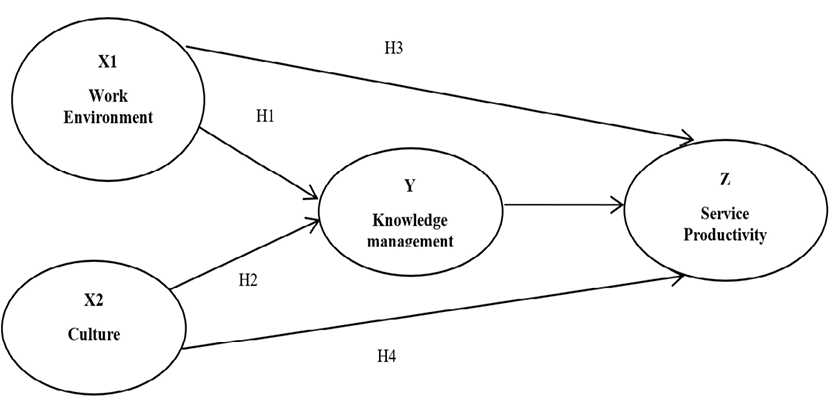
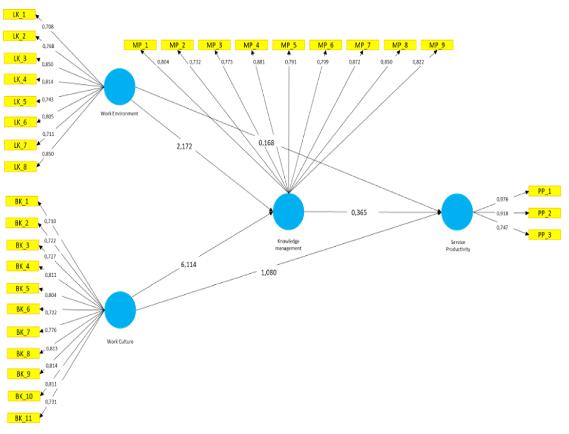
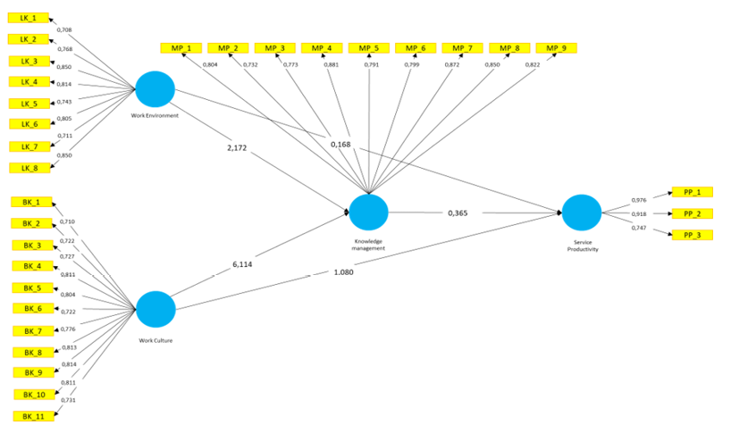

<header class="mb-4 text-sm no-indent">
    

        

            <a href="https://revistas.unjbg.edu.pe/index.php/eyn/issue/view/120" class="text-blue-600">Revista Economía & Negocios</a>
        

        
Vol. 6 Núm. 1, 2024

        

            <strong class="block pt-2">Articulo Original</strong>
        

    

    

        <h1 class="text-xl mb-0">
            Analysis of work environment and culture on service productivity with knowledge management mediation in
            Serang City Health Centers
        </h1>
        <h1>
            
                Análisis del entorno laboral y la cultura sobre la productividad del servicio con mediación de
                gestión del conocimiento en el Centro de Salud de la ciudad de Serang
            
        </h1>
    

    

        

            Dewi Widaningsih*1  
            *Autor de correspondencia: 
            <a href="mailto:widaningsih2@binabangsa.ac.id" class="text-blue-600">widaningsih2@binabangsa.ac.id</a>
        

        
Sutisna1

        
Tata Rustandi1

        

            1Bina Bangsa University, Banten, Indonesia.
        

        

            Esta obra está bajo una 
            <a href="https://creativecommons.org/licenses/by/4.0/" class="text-blue-600">Licencia Creative Commons Atribución 4.0 Internacional.</a>
        

        

            Como citar: Widaningsih, D., Sutisna, E., Rustandi, T. (2024). Analysis of work environment and culture
            on service productivity with knowledge management mediation in Serang City Health Centers. 
            <em>Economía &amp; Negocios, 6</em>(1), 94-103. 
            <a href="https://www.doi.org/10.33326/27086062.2024.1.1620" class="underline text-blue-600">https://www.doi.org/10.33326/27086062.2024.1.1620</a>
        

        

            CÓDIGO JEL:  
            M31, M39
        

    

</header>

## ABSTRACT

The research aims to assess how much influence the work environment, work culture, and knowledge
management have on service productivity at the Serang City Health Center. The difference with previous
research by other researchers is the addition of other variables, namely the work environment and
knowledge management. The quantitative research method used in this research is quantitative research.
As many as 431 ASN at the Puskesmas in Serang City constitute the population in this study. The number
of samples was determined based on the Slovin method; a total of 95 people participated. Smart PLS was
used to analyze the questionnaire data. It can be seen that the work environment has a significant
effect on knowledge management as well as work culture. Work culture has a large effect on service
productivity, while the work environment has a large effect on knowledge management. There is a
substantial relationship between knowledge management and service productivity. Knowledge management
shows a significant relationship between the work environment and service productivity. The work
environment has a significant impact on service productivity, as does knowledge management.

**_Keywords:_** service productivity, work environment, work
culture, knowledge management

## RESUMEN

La investigación tiene como objetivo evaluar cuánta influencia tienen el entorno laboral, la cultura
laboral y la gestión del conocimiento en la productividad del servicio en el Centro de Salud de la
ciudad de Serang. La diferencia con investigaciones anteriores de otros investigadores es la adición de
otras variables, como el clima laboral y la gestión del conocimiento. El método de investigación
cuantitativa utilizado en esta investigación es la investigación cuantitativa. Hasta 431 ASN en
Puskesmas en la ciudad de Serang constituyen la población de este estudio. El número de muestras se
determinó con base en el método Slovin; Participaron un total de 95 personas. Se utilizó Smart PLS para
analizar los datos del cuestionario. Se puede observar que el ambiente de trabajo tiene un efecto
significativo en la gestión del conocimiento y en la cultura laboral. La cultura laboral tiene un gran
efecto en la productividad del servicio, mientras que el entorno laboral tiene un gran efecto en la
gestión del conocimiento. Existe una relación sustancial entre la gestión del conocimiento y la
productividad del servicio. La gestión del conocimiento muestra una relación significativa entre el
clima laboral y la productividad del servicio. El entorno laboral tiene un impacto significativo en la
productividad del servicio, al igual que la gestión del conocimiento.

**_Palabras clave:_** productividad del servicio, clima laboral,
cultura laboral, gestión del conocimiento

## INTRODUCCIÓN

The Community Health Center (Puskesmas), as a government organization, must be able to provide maximum
service to the community. The Puskesmas is required to meet consumer needs through quality services, and
the role of human resources is to support the Puskesmas in carrying out these services. By improving
task-skill alignment and reducing redundant processes and unnecessary service delivery, health-care
organizations have been able to free up costly specialist cases, and, in some cases, reorganization of
care processes has also increased efficiency, allowing physical and staff resources to serve more.
patients and reduce the cost of providing care (Brownlee et al., 2013).

Productivity is related to the work environment, which plays an important role in an organization. Most
of the problems faced by employees are related to the work environment. Productivity levels can be
increased through the development of a conducive work environment within the organization (Abdul &
Awan, 2015). One of the things related to service productivity is service to Puskesmas visitors; this
condition of the description of the service can be seen in the Community Satisfaction Index (IKM)
figures, while at the IKM Puskesmas, it was identified that most of the IKM Puskesmas indicators in
Serang City in general have achieved good qualifications or are satisfactory with the category of
service quality B. However, there are still as many as six (6) indicators that are still of C quality,
and if you look at the tendency that these indicators do not change or tend to decrease in value, this
means that the performance of the Puskesmas in Serang City still has deficiencies in service matters. In
this case, if there are still low-quality measurement results, this could indicate low productivity.

According to research by Rahmawanti et al. (2014), creating a good work environment can affect employee
performance. The physical work environment and non-physical work environment also affect employee
motivation and morale because, if the work environment in the company is comfortable and pleasant, of
course employees can improve their performance so that company goals can be achieved properly (Sari
& Erlina, 2021). Apart from that, there are other related things. In addition, according to research
(Suwaryo et al., 2015) on organizational culture, organizational commitment, and readiness to change, it
was found that organizational culture influences organizational commitment and readiness to change. It
can be seen that there is a cultural influence on all organizational goals. According to (Massoudi et
al., 2017), there are significant environmental influences on work productivity. The influence of work
culture on knowledge management can be explained by the results of this study. (Alias et al., 2018). The
current research is different from previous studies, namely by adding the knowledge management variable
to the service productivity variable. The goal of this study is to find out how the Serang City Health
Center’s service productivity is affected by the work environment, work culture, and knowledge
management.

Thinking structure

Service productivity is very important because good service will increase the number of patient visits
for treatment at health services. There are certain variables that affect service productivity, and a
good work environment can increase service productivity. Besides that, the work culture factor of an
organization can also affect service productivity because a good work culture can improve service to
consumers so that they feel satisfied. The knowledge management factor is a variable that can have an
impact on service productivity because this factor is a mediating factor, so productivity can be
achieved through this factor.

Research hypotheses

The following hypotheses were formulated in the null form.

H1: It is suspected that the work environment influences knowledge management at the Serang City Health
Center.

H2: It is suspected that the work environment has an effect on service productivity at the Serang City
Health Center.

H3: It is suspected that work culture influences knowledge management at the Serang City Health Center.

H4: It is suspected that work culture influences service productivity at the Serang City Health Center.

H5: It is suspected that knowledge management has an effect on service productivity at the Serang City
Health Center.

H6: It is suspected that the work environment has an indirect effect on the productivity of patient
services through knowledge management at the Serang City Health Center.

H7: It is suspected that work culture has an indirect effect on service productivity through knowledge
management at the Serang City Health Center.

H8: It is suspected that the work environment, work culture, and knowledge management have an effect on
productivity at the Serang City Health Center.

## LITERATURE REVIEW

Productivity is synonymous with measuring efficiency and effectiveness in a service activity. Nangoy et
al. (2020) said that productivity is a mental attitude that has the point of view that today will be
better than yesterday (Afrizal et al., 2021).

Work productivity is the ratio between the results obtained (output) and the number of resources used as
input. It is the relationship between the number of resources used and the number of results (Salam et
al., 2022).

In research on the work environment, a positive and significant influence was found on both the physical
work environment and the non-physical work environment on the performance of local government employees.
Important factors in the physical work environment are cleanliness, air circulation, safety, and noise,
while important factors in the non-physical work environment are the relationships between colleagues
(Fithri et al., 2019).

Employee productivity (sometimes referred to as labor productivity) is an assessment of the efficiency of
a worker or a group of workers. Productivity can be evaluated in terms of an employee’s output over a
given period of time. Usually, the productivity of a particular worker will be assessed relative to the
average for employees doing similar work. Since a large part of the success of any organization depends
on the productivity of its workforce, employee productivity is an important consideration for businesses
(Massoudi et al., 2017).

Satyvendra (2019) defines a work environment as one that can be as small and private as a head office or
as public and large as a large organization or industry. Every day, centric concepts for things and
various activities take place in the workplace, which are very important in shaping an organization and
even the future career they have (Shammout, 2021).

The dimensions of the physical work environment are color, cleanliness, temperature, air circulation,
lighting, security, and calm (Fithri et al., 2019). Meanwhile, Xue said that each individual who works
in a team can unite their performance by sharing knowledge and recognizing the emotional expression of
each member of the team through cultural factors (Jamshed & Majeed, 2019).

Factors that influence work culture According to Hofstede, there are four dimensions, namely as follows:
1) power distance (a measure of the relationship between workers and management); 2)
individualism (a measure of how someone might make a difference between the interests of the
organization and self-interest); 3) uncertainty avoidance (the level at which people are able to
seek uncertainty and ambiguous situations); and 4) masculinity (the level at which success is
defined as ambition, challenge, and humiliation rather than attention or promotion) (Shahzad et al.,
2012).

## METHODS

The population in this study was all civil servants in the city of Serang, which had 431 people. The
Slovin formula is used to calculate the number of samples, and the sampling technique is proportional
stratified random sampling, which is used when the population has heterogeneous and stratified members
or elements proportionally, according to Sugiyono (2009).95 people to determine sampling.

Variable

 X1  : Work Environment

 X2  : Work Culture 

 Y   : Knowledge management
 
 Z   : Service Productivity
 

  

**Figura 1**

*Thinking structure*

## RESULTS

Evaluation of the Measurement Model (Outer Model)

  

**Figura 2**

*Evaluation of the Measurement Model (Outer Model)*

Test result

Convergent Validity attempts to determine the validity of each relationship between the manifest and the
construct or latent variable. As for the validity test with average variance extracted (AVE), based on
the results shown in the table above, all variables have an AVE value greater than 0.5, which means that
these variables are significant reliability test.

A reliability test is a test that measures the extent to which a measuring instrument performs
measurements without bias (free of errors) and also ensures the consistency of the measuring instrument
when used at a later time and across various items in the instrument (Sekaran and Bougie, 2016).

In this study, the composite reliability value for each construct has a value greater than 0.7, which
means that all constructs are reliable.

Analysis of Variance (R2) or Determination Test the R Square value indicates the level of determination
of exogenous, independent variables and endogenous, dependent variables.

  

**Table 1**

*Analysis of Variance (R2) or Determination Test*

|                         | R-Square |
| ----------------------- | -------- |
| Manajemen Pengetahuan   | 0.544    |
| Produktivitas Pelayanan | 0.516    |

*Note:* Results of SmartPLS data processing (2022)

From table 1 above, it can be seen that the R-Square values for variables can be explained as follows:

That knowledge management variables explained by work environment and work culture variables on knowledge
management 54.4% while 45.6% are explained by other variables outside those studied.

That the service productivity variable is explained by the work environment variable, work culture on
productivity 51.6% while 48.8% is explained by other variables outside those studied.

Inner Model Analysis Results

Path Coefficient

The analysis of bootstrapping produces a value contained in the coefficient for each relationship; the
highest value can be seen from the relationship that occurs between work culture and knowledge
management, namely a value of 0.565, while the lowest value can be seen from the work environment on
service productivity, which is equal to 0.027. And for the other structural model relationships, it has
a T-statistic value above 1.96, which illustrates the significance of the relationships in the research
model. The following is the result of the path coefficient:

  

**Figura 3**

*Test the significance of the bootstrapping model*

Hypothesis testing

Hypothesis testing is carried out based on the results of testing the inner model (structural model),
which includes the output r-square, parameter coefficients, and t-statistics. To see whether a
hypothesis can be accepted or rejected by considering the significance value between constructs,
t-statistics, and p-values.

Testing the research hypothesis was carried out with the help of SmartPLS (Partial Least Square) 3.2
software. These values can be seen from the bootstrapping results. The rules of thumb used in this study
are t-statistics > 1.96 with a significance level of p-value 0.05 (5%) and a positive beta
coefficient the bootstrapping results. The rules of thumb used in this study are t-statistics > 1.96
with a significance level of p-value 0.05 (5%) and a positive beta coefficient. The results are as
follows:

Hypothesis testing

|                                             | Original Sample (O) | Sample Average (M) | Standard Deviation (STDEV) | T Statistics | P Values |
| ------------------------------------------- | ------------------- | ------------------ | -------------------------- | ------------ | -------- |
| Work environment → Knowledge management     | 0.235               | 0.250              | 0.108                      | 5.114        | 0.030    |
| Work culture → Knowledge management         | 0.565               | 0.550              | 0.111                      | 6.619        | 0.000    |
| Work environment → Service productivity     | 0.046               | 0.000              | 0.125                      | 2.172        | 0.000    |
| Work culture → Service productivity         | 0.14                | 0.079              | 0.226                      | 3.367        | 0.000    |
| Knowledge management → Service productivity | 0.079               | 0.071              | 0.217                      | 2.365        | 0.015    |

From the table above, it can be seen that the model has a significant and positive effect through the
hypothesis in this study, as follows:

H1: The work environment has a significant positive effect on knowledge management.

The test results show that the work environment factor coefficient for knowledge management is 0.235 and
the t-statistic is 5.114. From these results, it is stated that the t-statistic is significant. Because
the p-value is > 1.96, the hypothesis is accepted, which means that the work environment has a
significant positive effect on knowledge management.

H2: Work culture has a significant positive effect on knowledge management.

The test results show that the work culture path coefficient for knowledge management is 0.565 and the
t-statistic is 6.619. From these results, it is stated that the t-statistic is significant. Because the
p-value is > 1.96, the hypothesis is accepted, which means that work culture has a significant
positive effect on knowledge management.

H3: The work environment has a significant positive effect on service productivity.

The test results show that the work environment fat coefficient on service productivity is 0.046 and the
t-statistic is 2.172. From these results, it is stated that the t-statistic is significant. Because the
p-value is > 1.96, the hypothesis is accepted, which means that the work environment has a
significant positive effect on service productivity.

H4: Work culture has a significant positive effect on service productivity.

The test results show that the work culture path coefficient on service productivity is 0.14 and the
t-statistic is 3.367. From these results, it is stated that the t-statistic is significant. Because
>1.96 with a p-value, the hypothesis is accepted, which means that work culture has a significant
positive effect on service productivity.

H5: Knowledge management has a significant positive effect on service productivity.

The test results show that the path coefficient value of knowledge management on service productivity is
0.079 and the t-statistic is 2.365. From these results, it is stated that the t-statistic is
significant. Because >1.96 with a p-value, the hypothesis is accepted, which means that knowledge
management has a significant positive effect on service productivity.

## CONCLUSIONS

This research departs from the problem of low service productivity at the Puskesmas in Serang City, one
of the most fundamental problems, namely, service productivity as a phenomenon that is closely related
to the work environment, work culture, and knowledge management. The results of the study explain that
the work environment and work culture have a significant influence on knowledge management. While work
culture, work environment, and knowledge management have a significant influence on service
productivity, through knowledge management, work culture and work environment can affect service
productivity.

For success in achieving a goal, a good work culture and work environment are needed through knowledge
management. These two things can increase the productivity of service to the community. A good work
culture will build employees from within because culture is a set of values that are embedded in the
minds of employees. Employees, while the work environment includes the physical aspects of the workplace
environment that support service productivity. Knowledge management as a mediating factor is a system
for organizing knowledge to achieve the goals of an organization, so this aims to achieve service
productivity.

## REFERENCES

Abdul, P., & Awan, G. (2015). Impact of working environment on employee’s productivity : A case study
of Banks and Insurance Companies in Pakistan. *European Journal of Business and Management,
7*(1), 329-346.

Afrizal, D., Anisa, D., Khaliq, M., & Yusrizal, D. (2021). Produktivitas, Kualitas Layanan,
Responsivitas, Responsibilitas dan Akuntabilitas pada Dinas Perhubungan Kota Dumai. *Jurnal Terapan
Pemerintahan Minangkabau, 1*(1), 60-67. <https://doi.org/10.33701/jtpm.v1i1.1864>

Brownlee, S., Coluci, J., & Walsh, T. (2013). Productivity and The Health Care Workforce. *New
American Foundation, 1*(1), 1-41. <http://wingofzock.org/2013/11/26/transformation-and-the-health-care-workforce/>

Fithri, P., Mayasari, P., Hasan, A., & Wirdianto, E. (2019). IMPACT OF WORK ENVIRONMENT ON EMPLOYEE
PERFORMANCE IN LOCAL. *Advances in Economics, Business and Management Research, 100*(Icoi),
21–25.

Jamshed, S., & Majeed, N. (2019). Relationship between team culture and team performance through lens
of knowledge sharing and team emotional intelligence. *Journal of Knowledge Management, 23*(1),
90-109. <https://doi.org/10.1108/JKM-04-2018-0265>

Massoudi, A. H., Salah, S., & Hamdi, A. (2017). The Consequence of work environment on Employees
Productivity. *IOSR Journal of Business and Management (IOSR-JBM, 19*(January), 35–42. <https://doi.org/10.9790/487X-1901033542>

Salam, M. F., Lasise, S., & Munizu, M. (2022). The Effect of Compensation and Work Environment on
Employee Productivity through Job Satisfaction. *Hasanuddin Journal of Business Strategy, 4*(1),
14-24.

Sari, A. M., & Erlina, R. R. (2021). *The Effect of the Work Environment on Employee Performance
with Motivation as a Mediation Variables*. 12(1), 372–382.

Shahzad, F., Rana, L., Khan, A., & Shabbir, L. (2012). Impact of Organizational Culture on
Organizational Performance : An Overview. *Interdisciplinary Journal of Contemporary Research in
Business, 3*(3), 975-985.

Shammout, M. (2021). *The impact of work environment on employees performance.* *11*,
78–101.

