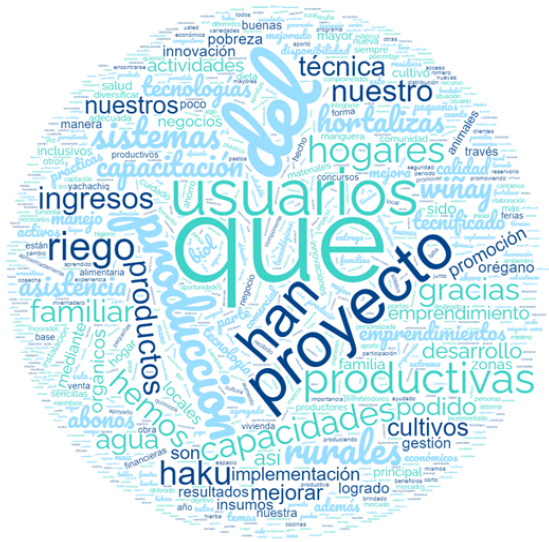
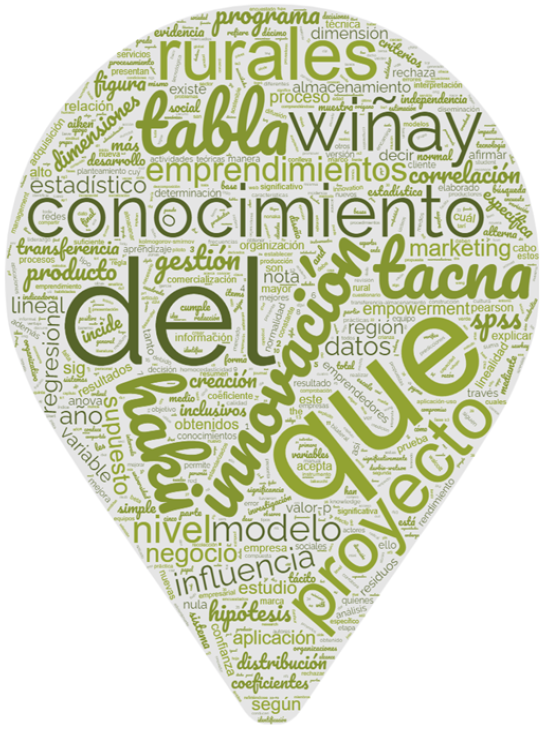

<header class="mb-4 text-sm no-indent">
    

        
<a href="https://revistas.unjbg.edu.pe/index.php/eyn/issue/view/120" class="text-blue-600">Revista Economía & Negocios</a>

        
Vol. 6 Núm. 1, 2024

        
<strong class="block pt-2">Articulo Original</strong>

    

    

        <h1 class="text-xl mb-0">Impacto del Foncodes en los emprendimientos rurales que cambian vidas en Perú</h1>
        <h1>Impact of Foncodes on rural enterprises that change lives in Peru</h1>
    

    

        

            Edgard Enrique Wong-Copaja*  
            *Autor de correspondencia: <a href="mailto:eewongcopaja@gmail.com" class="text-blue-600">eewongcopaja@gmail.com</a> - <a href="https://orcid.org/0000-0003-2141-8126" class="text-blue-600">https://orcid.org/0000-0003-2141-8126</a>  
            Colegio de Ingenieros Cd Tacna. Vicepresidente del Capítulo Industriales, Comerciales. Coordinador del Nec Palca 2. Haku Wiñay. Doctor en Administración.  
            Tacna, Perú
        

        

            Carlos Alberto Choquehuanca-Saldarriaga 
            <a href="mailto:cachoquehuancas@unac.edu.pe" class="text-blue-600">cachoquehuancas@unac.edu.pe</a> - <a href="https://orcid.org/0000-0002-2734-5362" class="text-blue-600">https://orcid.org/0000-0002-2734-5362</a> 
            Universidad Nacional del Callao. Lima, Perú
        

        

            Víctor Enrique Marengo-Murga 
            <a href="mailto:vmarengom@gmail.com" class="text-blue-600">vmarengom@gmail.com</a> - <a href="https://orcid.org/0000-0003-2139-7791" class="text-blue-600">https://orcid.org/0000-0003-2139-7791</a> 
            Ministerio de Desarrollo e Inclusión Social - Fondo de Cooperación para el Desarrollo Social. Coordinador de Desarrollo de Capacidades Productivas. Magister en Ciencias de la Educación con mención en Medición y Evaluación de la Calidad Educativa.
        

        

            Manuel Nolazco-Barraza 
            <a href="mailto:mnolazco@foncodes.gob.pe" class="text-blue-600">mnolazco@foncodes.gob.pe</a> - <a href="https://orcid.org/0009-0008-4605-4852" class="text-blue-600">https://orcid.org/0009-0008-4605-4852</a> 
            Ministerio de Desarrollo e Inclusión Social - Fondo de Cooperación para el Desarrollo Social. Especialista de Proyectos Productivos. Economista.
        

        
Esta obra está bajo una <a target="_blank" href="https://creativecommons.org/licenses/by/4.0/" class="text-blue-600">Licencia Creative Commons Atribución 4.0 Internacional.</a>

        

            Como citar: Wong-Copaja, E. E., Choquehuanca-Saldarriaga, C.A., Marengo-Murga, V. E., &amp; Nolazco-Barraza, M. (2024). Impacto del Foncodes en los emprendimientos rurales que cambian vidas en Perú. <em>Economía &amp; Negocios, 6</em>(1), 75-93. <a target="_blank" href="https://www.doi.org/10.33326/27086062.2024.1.1832" class="text-blue-600">https://www.doi.org/10.33326/27086062.2024.1.1832</a>
        

        

            CÓDIGO JEL:  
            O1, M13, O17
        

    

</header>

## RESUMEN

Hoy en día, los gobiernos ven el espíritu empresarial como un medio para promover el desarrollo
económico, social, productivo e incluso cultural de sus países, pero a pesar de los beneficios de esta
tendencia, todavía existen muchos retos importantes que deben superarse para que los beneficios del
espíritu empresarial sean realmente sostenibles y duraderos (Jurado, 2022). Este es el problema que
Foncodes considera necesario abordar: el limitado acceso de las familias de subsistencia a los mercados
locales en zonas rurales andinas y selváticas densamente pobladas. El reto consiste en superar las
causas subyacentes, a saber, el limitado conocimiento técnico de la producción familiar en las zonas
rurales, la falta de capitalización de los activos familiares y el escaso conocimiento de los mercados
de insumos y servicios y de los destinos de los productos, mediante la creación de empresas agrícolas y
no agrícolas en las zonas de alta montaña y selva, gestionadas por agricultores rurales de subsistencia,
organizadas según un modelo básico de implementación y utilizando los recursos financieros de Foncodes.
Del 2012 a agosto de 2023, Foncodes financió 16 261 emprendimientos, siendo el monto financiado de
S/169 700 250. Como principales resultados un 97 % de los emprendimientos implementados estaban
operativos y los usuarios de la selva incrementaron sus ingresos en 60.95 % y los de la sierra en
72.08 %; también, el 45.59 % de ERI participan en mercados ampliados; permitiendo la generación y/o
preservación de 63 273 autoempleos familiares.

**_Palabras clave:_** emprendimientos rurales, autoempleo,
poblaciones vulnerables, desarrollo, hogares rurales con economías de subsistencia

## ABSTRACT

Today, governments see entrepreneurship as a means to promote the economic, social, productive and even
cultural development of their countries, but despite the benefits of this trend, there are still many
important challenges that must be overcome for the benefits of entrepreneurship to be truly sustainable
and long-lasting (Jurado, 2022). This is the problem that Foncodes considers necessary to address: the
limited access of subsistence families to local markets in densely populated rural Andean and jungle
areas. The challenge is to overcome the underlying causes, namely limited technical knowledge of family
production in rural areas, lack of capitalization of family assets, and poor knowledge of input and
service markets and product destinations, through the creation of agricultural and non-agricultural
enterprises in high mountain and jungle areas, managed by rural subsistence farmers, organized according
to a basic implementation model and using Foncodes financial resources. From 2012 to August 2023,
Foncodes financed 16,261 enterprises, with the amount financed being S/169,700,250. As main results, 97%
of the implemented enterprises were operational and users in the jungle increased their income by 60.95%
and those in the highlands by 72.08%, also 45.59% of ERI participate in expanded markets; allowing the
generation and/or preservation of 63,273 family self-employment.

**_Keywords:_** rural entrepreneurship, self-employment,
vulnerable populations, development, rural households with subsistence economies

## INTRODUCCIÓN

Los empresarios peruanos son creativos, ingeniosos y están dispuestos a encontrar una salida en tiempos
económicos difíciles. Casi la mitad de las empresas peruanas son económicamente fuertes. En este
contexto, es importante tener ideas y planes claros para convertirlos en oportunidades de negocio.

El objetivo de este estudio es presentar los principales resultados del proyecto desde dos grandes
dimensiones: a) Asesoramiento y apropiación de la gestión de emprendimientos rurales y b) Impactos de la
gestión de los emprendimientos rurales.

Por ello, Wong (2020) demuestra que la agricultura inclusiva ha hecho progresos significativos en
términos de costes de producción, financiación, endeudamiento y, lo que es más importante, gestión de
las inversiones. Demuestra que los insumos añaden valor a los productos si se utilizan correctamente y
que la correcta asignación de recursos y la adición de valor se consideran medios para aumentar la
rentabilidad de las empresas.

Es así que, Soleymani et al., (2021) indica que la iniciativa empresarial rural pretende utilizar los
recursos humanos de las zonas rurales para desarrollar los recursos rurales, pero el problema es que el
desarrollo de una zona se hace a expensas del desarrollo de otras zonas. Esto conduce a un desequilibrio
en el desarrollo y, por tanto, a problemas de desarrollo (Shahraki y Heydari, 2019).

El conocimiento es un recurso intangible fundamental para el éxito o el fracaso de una organización
(Cancino et al., 2018). Una gestión eficaz del conocimiento también permite a una organización innovar
con eficacia (Mardani et al., 2018).

En 2018, más del 42,1% de las personas que vivían en zonas rurales eran pobres, tres veces más que en las
zonas urbanas (14,4 %), el 30,4 % en las zonas de montaña y el 26,5 % en las zonas semiurbanas, con las
tasas de pobreza más altas en las zonas de montaña (46,1 %) y en las zonas semiurbanas (38,3 %) (INEI,
2018).

Esta situación es el resultado de una serie de factores interrelacionados que causan y perpetúan la
pobreza en los hogares rurales. Las familias campesinas de las zonas rurales de Perú y la Amazonia se
ven especialmente afectadas: dependen de sistemas de producción familiares que no consiguen rentabilizar
debido a la baja productividad y a la falta de excedentes para comerciar y vender, y tienen dificultades
para hacer frente a las cambiantes condiciones naturales y a los riesgos asociados al cambio climático
(Shahraki y Heydari 2019).

En ese contexto, Foncodes identificó como problema a resolver, lo siguiente: limitadas oportunidades en
el acceso a los mercados locales para las familias que se autoabastecen en los Andes y las zonas rurales
de la selva (Midis, 2021).

De esta manera, se busca solucionar como causas de dicho problema: el limitado conocimiento tecnológico
de la producción familiar rural, la escasa capitalización de los activos familiares rurales, así como el
desconocimiento de los mercados de provisión de insumos y servicios para las actividades productivas y
el de mercados de destino de sus productos (Foncodes, 2023).

Sin embargo, otras dificultades de dicha problemática, referida a las inversiones facilitadoras de
negocios, tales como: el escaso acceso a infraestructura vial, agua y saneamiento que mejore la
productividad, acceso a los servicios públicos básicos, mercados locales; así como las condiciones
ambientales fuertemente cambiantes, entre otras, se prevé atender, mediante alianzas estratégicas con
gobiernos locales e instituciones públicas y privadas, aliados del proyecto Haku Wiñay/Noa Jayatai [Haku
Wiñay (vamos a crecer en idioma quechua), Noa Jayatai (vamos a crecer en dialecto Shipibo conibo)
Proyecto Productivo de Foncodes] (Foncodes, 2023).

En el periodo de 2012 a agosto de 2023, Foncodes financió 16 261 emprendimientos, de los cuales, 7067 se
encontraban en marcha y 9194 nuevos emprendimientos, atendiéndose a 63 273 hogares; con una inversión
total de S/209 051 537, siendo el monto financiado por Foncodes de S/169 700 520 y un aporte de los
usuarios de S/39 351 017 (Foncodes, 2023).

Según líneas de inversión, el 41.2 % de los emprendimientos son pecuarios; 16.2 %, de agroindustria;
11.7 %, agrícolas; 11.8 %, de servicios; 7.9 %, de artesanías; 2.1 %, acuícolas, y 8.5 %, otros agrarios
y no agrarios. Respecto al total de hogares usuarios, un 39.5 % están liderados por mujeres y el 60.5 %
por hombres (Foncodes, 2023).

Los emprendimientos se implementan desde 2012, en un proceso de mejora continua, con el Proyecto Especial
“Mi Chacra Emprendedora” (2012-2013) y proyecto Haku Wiñay/Noa Jayatai (2014 a la fecha) en la modalidad
de “fondos concursables”, atendiéndose al público objetivo en cada distrito, en alianza con los
gobiernos locales e instituciones públicas y privadas, siendo el Comité Local de Asignación de Recursos
(CLAR) quien determina a los emprendimientos ganadores, presentados por grupos de interés integrados por
4 emprendedores, en promedio, los que reciben un premio de S/12 000 en sierra y S/13 000 en selva, en
promedio, como “capital semilla” y, la capacitación y asistencia técnica productiva, así como de gestión
económica-comercial y articulación al mercado, asociatividad y certificaciones (Foncodes, 2023).

En conjunto, el 88,1 % de los agricultores declararon haber aumentado sus ingresos; el 84,5 %, su
productividad; el 85,7 %, la calidad de sus productos; el 70,2 %, el acceso al mercado, y el 88,1 %, el
reconocimiento de su explotación por parte de la comunidad (Foncodes, 2023).

El espíritu empresarial también puede considerarse un campo de estudio que se centra en tres factores o
motores clave (individuos, empresas e instituciones), que pueden influir mutua y complementariamente en
el entorno económico de una región o país (Arbeláez et al., 2023).

El mundo ha cambiado en los últimos años y cada vez hay más separación entre desarrollo económico y
social (Hernández y Díaz, 2016). Se trata de una reacción contra el desarrollo innovador (intensivo en
capital y destructor del medio ambiente) (Soleymani et al., 2021). Para combatir la exclusión social y
la desigualdad, es necesario promover un desarrollo más integrador e innovador (Morant et al., 2016).

Como se ha argumentado, las competencias empresariales han estado confinadas durante demasiado tiempo al
sector empresarial y el desarrollo empresarial en otros sectores, como el público y el social, se ha
visto obstaculizado. Lo ideal sería que dicha formación fuera integradora, pero que abarcara diferentes
sectores en un entorno diverso, cambiante e incierto. Dado que la formación en materia de gestión es
distinta de la formación en materia de espíritu empresarial, se reconoce que el contenido de los “cursos
de espíritu empresarial” debería centrarse en el desarrollo de las capacidades individuales,
independientemente del entorno social, político o comunitario (Toca, 2010).

También, las empresas regionales colombianas carecen de algunos de los elementos necesarios para hacer
frente a los retos económicos actuales y sugiere abordarlos invirtiendo en formación y sinergia entre
los actores implicados en el proceso competitivo (Sanclemente, 2010).

En segundo lugar, se propone una definición para distinguir ambos conceptos: el objetivo estratégico del
autoempleo es crear y mantener el empleo, mientras que el objetivo estratégico del espíritu empresarial
es crear valor añadido para la sociedad y alcanzar objetivos claros de crecimiento (Valencia, 2012).

También, explora el vínculo entre progreso y crecimiento y el importante papel de las empresas. Los
empresarios, junto con otros agentes sociales, crean riqueza explotando sus propios recursos y los del
mercado y, en ocasiones, distribuyen riqueza entre distintos grupos de la sociedad a través de las
innovaciones que crean o adaptan (Mayer et al., 2020).

En este sentido, el espíritu empresarial es un determinante fundamental del crecimiento y de la creación
de empleo. Aunque los empresarios son abundantes en América Latina y el Caribe, los negocios en la
región son más pequeños y menos propicios al crecimiento y la innovación que en otras regiones. El
crecimiento de la productividad ha sido mediocre durante décadas y el reciente aumento de las materias
primas no ha sido una excepción. Por consiguiente, será necesario contar con empresarios dinámicos para
promover la creación de empleos de calidad y acelerar el crecimiento de la productividad en la región
(Mayer et al., 2020).

El emprendimiento rural se refiere a la creación y desarrollo de actividad económica en una zona rural,
ya sea agricultura, ganadería, turismo rural u otras actividades que generen valor añadido y empleo en
estas zonas (Wong, 2023).

De las características de las asociaciones agrícolas y familiares (AFA) se desprende que están compuestas
principalmente por población rural pobre, indígena y sin tierra, con pocos recursos económicos. Realizan
inversiones en la economía rural (artesanía, turismo, pesca, apicultura, etc.). En su mayoría son
pequeñas y medianas empresas agroindustriales (productoras de queso, dulces, vino, aceite, encurtidos,
etc.) o empresas manufactureras de propiedad directa de pequeñas y medianas empresas o gestionadas por
ellas. Unidades de producción locales dirigidas por pequeños productores. Las personas que componen este
mundo desempeñan un papel importante en la estructura social y la conformación de la identidad de las
zonas rurales. Esta perspectiva pone de relieve las diferencias marcadamente asimétricas entre los
agentes sociales y la agricultura empresarial en términos de acceso a la información, recursos
productivos y poder de negociación: un tipo muy distinto de “segunda agricultura” que se manifiesta de
formas concretas. Hablan con los niños sobre su modo de vida y su relación con el medio rural (Lattuada,
2014).

En la mayoría de las empresas familiares, la economía cooperativa no formal se debe no solo a la
necesidad de resolver nuevos problemas fundamentales o de encontrar alternativas para mejorar las
condiciones de vida, sino también a la tendencia a formar asociaciones. Esto se debe no solo a la
necesidad de resolver nuevos problemas fundamentales o de encontrar alternativas para mejorar las
condiciones de vida, sino también a la tendencia a formar asociaciones, ya sea como iniciativas
individuales independientes o, más a menudo, para facilitar su implementación con la ayuda de recursos y
control de organismos estatales y de la sociedad civil. Estas formas de asociación pueden verse
limitadas por la acción del Estado, pero también pueden verse facilitadas por diversos contextos
culturales y sociales, como la memoria social, la identidad y el origen étnico, la religión, la
vecindad, la amistad y el parentesco, así como las relaciones e interacciones, el prestigio y el
reconocimiento (Lattuada, 2014).

Los resultados del estudio “Formas asociativas de los agricultores familiares en el contexto del
desarrollo rural en Argentina en las últimas décadas (1990-2014)” muestran que, además de un cierto
grado de formalización alcanzado por las nuevas organizaciones asociativas, especialmente las de
carácter económico promovidas por el Programa de Desarrollo Rural (Proder), se ha producido una
diversificación de muchos productores e incluso de la población rural no agrícola, que les ha permitido
encontrar fuentes alternativas de ingresos, como sugieren Darnhofer et al. (2008), proporcionando
opciones adicionales de ingresos a grupos rurales vulnerables y actuando como amortiguador de los
riesgos asociados a su dependencia de un solo tipo de trabajo o actividad productiva. Así pues, las
actividades de estas asociaciones no solo se utilizan en el espacio de la economía de mercado, sino
también en el espacio político y social (Lattuada et al., 2015).

Cualquiera que sea el grado de implicación de estas asociaciones, cabe destacar que el hecho de que
reúnan a grupos tradicionalmente aislados y especialmente vulnerables en la estructura de las
comunidades rurales abre oportunidades de acceso a la información, la formación y la asistencia técnica,
y supone una importante contribución a la mejora de la calidad de vida de la comunidad. En muchos casos,
estas primeras formas de asociación han mejorado los medios de vida de sus explotaciones y de las
pequeñas comunidades en las que viven, incluyendo pozos, proyectos de infraestructuras comunitarias y
transporte, aunque estas experiencias no hayan madurado hasta convertirse en organizaciones económicas
autónomas de pleno derecho con perspectivas comerciales y agroindustriales. Los resultados obtenidos no
son insignificantes en comparación con las condiciones iniciales de los miembros (Lattuada, 2014).

La capacidad de las asociaciones puede depender de las características sociales, culturales, económicas y
medioambientales de sus miembros. En este sentido, la salud organizativa de la economía solidaria debe
tener en cuenta los elementos clave de la capacidad colectiva: estabilidad, cohesión, clima
organizativo, espíritu de equipo, capacidad de liderazgo, comunicación y cooperación. Si consideramos
los criterios en el orden indicado en la tabla 1, los criterios quedan así:

**Tabla 1**

*Algunos elementos de las capacidades asociativas*

| Elemento asociativo  | Aparición de la capacidad de socialización a nivel individual             | Expresión de la competencia asociativa a nivel de grupo                              |
| -------------------- | ------------------------------------------------------------------------- | ------------------------------------------------------------------------------------ |
| Seguridad            | La persona demuestra perseverancia al realizar sus actividades.           | Se mantienen como miembros de la organización.                                       |
| Adherencia           | Trabaja con convicción, centrado en el bienestar colectivo.               | Existe un alto nivel de participación de los socios.                                 |
| Clima organizacional | La persona posee buena autoestima y capacidad de motivación.              | Prima el sentido de pertenencia a la organización.                                   |
| Trabajo en equipo    | La persona busca estar integrada y es participativa.                      | Logran sus objetivos y el cumplimiento de tareas.                                    |
| Liderazgo            | Su práctica de valores lo sitúa como alguien digno para seguir y confiar. | Permanencia, cumplimiento y aceptación de dirigentes.                                |
| Comunicación         | Expresa claramente sus ideas o propuestas, con sinceridad.                | Aumenta el nivel de confianza y participación entre los miembros de la organización. |

*Nota:* El índice de capacidad de afiliación: construcción teórica y metodología
de cálculo para las organizaciones de la economía solidaria

Cuanto mayor es el potencial humano, mejores son las oportunidades de desarrollo para los individuos o
las organizaciones, y es más probable que las organizaciones de la economía solidaria tengan mejores
oportunidades de desarrollo si tienen un alto potencial (Espinoza y Gómez, 2018).

El alcance de la intervención en este estudio fue nacional, ya que se tuvo en cuenta la Directriz 190
“Lineamientos de Intervención para Promover el Desarrollo Productivo, la Generación de Ingresos y la
Diversificación de la Población en el Proceso de Integración”, aprobada por la RM 006-2012-MIDIS. El
grupo objetivo estuvo conformado por 533 962 hogares pobres dedicados a actividades de subsistencia,
distribuidos en 11 191 caseríos de 24 departamentos del Perú y la meseta amazónica. Estas poblaciones
rurales y sus medios de subsistencia son especialmente vulnerables a los riesgos e impactos del cambio
climático. La región de Cajamarca tiene el mayor número de ERI (2013) y el mayor número de hogares
pobres (7769); el segundo y tercer mayor número se encuentran en Huancavelica (1341 y 5236 hogares) y
Ayacucho (1306 y 4746), respectivamente.

## MATERIALES Y MÉTODOS

Según Hernández et al. (2014), se trata de estudios fundamentales basados en un enfoque teórico, cuyo
objetivo es ampliar los conocimientos científicos existentes sobre la realidad del fenómeno estudiado.

La investigación descriptiva y explicativa consiste en definir la característica, atributo, individuo,
grupo, sociedad, proceso, objeto u otro fenómeno objeto de análisis. Implica medir o recolectar datos y
proporcionar información sobre diferentes conceptos, variables, aspectos, dimensiones y partes del
fenómeno o problema investigado (Hernández et al., 2014).

Hernández et al. (2014), el nivel explicativo se describió como una simple descripción de conceptos y
fenómenos y la identificación de relaciones entre conceptos; es decir, un intento de encontrar causas
para acontecimientos y fenómenos físicos o sociales. En otras palabras, se demostró cómo la gestión del
conocimiento puede afectar a la capacidad de innovación de los empresarios rurales.

Según Sousa et al. (2007), la investigación se basa en el paradigma pospositivista porque es un estudio
cuantitativo y, por tanto, sus resultados exploran la interacción entre causa y efecto. Según Flores
(2004), en el paradigma pospositivista, la realidad existe, pero no puede comprenderse plenamente,
debido sobre todo a lo incompleto de los mecanismos de razonamiento humano. En el plano ontológico, se
argumenta que los fenómenos son incontrolables y que el concepto de realidad es reflexivo porque los
seres humanos son imperfectos. En el plano epistemológico, los resultados de la investigación se
consideran probabilísticos y deben apoyarse en el marco teórico en el que se basa la investigación
(Flores, 2004).

También, es una observación descriptiva que utiliza métodos cualitativos. Las observaciones y las
narraciones se comparan utilizando las técnicas del método respectivo (entrevistas en profundidad,
observación participante, grupos de discusión, etc.). Cuando se produce un fenómeno, se capta en
grabaciones de audio y vídeo, luego se transcribe en códigos y finalmente se analiza: análisis verbal o
de la acción. En resumen, los métodos cualitativos estudian las relaciones entre categorías (variables,
determinantes) en un contexto estructural y situacional.

La investigación corresponde a estudios etnográficos cualitativos (Taylor y Bogdan, 1987). Se utilizaron
dos métodos para recopilar datos: grupos de discusión y entrevistas semiestructuradas (Denzin y Lincoln,
2011). Los escenarios son muy similares y pueden clasificarse en cuatro grupos temáticos: producción de
bienes y servicios, creación de oportunidades, producción sostenible y resultados. Esta sincronización
entre las tecnologías permite definir indicadores de innovación inclusiva. Debido a esta práctica y a la
naturaleza de las discusiones grupales e individuales, la conversación fue grabada para su posterior
transcripción y análisis (Toca Torres, 2010). Todos los participantes firmaron un consentimiento de
participación en este estudio (De la Cuesta Benjumea, 2008).

Se realizaron análisis de contenido, semánticos y deductivos según las categorías de análisis. Las
entrevistas grabadas se transcribieron y analizaron con el programa Atlas.ti.

Se realizaron entrevistas en profundidad semiestructuradas con cada individuo en su casa o en el trabajo.
De acuerdo con los métodos de investigación cualitativa, se obtuvo permiso para grabar toda la
conversación con el fin de captar reacciones, actitudes y gestos potencialmente significativos durante
la entrevista.

Los resultados de las entrevistas se categorizaron utilizando un enfoque inductivo, con percepciones del
espíritu empresarial y la innovación integradora expresadas a través de los puntos de vista de distintos
sectores.

Las entrevistas se transcribieron y codificaron según subcategorías relacionadas con el trabajo. A
continuación, se realizaron análisis del discurso de acuerdo con las directrices internacionales sobre
métodos de investigación cualitativa.

**Variables e indicadores**

**Tabla 2**

*Inversión en infraestructura de la región Lima, durante el periodo 2007-2021, en S/, año 2007*

| N.º | Variables                                                                                                          | Indicadores                                                                                                                   |
| --- | ------------------------------------------------------------------------------------------------------------------ | ----------------------------------------------------------------------------------------------------------------------------- |
| 1   | Emprendimientos rurales asesorados e inversión realizada                                                           | Número de pequeños emprendimientos rurales que han recibido asistencia técnica.                                               |
|     | Montos de inversión de Emprendimientos Rurales Inclusivos que recibieron asistencia técnica y dotación de activos. |
| 2   | Apropiación de la Gestión de Emprendimientos Rurales                                                               | % de emprendimientos operando respecto al total de emprendimientos implementados.                                             |
| 3   | Satisfacción del usuario                                                                                           | % de usuarios que expresan su satisfacción de las actividades en la implementación de los ERI.                                |
| 4   | Ingresos monetarios                                                                                                | % de incremento de ingresos de hogares que recibieron asistencia técnica para la gestión de pequeños emprendimientos rurales. |
| 5   | Autoempleo                                                                                                         | Número de autoempleos generados y/o preservados                                                                               |
| 6   | Mercados ampliados                                                                                                 | Porcentaje de ERI que participan en mercados ampliados.                                                                       |

El desarrollo de la investigación ha enfrentado una serie de limitaciones que han impedido su ejecución
en mejores condiciones; por ejemplo, la generalizabilidad de los resultados es baja porque las
características de los sujetos representan diferentes niveles y contextos en relación con factores
externos y la falta de resultados de investigaciones sobre las variables estudiadas hace imposible
comparar nuestros resultados con los obtenidos en estos estudios.

## RESULTADOS Y DISCUSIÓN

En este contexto, los resultados presentados en este documento se analizan y discuten a partir de los
indicadores de cada variable recogidos en el estudio. Estos resultados pretenden responder a las
preguntas planteadas al inicio del estudio y se describen a continuación:

Variables relacionadas al asesoramiento y apropiación de la gestión de emprendimientos rurales:

**Tabla 3**

*Resultados relacionados al asesoramiento y apropiación de la gestión de emprendimientos rurales*

<table>
    <thead>
        <tr>
            <th>Variable</th>
            <th>Indicadores</th>
            <th>Situación previa a la experiencia</th>
            <th>Resultados después de la experiencia</th>
        </tr>
    </thead>
    <tbody>
        <tr>
            <td>Emprendimientos rurales asesorados e inversión realizada</td>
            <td>Número de pequeños emprendimientos rurales que han recibido asistencia técnica.</td>
            <td>Enero de 2012: 151 emprendimientos en marcha.</td>
            <td rowspan="2" class="align-middle">Agosto de 2023: 16 261 emprendimientos que han recibido asistencia técnica,
                que conglomeran 63 273 familias con economías de subsistencia Agosto de 2023:
                S/169 700 250</td>
        </tr>
        <tr>
            <td></td>
            <td>Montos de inversión de emprendimientos rurales inclusivos que recibieron asistencia
                técnica y dotación de activos.</td>
            <td>Enero de 2012: S/0</td>
            <td></td>
        </tr>
    </tbody>
    <tfoot class="border-t-1 border-t-black dark:border-t-gray-200">
        <tr>
            <td>Apropiación de la gestión de emprendimientos rurales</td>
            <td>% de emprendimientos operando respecto al total de emprendimientos implementados.</td>
            <td>1.1% emprendimientos en marcha que estaban operativos.</td>
            <td>El 97.3% de los emprendimientos financiados se encontraban operativos.*</td>
        </tr>
        <tr>
            <td>Satisfacción del usuario</td>
            <td>Porcentaje de usuarios que expresan su satisfacción como “buena” o “muy buena” de las
                actividades en la implementación de los ERI.</td>
            <td>No aplica</td>
            <td>El 72.9% de usuarios que han expresado su satisfacción agregada de como “buena” o “muy
                buena” de las actividades en la implementación de los ERI.*</td>
        </tr>
    </tfoot>
</table>

*Nota:* Datos obtenidos de Foncodes al 21.08.2023
\* Evaluación de Resultados Programa Presupuestal 0118 Acceso a hogares rurales con economías de
subsistencia a mercados locales Haku Wiñay 2020. Ver gráfica N.o 19 p. 75.
<https://drive.google.com/file/d/1rfySSQXq6Tu7djUwuL7tnSiwMJea7t33/view?usp=sharing>

Se puede observar en los indicadores lo siguiente: el monto invertido en la ejecución del Programa
Empresa Rural fue de 169 700 250 soles. Con una inversión de 169 700 250 soles, el Programa
Emprendimientos Rurales ha brindado asistencia técnica a 16 261 empresas activas en la sierra y Amazonía
rural peruana y ha abastecido de pequeños productos básicos a 63 273 familias dependientes de la
agricultura y con bajo potencial de ahorro en sus sistemas productivos domésticos. A través de estas
prácticas se mejoró su situación, debido a la baja productividad de la mano de obra, los escasos o nulos
excedentes para reponer y vender y las dificultades para afrontar los riesgos y la exclusión social
asociados a las fluctuantes condiciones naturales y al cambio climático.

El enfoque también parece haber abordado cuestiones relevantes identificadas por parte de los ciudadanos,
ya que el 88.1 por ciento de los hogares que operan empresas en las zonas rurales de la sierra y la
región amazónica del país opinó que sus ingresos procedentes de la empresa habían aumentado, el 84.5 por
ciento opinó que la productividad había aumentado, el 85.7 por ciento opinó que la calidad de sus
productos había mejorado. El 2 por ciento cree que ha mejorado el acceso al mercado, el 88.1 por ciento
cree que ha mejorado la calidad de sus productos, el 5 por ciento cree que ha mejorado la productividad,
el 85.7 por ciento cree que ha mejorado la calidad de la producción de la empresa, el 70.2 por ciento
cree que ha mejorado el acceso al mercado y el 88.1 por ciento cree que su empresa ha obtenido el
reconocimiento de la sociedad.

Variables relacionadas a los impactos de la Gestión de los Emprendimientos Rurales:

**Tabla 4**

*Resultados relacionados a los impactos de la Gestión de los Emprendimientos Rurales*

<table>
    <thead>
        <tr>
            <th>Variable</th>
            <th>Indicadores</th>
            <th>Situación previa a la Intervención</th>
            <th>Resultados después de la Intervención</th>
        </tr>
    </thead>
    <tbody>
        <tr>
            <td>Ingresos monetarios</td>
            <td>% de incremento de ingresos de hogares que recibieron asistencia técnica para la gestión
                de pequeños emprendimientos rurales.</td>
            <td>Año 2018:  Valor de ventas de hogares que recibieron la asistencia técnica para la
                gestión de pequeños emprendimientos rurales, por región:   Selva: S/2466.25
                 (departamentos: Amazonas, Huánuco, Loreto y San Martín)   Sierra: S/2800.35.
                 (departamentos: Áncash, Apurímac, Arequipa, Ayacucho, Cajamarca, Cusco,
                Huancavelica, Junín, La Libertad, Piura, Puno)
            </td>
            <td>Año 2021:  Valor de ventas de hogares que recibieron la asistencia técnica para la
                gestión de pequeños emprendimientos rurales, por región:   Selva: S/4125.02
                 (departamentos: Amazonas, Huánuco, Loreto y San Martín)   Sierra: S/5007.60
                 (departamentos: Áncash, Apurímac, Arequipa, Ayacucho, Cajamarca, Cusco,
                Huancavelica, Junín, La Libertad, Piura, Puno).*
            </td>
        </tr>
    </tbody>
    <tfoot class="border-t-1 border-t-black dark:border-t-gray-200">
        <tr>
            <td>Autoempleo</td>
            <td>Número de autoempleos generados y/o preservados.</td>
            <td>151</td>
            <td>63 273 autoempleos generados y/o preservados, donde el 39.5 % representan a las mujeres.
            </td>
        </tr>
        <tr>
            <td>Mercados ampliados</td>
            <td>Porcentaje de ERI que participan en mercados ampliados.</td>
            <td>13.23 %</td>
            <td>45.59 % de ERI que venden en mercados regionales y ferias de otras comunidades.</td>
        </tr>
    </tfoot>
</table>

*Nota:* Datos obtenidos de Foncodes al 21.08.2023b
\*Evaluación de resultados del Programa Presupuestal 0118 “Acceso de hogares rurales con economías de
subsistencia a mercados locales - Haku Wiñay” del portafolio 2018. Ver tabla N.o 27 p. 46 y tabla
N.o 28 p. 47. <https://drive.google.com/file/d/1LCv8k3ICFfLF1ciB98KNdJB2h_-sdQeI/view?usp=sharing>

Indicadores relacionados a los impactos de la Gestión de los Emprendimientos Rurales: Los principales
resultados incluyen el funcionamiento del 97 % de todos los negocios para diciembre de 2021 y un aumento
del 60 % de los ingresos de los hogares usuarios en las zonas rurales de la región amazónica de Perú
(departamentos de Amazonas, Huánuco, Loreto y San Martín). En la sierra (departamentos de Áncash,
Apurímac, Arequipa, Ayacucho, Cajamarca, Cusco, Huancavelica, Junín, La Libertad, Piura y Puno), los
ingresos aumentaron en un 72,08 %. También se observa que el 45,59 % de las ERU participan en mercados
más grandes y dinámicos.

Este resultado se corrobora por Lattuada et al. (2015), En su trabajo sobre la experiencia argentina “Las
formas cooperativas de la agricultura familiar en el desarrollo rural de Argentina en las últimas
décadas (1990-2014)”, señala que, además del grado de formalización alcanzado por las nuevas
asociaciones, en particular las asociaciones económicas apoyadas por el programa de desarrollo rural,
las nuevas asociaciones han permitido a muchos productores (incluidas las poblaciones rurales no
agrícolas) encontrar fuentes alternativas de ingresos y diversificar sus actividades y sus actividades
económicas, concluye. Como resultado, las actividades de estas asociaciones se han desarrollado no solo
en el mercado económico, sino también en las esferas política y social.

También hay casos excepcionales en los que las organizaciones facilitan el acceso a los mercados
nacionales e internacionales. En casos excepcionales, algunos vínculos se establecen a través de redes y
asociaciones entre empresas, como empresas conjuntas, clusters, mercados callejeros, acuerdos con el
sector agrícola, cadenas de supermercados y cooperativas. En estos casos más complejos, es evidente la
presencia y el apoyo de instituciones y organizaciones públicas, que desempeñan un papel activo en la
organización, la gestión y el control de la experiencia a través de apoyo técnico, organizativo y
comercial.

Además, 16.261 empresas han creado o apoyado a un total de 63.273 hogares autosuficientes, contribuyendo
al crecimiento económico local y proporcionando los medios de vida necesarios en zonas de sierra y selva
donde prevalece la pobreza extrema, a pesar de la crisis sanitaria que comenzó en marzo de 2020.

Por último, el 88,1 % de los agricultores rurales afirma que sus ingresos han aumentado, el 84,5 % afirma
que su productividad ha aumentado, el 85,7 % afirma que la calidad de sus productos ha mejorado, el
70,2 % afirma que su acceso a los mercados ha mejorado y el 88,1 % afirma que son reconocidos en la
comunidad.

### Entrevista 1. Creación de oportunidades

**Figura 1**

*Nube de palabras sobre creación de oportunidades*

Nota: La figura muestra la nube de palabras más
relevantes de la entrevista en relación con la pregunta creación de oportunidades de los
emprendedores rurales

Según los emprendedores manifestaron:

“El proyecto reforzó la capacidad productiva y las actividades empresariales de los hogares rurales
pobres y muy pobres para aumentar y diversificar sus ingresos estables y autosuficientes. El proyecto
también ayudará a fortalecer e integrar los sistemas de producción familiar proporcionando asistencia
técnica, formación y herramientas de producción para introducir tecnologías de producción innovadoras, y
contribuirá a la vivienda saludable de los hogares rurales mejorando las instalaciones de cocina, el
suministro de agua potable y la gestión de residuos.”

### Entrevista 2. Ingresos monetarios

**Figura 2**

*Nube de palabras sobre creación de oportunidades*

Nota:  La figura muestra la nube de palabras más
relevantes de la entrevista en relación con la pregunta ingresos monetarios de los emprendedores
rurales

Según los emprendedores manifestaron:

“Sobre todo, hemos adquirido nuevas competencias en producción industrial, comercial y artesanal, que nos
han ayudado a aumentar nuestros ingresos familiares, salir de la pobreza y mejorar nuestra calidad de
vida. Hemos recibido asistencia técnica y formación personal para desarrollar nuestro negocio y nuestra
agricultura, y se nos ha animado a cultivar de forma ecológica respetando el ecosistema: por ejemplo,
somos capaces de utilizar la tecnología para regar nuestros campos y optimizar el uso de los recursos
hídricos. En cuanto a la producción y la comercialización, además de apoyo para la compra de materias
primas y equipos, también recibimos formación de especialistas cualificados en producción y
comercialización y asistencia técnica para el desarrollo empresarial. Nuestra comunidad agrícola y la
cooperativa agrícola siempre han apoyado la agricultura ecológica, vendemos productos con valor añadido
y cosechamos solo dos veces al año, pero gracias a la tasa y a este proyecto hemos empezado a añadir
valor a nuestros productos.”

### Entrevista 3. Calidad de vida

**Figura 3**

*Nube de palabras sobre calidad de vida*

Nota: La figura muestra la nube de palabras más
relevantes de la entrevista en relación con la pregunta calidad de vida de los emprendedores rurales

Según los emprendedores manifestaron:

“Gracias a este proyecto, la gente ha llegado a apreciar mis productos. Me ha enseñado a vivir mejor
gracias al orden y las normas de calidad. Mi familia pertenece a la comunidad y ahora puede participar
en todas las actividades comunitarias, una mejor formación en agricultura, como la producción de patatas
y maíz, y el uso de herramientas innovadoras han añadido valor a nuestros productos y son reconocidos
por nuestros clientes. La población urbana ha vuelto a reconocer nuestra cultura autóctona y ya no se
discrimina nuestra forma de pensar. Los resultados del programa Haku Wiñay en un periodo de tiempo
relativamente corto son indiscutibles. Los cambios en la gestión tecnológica de los cultivos y el ganado
en los sistemas de producción domésticos han aumentado los rendimientos y mejorado la utilización de los
alimentos en los hogares. En el caso de viviendas mejores y más sanas, la tecnología mejoró la salud y
el entorno de los usuarios. El trabajo con los hogares y las familias no solo promueve la adopción de
tecnologías competitivas, sino que también tiene un impacto positivo en los usuarios, fomentando su
participación e implicación en el componente. En el desarrollo de empresas rurales inclusivas, las
actividades en curso generan ingresos económicos y constituyen una valiosa fuente de empleo para los
socios. En el caso de los usuarios que participan en agrupaciones de empresas rurales inclusivas, tiende
a desarrollarse una dinámica familiar positiva de apoyo mutuo, y el aumento de los ingresos contribuye
al fortalecimiento socioeconómico de la familia. En cuanto al desarrollo de la capacidad financiera, el
programa de formación pretende debatir los puntos más importantes y fundamentales para introducir una
cultura del ahorro entre los productores. Aunque el porcentaje de usuarios que consiguieron ahorrar fue
bajo, muchos de ellos reconocieron la importancia del ahorro y los que lo hicieron estaban convencidos
de haber tomado la decisión correcta. Estos resultados dan fe de la eficacia de la gestión del proyecto.
La comunicación y coordinación constantes entre los miembros del equipo de distrito, los coordinadores
técnicos, los intermediarios financieros, Yachachiq y ORNEC ayudaron a superar la desconfianza inicial
de los usuarios y a hacer avanzar el trabajo. Los cambios tangibles provocados por la tecnología
sencilla y asequible dieron la vuelta a la situación inicial. Al final del proyecto, las familias habían
aprendido a hacer un uso más eficiente de sus explotaciones, optimizando el uso del agua, proporcionando
pastos para el ganado y permitiendo a los agricultores utilizar tierras abandonadas.”

## CONCLUSIONES

Los 16,261 emprendimientos financiados por Foncodes al 2023, permitieron la generación y/o preservación
de un total de 63,273 autoempleos familiares, contribuyendo a dinamizar las economías locales en
situación de pobreza extrema de la sierra y selva.

Apropiación de emprendimientos: A diciembre de 2021, un 97 % del total de emprendimientos implementados
estaban operativos.

Ingresos: Los hogares usuarios en ámbitos rurales de la amazonia peruana (departamentos de Amazonas,
Huánuco, Loreto y San Martín) incrementaron sus ingresos en un 60.95 %; mientras que, en ámbitos de la
sierra rural (departamentos de Áncash, Apurímac, Arequipa, Ayacucho, Cajamarca, Cusco, Huancavelica,
Junín, La Libertad, Piura, Puno) incrementaron sus ingresos en un 72.08 %.

Satisfacción de los hogares usuarios: El 88.1 % de los hogares usuarios lograron elevar los ingresos de
los emprendimientos; el 84.5 % percibe que se logró incrementar la productividad, el 85.7 % percibe que
mejoró la calidad de la producción del emprendimiento, el 70.2 % percibe que se logró tener mayor acceso
a mercados y el 88.1 % percibe que logró reconocimiento de su negocio en la comunidad.

La promoción de negocios rurales inclusivos debe considerar dos aspectos para que prosperen: uno es el
conocimiento del mercado y el otro la confianza entre los integrantes del grupo de interés. Un mercado
con una amplia demanda por algunos productos se convierte en un espacio que les permite a los usuarios
organizarse para vender sus productos a mejores precios y de esta manera elevar sus ingresos.

En el caso de la confianza, esta facilita que el trabajo asociativo funcione, y que cada miembro asuma
sus responsabilidades con compromiso para el bien común. El proyecto debe seguir fortaleciendo un
enfoque de mercado, que permita consolidar las cadenas productivas locales que se están promoviendo. Es
importante trabajar en la búsqueda de nuevos mercados donde destinar los productos de las apuestas
productivas que ha generado el proyecto. Sumado a ello, será importante desarrollar en los usuarios
capacidades que les permitan ser gestores de nuevas salidas comerciales para sus productos, lo cual
impulsará una mayor apropiación del negocio por parte de todo el grupo.

Uno de los aspectos primordiales para que un negocio funcione bien es disponer de una organización
fortalecida y para ello la confianza entre los integrantes del grupo de interés es fundamental porque
cimenta el capital social. Esto puede explicar el por qué los negocios rurales integrados por familiares
han sido más exitosos que los compuestos por personas que se conocen menos. Es preferible trabajar con
menos grupos, organizados en base a confianza, a quienes se les puede dar un aporte mayor que cubra
aspectos de su plan de negocios, como la promoción y el marketing. El recurso humano formado para la
asistencia técnica debe ser valorado como una de las principales inversiones. El permanente
fortalecimiento de capacidades de los emprendedores resulta fundamental para el logro de los objetivos.

Finalmente, podemos también resaltar que el Perú cuenta con una participación notoria en actividades
económicas y productivas de las mujeres rurales usuarias del proyecto Haku Wiñay/Noa Jayatai en la
sierra y la selva, de acuerdo con el enfoque de igualdad de oportunidades que promueve Foncodes como
programa nacional del Ministerio de Desarrollo e Inclusión Social, donde el 44 % del total de personas
que participan, lideran y gestionan los emprendimientos rurales inclusivos que promueve Haku Wiñay en la
sierra y Noa Jayatai son mujeres y el 56 % son hombres.

## REFERENCIAS

Albort Morant, G., Leal Millán, A. y Cepeda Carrión, G. (2016). The antecedents of green innovation
performance: A model of learning and capabilities. Journal of Business Research, 4912-4917. doi:<https://doi.org/10.1016/j.jbusres.2016.04.052>

Alvarado, J., & Pintado, M. (2013). Necesidad, demanda y obtención de crédito en el sector
agropecuario en el Perú. CIES, 1-100. <https://cies.org.pe/es/investigaciones/desarrollo-rural/necesidad-demanda-y-obtencion-de-credito-en-el-sector-agropecuario>

Amaro Rosales, M. y De Gortari Rabiela, R. (octubre de 2016). Inclusive innovation in the Mexican
agricultural sector:. *Economía Informa*. <https://core.ac.uk/download/pdf/82781988.pdf>

Arbeláez Rendón, M., Giraldo, D. y Lotero, L. (2023). Influence of digital divide in the entrepreneurial
motor of a digital economy: a system dynamics approach. *Journal of Open Innovation: Technology,
Market, and Complexity*, 1-12. doi:<https://doi.org/10.1016/j.joitmc.2023.100046>

Arregui Solano, R., Guerrero Murgueytio, R. y Ponce Silva, K. (2020). *Inclusión Financiera y
Desarrollo, Situación actual Retos y desafíos de la banca*. Ecuador: Universidad Espíritu Santo.
<https://www.superbancos.gob.ec/bancos/wp-content/uploads/downloads/2020/07/LIBRO-INCLUSION-FINANCIERA-Y-DESARROLLO.pdf>

Cancino, C. A., La Paz, A. L., Ramaprasad, A. y Syc, T. (2018). Techonological innovation for sustainable
growth: an ontological perspective. *Journal of Cleaner Production, 179*. doi:<https://doi.org/10.1016/j.jclepro.2018.01.059>

Condori Alejo, H., Acituno Rojo, M., & Sotomayor Alzamora, G. (2021). Rural Micro Credit Assessment
using Machine Learning in a Peruvian microfinance institution. *Procedia Computer Science*,
408-413. doi:<https://doi.org/10.1016/j.procs.2021.04.117>

Espinoza Lastra, Ó. y Gómez López, J. (2018). Índice de Capacidades Asociativas: construcción teórica y
propuesta metodológica de cálculo para organizaciones de economía solidaria. *Ciriec*, 285-316.
https://rua.ua.es/dspace/bitstream/10045/89171/1/2018\_Espinoza\_Gomez\_CIRIEC.pdf

Flores, M. (2004). Implicaciones de los paradigmas de investigación en la práctica educativa. *Revista
Digital Universitaria*, 2-9.

Foncodes. (2013). Cocinas mejoradas a leña. *Proyectos*. <http://www.foncodes.gob.pe/portal/index.php/proyectos/cml/item/96-programa-de-apoyo-crediticio-a-la-peque>

Foncodes. (2021). *Premios de buenas prácticas en gestión pública, distinciones y reconocimientos
internacionales*. Lima: Foncodes. <https://cdn.www.gob.pe/uploads/document/file/2073315/Libro%20Haku%20Wi%C3%B1ay.pdf>

García Barrios, L. y González Espinosa, M. (2017). Participatory ecological research supporting forest,
agroforest and silvopastoral restoration in peasant territories. Recent experiences and challenges in
the Sierra Madre de Chiapas, México. *Revista Mexicana de Biodiversidad*, 129-140. doi:<https://doi.org/10.1016/j.rmb.2016.10.022>

Hernández, R., Fernández, C. y Baptista, P. (2014). *Metodología de la Investigación*. Mc Graw
Hill Education.

INEI. (2018). *Pobreza monetaria*. Lima: INEI. <https://www.inei.gob.pe/media/MenuRecursivo/publicaciones_digitales/Est/Lib1699/cap03.pdf>

Jaramillo, M., Aparicio, C. y Cevallos, B. (2013). ¿Qué factores explican las diferencias en el acceso al
sistema financiero? evidencia a nivel de hogares en el Perú. *Superintendencia de banca, seguros y
administradoras privadas de fondos de pensiones*, 1-24. <https://www.sbs.gob.pe/portals/0/jer/ddt_ano2013/dt_03_2013.pdf>

Jurado Paz, I. M. (2022). Emprendimiento rural como estrategia de desarrollo territorial: una revisión
documental. *Económicas*, 257-280. doi:https://orcid.org/0000-0002-5678-4217

Lattuada, M. (2014). *Las asociaciones económicas no cooperativas de la agricultura familiar*.
Buenos Aires: Ministerio de Agricultura. <http://repiica.iica.int/docs/b3698e/b3698e.pdf>

Lattuada, M., Nogueira, M. E. y Urcola, M. (2015). Las formas asociativas de la agricultura familiar en
el desarrollo rural argentino de las últimas décadas (1990-2014). *Ciriec*, 195-228. <https://www.redalyc.org/pdf/174/17442313007.pdf>

Mardani, A., Nikoosokhan, S., Moradi, M. y Doustar, M. (2018). The Relationship Between Knowledge
Management and Innovation Performance. *The Journal of High Technology Management Research,
29*(1). doi:<https://doi.org/10.1016/j.hitech.2018.04.002>

Mayer Granados, E. L., Blanco Jiménez, F. J., Neira, M. Á. y Charles Coll, J. A. (2020). Emprendimiento y
crecimiento económico: El sistema mexicano de incubadoras de negocios. *Revista de ciencias
sociales*, 107-127. <https://www.redalyc.org/journal/280/28063104011/html>

Midis, Foncodes, Banco de la Nación. (2018). *Memoria anual 2018*. Lima: Fideicomiso.

Ministerio de Desarrollo e Inclusión Social. (2021). *Necesidades y posibles soluciones de
innovación*. Lima: Midis. <http://evidencia.midis.gob.pe/wp-content/uploads/2021/07/2021-Informe-final-FONCODES-Innovacion.pdf>

Olivier Klein, P. y Weill, L. (2022). Bank profitability and economic growth. *The Quarterly Review of
Economics and Finance*, 189-199. doi: <https://doi.org/10.1016/j.qref.2022.01.009>

Pérez Caldentey, E. y Titelman, D. (2018). *La inclusión financiera para la inserción productiva y el
papel de la banca de desarrollo*. Santiago: Cepal.
https://repositorio.cepal.org/bitstream/handle/11362/44213/1/S1800568\_es.pdf

Ramos Vidal, I. y Maya Jariego, I. (2014). Ense of community, psychological empowerment, and civic
participation in workers of cultural organizations. *Psychosocial Intervention*, 169-176. doi: <https://doi.org/10.1016/j.psi.2014.04.001>

Roa, M. y Warman, F. (2016). Intermediarios financieros no bancarios en América Latina: ¿Shadow Banking?
*Cuadernos de Economía*, 49-63. doi: <https://doi.org/10.1016/j.cesjef.2015.07.004>

Sahasranaman, S., Nandakumar, M., Pereira, V. y Temouri, Y. (2021). Knowledge capital in social and
commercial entrepreneurship: Investigating the role of informal institutions. *Journal of
International Management, 27*(1). doi: <https://doi.org/10.1016/j.intman.2021.100833>

Salazar Villano, F. (2013). Cuantificación del riesgo de incumplimiento en créditos de libre inversión.
*Estudios Gerenciales*, 416-427. doi: <https://doi.org/10.1016/j.estger.2013.11.007>

Sampedro Hernández, J. y Díaz Pérez, C. (febrero de 2016). Innovación para el desarrollo inclusivo: Una
propuesta para su análisis. *Economía Informa, 396*, 34-48. doi: <https://doi.org/10.1016/j.ecin.2016.01.002>

Sanclemente Téllez, J. C. (2010). La colonización antioqueña, el emprendimiento y su aporte a la
competitividad regional y nacional. *Estudios Gerenciales*, 119-147.
http://www.scielo.org.co/pdf/eg/v26n114/v26n114a07.pdf

Shahraki, H. y Heydari, E. (27 de abril de 2019). Rethinking rural entrepreneurship in the era of
globalization: some observations from Iran. *Journal of Global Entrepreneurship Research.* doi:
<https://doi.org/10.1186/s40497-019-0162-6>

Soleymani, A., Yaghobi Farani, A., Karimi, S., Azadi, H., Nadiri, H. y Scheffran, J. (25 de marzo de
2021). Identifying sustainable rural entrepreneurship indicators in the Iranian context. *Journal of
Cleaner Production, 290*. doi:<https://doi.org/10.1016/j.jclepro.2020.125186>

Sousa, V., Driessnack, M. y Costa, I. (2007). Revisión de diseños de investigación resaltantes para
enfermeria. Parte 1: Diseño de investigación cuantitativa. Revlatino am enfermagem.

Toca Torres, C. (2010). Consideraciones para la formación en emprendimientos: explorando nuevos ámbitos y
posibilidades. *Estudios Gerenciales*, 1-15. <http://www.scielo.org.co/scielo.php?script=sci_arttext&pid=S0123-59232010000400003>

Valencia Agudelo, G. D. (2012). Autoempleo y emprendimiento. Una hipótesis de trabajo para explicar una
de las estrategias adoptadas por los gobiernos para hacer frente al progreso del mercado. *Semestre
Económico*, 103-127. <https://www.redalyc.org/pdf/1650/165025358004.pdf>

Wong Copaja, E. E. (2020). Incidencia de la Educación financiera en el mejoramiento de los Costos de
Producción de los Negocios Rurales Inclusivos del Proyecto Haku Wiñay / Nao Jayatai PP - 0118 “Acceso de
Hogares rurales con economía de subsistencia a mercados locales. *Iberoamerican Business
Journal*, 78-99. doi: <https://doi.org/10.22451/5817.ibj2020.vol4.1.11040>

Wong Copaja, E. E. (2023). Emprendimiento rural como estrategia de innovación inclusiva. *Economía y
Negocios*, 194-207. doi:<https://www.doi.org/10.33326/27086062.2023.1.1657>

