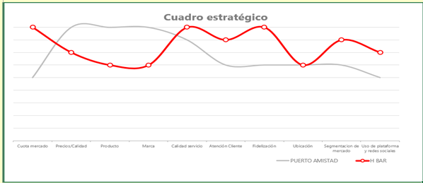

<header class="mb-4 text-sm no-indent">
    

        

            <a href="https://revistas.unjbg.edu.pe/index.php/eyn/issue/view/120" class="text-blue-600">Revista Economía & Negocios</a>
        

        
Vol. 6 Núm. 1, 2024

        

            <strong class="block pt-2">Articulo Original</strong>
        

    

    

        <h1 class="text-xl mb-0">Estrategias de marketing competitivo para mejorar el posicionamiento del local “H Sports Bar” de Bahía de Caráquez</h1>
        <h1>
            Competitive marketing strategies to improve the positioning of the local “H Sports Bar” in Bahía de Caráquez
        </h1>
    

    

        

            Frank Ángel Lemoine-Quintero*  
            *Autor de correspondencia: 
            <a href="mailto:frank.lemoine@uleam.edu.ec" class="text-blue-600">frank.lemoine@uleam.edu.ec</a> - 
            <a href="https://orcid.org/0000-0001-8885-8498" class="text-blue-600">https://orcid.org/0000-0001-8885-8498</a>  
            Universidad Laica Eloy Alfaro de Manabí, Extensión Sucre. Manabí, Ecuador
        

        

            Noelia Thaily Proaño-Delgado  
            <a href="mailto:e1312112855@live.uleam.edu.ec" class="text-blue-600">e1312112855@live.uleam.edu.ec</a>  
            Universidad Laica Eloy Alfaro de Manabí, Extensión Sucre. Manabí, Ecuador
        

        

            Esta obra está bajo una 
            <a href="https://creativecommons.org/licenses/by/4.0/" class="text-blue-600">Licencia Creative Commons Atribución 4.0 Internacional.</a>
        

        

            Como citar: Lemoine-Quintero, F. A., &amp; Proaño-Delgado, N. T. (2024). Estrategias de marketing competitivo para mejorar el posicionamiento del local “H Sports Bar” de Bahía de Caráquez. 
            <em>Economía &amp; Negocios, 6</em>(1), 152-169. 
            <a href="https://www.doi.org/10.33326/27086062.2024.1.1889" class="underline text-blue-600">https://www.doi.org/10.33326/27086062.2024.1.1889</a>
        

        

            CÓDIGO JEL:  
            M21, M31, M32
        

    

</header>

## RESUMEN

El marketing competitivo se ha convertido en la herramienta más efectiva para alcanzar mejor cuota de
mercado a nivel regional. El objetivo del estudio fue analizar la efectividad de estrategia de marketing
competitivo para mejorar el posicionamiento del local H Sports Bar de Bahía de Caráquez. Bajo el
contexto cuantitativo se aplicó el método descriptivo para desarrollar un estudio que describa los
hechos basados en los instrumentos aplicados. Entre los resultados más relevantes refirieron tener en
cuenta a los bares como fuente de entretenimiento, lo que se deja entrever con la objetividad con la que
se califica a los bares, con base en esto se pueden plantear varias estrategias para poder fortalecer la
imagen y lograr fidelizar a clientes potenciales. Entre los puntos fuertes de H Sports Bar se destacan
el mercado, la fidelización y la segmentación del mercado, por lo que se hace una comparación con otro
local para ver cuáles son los puntos fuertes de cada uno y así mejorar el local. Por lo tanto, la
propuesta se orientó en la elaboración de una página web para fortalecer el posicionamiento competitivo
del local H Sports Bar de Bahía de Caráquez.

**_Palabras clave:_** estrategias, perfil competitivo, marketing
digital, negocio, Bahía de Caráquez

## ABSTRACT

Competitive marketing has become the most effective tool to achieve a better market share at the regional
level. The objective of the study was to analyze the effectiveness of a competitive marketing strategy
to improve the positioning of the H Sports Bar in Bahía de Caráquez. Under the quantitative context, the
descriptive method was applied to develop a study that describes the facts based on the applied
instruments. Among the most relevant results, they referred to taking into account bars as a source of
entertainment, which can be seen with the objectivity with which bars are rated. Based on this, several
strategies can be proposed to strengthen the image, and achieve the loyalty of potential clients. Among
the strengths of H Sports bar are the market, loyalty and market segmentation, which is compared with
another location to see what the strengths of each one are and thus improve the location. Therefore, the
proposal was focused on the development of a website to strengthen the competitive positioning of the H
Sports Bar in Bahía de Caráquez.

**_Keywords:_** strategies, competitive profile, digital
marketing, business, Bahía de Caráquez

## INTRODUCCIÓN

En la actualidad se manifiesta una evolución de la tecnología a nivel internacional; esta ha repercutido
en las empresas, organizaciones, instituciones y en los emprendimientos de forma positiva y regenerativa
en algunos de los casos, con la finalidad de atenuar los impactos ambientales. Por esto, los
emprendimientos se han refugiado en el desarrollo tecnológico para fortalecer su actividad comercial o
de servicios, logrando resultados muy representativos a nivel de mercado.

En Ecuador, los negocios familiares reconocidos como emprendimientos buscan alternativas para sobrevivir
los eventos a nivel de entorno que de forma directa e indirecta inciden en su permanencia en el mercado;
por lo que, a través del marketing, buscan implementar técnicas, métodos y herramientas efectivas para
su crecimiento. Entre las estrategias que más predominan en la actualidad en el país son las de
competitividad como alternativa de fortalecimiento comercial.

Sin duda alguna, el 2020 fue un año que revolucionó y marcó una diferencia en las actividades
comerciales. La nueva forma de comunicarnos y, principalmente, cómo adquirir nuevos servicios y compras
creó un precedente que hizo tomar decisiones de marketing con un enfoque digital y de contenido
publicitario, que generaron nuevos servicios a nivel de la actividad.

Es por esto que los emprendimientos se han transformado en la herramienta que dinamiza la actividad
turística de cualquier región, evidenciando la importancia del marketing tradicional y su relación con
los factores de dinamización de la actividad turística de cualquier país. La actividad comercial en
Ecuador desarrolla estrategias competitivas en función de su alcance geográfico, de sus objetivos y de
los medios de comunicación.

Siguiendo algunas declaraciones de autores, enfoca su estudio al logro de acciones que a nivel de
actividad busca alternativas que lo diferencien de otros emprendimientos o negocios con servicios
semejantes, buscando ventajas que lo diferencien para tomar decisiones al respecto (Pérez, 2021, p. 24).

Otros autores alegan que una estrategia competitiva efectiva incide directa e indirectamente a nivel de
negocio generando expectativas para el logro de resultados favorables a la actividad comercial donde la
gestión va direccionada a alcanzar estándares de utilidades y rentables que le facilite diferenciarse en
el mercado (Quiroa, 2020, p. 102).

Si bien es importante abordar que el estudio de perfil competitivo se reconoce como un proceso que
relaciona al negocio con su entorno, es porque realmente las interacciones de fuerzas actuantes generan
un papel importante en sus interacciones con el entorno. El análisis competitivo colabora a identificar
las fortalezas y debilidades a nivel de actividad, como también las oportunidades existentes y las
amenazas persistentes a nivel de entorno (Cepeda, 2021, p. 33).

Todos estos autores desde su punto o criterios comunes, referente a estrategias competitivas, tienen una
conexión en la forma de reconocerla o definirla donde a consideración todas son objetivas y manifiestan
el logro o alcance de un objetivo en común a nivel de actividad comercial o negocio en particular.

A pesar de todas las acciones que se desarrollan a nivel tanto de actividad comercial como de servicios,
la nueva era de la tecnología ha marcado nuevas alternativas que han hecho que el servicio genere
mayores niveles de eficiencia, donde la tecnología o las plataformas del internet han otorgado la
eficacia como un plus a la efectividad de la mejora continua y, por ende, a la competitividad
empresarial.

Es a consideración del especialista en la temática de los nuevos escenarios del marketing, que es
importante alegar que el auge del comercio electrónico y el auge del entorno en línea para los tipos
transaccionales han creado oportunidades para que los consumidores se centren en nuevas marcas, ya que
han estado más expuestos al descubrimiento de nuevas posibilidades. Esta tendencia se ve especialmente
entre los millennials y gen z, aunque otros grupos de edad también han cambiado la forma de comprar.
Ahora, los consumidores se encuentran en una posición ventajosa para permanecer leales a las nuevas
marcas que han satisfecho sus necesidades durante el tiempo de inactividad (Constante, 2012, p. 17).

Existen estudios que muestran resultados alentadores referentes a la actividad en línea, pero esto se
centra especialmente en el sector de los supermercados, uno de los actores clave de la economía durante
la pandemia. Marcas como Tesco y Ocado se han posicionado como referentes por su capacidad de respuesta
y amplios planes de atención al cliente ante la pandemia. Esta estrategia les ayuda a mantenerse con
vida a pesar de que en los momentos más críticos la demanda está casi insatisfecha y muchos clientes
tienen que hacer cola durante horas en sus tiendas (Monterroso, 2016, p. 81).

H Sports Bar, bajo las condiciones pandémicas, se ha visto afectado económicamente, por lo que se
pretende con este estudio desarrollar estrategias de marketing competitivo para fortalecer su actividad
a nivel de mercado local, regional y nacional; a partir del diseño de nuevos servicios y estrategias
publicitarias en función del contenido y de los objetivos.

La Universidad Laica Eloy Alfaro de Manabí, Extensión Bahía, bajo las normativas y políticas vigentes,
busca desarrollar los procesos sustantivos bajo el contexto académico, investigativo y vinculativo,
donde docentes y estudiantes contribuyen en los emprendimientos de las comunidades del radio de acción
aportando en la calidad de servicios y estrategias competitivas a nivel de actividad comercial
(Lemoine-Quintero et al., 2020).

El objetivo del presente estudio fue analizar estrategias de marketing competitivo para mejorar el
posicionamiento del local H Sports Bar de Bahía de Caráquez, provincia de Manabí, en el Ecuador. Para
esto se requiere verificar a través de la técnica de marketing la competitividad del negocio y sus
estrategias en función de su alcance geográfico, de sus metas y canales de comunicación. El presente
estudio responde a una de las actividades del proyecto de vinculación con la sociedad titulado:
“Responsabilidad Social y liderazgo en los emprendimientos familiares de las comunidades del Cantón
Sucre”, a partir del impacto social en comunidades del sector objeto de estudio (Lemoine-Quintero et
al., 2020).

#### Fundamento que sustenta la teoría del marketing digital

Sánchez Caballero (2018) establece que el objetivo del marketing digital es poder lograr que el contenido
expuesto en internet sea visualizado por la mayor cantidad de usuarios posibles, aumentando su presencia
en los mercados meta donde se han planteado sus estrategias, teniendo en cuenta la fidelización como
otro factor vital en el desarrollo del crecimiento de la empresa (p. 23).

Comenzaremos ejemplificando criterios más actuales como el de Fontalba (2021), quien alega que el
*marketing online* facilita medir en tiempo real las acciones que se llevan a cabo, ganando
visibilidad y a su vez optimizando recursos; por otro lado, Fuentes (2022) reconoce a las plataformas o
blogs como una alternativa de marketing que aplican los medios de comunicación, así como canales
publicitarios tecnológicos y plataformas digitales donde la telefonía móvil protagoniza un rol
importante.

En la plataforma Cyberclick (s. f.) se describe que el marketing digital (*marketing online*) son
todas aquellas estrategias y acciones promocionales y publicitarias que se ejecutan en canales y medios
de internet, donde tiene otras acepciones muy usadas, tales como mercadotecnia en internet,
cybermarketing o cibermarketing. Desde este contexto, guarda una relación con los negocios actuales en
el Ecuador, pero Silva (2022) reconoce que la alternativa digital pretende que los negocios forjen
destrezas en estos entornos virtuales con la finalidad de obtener una mayor figura y cautivar al público
de interés.

En otras plataformas tales como Mailchimp (s.f.) se reconoce al marketing digital como parte del
marketing que centra su actividad en la promoción de las marcas para vincularla con usuarios de
internet. Se resalta que no solo incluye el correo electrónico, las redes sociales y la publicidad
basada en plataformas web, sino también integra otras alternativas vigentes en canales de marketing. Por
otro lado, Troya et al. (2019) en su estudio alegan que la web 2.0 es una plataforma que actúa en la
evolución del marketing tradicional al digital, permitiendo que la actividad del internet interactúen
como canales de comunicación a nivel mundial, resguardando la expectativa de usuarios de ser
“escuchados”, particularidad proporcionada de las nuevas generaciones.

#### Percepción del uso del marketing digital

Gallardo Plaza (2012) establece que el uso del marketing digital permite manipular herramientas de
posicionamiento, diseño y gestión de contenidos, beneficiando de por sí a la empresa con incremento de
interacción con los clientes, estableciendo incrementos significativos en las ventas y en la aceptación
comunicativa del público objetivo (p. 82).

Estudios actuales muestran cómo utilizar el marketing digital en función de obtener resultados en
beneficios de sus ventas a través de su visualización en diferentes plataformas digitales y redes
sociales. Se evidencia dentro de las técnicas del marketing cómo el merchandising de presentación va a
ocupar un importante papel en la presentación del producto desde una óptica atractiva que incida
positivamente a nivel emocional de los usuarios (Salinas, 2017, p. 5).

La percepción depende de múltiples factores tanto internos como externos a nivel de clientes,
consumidores o usuarios, dependiendo del momento de la acción en la decisión de compra de estos. Es
importante reconocer que a nivel de internet también se miden las percepciones en dependencia de la
plataforma de manera cualitativa y cuantitativa, lo cual es una ventaja al momento de desarrollar algún
estudio (Salazar, 2020, p. 12).

#### Marketing relacional

Se menciona que el marketing relacional se enfoca en la captación de clientes para luego aplicar
estrategias, donde esta permita fortalecer las relaciones con los clientes, manteniendo un perfil de
fidelización que se va consolidando en el transcurso del tiempo (Arguello, 2019, p. 11).

Simboliza además generar una relación con los clientes desde diferentes perspectivas de la actividad
comercial o punto de venta. Cabe indicar que esta relación a partir del marco digital puede generar un
vínculo desde lo psicológico, donde a través del diseño se genera un espacio creativo donde el cliente o
usuario se identifique de forma positiva (Meléndez, 2018, p. 74).

Fernández y Avella (2006) son citados por la revista Sinergia (2015), en la que se hace referencia sobre
la identificación de los procesos relacionales de las empresas como “un conjunto de actividades mediante
las cuales uno o varios factores productivos se transforman en productos, es necesario que en los
procesos se identifiquen todos los inputs que se utilizan para obtener los outputs” (p. 4).

Lograr resultados afirmativos en la aplicación del marketing relacional debe ser una meta de cualquier
empresa, donde estas busquen el medio más efectivo para atenuar las brechas entre el cliente y la
empresa o donde las expectativas superen las percepciones de los clientes, evidenciado en la búsqueda de
herramientas efectivas que logren mejores niveles de satisfacción y mejor índice de satisfacción.

#### Estrategia de competencia

Desde el concepto de estrategias de competencia las empresas y negocios las desarrollan como la
alternativa al crecimiento y posicionamiento a nivel de mercado, es por esto que en la actualidad la
revolución de la tecnología ha traído consigo herramientas capaces no solo de ubicar a un negocio en un
lugar o posición frente a negocios similares, sino también a buscar alternativas para competir con otros
negocios indirectos.

Crear una estrategia involucra decidir una acción predeterminada para el logro de los objetivos en
función de la actividad comercial o de servicios. Cabe indicar que dichas acciones también establecen
una dirección que tomará resultados de acuerdo, también, al uso de los medios y técnicas de marketing
que facilite estrategias de competitividad efectivas (Aguilar, 2018, p. 34).

Pursell (2017) aborda en su análisis que una estrategia empresarial siempre será efectiva en dependencia
de sus características y especificaciones innovadoras, puesto que el enfoque de la estrategia está
direccionada no solo a lograr los objetivos propuestos, sino también a generar impactos positivos a
nivel de clientes o consumidores reflejados en las acciones de gestión de directivos o propietarios de
los negocios comerciales (pp. 12, 34).

Es importante reconocer que también las empresas deben generar estudios internos para establecer
estrategias a nivel de productividad, donde se debe reconocer primeramente sus puntos fuertes y débiles
para la toma de decisiones internas y luego responder a las exigencias de sus competidores asegurándose
un lugar competitivo en el mercado comercial.

#### Estrategia de competitividad

La estrategia de competitividad tiene como intención descubrir, desde su gestión, objetivos de ventas que
desde su perspectiva cumplan con sus proyecciones, además de que los objetivos establecidos previamente
sean alcanzables y medibles, y que a su vez facilite establecer o coordinar acciones en beneficios de la
actividad comercial.

Si se abarca desde el criterio de competitividad, entonces se tiene que reconocer que la empresa, desde
su razón social para la cual fue concebida, cumple con los estándares de trabajadores aptos para aportar
al negocio todo cumplimiento que facilite desde su funcionabilidad la obtención de indicadores de
rentabilidad aceptables.

Monterroso (2016) afronta desde distintas perspectivas teóricas visualizar de qué forma una
competitividad es ciertamente estática y sustentable en el tiempo, donde esta se ha convertido en una
competitividad dinámica que requiere la formulación de estrategias evolutivas y adaptativas en función
de la actividad comercial o de servicios. Definitivamente, se alega respecto a la posibilidad de crear y
recrear ventajas competitivas temporales en contextos de grandes innovaciones y cambios.

Para los autores, en otras palabras, la estrategia de competitividad es el conjunto de elementos que
desde su concepción va a contribuir al fortalecimiento a nivel empresarial y a la búsqueda de nuevas
alternativas que fidelicen a los clientes.

#### Relación de competencias y competitividad

En la investigación, para conocer los competidores directos, Torreblanca (2014) explica que “son aquellos
que ofrecen al mercado al que nos dirigimos un producto o servicio con las mismas características que el
nuestro, sea mejor o peor, seguramente para intentar satisfacer una misma necesidad o un mismo deseo en
nuestro target” (p. 21).

Por otra parte, Castillero (2019) refiere que desde su criterio tanto competencia como competitividad a
menudo están vinculados en el ámbito empresarial, aunque no se puede ignorar que existen sus diferencias
claves entre ellas que lo discrepan, aunque suelen usarse indistintamente en calidad de su uso o estudio
que requiera desarrollar.

La empresa reconoce que los valores de la competencia se deben medir e investigar a partir ciertos
parámetros, por ello Benitez (2017) expone que “la indirecta son las empresas o negocios que intervienen
en el mismo mercado y clientes buscando satisfacer sus necesidades con productos sustitutos o de forma
diferente”, dejando claro que los clientes tienen la decisión en las acciones de compras y opiniones
referente a sus percepciones.

Para Borges (2018), el concepto aquí es muy simple, los competidores directos son aquellos que indagan el
mismo público objetivo y tienen la misma oferta de valor. Los competidores indirectos o sustitutos
(Fuerzas de Porter) también miran al equivalente público objetivo, pero tienen diferentes ofertas de
valor. Una expresión interesante para entenderlo es el “Share of Pocket”, que es la aportación que
tienes del “bolsillo” de tu cliente, cuánto tiene que gastar (p. 47).

Por todo lo antes expresado, nos acogemos a lo que expresa Montes (2014) que la competencia es
identificada por la lucha entre los operadores por crear mayor cuota de mercado, mientras que la
competitividad enseña el potencial de competir de cada operador con el resto. Es por esto que nos
acogemos a lo anteriormente expuesto para futuros análisis.

#### Desarrollo de estrategias

Desarrollar o implementar estrategias es algo muy común en la actualidad, puesto que los negocios en
busca de mejorar sus ventas desarrollan diagnósticos que desde su concepción les facilita obtener
resultados que le facilitan tomar acciones para atenuar dichos inconvenientes; a partir de esto
desarrolla estrategias que le permite fortalecer su actividad comercial o de servicio que le genere una
cuota de mercado altamente competitiva.

Existen criterios que entre las estrategias empresariales una de las más efectivas es la de innovación,
por considerar que esta consciente ubicarse a la vanguardia. Esta, por lo general, se desarrolla cuando
los propietarios y comerciales desde resultados previos consideran interferir a nivel de marca o imagen
para el logro de resultados altos (Pursell, 2017, p. 61).

#### Posicionamiento empresarial

Los criterios de experto indican que el posicionamiento es una de las claves que permiten asegurar el
éxito y la viabilidad económica de una actividad comercial. Cuando un emprendedor busca crear una
empresa, debe buscar el posicionamiento que quiere llegar a alcanzar en el mercado, respecto a la
competencia de productos y marcas que, también, competirán por hacerse su propio hueco. El
posicionamiento en el mercado de una empresa se entiende como la posición que ocupa en la mente de un
consumidor frente a la competencia que también actúa en el mismo terreno de juego, ya sea con los mismos
productos o con productos sustitutivos (Mentorday, s. f.).

Roldan Buitrago (2018) señala que “la prestación de servicios es la relación en la cual una persona, que
se denomina prestador, se compromete a desarrollar una prestación a favor de otra, denominada comitente,
a cambio de una contraprestación o en forma gratuita” (p. 74).

Para Saucedo Yépez (2018), la gestión de propósitos tradicional es una técnica instituida en la que los
propósitos se llevan a cabo en un ciclo de vida de progresión que encierra las sucesivas etapas: inicio,
organización, implementación, seguimiento y conclusión (p. 73).

#### Tipos de estrategia de posicionamiento

Existen muchas estrategias que en la actualidad empresarios y especialistas en la temática del marketing
se apoyan para posicionar una marca o un destino turístico. Es importante reconocer que el desarrollo de
la tecnología ha propiciado que se generen estrategias tanto a nivel de contenidos digitales como
estrategias de orden vertical y horizontal a nivel del negocio en búsqueda de lograr el cumplimiento de
sus objetivos empresariales.

Los propietarios buscan emplear estrategias de posicionamiento basado en el consumidor, pues como se
conoce estos adoptan un comportamiento real que manifiesta sus conductas o estilos referentes a un
producto o servicios donde los especialistas en la temática de marketing y sus dimensiones generan
estrategias que modele dicho comportamiento llevando este a un comportamiento deseado (Lemoine et al.,
2021).

Por lo antes expuesto, es bueno alegar que los tipos de estrategias van en función del prototipo de
marketing y en función de la técnica, el método y la herramienta que se pretenda utilizar en un estudio.
Estas pueden ser no solo utilizadas desde su contexto lógico e histórico, sino adaptado a la indagación,
siempre que esta sea validada a través de expertos conocedores de la temática.

Entonces, podemos hablar de posicionamiento cuando desde un diagnóstico las herramientas utilizadas
contribuyen a tomar la decisión de ubicar una imagen, marca o producto a un segmento de mercado definido
por los resultados obtenidos. Resaltamos que tenemos que reconocer las directrices emprendedoras como
una táctica para alcanzar metas a corto y mediano plazo en función de la publicidad y la promoción como
los dos componentes del marketing superelementales para el posicionamiento (Lemoine et al., 2021).

## MATERIALES Y MÉTODOS

Todo estudio requiere de un enfoque metodológico que desde su concepción describa la secuencia de la
investigación a partir de criterios científicos que no solo avalen el desarrollo de esta, sino que
indique directrices donde el lector se ubique un poco más desde la realidad objetiva que se está
estudiando. Es por esto que el presente trabajo investigativo se realizó según el alcance descriptivo
que, según Hernández et al. (2018), aborda desde su experiencia una congruencia de los elementos que
conforman la metodología en su estudio que servirá como una guía (p. 108).

La decisión de realizar el estudio bajo este alcance tuvo lugar debido a la intención de comprender
varios aspectos de la problemática, para poder establecer estrategias adecuadas y mejorar el
posicionamiento del local H Sports Bar.

Por otra parte, el trabajo investigativo se realizó bajo el diseño no experimental que, de acuerdo con la
propuesta de Dzul (s.f.), fundamenta su estudio en la observación que conlleva luego un análisis y una
descripción de lo observado. Debido a lo anteriormente abordado, el método utilizado es el analítico
descriptivo.

La población se tomará de las plataformas web que desde su contexto aportan al estudio por sus
características y especificaciones respecto a su contenido. En este caso en particular se toma a
TripAdvisor por ser el más reconocido en el ámbito turístico y por el ambiente e información que brinda.

## RESULTADOS

#### Estudio de posicionamiento estratégico de H Sports Bar

Para desarrollar este estudio nos basamos en cifras estadísticas de la plataforma web TripAdvisor, donde
se evalúan los factores claves de éxito de un negocio, se escoge como principal competidor Puerto
Amistad, las calificaciones y opiniones tienen un puntaje de 4 puntos superior a D’Cameron, Muelle 1 y
Pepitos, que tienen calificaciones de 3.5 a 4 puntos.

El modelo para evaluar el perfil competitivo desde los factores claves para alcanzar el éxito no es
complicado si los expertos validan cada parámetro objeto de estudio y cuya finalidad es un estudio
comparativo que permita tomar mejores decisiones en cuanto al posicionamiento. Los resultados de este se
muestran en la tabla 1 y las calificaciones serán de 1 a 10 de acuerdo con la técnica empleada.

**Tabla 1**

*Perfil Estratégico Competitivo*

|     | Parámetros                         | Valor Puntos 1 a 10 H Sports Ba | Valor Puntos 1 a 10 Puerto Amistad |
| --- | ---------------------------------- | ------------------------------- | ---------------------------------- |
| 1   | Cuota mercado                      | 9                               | 5                                  |
| 2   | Precios/calidad                    | 7                               | 9                                  |
| 3   | Producto                           | 6                               | 9                                  |
| 4   | Marca                              | 6                               | 9                                  |
| 5   | Calidad de servicio                | 9                               | 8                                  |
| 6   | Atención al Cliente                | 8                               | 6                                  |
| 7   | Fidelización                       | 9                               | 6                                  |
| 8   | Ubicación                          | 6                               | 6                                  |
| 9   | Segmentación de mercado            | 8                               | 6                                  |
| 10  | Uso de plataforma y redes sociales | 7                               | 5                                  |

Como se observa en los resultados anteriores, H Sports bar obtiene mejor posición competitiva que el
restaurante Puerto Amistad. En la siguiente figura se observa dicho comportamiento o representación
estratégica.

**Figura 1**

*Representación Estratégico Competitivo*

Como se observa, existen diferencias, entre H Sports Bar y el restaurante Puerto Amistad, por ejemplo,
cuál es su competidor más fuerte en cuanto a ubicación o cercanía de uno respecto al otro y por la
similitud de los servicios. Esto permitió usar la matriz de perfil competitivo con la finalidad de
determinar otros parámetros claves para verificar el éxito de uno respecto al otro, cuyos resultados se
muestran en la figura 2.

**Figura 2**

*Estudio a nivel comparativo de los factores claves de éxito*

Con respecto al mercado H Sports Bar, es quien tiene mejor calificación, resultando ventajoso frente a su
competencia, por su parte con respecto a la calidad precio, H Bar sí termina muy por debajo con su
competidor, así como con los apartados producto y marca; sin embargo, por muy poco la calidad de
servicio se ve ligeramente superior frente a Puerto Amistad; en ubicación ambos presentan calificaciones
relativamente bajas e inclusive en el uso de redes sociales H Bar solo lo supera por dos puntos; si bien
es cierto que los puntos en donde, H Sports Bar se muestra superior a su competencia, hay que recalcar
que en los puntos deficientes sí llegan a ser bajos. Estos serían los puntos a tratar para mejorar el
posicionamiento del establecimiento, sin dejar de lado que aun en el apartado que implica el uso de
redes sociales también hay que mejorar varios puntos.

#### Diseño de la propuesta estratégica competitiva

Tema de la propuesta: Elaboración de una página web para el desarrollo del posicionamiento competitivo
del local H Sports Bar de Bahía de Caráquez.

Justificación: La alternativa a la problemática es desarrollar contenidos publicitarios que transciendan
más que a un mercado objetivo, que tengan un alcance geográfico mucho más diversificado, que generen un
flujo de turistas en diferentes épocas del año. Para esto, los contenidos van a contener en dependencia
de la estacionalidad promociones que estén alineadas a las demandas que generen las propias publicidades
en función del objetivo que se pretende alcanzar y de los medios de comunicación que se deben utilizar,
sin descuidar que se nutrirá a la página de web con enlaces, otras plataformas y redes sociales.

El local H Sports Bar, que brinda comida, bebidas, espectáculo y música, busca desde su razón social
generar nuevos impactos con la finalidad no solo de reconocer la marca, sino también de brindar una
recreación amena a sus moradores, consumidores locales y público en general.

En consideración con los inconvenientes que ha generado la COVID-19 y otros eventos que han afectado la
actividad comercial en la zona objeto estudio, este local busca también contribuir en incrementar la
fuente de empleos como una estrategia para la mejora familiar de los habitantes del sector.

H Sports Bar es un restaurante que se dedica a brindar servicios gastronómicos desde 2014 en la ciudad
Bahía de Caráquez. Se vio afectado por el terremoto el 16 de abril del 2016. En la actualidad, la
pandemia de la COVID-19 afectó la salud y la economía de nuestra ciudad. Este negocio poco a poco ha ido
recuperando una estabilidad económica, viéndose en la obligación de implementar medidas de bioseguridad
para adaptarse en el mercado y brindar seguridad en sus consumidores. El objetivo del local H Sports Bar
es desarrollar la estrategia digital efectiva que transcienda los paradigmas de la actividad comercial y
recreativa de la provincia Manabí.

La siguiente propuesta es la creación de la página web para el restaurante H Sports Bar, la cual ayudará
a dar mayor impacto en internet. Esta propuesta impulsa a los clientes a conocer más de este negocio y a
brindar a los nuevos consumidores una mejor imagen del negocio, así como conocer las variedades de los
productos, la ubicación y el número de contacto, toda la información detallada. Esta propuesta ayudará a
que su nivel de ventas aumente.

#### Estrategia en Plataforma Digital

La unidad básica del World Wide Web o simplemente Web, como se le llama comúnmente, está integrada por
sitios web y éstos a su vez por páginas web. La gente suele confundir estos términos, pero un sitio web
es en realidad un conjunto de páginas web.

Partiendo de criterios de expertos nos enfocamos a la determinación de Milenium (2018) cuando expone:

Una página de Internet o página Web es un documento electrónico adaptado particularmente para el Web, que
contiene información específica de un tema en particular y que es almacenado en algún sistema de cómputo
que se encuentre conectado a la red mundial de información denominada Internet, de tal forma que este
documento pueda ser consultado por cualesquier persona que se conecte a esta red mundial de
comunicaciones y que cuente con los permisos apropiados para hacerlo.

Basado en el criterio anteriormente especificado, se concibió el diseño con la interactividad de redes
sociales y especialistas en la temática objeto de estudio, aportando de esta manera a la búsqueda de una
solución concreta desde la exploración del objeto y el campo investigativo.

**Figura 3**

*Contenido publicitario*

## CONCLUSIONES

La fundamentación teórica permitió desarrollar criterios que aportaron significativamente al desarrollo
de la toma de decisiones para aportar estrategias competitivas para el emprendimiento de H Sports Bar.
La revisión de artículos científicos contribuyó a verificar similitudes en temáticas investigativas que
tributaron en el presente estudio.

El estudio de perfil competitivo consistió en verificar el posicionamiento de H Sports Bar con respecto a
su competidor más fuerte que es Puerto Amistad, denotando los puntos fuertes y débiles para el
desarrollo de estrategias sólidas. Mediante la página web, el local H Sports Bar tendrá más
visualizaciones en el internet y llegará a muchos más consumidores, que en su mayoría no conocen o no
visitan el restaurante y no conocen sobre los servicios que este ofrece.

Las estrategias propuestas incidirán no solo en el posicionamiento competitivo del negocio, sino también
que le permitirá fortalecerse en el ámbito de contenido digital, que hará abarcar un mercado nacional
con clientes potenciales y que facilitarán la sostenibilidad de H Sports Bar.

## CONFLICTOS DE INTERÉS

Los autores expresan que no existe conflicto de intereses.

## REFERENCIAS

Aguilar Mieles, P. (2018). Cómo elaborar su estrategia empresarial. org/itc, 7, 34. Recuperado el 19 de
enero de 2022. <https://www.intracen.org/itc/apoyo-al-comercio/elaborar-su-estrategia-empresarial/>

Arguello, E. (2019). Posicionamiento competitivo, definición y consejos prácticos. *Science, 1*,
11. Recuperado el 29 de junio de 2021. <https://www.joseargudo.com/posicionamiento-competitivo-definicion-y-consejos-practicos/>

Benitez, M. (2017). La competencia en la empresa: directa e indirecta, perfecta e imperfecta.
*Gestión.org*. Recuperado el 21 de octubre de 2021. <https://www.gestion.org/la-competencia-en-la-empresa-directa-e-indirecta-perfecta-e-imperfecta/>

Borges, L. (2018). Cómo Mapear Concurrentes Directos e Indirectos. *Blog de notas académico, 6*,
47. Recuperado el 20 de octubre de 2021. <https://blog.luz.vc/es/como-hacer/c%C3%B3mo-asignar-competidores-directos-e-indirectos/>

Casanova Villalba, C. (2020). Gestión y costos de producción: Balances y perspectivas. *Revista de
Ciencias Sociales (Ve), 8*, 302. Recuperado el 5 de enero de 2022. <https://www.redalyc.org/journal/280/28065533025/html/>

Castillero, O. (2019). *Las 3 diferencias entre competencia y competitividad*. <https://psicologiaymente.com/empresas/diferencias-competencia-competitividad>

Cepeda, M. d. (2021). Matriz de Perfil Competitivo. *Science, 1*, 33. Recuperado el 29 de junio de
2021. <https://www.zonaeconomica.com/matriz-del-perfil-competitivo>

Cisneros Burbano, H. (2018). Sistema de gestión administrativa: principios y usos. *Science, 10*,
83. Recuperado el 15 de enero de 2022. <https://www.siigo.com/blog/empresario/sistema-de-gestion-administrativa/>

Constante, I. (2012). Economía y servicios profesionales. *Physical Review Letters, 2*, 17.
Recuperado el 29 de junio de 2021. <http://carlylenoteniarazon.blogspot.com/2012/11/competencia-y-competitividad.html>

Cueva, J., Sumba, N. y Duarte, W. (2021). Marketing de contenidos y decisión de compra de los
consumidores generación Z en Ecuador. *ECA Sinergia*, *12*(2), 25-37. Recuperado el 8 de
noviembre de 2021. <https://www.redalyc.org/journal/5885/588569075003/html/>

Cyberclick. (s.f.). *Marketing Digital o Marketing Online*. ¿Qué es el marketing digital? <https://www.cyberclick.es/marketing/marketing-online-o-marketing-digital-que-es>

Dzul, M. (s.f.). *Diseño no experimental*. Universidad Autónoma del Estado de Hidalgo.

Escamilla Ruíz, G. (2020). Fidelización del cliente: concepto, importancia, consejos y métricas.
*Scielo, 5*, 41. Recuperado el 18 de enero de 2022. <http://www.scielo.org.co/pdf/eg/v36n154/0123-5923-eg-36-154-114.pdf>

Fernández, O. y Avella, S. (2015). Procesos de producción y productividad en la industria de calzado
ecuatoriana. *Sinergia, 10*, 109. Recuperado el 7 de enero de 2022.
file:///C:/Users/jhonn/Downloads/Dialnet-ProcesosDeProduccionYProductividadEnLaIndustriaDeC-6197632.pdf

Fernandez, S., López, G. y Mencia. (2018). *Comunicación y marketing de contenidos*. ResearchGate.
<https://www.researchgate.net/publication/326159848_Capitulo_7_Comunicacion_y_marketing_de_contenidos>

Flores Navarro, G. (2019). Pensamientos de innovación. *Revista de Humanidades Médicas, 4*, 81.
Recuperado el 26 de octubre de 2021. <https://retos-operaciones-logistica.eae.es/proceso-de-produccion-en-que-consiste-y-como-se-desarrolla/>

Fontalba, P. (2021). *Marketing Digital*. ¿Qué es el marketing digital y cuáles son sus ventajas?
<https://www.ttandem.com/blog/que-es-el-marketing-digital-y-cuales-son-sus-ventajas/>

Fuentes, O. (2022). Qué es el Marketing Digital. *IEBS*. <https://www.iebschool.com/blog/que-es-marketing-digital-marketing-digital/>

Galarza Mendoza, O. (2019). Marketing estratégico. *Marketing en el Siglo, 2*, 305. Recuperado el
29 de junio de 2021. <https://explorable.com/es/revistas-academicas>

Gallardo Plaza, M. (2012). Administración estratégica de la visión a la ejecución. *Physical Review
Letters, 2*, 82. Recuperado el 19 de octubre de 2017. <http://www.scielo.org.pe/scielo.php?script=sci_arttext&pid=S2077-18862010000200008#:~:text=Por%20un%20lado%2C%20para%20Jobber,la%20relaci%C3%B3n%2C%20conocidos%20como%20stakeholders>

GizTab. (2022). *GizTab*. <https://www.giztab.com/wordpress-caracteristicas-principales-y-primeros-pasos/>

Gonzales Albuja, C. (2016). Propuesta para la estandarización de los procesos. *Bitstream, 10*,
53. Recuperado el 9 de enero de 2022. <https://repositorio.ucp.edu.co/bitstream/10785/4136/1/DDMIIND23.pdf>

Guellcom Creative Solutions. (2020). *Guellcom*. <https://guellcom.com/cual-es-la-importancia-de-una-pagina-web>

Hernandez, R. y Mendoza, P. (2018). *Metodología de la investigación: Las rutas cuantitativa,
cualitativa y mixta*. McGraw Hill.

Instituto de Estudios Cajasol. (2021). *Instituto de Estudios Cajasol*. <https://institutocajasol.com/que-es-wordpress-y-como-funciona/>

Lemoine, F., Andrade, A., Pallaroso, E., Garcìa, J., Risco, L. y Bailón, M. (2021). *Posicionamiento
de una marca: directrices emprendedoras desde la óptica estudiantil*. Munayi. [https://doi.org/https://munayi.uleam.edu.ec/wp-content/uploads/2021/07/posicionamiento-de-marca-lemoine.pdf](https://doi.org/https%3A/munayi.uleam.edu.ec/wp-content/uploads/2021/07/posicionamiento-de-marca-lemoine.pdf)

Lemoine, F., Hernández, N., Castellanos, Graciela y Zamora, Y. (2021). Comportamiento del consumidor de
destinos turísticos de Ecuador. *Revista Venezolana de Gerencia, 26*(96), 1336-1351. [https://doi.org/https://doi.org/10.52080/rvgluz.26.96.21](https://doi.org/https%3A/doi.org/10.52080/rvgluz.26.96.21)

Lemoine-Quintero, Carvajal-Zambrano, Hernández-Rodríguez y Delgado-Caicedo. (2020). Rol y pertinencia en
universidades del Ecuador en la actividad de vinculación con la sociedad. *Maestro y Sociedad,
17*(3). [https://doi.org/https://maestroysociedad.uo.edu.cu/index.php/MyS/article/view/5212](https://doi.org/https%3A/maestroysociedad.uo.edu.cu/index.php/MyS/article/view/5212)

Lemoine-Quintero, Fernández-Rodríguez, Villacis-Zambrano. (2020). Incidencias de las contradicciones
sociales en el comportamiento del consumidor turístico del Ecuador. *IPSA Scientia, Revista
científica Multidisciplinaria, 5*(1), 191-206. [https://doi.org/https://doi.org/10.25214/27114406.978](https://doi.org/https%3A/doi.org/10.25214/27114406.978)

Mailchimp. (s.f.). *¿Qué es el marketing digital?* <https://mailchimp.com/es/marketing-glossary/digital-marketing/>

Martinez Arangui, H. (2017). Pensamiento basado en riesgos. *Polo del conocimiento, 10*, 52.
Recuperado el 19 de enero de 2022. Planificación ISO. <https://polodelconocimiento.com/ojs/index.php/es/article/download/683/837>

Meléndez, J. A. (2018). Merchandising relacional. *Palomino, 3*, 71. Recuperado el 18 de enero de
2022. <https://repositorio.usmp.edu.pe/bitstream/handle/20.500.12727/5872/PALOMINO_RJ.pdf?sequence=1&isAllowed=y>

Mentorday. (s.f.). *Posicionamiento de mercado, marca, producto*. <https://mentorday.es/wikitips/posicionamiento-mercado-marca-producto/>

Milenium. (2018). *Informática Milenium*. <https://www.informaticamilenium.com.mx/es/temas/que-es-una-pagina-web.html#:~:text=Significado%20y%20Concepto-,P%C3%A1ginas%20Web,un%20conjunto%20de%20p%C3%A1ginas%20web>.

Montero Vera, M. (2017). Estrategias de posicionamiento. *Physical Review Letters, 8*, 42.
Recuperado el 29 de junio de 2021. <https://www.emprendepyme.net/estrategias-de-posicionamiento.html>

Monterroso, E. (2016). Competitividad y Estrategia: conceptos, fundamentos y relaciones. *Revista del
Departamento de Ciencias Sociales, 3*(3), 4-26. [https://doi.org/http://www.redsocialesunlu.net/?p=742](https://doi.org/http%3A/www.redsocialesunlu.net/?p=742)

Montes, G. (2014). *Competente versus competitivo*. <https://www.enae.es/blog/como-pasar-de-ser-una-empresa-competente-una-competitiva?_adin=02021864894#gref>

Mora Ponce, T. (2018). Fundamentos del marketing estratégico. *Physical Review Letters, 2*, 51.
Recuperado el 18 de enero de 2022. <https://explorable.com/es/revistas-academicas>

Online, S. M. (2021). *Seopro*. <https://seopromarketing.online/las-caracteristicas-mas-importantes-de-una-web/>

Peiró, E. (2018). Estrategias de Venta. Qué son y cuáles utilizar en tu negocio. *scielo, 4*, 21.
Recuperado el 18 de enero de 2022. <https://www.scielo.br/j/ram/a/CxYsShP5Bsg9fdjjqcmqPsD/abstract/?lang=es>

Pérez Castro, A. (2021). Etapas del proceso de producción: conoce el proceso de principio a fin.
*obsbusiness, 15*, 51. Recuperado el 12 de octubre de 2022. <https://www.obsbusiness.school/blog/etapas-del-proceso-de-produccion-conoce-el-proceso-de-principio-fin>

Perez, A. (2021). OBS Business School, *4*, 24. Recuperado el 28 de junio de 2021. <https://www.obsbusiness.school/blog/estrategia-competitiva-definicion-tipos-y-planteamiento>

Portillo Ocaña, P. (2018). Tipos de clientes: Cómo atenderlos para conectar en la venta.
*globalkamconsultoresretail, 7*, 42. Recuperado el 19 de enero de 2022. <https://globalkamconsultoresretail.com/tipos-de-clientes/>

Pursell, S. (2017). Estrategia empresarial: qué es, tipos, implementación y ejemplos. [https://doi.org/https://blog.hubspot.es/](https://doi.org/https%3A/blog.hubspot.es/)

Quiroa, M. (2020). Economipedia.com. *Physical Review Letters, 2*, 102. Recuperado el 29 de junio
de 2021. <https://economipedia.com/definiciones/estrategia-competitiva.html>

Ramos, J. (2016). *Marketing de contenidos: Guía práctica* (1) España: XinXii. <https://books.google.com.ec/books?id=bZI2DgAAQBAJ&printsec=frontcover&dq=marketing+de+contenido&hl=es-419&sa=X&redir_esc=y#v=onepage&q&f=false>

Rivera Toledo, J. ( 2019). El mercado de trabajo ecuatoriano. *Scielo, 9*, 3. Recuperado el 6 de
enero de 2022. <https://biblio.flacsoandes.edu.ec/catalog/resGet.php?resId=15912>

Rodríguez, I. (2018). *Marketing Digital y Comercio*. Barcelona, España: Pirámide. <https://www.researchgate.net/publication/345431904_Marketing_digital_y_comercio_electronico_2nd_edition>

Roldan Buitrago, A. (2018). Prestación de servicios. *Science, 9*, 19. Recuperado el 19 de enero
de 2022. <https://www.fircon-consultores.com/web/blog/la_prestacion_de_servicios/6/24>

Rosado Velez, M. (2013). Conceptos de administración estratégica. *Science, 1*, 41. Recuperado el
18 de enero de 2022. <https://explorable.com/es/revistas-academicas>

Salas, L., Acosta, M. y Jiménes, M. (2018). Importancia del Marketing de Atracción 2.0, en las Pequeñas y
Medianas Empresas de la ciudad de Guayaquil (Ecuador). *Espacios, 39*(18), 1-31. Recuperado el 17
de noviembre de 2021. <https://www.revistaespacios.com/a18v39n18/a18v39n18p31.pdf>

Salazar, B. (2020). Principales funciones del merchandising. *Capitals and Countries, 2*, 13.
Recuperado el 18 de enero de 2022. <https://guiadelempresario.com/marketing/merchandising/>

Salinas, D. (2017). Tipos de Mercadotecnia. Siecnce, 4, 34. Recuperado el 18 de enero de 2022. <https://tiposdemarketing.net/merchandising-de-presentacion/>

Sanagustín, E. ( 2013). *Marketing de contenidos, estrategias para atraer clientes a tu empresa*.
España: Anaya Multimedia. <https://node1.123dok.com/dt02pdf/123dok_es/002/805/2805542.pdf.pdf?X-Amz-Content-Sha256=UNSIGNED-PAYLOAD&X-Amz-Algorithm=AWS4-HMAC-SHA256&X-Amz-Credential=7PKKQ3DUV8RG19BL%2F20211126%2F%2Fs3%2Faws4_request&X-Amz-Date=20211126T162643Z&X-Amz-SignedHeaders=h>

Sánchez Caballero, S. (2018). Satisfacción del cliente: definición, historia, retos y estrategia.
*Scielo, 3*, 81. Recuperado el 18 de enero de 2022. <https://www.efficy.com/es/satisfaccion-del-cliente-definicion-historia-retos-y-estrategia/>

Saucedo Yepez, C. (2018). La gestión tradicional y la gestión por procesos. *Science, 5*, 73.
Recuperado el 7 de enero de 2022. <https://www.finanzas.gob.ec/wp-content/uploads/downloads/2014/09/BOLETIN-32.pdf>

Silva, L. (2022). *Qué es el marketing digital, sus ventajas y tipos*. El Marketing Digital
(Marketing Online) son todas aquellas estrategias y acciones promocionales y publicitarias que se
ejecutan en canales y medios de Internet.

Sordo, A. I. (2019). El Ciclo del Marketing de Contenidos. En V. Giraldo, *Guía Práctica de Marketing
de Contenidos basado en datos* (47). SEMrush. <https://es.semrush.com/ebooks/guia-marketing-contenidos-basado-datos-sample.pdf>

Tejena Aguilar, P. (2018). ¿Qué es el análisis del comportamiento del consumidor? *Scielo, 10*,
61. Recuperado el 18 de enero de 2022. <https://www.redalyc.org/articulo.oa?id=87041161004>

Toledano, F. y San, B. M. (2015). Herramientas de marketing de contenido para la generación de tráfico
cualificado online. *Revista Opción, 31*(4), 978-996. Recuperado el 5 de noviembre de 2021. <https://www.redalyc.org/pdf/310/31045569057.pdf>

Torreblanca, F. (2014). *¿Quiénes son nuestros competidores indirectos?* Recuperado el 21 de
octubre de 2021. <https://franciscotorreblanca.es/diferenciar-competidores-directos-e-indirectos/>

Troya, K., Camacho, J., Encalada, G. y Sandoya, L. (2019). El marketing digital en las empresas de
Ecuador. *Journal of Science and Research: Revista Ciencia e Investigación,4*(1), 1-10.
https://dialnet.unirioja.es/servlet/articulo?codigo=7368338. <https://dialnet.unirioja.es/servlet/articulo?codigo=7368338>

Valle Moscoso, P. ( 2020). ¿Cuáles son las ventajas del pensamiento basado en riesgos? *isotools,
3*, 31. Recuperado el 19 de enero de 2022. <https://www.isotools.org/2020/12/29/cuales-son-las-ventajas-del-pensamiento-basado-en-riesgos/>

