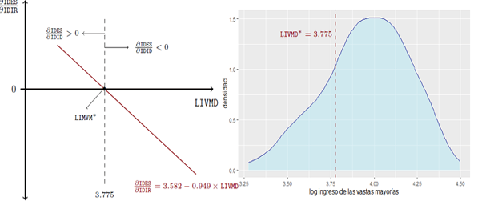

<header class="mb-4 text-sm no-indent">
    

        
<a target="_blank" class="text-blue-600" href="https://revistas.unjbg.edu.pe/index.php/eyn/issue/view/120">Revista Economía & Negocios</a>

        
Vol. 6 Núm. 1, 2024

        
<strong class="block pt-2">Articulo Original</strong>

    

    

        <h1 class="text-xl mb-0">Desequilibrio social, desigualdad distributiva y desempleo en el Perú, 2004 - 2017</h1>
        <h1>Social disequilibrium, distributive inequality and unemployment in Peru, 2004 - 2017</h1>
    

    

        
 Eloy Ávalos*  
            *Autor de correspondencia: eavalosa@unmsm.edu.pe - <a target="_blank" class="text-blue-600"
                href="https://orcid.org/0000-0002-9521-9552">https://orcid.org/0000-0002-9521-9552</a> 
            Universidad Nacional Mayor de San Marcos, Departamento Académico de Economía. Lima, Perú
        

        
Esta obra está bajo una Licencia Creative Commons Atribución 4.0 Internacional.

        
Como citar:Ávalos, E. (2024). Desequilibrio social, desigualdad distributiva y desempleo en el Perú, 2004
            - 2017. <em>Economía &amp; Negocios, 6</em>(1), 24-44. <a target="_blank" class="text-blue-600"
                href="https://www.doi.org/10.33326/27086062.2024.1.1842">https://www.doi.org/10.33326/27086062.2024.1.1842</a> 
        

        
 CÓDIGO JEL:  
            D63, O11, O15

    

</header>

## RESUMEN

El presente trabajo tiene por objetivo principal contrastar una extensión de la hipótesis de la teoría
del desequilibrio distributivo formulada por Figueroa (1993, 2015). Para alcanzar el objetivo se
construyeron dos índices; uno que mide el desorden social y otro que mide la desigualdad distributiva.
Luego, se utilizó la técnica econométrica de datos de panel bajo efectos aleatorios, teniendo como
unidades de análisis empírico a los departamentos del Perú para el periodo 2004-2017. Los resultados
alcanzados en la presente investigación dan cuenta de que una relación entre el desorden social y la
tasa de desempleo; así como entre la desigualdad distributiva y el desequilibrio social, tiene respaldo
empírico y está acorde con lo esperado según las formulaciones de la teoría económica basada en la
envidia económica y los límites de tolerancia a la desigualdad distributiva.

**_Keywords:_** desequilibrio social, desigualdad distributiva,
envidia económica, tasa de desempleo, tolerancia limitada a la desigualdad

## ABSTRACT

The main objective of this paper is to contrast an extension of the hypothesis of the distributive
imbalance theory formulated by Figueroa (1993, 2015). To achieve the objective, two indices were
constructed; one that measures social disorder and another that measures distributive inequality. Then,
the panel data econometric technique under random effects was used, having as empirical units of
analysis the departments of Peru for the period 2004-2017. The results achieved in the present
investigation show that a relationship between social disorder and the unemployment rate; as well as
between distributive inequality and social imbalance, has empirical support and are in accordance with
what is expected according to the formulations of the economic theory based on economic envy and the
limits of tolerance to distributive inequality.

**_Palabras clave:_** social disequilibrium, distributive
inequality, economic envy, unemployment rate, limited tolerance for inequality

## INTRODUCCIÓN

Entre enero de 2003 y diciembre de 2017, el producto interno bruto de la economía peruana creció a una
tasa mensual promedio de 0.50 %, lo que aproximadamente equivale a una tasa anual promedio de 6.17 %
(INEI, 2019).

Los efectos que genera el crecimiento económico, tal como superar un conjunto de limitaciones de carácter
estructural; como lo son la desigualdad distributiva y la pobreza, dependen de qué tan homogéneo sea el
crecimiento entre los diversos sectores productivos. Sin embargo, homogéneo o no, ante el crecimiento
económico es factible que exista algún efecto focalizado sobre la pobreza y la pobreza extrema. Por
ejemplo, entre los años 2001 y 2004, la reducción de la pobreza fue mayor entre los pobres rurales
(Francke, 2006). Adicionalmente, para los primeros años de la década del 2000 existe evidencia de una
relación inversa entre el crecimiento del PIB y su incidencia sobre la pobreza, aunque sensible a la
escala del PIB (Adrianzen, 2013). Asimismo, para algunos años del periodo bajo estudio, el crecimiento
económico ha sido caracterizado como si fuese un crecimiento que ha favorecido a la población más pobre,
ya que ha reducido la pobreza monetaria (García, 2011).

La desigualdad de ingresos, para los años 2003 y 2004, se mantenía en un nivel de alrededor de la década
de 1960. Esta persistencia de la desigualdad distributiva ocurre mediante la inversión intergeneracional
en el capital humano (Mendoza, 2015). Sin embargo, para algunos autores el reciente crecimiento
económico peruano ha mostrado evidencias de una reducción de la desigualdad económica. Así, para el año
1997 a nivel nacional el índice de Gini sobre los ingresos fue de 0.54; luego, en el 2006 la desigualdad
era de 0.49 (Jaramillo, 2011).

Por otro lado, desde una postura económica heterodoxa no se ve la desigualdad en el Perú desde la
perspectiva de los ingresos de los hogares; pues se considera que una medición desde este enfoque
subestima la desigualdad en tanto no recoge información de los ingresos de los hogares con mayor riqueza
e ingresos. La heterodoxia adopta más bien una metodología que mide la desigualdad desde las cuentas
nacionales, llegando a la conclusión que la desigualdad es predominante, no solo en la distribución
factorial, sino además en la distribución personal; ya que según los cálculos el Gini este fluctuó,
entre el 2004 y 2016, de 0.68 y 0.64 en el mejor de los casos (Alarco, 2019).

Entre los años 2004 y 2017, según nuestros cálculos, los cambios en la desigualdad distributiva han sido
heterogéneos [para el cálculo del índice de Gini se utilizó la misma base de datos que se usó para
estimar el índice de desigualdad del ingreso relativo que se expone en Ávalos (2023) sobre la cual se
aplicó la librería *ineq* del programa estadístico R, con la orden *ineq(x, type=
“Gini”*]. Así, de acuerdo al índice de Gini promedio, los seis departamentos con mayor
desigualdad de ingresos son Ayacucho (51.86), Cajamarca (53.27), Puno (51.03), Huánuco (52.36),
Huancavelica (51.77) y Apurímac (50.88). Entre estos, todos han visto disminuir su índice, algunos más
que otros. Por ejemplo, Apurímac y Huancavelica, disminuyeron en 10.44 y 9.29 puntos; en tanto que, los
departamentos de Ayacucho y Cajamarca fueron los que menos disminuyeron, 0.09 y 0.51 puntos
respectivamente. Un segundo grupo de departamentos, pero con un índice de Gini promedio menor, comprende
a Loreto (49.97), Moquegua (50.61), Cusco (49.63), San Martín (49.92), Amazonas (49.22) y La libertad
(48.00). Entre estos, solo cinco disminuyeron su desigualdad. Loreto tuvo un aumento de 2.94 puntos y
San Martín apenas mejoró en 0.43 puntos. En tanto que, Amazonas y La Libertad fueron los departamentos
que más mejoraron, con 3.75 y 2.53 puntos, respectivamente.

Un tercer grupo de departamentos, con un coeficiente de Gini promedio aún menor, comprende a Ancash
(47.92), Pasco (47.30), Junín (45.01), Piura (44.89), Arequipa (43.89) y Lima (43.85). De estos, el
departamento de Junín ha empeorado su desigualdad distributiva, pues entre 2004 y 2017 el índice de Gini
pasó de 45.79 a 45.98. El resto disminuyó, siendo los departamentos de Lima y Arequipa los que más
mejoraron; el primero en 4.42 y el segundo en 7.77 puntos. Finalmente, un cuarto grupo de departamentos,
que en promedio tienen un Gini igual a 40.13, comprende a Tacna (43.00), Lambayeque (41.19), Madre de
Dios (40.80), Ucayali (40.28), Tumbes (38.76) e Ica (36.75). De este último grupo, el departamento de
Madre de Dios ha retrocedido en términos de desigualdad, pues su índice de Gini aumentó 6.40 puntos.
Adicionalmente, los departamentos de Ica y Ucayali han evolucionado positivamente en la reducción de la
desigualdad, pues Ica disminuyó en 11.57 puntos y Ucayali, en 6.75 puntos.

Por otro lado, bajo el contexto de crecimiento económico peruano 2003 - 2017, se evidencia un mayor
desorden o desequilibrio social. Por ejemplo, algunos tipos de delitos, como aquellos contra el
patrimonio, han presentado un incremento importante. Entre estos tipos de delitos, considerando su
magnitud, los más importantes son el hurto [para una delimitación y diferencia legal entre hurto, robo,
apropiación ilícita, estafa nos remitimos al Código Penal (El Peruano, 1990)]. Así, se ha observado que
en el Perú entre los años 2004 y 2017, el hurto (_Thurden_p_) pasó de 209.61 a 319.17 casos por
cada 100 mil habitantes. Asimismo, para el mismo periodo, el robo (_Trobden_p_) pasó de 156.26 a
220.19 casos por cada 100 mil habitantes. Por otro lado, los delitos de apropiación ilícita
(_Taprden_p_) y de estafa (_Testden_p_) pasaron de 14.56 y 17.81 casos por 100 mil
habitantes a 4.88 y 16.25 casos, respectivamente.

La evolución de estos delitos contra el patrimonio, como esperábamos, no ha sido homogéneo para todos los
departamentos del Perú. Por ejemplo, para el año 2004, los departamentos con menor número de hurtos por
cada 100 mil habitantes fueron Puno (23), Huancavelica (35) y San Martín (43). En tanto que, los que
tuvieron mayores números fueron Madre de Dios (474), Lima (541) y Moquegua (565). Trece años después, no
solo al menos las diferencias se mantienen, sino que además se tienen mayores niveles. Así, para el año
2017, los departamentos con un menor número de hurtos eran Puno (59), Huánuco (79) y Huancavelica (102).
En tanto que, los que tuvieron mayores números de casos fueron Tacna (725), Lambayeque (907) y Madre de
Dios (1278). En cuanto a los robos, para el año 2004, los departamentos con un menor número eran Puno
(17), Cajamarca (17) y Huancavelica (22), y los que tuvieron mayores números fueron Madre de Dios (390),
La Libertad (393) y Lima (439). Para el año 2017, los departamentos con un menor número de robos fueron
Huánuco (23), Huancavelica (28) y Pasco (35). Mientras que, los que tuvieron mayores números de casos
fueron Ica (560), Tumbes (656) y Madre de Dios (727).

En cuanto al delito de apropiación ilícita, los departamentos con un menor número de casos por cada 100
mil habitantes durante el año 2004 fueron Huancavelica (0), Huánuco y Pasco (3). Y los que tuvieron
mayores números fueron Madre de Dios (51), Ucayali (54) y Lambayeque (63). En tanto que para el 2017,
los departamentos con menores casos fueron Ayacucho, Huánuco y Puno (1), y los de mayores números de
casos correspondieron a Arequipa (19), Tumbes (22) y Madre de Dios (36). En cuanto a las estafas, para
el año 2004, los departamentos con un menor número eran Tumbes, Huánuco y Pasco (1), y los que tuvieron
mayores números fueron Loreto (45), Ucayali (62) y Lambayeque (62). Para el año 2017, los departamentos
con un menor número de estafas por cada 100 mil habitantes fueron Huánuco (2), Apurímac (3) y Puno (4).
Mientras que, los que tuvieron mayores números de estafas fueron Arequipa (21), Loreto (22) y Lambayeque
(55).

En general, de acuerdo con lo observado, parece ser que el delito de apropiación ilícita tiende a tomar
cada vez menor importancia en la forma de delinquir, frente al delito de la estafa. Asimismo, ambos
delitos, apenas representan entre el 5 % y 10 % de los delitos de hurto y robo, siendo estos últimos
numéricamente más importantes en relación al total.

Otros tipos de delitos, en los que subyace alguna motivación económica, son algunos de los que son
tipificados, según el Código Penal (El Peruano, 1990), como delitos contra la seguridad pública. Entre
los más importantes, nuevamente, por su magnitud cuantitativa, son los delitos del tráfico ilícito de
drogas. Para estos delitos se observa que entre los años 2004 y 2017, el tráfico ilícito de drogas
(_Tilden_p_) tuvo un valor mínimo de 6.12 casos por 100 mil habitantes para el año 2006 y alcanzó
un valor máximo de 16.89 casos para el 2015. En tanto que, la microcomercialización de drogas
(_Tmdrden_p_) comenzó para el periodo con el menor valor, 8.83 casos por 100 mil habitantes,
alcanzando un pico de 21.80 casos para el año 2012.

Como en los casos de delitos contra el patrimonio, los delitos contra la seguridad pública no presentan
una evolución homogénea para los departamentos del Perú. En el caso del tráfico ilícito de drogas, los
departamentos con menores casos por cada 100 mil habitantes durante el 2004 fueron Arequipa,
Huancavelica (2) y Amazonas (4). En cambio, los departamentos de Ayacucho, Ucayali (44) y Huánuco (56)
fueron los que registraron mayores casos. Posteriormente, para el año 2017, fueron los departamentos de
Huancavelica, Pasco y Ucayali los que registraron una tasa mínima de 1; mientras que Arequipa (21),
Loreto (22) y Tumbes (89) fueron los que registraron las mayores tasas de tráfico ilícito de drogas.

En cuanto al delito de microcomercialización de drogas, durante el año 2004, fueron alrededor de siete,
de veinticuatro departamentos, los que no presentaron caso alguno. Mientras que, los que tuvieron
mayores números fueron Piura (23), Lima (25) y Moquegua (28). En tanto que, para el 2017, solo dos
departamentos del total no presentaron casos y fue Puno (1) el departamento con el menor número positivo
de casos. Los de mayores casos de microcomercialización de drogas fueron La Libertad (28), Lambayeque
(30) y Tumbes (30). En general, se observa un aumento en el número total de casos de delitos durante el
periodo de estudio, lo cual se contrapone con el crecimiento económico experimentado por la economía
para el mismo periodo.

Para evidenciar la heterogeneidad, mostramos en la tabla 1, para el año 2017, un ranking de los
departamentos según el mayor número de casos por tipo de delito observado que presentan.  

**Tabla 1**

_Ranking departamental de delitos, 2017_

| Delito   | 1.º lugar     | 2.º lugar  | 3.º lugar   | 4.º lugar  | 5.º lugar  |
| -------- | ------------- | ---------- | ----------- | ---------- | ---------- |
| Hurden_p | Madre de Dios | Lambayeque | Tacna       | Arequipa   | Tumbes     |
| Robden_p | Madre de Dios | Tumbes     | Ica         | Lima       | Lambayeque |
| Aprden_p | Madre de Dios | Tumbes     | Arequipa    | Amazonas   | Lambayeque |
| Estden_p | Arequipa      | Lambayeque | Tacna       | San Martín | Amazonas   |
| Tilden_p | Tumbes        | Loreto     | Arequipa    | Huánuco    | Tacna      |
| Mdrden_p | Lambayeque    | Tumbes     | La Libertad | Moquegua   | Lima       |

_Fuente:_ Policía Nacional del Perú

Por último, considerando todos los departamentos del Perú, los seis delitos, cuatro delitos contra el
patrimonio y dos contra la seguridad pública; se evidencia durante el periodo 2004 - 2017 un aumento del
total de delitos (_Ttdelit_p_) por cada 100 mil habitantes. Numéricamente, se ha pasado de 416.30
a 577.98 casos, con un mínimo de 351.55 y un máximo de 624.65 casos para el periodo (tabla 2).  

**Tabla 2**

_Total de delitos por 100 mil habitantes_

| Año  | Ttdelit_p | Año  | Ttdelit_p | Año  | Ttdelit_p | Año  | Ttdelit_p |
| ---- | --------- | ---- | --------- | ---- | --------- | ---- | --------- |
| 2004 | 416.3     | 2008 | 358.83    | 2012 | 561.74    | 2016 | 584.34    |
| 2005 | 394.34    | 2009 | 381.91    | 2013 | 584.87    | 2017 | 577.98    |
| 2006 | 382.98    | 2010 | 427.63    | 2014 | 594.58    |      |           |
| 2007 | 351.55    | 2011 | 473.83    | 2015 | 624.65    |

_Fuente:_ Policía Nacional del Perú

La teoría del desequilibrio distributivo sostiene que los miembros de una economía de mercado poseen un
sentido de justicia respecto a la desigualdad distributiva de ingresos. Es decir, cada uno posee una
_tolerancia social limitada a la desigualdad distributiva_ (Figueroa, 1993; 2015). Así, si para
algún grupo de individuos la desigualdad de ingresos se incrementa más allá de los límites de
tolerancia, este resultado conducirá a un desorden o desequilibrio social; ya que los individuos se
comportarán como si desconocieran las reglas básicas y necesarias para el funcionamiento de la economía
de mercado, activándose como consecuencia algunos mecanismos redistributivos por fuera del mercado. Se
usan los términos _desequilibrio distributivo, desequilibrio social_ o *crisis distributiva*como equivalentes. En la presente investigación seguiremos utilizando el término _desorden
social_ o _desequilibrio social_ como equivalentes, el cuál será formalizado en la
siguiente sección.

¿Cuándo y por qué una sociedad entraría en un desequilibrio social? Una posible explicación del
desequilibrio social se fundamenta en el agotamiento del _efecto túnel_. Según Hirschman y
Rothschild (1973), en ciertas etapas del desarrollo económico el bienestar de un individuo no solo
depende de su ingreso presente, sino además de su ingreso futuro esperado. Luego, cada individuo podría
sentir gratificación por la mejora en los ingresos de otros individuos de referencia. Es decir, podría
poseer una tolerancia a la desigualdad, pues toma esta situación de empeoramiento como una información
positiva de que pronto mejorará su situación individual (esta sería una situación bajo el _efecto
túnel_). Así, el _efecto túnel_ es una especie de tolerancia inicial (Flechtner, 2013).
Sin embargo, si con el transcurrir del tiempo los individuos percibiesen que sus expectativas de
mejoras, en términos de ingreso o bienestar, no alcanzan hacerse efectivas en un presente determinado
entonces experimentarán un sentido de furia y de deseo de cambio de tal injusticia, configurando así un
tipo específico de desarrollo económico para la sociedad. Por ejemplo, podríamos tener un desarrollo
económico con fallas de coordinación, donde los agentes, a pesar de conocer sobre la situación de
equilibrio socialmente superior, no pueden optar por aquel, ya sea porque a veces las personas tienen
diferentes expectativas o sea porque a todos les conviene esperar a que alguien más dé el primer paso
(Todaro, 2015, p. 166).

Asimismo, la duración temporal del _efecto túnel_ está condicionada por el grado de heterogeneidad
de la sociedad, la cual estaría determinada, entre otros factores, por las características de tipo
étnico, religioso o lingüístico. Así, por ejemplo, si en sociedades heterogéneas el desarrollo económico
se identifica con un grupo étnico en particular, entonces es poco probable que aquellos miembros que se
quedan rezagados experimenten el _efecto túnel_, ya que tendrían una baja o ninguna tolerancia a
la mayor desigualdad, dado que considerarían que se estaría alcanzando una ventaja injusta sobre ellos.
Por lo tanto, en sociedades más homogéneas, el _efecto túnel_ sería probablemente de mayor
duración y más profundo.

La literatura empírica que trata del _efecto túnel_ supone implícitamente la existencia de límites
de tolerancia a la desigualdad en los individuos. Por ejemplo, Ravallion y Lokshin (2000) muestran
evidencia para Rusia de 1996. En una muestra de rusos adultos encuentran que existe un mayor apoyo a la
implementación de políticas redistributivas entre aquellos que esperan que su bienestar disminuya,
siendo más fuerte este apoyo en los que tienen un estado de salud deteriorado, los que habitan en las
zonas rurales, las personas con menos años de escolaridad, los que temen perder su trabajo, los ancianos
y las mujeres. Así, sectores que serían menos favorecidos apoyarían en mayor proporción la aplicación de
políticas redistributivas en tanto esperan que en un futuro cercano su situación mejore. Por otro lado,
en un estudio empírico que testea el _efecto túnel_ para el Reino Unido y para Alemania, FitzRoy
et al. (2013) trabajan un panel de grupos de individuos encontrando una asimetría en la relación entre
el ingreso relativo y la satisfacción de vida condicionada a la edad. En este caso, se encuentra que
para los grupos menores de cuarenta y cinco años de edad, existe un efecto positivo significativo,
mientras que para los grupos mayores se tiene el usual efecto negativo, lo cual es consistente con la
hipótesis del _efecto túnel_, en tanto que las personas jóvenes vean el éxito de sus compañeros
como una información positiva de sus propias perspectivas de futuro a diferencia de las personas
mayores, para quienes sus expectativas han perdido relevancia.

La hipótesis del _efecto túnel_ de Hirschman, como un fundamento que subyace al desorden social,
podría interpretarse como una simplificación teórica excesiva si se sostiene que al finalizar un efecto
túnel cualesquiera sean necesariamente los pobres los únicos individuos que se interesan en la brecha
existente entre ellos y los ricos. Sin embargo, no es esta la idea que se desprende de la lectura de
Hirschman y Rothschild (1973), pues los individuos pueden tener diversas perspectivas y experiencias del
desarrollo económico y social de la sociedad. Además, los indicadores de desigualdad pueden variar
independientemente del crecimiento económico (Durongkaveroj, 2018).

Por otro lado, otra hipótesis teórica que podría explicar la existencia del desequilibrio social sería
aquella que sostiene una relación inversa entre el bienestar subjetivo y la desigualdad distributiva.
Por ejemplo, en esta línea de investigación, Powdthavee et al. (2017) estudian una posible relación
entre el bienestar subjetivo agregado y el 1 % superior en la distribución del ingreso nacional. Este
estudio evidencia para una muestra de veinticuatro países, de 2005 a 2013, que ante un aumento de los
ingresos nacionales se tiene un efecto negativo significativo sobre el bienestar agregado en tanto que
aumenta la participación del ingreso de los percentiles superiores de la distribución del ingreso.
Además, encuentra evidencia estadística de que las personas que habitan en Europa son significativamente
menos tolerables al aumento de la participación de los ingresos de los percentiles superiores que las de
otros países, ya que estas consideran que viven en una sociedad menos móvil. Por supuesto, este hallazgo
es consistente con la hipótesis del _efecto túnel_, puesto que esta hipótesis predice que la
asociación entre la desigualdad del ingreso y el bienestar agregado debería ser positiva (o menos
negativa) en países donde la movilidad del ingreso es alta. Sin embargo, Powdthavee et al. (2017)
resalta que la relación entre la desigualdad distributiva y el bienestar emocional es sumamente compleja
a lo largo de los diferentes países.

Una tercera hipótesis, tomando la idea del efecto _bandwagon_ de Leibenstein (1950), que podría
explicar la relación entre desigualdad y desorden social, es aquella que sostendría que los individuos
menos favorecidos en la distribución recurren al desorden social con el fin de poder sostener o
incrementar su nivel de vida condicionado por el efecto _bandwagon_ en relación con los grupos o
individuos de mayores ingresos o mejor posicionados en la distribución de ingresos. Sin embargo, esta
línea de investigación no ha sido desarrollada.

Finalmente, tenemos la hipótesis de la teoría del desequilibrio social (Figueroa, 2015). En su primera
presentación, Figueroa (1993) formula para un _j_-ésimo individuo, una _función de equidad
Ej=f_ (_Yj, Rj_), siendo (_Yj,
Rj_ ) > (\*Yj\*, Rj\**), donde
*Yj* denota el ingreso absoluto y *Rj* el ingreso relativo. El
ingreso relativo del *j*-ésimo individuo viene dado por  *Rj*≡,  siendo
*i* el individuo representativo del grupo de referencia o el ingreso promedio del grupo de
referencia. El asterisco denota los umbrales de tolerancia respectivos del *j*-ésimo individuo.
Así, una asignación de ingresos se considera como una *asignación no justa* en la medida que
exista algún grupo de individuos para los que dicha asignación no es tolerable, esto es
(*Yj, Rj* ) < (*Yj\*,
Rj\*\*).

Posteriormente, Figueroa (2015) sostiene que las sociedades capitalistas se caracterizan por ser
sociedades desiguales donde los individuos tienen un sentido de equidad con respecto a la desigualdad
distributiva y como consecuencia de ello se establecen umbrales de tolerancia a la desigualdad.
Entonces, cuando la desigualdad distributiva resultante del intercambio vías mercado cae fuera del rango
tolerable, los individuos se comportarán como si desconociesen las reglas formales de la sociedad. En
este sentido, luego se propone una función de predicción empírica,

$$ S D=f\left(\frac{D}{D^\*}\right) $$

donde _f’_> 0, siendo _SD_ un indicador de desorden social, _D_ el grado de
desigualdad corriente y \*D\*\* un nivel de desigualdad tolerable. Agrega Figueroa (2009)
que la desigualdad de ingresos es resultado esencialmente de la desigualdad inicial en la distribución
individual de los activos económicos y políticos con la que se inició históricamente la sociedad, lo
cual es consistente con el segundo teorema del bienestar social abundantemente estudiando en la
literatura (Hildenbrand & Kirman, 1988; Feldman & Serrano, 2006; Starr, 2011).

En la literatura teórica, que hace un mayor hincapié en la fundamentación microeconómica, se concibe una
asignación equitativa como aquella situación en la que no existe envidia económica. A la luz de esto, en
la formulación teórica de Figueroa es posible que entre las asignaciones de ingresos tolerables existan
algunas asignaciones distributivas que no sean justas, ya que podría existir _envidia económica_
por parte de algún grupo de individuos sobre otros en algunas de ellas (Varian, 1974; Chavas, 2008).
Así, Chavas (2008) define una _asignación justa_ utilizando una función de beneficios
_bi_ (∙), tal que una asignación es justa si y solo si se satisface la condición
siguiente,

$$
b\_i\left(y\_j, U\_i\left(y\_j\right)\right) \leq 0 \quad \forall i, j \in N, \quad
j \neq i
$$

donde _i_ y _j_ denotan individuos diferentes. Entonces, podríamos tener diferentes
conceptos de justicia distributiva, ajenas a situaciones de distribución tolerables, ya que la teoría
del desequilibrio distributivo no hace uso de una función de bienestar social ni tampoco incorpora una
relación de correspondencia de elección social; pues, se formula inicialmente una función de equidad
para luego plantear una función de predicción empírica dejando como única razón subyacente de la posible
relación entre la desigualdad distributiva y el desorden social la existencia de umbrales de tolerancia.
Sin embargo, es posible tener definiciones de justicia contradictorias entre sí o ausentes en el marco
de la teoría del desequilibrio distributivo. Siguiendo a Corchón y Iturbe-Ormaetxe, I. (2001), para un
enfoque específico de la teoría de la justicia del segundo tipo, enfoque _equidad_, será posible
proponer asignaciones libres de envidia. Luego, formulándose una función de aspiración individual, será
posible tener una situación de injusticia distributiva pero tolerable.

Por otro lado, será factible tener un concepto de justicia, entre otros, basado en la igualdad de
libertad donde los individuos están dotados de diferentes capacidades productivas. El concepto de
_igualdad de libertad_ se justifica éticamente sobre la idea de que todo ser humano debería tener
acceso a las mismas oportunidades de vida, independientemente de las diferencias innatas de
productividad (Piketty, 1994). Sin embargo, una asignación resultante de una elección social, donde cada
individuo tiene acceso al mismo conjunto de oportunidades, si bien podría ser una asignación Pareto
eficiente, aún podría ser no tolerable. Bajo otra postura, para las mismas oportunidades no siempre se
obtienen los mismos resultados en tanto el ejercicio de las libertades no permite efectuar las
realizaciones de valoración positiva (Sen, 1998, Sen, 1999). Es más, aun si se alcanzase el objetivo del
desarrollo: el ejercicio pleno de las libertades que permita la realización de las capacidades no está
garantizado un resultado socialmente tolerable (Avalos, 2016).

Finalmente, es importante mencionar que la relación que podría existir entre desigualdad distributiva y
desorden social no solo se sostiene en la economía, ya que en las investigaciones de otras disciplinas,
como la de los epidemiólogos Wilkinson y Pickett en _The Spirit Level: why equality is better for
everyone_, se muestra que la desigualdad es violencia estructural, pues esta se traduce en
efectos negativos sobre variables que van desde la educación hasta la esperanza de vida de los miembros
de la sociedad (Thomas, 2012).

Originalmente, la hipótesis del efecto túnel de Hirschman, usa una función de utilidad para el individuo
tipo _A_ de forma _U A_(_t_) = _V_(_Y A_
(_t_), _Y B_ (_t_), _E A_(_t_)), donde
_Y i_ (_t_) es el ingreso presente y _Ei_ es el ingreso
futuro esperado del _i_-ésimo individuo. En esta teoría, la idea de _envidia_ o _efecto
comparación_ se recoge por el coeficiente *V*2<0 (Hirschman &
Rothschild, 1973). En tanto que, la categoría de _envidia económica_ permite precisar un criterio
para establecer cuándo una asignación o un vector de distribución es justo o equitativo en el marco de
la economía del bienestar, la teoría de Hirschman puede ser ampliada para tal efecto. Por lo tanto, la
incorporación del ingreso del individuo tipo _B, YB_, en la función de utilidad del
individuo _A_, recoge la idea de que el individuo no solo evalúa su ingreso absoluto para efectos
de su bienestar, sino además considera el ingreso de otros. Es decir, evalúa un ingreso relativo a un
grupo referente.

Por otro lado, para Feldman y Kirman (1974) la asignación justa involucra un vector de envidia
_e_(_x_), tal que _e_(_x_)=(*e*1
(_x_),…,*e*2 (_x_)); siendo _ei_
(_x_)=∑jn =1[*ui*
(*xj*)-*ui* (*xi*)] una medida total de la envidia
económica del _i_-ésimo individuo respecto al resto de individuos, siendo _ui_
(∙) la función de utilidad del _i_-ésimo individuo. Como se observa, la medida total de envidia
económica del _i_-ésimo individuo contemplan la asignación del _j_-ésimo individuo.
Nuevamente, se tiene la comparación entre el bienestar de un individuo según su asignación propia y la
que obtendría si dispusiese de la asignación del otro individuo.

Asimismo, Varian (1974, 1975) señala que una asignación _x_ es _equitativa_ si y solo si
para todo individuo _i_ y _j_ se cumple _xi_ ≿ _xj_
[en la literatura estándar de la teoría neoclásica, la notación ≿*i* se refiere a la
relación de preferencia débil y ≿*i* denota la relación de *preferencia fuerte*
(Mas-Colell, 1995)]. Luego, si _xj_ ≿*i*  _xi_, se
dice que el _i_-ésimo individuo envidia al individuo _j_ en la asignación _x_. Por
lo tanto, la equidad requiere la ausencia de envidia económica. Entonces, si una asignación _x_
es equitativa y eficiente, luego se dice que esta es _justa_. Claramente, para definir la equidad
y la justicia distributiva, necesariamente un individuo evalúa la asignación de otro referencial, por lo
que se establece aquí una diferencia entre la asignación equitativa y justa, esta es la eficiencia.

Desde una extensión de la teoría de la equidad formulada en la psicología social, Mui (1995), sostiene
que la _envidia económica_ juega un papel importante en el comportamiento económico que subyace
en situaciones de sabotajes o represalias contra otros individuos y que el intercambio voluntario (legal
y a través del mercado) no es suficiente para aliviar totalmente los problemas derivados de la envidia.
Esta teoría presenta una formalización de la _envidia económica_ como si fuese una función
matemática, la función _E_, dada por:

$$
\begin{array}{cll}
E\_1=\left(\frac{Y\_1}{Y\_2}\right)=0 \quad \text { si } \quad \frac{Y\_2}{Y\_1} \leq 1 \\
E\_1=\left(\frac{Y\_1}{Y\_2}\right)\gt 0, \text { }\mathrm{E}\_1>0, \text { } E\_1^{\prime}\gt 0 \quad \text
{ si } \quad \frac{Y\_2}{Y\_1}\gt 1
\end{array}
$$

siendo los _Yi_ los ingresos absolutos individuales. En la formulación de Mui (1995),
la expresión de la envidia económica es presentada en términos del ingreso relativo, pues si el ingreso
del individuo 2 es mayor al ingreso del individuo uno, _Y2_ >
_Y1_, luego la envidia del individuo 1 será mayor, pues E1’> 0.

En una línea de investigación similar, Fischer y Torgler (2006) señalan que en una asignación de ingresos
donde la posición relativa es importante para cada individuo, la envidia económica de parte de un grupo
de individuos consecuente será un factor de desorden social, pues reduce la _felicidad personal_.
Asimismo, sostienen que las desventajas en la posición del ingreso relativo disminuyen la confianza de
las personas en los demás y afecta su percepción de justicia. Para efectos de la aplicación empírica de
su teoría, utilizan la diferencia entre los ingresos individuales y el ingreso nacional y regional de
subsistencia como una aproximación de la _envidia económica_.

Es importante señalar que en los inicios de la literatura económica neoclásica ya existían indicios de la
idea de umbral de tolerancia. Por ejemplo, para umbrales absolutos, Avalos (2014) hace notar que Alfred
Marshall, en sus _Principles of Economics_, señala que la influencia del nivel de ingreso sobre
una persona no es menor y que frente a una variabilidad de su ingreso que conlleve un nivel por debajo
de un ingreso absoluto determinado no le puede ser indiferente. Al respecto:

…It may make little difference to the fulness of life of a family whether its
yearly income is £1000 or £5000; but it makes a very great difference whether the income is £30 or £150:
for with £150 the family has, with £30 it has not, the material conditions of a complete life [… Puede
hacer poca diferencia para la plenitud de la vida de una familia si su ingreso anual es de £1000 o
£5000; pero hace una diferencia muy grande si el ingreso es de £30 o £150: porque con £150 la familia
tiene, con £30 no, las condiciones materiales de una vida normal] (Marshall, 1920, p. 1).

Adicionalmente, Marshall indica que la satisfacción que una persona obtiene de su ingreso, recién se
inicia una vez satisfecha las necesidades más apremiantes. Es decir, que existiría un nivel de ingreso
relacionado a un nivel de necesidades y que solo a partir de ese nivel se toma en cuenta la satisfacción
para el individuo.

That is to say, if £30 represent necessaries, a person’s satisfaction from his
income will begin at that point; and when it has reached £40, an additional £1 will add a tenth to the
£10 which represents its happiness-yielding power (Marshall, 1920, p. 111).

Como mencionamos, ambos planteamientos dan cuenta de la existencia de un umbral absoluto de tolerancia.
Por otro lado, desde otra perspectiva teórica, no está demás mostrar que en la economía clásica se
pueden encontrar indicios de que frente a una mayor desigualdad, los individuos sentirán un mayor
descontento. Al respecto Marx (1849) señala:

A house may be large or small; as long as the neighboring houses are likewise
small, it satisfies all social requirement for a residence. But let there arise next to the little house
a palace, and the little house shrinks to a hut. The little house now makes it clear that its inmate has
no social position at all to maintain, or but a very insignificant one; and however high it may shoot up
in the course of civilization, if the neighboring palace rises in equal of even in greater measure, the
occupant of the relatively little house will always find himself more uncomfortable, more dissatisfied,
more cramped within his four walls (Marx, 1849, p. 82).

En síntesis, dado que la teoría del desequilibrio distributivo omite la envidia económica como parte del
mecanismo subyacente que explicaría la relación entre desigualdad distributiva y el desorden social, en
la presente investigación incorporaremos el concepto de _envidia económica_, además de la
presunción de la existencia de umbrales de tolerancia a la desigualdad, como los factores que subyacen
en la relación empírica que formula Figueroa (2015).

Por otro lado, si consideramos que cierto tipo de criminalidad es parte del desequilibrio social, ¿qué
dice la literatura económica de la criminalidad? La literatura económica acerca de la criminalidad
enfoca la explicación de esta variable como si fuese resultado de una elección racional individual
(Becker, 1962; Block & Heineke, 1975). Sin embargo, este enfoque puede reexpresarse en términos de
la teoría del desequilibrio social,  donde el ingreso relativo es una de las variables explicativas.
Así, de una forma muy simple, podemos formular una función de costos del crimen dada por
_C_=π*F*, donde π denota la probabilidad de que el criminal sea capturado y _F_,
una medida monetaria del castigo o pena. Si concebimos que el castigo refleja el costo de oportunidad de
la actividad criminal, el cual viene dado por _wl_, siendo _w_ el salario que podría
percibirse por un empleo legal mediante una transacción de mercado y _l_ el número de horas que
podría laborar. Luego, dada una tasa de desempleo promedio _μ_ y una dotación laboral del
individuo _h_; entonces podemos derivar las horas de empleo en términos de la tasa de desempleo
_l_ =(1-_μ_)_h_. Por otro lado, si denotamos por _w_ ̃  el salario de
referencia que tiene el individuo, ya sea el salario de un individuo representativo o el salario
promedio de un grupo próximo, entonces su ingreso relativo vendría dado por _r_ = _ww_ ̃
(-1). Luego, será posible como se muestra en Avalos (2023) expresar el ingreso relativo como
un equivalente aproximado igual a _r_ = 1- _I_, donde I es un índice de desigualdad
distributiva. En consecuencia, el costo de la actividad criminal será expresado de la siguiente manera:

$$ C=\pi(1-I) \tilde{w}(1-\mu) h $$

de donde derivamos formalmente que una mayor desigualdad disminuiría el costo del crimen y en
consecuencia aumentaría la criminalidad generando mayor desequilibrio social,

$$ \frac{\partial C}{\partial 1}=-\pi \tilde{w}(1-\mu) h\lt 0 $$

Además, se obtiene que una mayor tasa de desempleo, disminuiría el costo del crimen, por lo tanto
aumentaría el volumen de delitos y en consecuencia el desorden social,

$$ \frac{\partial C}{\partial \mu}=-\pi(1-I) \tilde{w} h\lt 0 $$

El sentido de estos resultados no depende del valor de π, en tanto que se verifica 0 ≤ π ≤ 1.

Como notamos, el enfoque de Becker (1962) queda enmarcado bajo la formulación teórica propuesta en la
presente investigación. La diferencia estaría en el mecanismo subyacente. Así, un aumento de la
desigualdad distributiva, que incrementaría la envidia económica, y un aumento de la tasa de desempleo,
que incrementaría el rechazo al resultado distributivo del mercado, conllevarán una reducción del costo
de la actividad delictiva y, en consecuencia, un aumento de los delitos, _ceteris paribus_. En
otras palabras, habría un mayor desorden o desequilibrio social. En suma, se mantiene incólume la
relación empírica de la teoría del desequilibrio social.

De acuerdo con lo planteado, pretendemos responder las siguientes preguntas: ¿ha tenido un impacto la
desigualdad distributiva sobre el desequilibrio social?; y, si hubiese algún impacto, ¿este está
condicionado por algún umbral absoluto de ingreso? Por último, una variable relacionada con la
percepción de ingresos, como la tasa de desempleo, ¿tendrá algún efecto sobre el desequilibrio o
desorden social?

Además, la presente investigación tiene por objetivos contrastar si la variación de la desigualdad o de
las variables que modifiquen la posición relativa y absoluta del individuo en su situación económica,
tales como la situación laboral y los niveles de ingresos de los peores posicionados en la distribución
de ingresos, generan cambios en el desequilibrio o desorden social; así como, aproximar empíricamente el
desequilibrio o desorden social mediante un índice basado en las estadísticas de las denuncias de
delitos con motivación económica, dada la normativa del derecho penal del Perú.

Formulamos las siguientes hipótesis: de acuerdo a la teoría del desequilibrio social, se espera que una
mayor desigualdad distributiva aumente el desequilibrio o desorden social. Este resultado estará
condicionado por el nivel del ingreso de las vastas mayorías. Esperamos que el impacto de la desigualdad
distributiva sobre el desorden social sea cada vez menor a medida que aumente el ingreso de las vastas
mayorías y que a partir de cierto umbral de ingresos, una mayor desigualdad ya no afectará positivamente
al desequilibrio social.

## MATERIALES Y MÉTODOS

La literatura sobre los determinantes de la criminalidad es vasta. En ella, se da cuenta de una posible
relación entre la desigualdad, el desempleo y la criminalidad, donde se encuentran evidencias de una
relación significativa entre la desigualdad del ingreso y la tasa de criminalidad de algún tipo, como es
el caso del estudio de Kelly (2000) para los condados urbanos en Estados Unidos y el de Demombynes y
Özler (2002), que también encuentra una relación positiva para cierto tipos de delitos en Sudáfrica,
evidenciando una relación entre el robo en general, el robo de residencias, las estafas, etc., y la
desigualdad.

Asimismo, para los municipios brasileños, De Resende y Viegas (2011) encuentran una relación
significativa o no entre la desigualdad y la criminalidad, según se trate de un tipo específico de
crimen. Una “debilidad” de estos trabajos es que la relación entre la desigualdad del ingreso y la tasa
de criminalidad se presenta como una relación empírica, no haciendo explícita el mecanismo causal que
subyace a dicha relación. Es decir, carecen de una explicación teórica. Pero, como ya lo mencionamos, es
posible establecer una relación causal entre la desigualdad y la criminalidad, en el marco de una teoría
del desequilibrio social. Además, estos estudios limitan el tratamiento de la desigualdad de ingresos al
clásico indicador del coeficiente de Gini.

Para efectos del trabajo empírico de la presente investigación trabajaremos sobre la base de la relación
empírica propuesta en Figueroa (2015), pero con un fundamento adicional basado en la envidia económica
(Avalos, 2014). Bajo el marco teórico del desequilibrio social, buscaremos contrastar las siguientes
relaciones: siempre que no se esté por debajo de un umbral de ingreso de las vastas mayorías, un aumento
de la desigualdad distributiva incrementa la envidia económica y, en consecuencia, el desorden social,
_ceteris paribus_, y un aumento de la tasa de desempleo, incrementa el rechazo al resultado
distributivo del mercado; conllevando un mayor desorden social, _ceteris paribus_.

La operatividad empírica del desequilibrio social se tratará mediante la construcción de un índice, el
cual denotaremos como IDES (índice de desequilibrio social). El índice se construirá sobre la base de
las denuncias de los delitos de hurto, robo, apropiación ilícita, estafa, tráfico ilícito y de
microcomercialización de drogas por cada 100 mil habitantes para cada departamento del Perú durante el
periodo 2004 - 2017. No se considera a toda la población del departamento, sino solo a aquella parte que
potencialmente puede realizar un trabajo o cometer delitos; que para efectos del presente trabajo,
consideraremos únicamente a las personas comprendidas entre los 15 y 65 años de edad.

Para la elaboración del índice IDES se sigue la metodología utilizada en la construcción de indicadores
de bienestar social (Di Pasquele, 2008; Rocha et al., 2017), con algunos ajustes estadísticos. La fuente
de los datos de denuncias son los anuarios estadísticos elaborados por la Dirección de Tecnología de la
Información y Comunicaciones de la Policía Nacional del Perú, PNP. Este índice será construido mediante
una doble normalización. La primera transformación busca evitar que se tomen valores 0 (cero) ya que se
busca construir el índice sobre logaritmos. Como es conocido la transformación logarítmica busca reducir
la heteroscedasticidad y la asimetría que son usuales en las observaciones de datos de panel. La segunda
transformación opera sobre la logaritmización anterior siguiendo los pasos usuales en la construcción de
un índice de bienestar social. La construcción del _índice de desequilibrio social_ considera un
sistema de ponderaciones según la penalidad promedio, medida en meses, por cada tipo de delito.

Para cada una de las variables se utilizan observaciones de datos de panel departamental del Perú para el
periodo 2004 al 2017. La envidia económica será aproximada mediante un índice, el _índice de
desigualdad del ingreso relativo_ (IDIR), cuya elaboración está basada en la información de los
ingresos de la Encuesta Nacional de Hogares que realiza el Instituto Nacional de Estadística e
Informática (INEI). La metodología del cálculo de este índice se detalla en Ávalos (2023). El tránsito
de perceptores de ingreso sobre el umbral de tolerancia será aproximado mediante dos variables. La
primera es la tasa de desempleo (TDES) departamental, información elaborada por el INEI, y la segunda es
el ingreso de las vastas mayorías (IVMD) (Shaikh & Ragab, 2007), calculado a partir de la
información de los ingresos de la Encuesta Nacional de Hogares que realiza el INEI.

Se considerarán como variables de control, la proporción de la producción minera sobre el producto total
(PMINER), calculado a partir del valor de la producción del sector minero y del PIB departamental, cuya
fuente de información es el Banco Central de Reserva del Perú (BCRP). Una segunda variable son las
transferencias públicas por hogar (TRAPUB), cuya fuente de información es la Encuesta Nacional de
Hogares que realiza el INEI. Una tercera variable es el nivel educativo promedio del hogar según el
número de años de estudios (NEDUC), con las mismas fuentes. Otra variable que hemos considerado es el
número de operativos policiales selecto efectuados por la Policía Nacional acorde a sus planes
operativos, normalizado por el tamaño de la población (DOPNP). Las fuentes de información son los
boletines de la PNP. Finalmente, la proporción de hogares que cuenta con servicios de agua potable y
desagüe (AGUPOT) tomado de la Encuesta Nacional de Hogares que realiza el INEI.

La modelización econométrica tiene como variable dependiente el índice de desequilibrio social (IDES) y
como principales variables independientes el índice de desigualdad del ingreso relativo (IDIR), la tasa
de desempleo departamental (TDES) y el logaritmo del ingreso de las vastas mayorías (LIVMD). La
especificación del modelo econométrico básico es la siguiente:

$$
\operatorname{IDES}\_{(i, t)}=\beta\_1+\beta\_2 I D I R\_{i, t}+\beta\_3
\operatorname{TDES}\_{i, t}+\beta\_4 \operatorname{LIVMD~}\_{i, t}+\beta\_5\left(\operatorname{IDIR}\_{i, t}
\times \text { LIVMD }\_{i, t}\right) +\text { otros determinantes }
$$

Los otros determinantes del modelo son la proporción de la producción minera sobre el producto interno
bruto (PMINER), las transferencias públicas recibidas por los hogares (TRAPUB), el nivel educativo
promedio del hogar (NEDUC), el número de operativos policiales selecto per cápita (DOPNP) y la
proporción promedio de hogares con el servicio de agua potable (AGUPOT).

De acuerdo con la teoría del desequilibrio social, se espera que una mayor desigualdad distributiva
aumente el desequilibrio social, _ceteris paribus_. Esto es

$$
\frac{\partial I D E S}{\partial I D I R}=\beta\_2+\beta\_5 \times \text { LIVMD
}\gt 0
$$

Sin embargo, si este resultado estará condicionado por el nivel del ingreso de las vastas mayorías es
elevado. Ante esto, específicamente esperamos obtener:

1. El impacto de la desigualdad distributiva sobre el desorden social se reducirá a medida que aumente
   el ingreso de las vastas mayorías. Esto es
   $$
   \frac{\partial^2 I D E S}{\partial L I V M D \text{ } \partial I D I
   R}=\beta\_5\lt 0 $$3. A partir de cierto umbral, para los departamentos con un elevado ingreso de las vastas mayorías, una
      mayor desigualdad ya no afectará positivamente al desequilibrio social. Esto es que existe un umbral
      en el ingreso de las vastas mayorías:
   $$ LIVMD \gt -\frac{\beta\_2}{\beta\_5} \gt 0 $$
   $$

Para verificar esto, *β*2 debe ser positivo y *β*5 debe ser negativo.
Luego, el impacto marginal de la desigualdad sobre el desequilibrio social será positivo para los
valores bajos y negativo para los valores altos del ingreso de las vastas mayorías.

Además, esperamos como resultado que una mayor tasa de desempleo aumente el desequilibrio social,
_ceteris paribus_. Un *β*3 positivo validaría esta hipótesis.

$$ \frac{\partial^2 IDES}{\partial IDES}=\beta_3\lt 0 $$

## RESULTADOS

Los resultados econométricos para el índice de desequilibrio social se muestran en la tabla 3,
presentándose desde los modelos más agregados a los más específicos. Se trabajaron seis modelos. El
primero se realiza bajo el método de mínimos cuadrados ordinarios agrupados. El quinto modelo utiliza el
método de datos de panel de efectos fijos entre grupos. El segundo, tercer, cuarto y sexto modelo se
basan en el método de datos de panel de efectos aleatorios. En la misma tabla se presentan los
coeficientes de regresión estimados para cada variable explicativa y su respectivo _p-value_. En
las últimas filas se presentan el *R*2, el *R*2 ajustado, el
estadístico _F_ y el número de observaciones.

En el modelo de MCO agrupados (modelo i), el signo del parámetro estimado del índice de desigualdad es
consistente con la formulación teórica, ya que según el resultado un aumento en la desigualdad se asocia
con un mayor desorden social. Lo mismo ocurre para la tasa de desempleo. Y en ambos casos
estadísticamente significativo. En el modelo de efectos aleatorios (modelo ii), un aumento de la
desigualdad se asocia con un menor desorden social, lo cual contradice la hipótesis teórica, en tanto
que en el modelo de efectos aleatorios (modelo iii), un aumento de la tasa de desempleo se asocia con un
descenso del desequilibrio social. Un resultado totalmente opuesto a la hipótesis teórica. Pero,
únicamente el primer caso es estadísticamente significativo (0.1 %). En el modelo de efectos aleatorios
(modelo iv), el cual incluye adicionalmente el logaritmo del ingreso de las vastas mayorías como
variable independiente; la estimación puntual de los coeficientes del índice de desigualdad y de la tasa
de desempleo se corresponden con la hipótesis teóricas y son además estadísticamente significativos al
menos al 10 %. En este modelo, se estima que en promedio para el periodo 2004-2017 en el Perú, el efecto
marginal de la desigualdad distributiva sobre el desequilibrio social es igual a -0.2077 y el efecto
marginal de la tasa de desempleo sobre el desorden social es 1.7937 (el promedio de la variable IVMD,
para el periodo, es igual a 10434.57. Entonces, L _IVMD_ = 4.0185$).  

**Tabla 3**

_Resultados econométricos_

| Variables    | Variable dependiente: IDES |              |            |              |             |              |
| ------------ | -------------------------- | ------------ | ---------- | ------------ | ----------- | ------------ |
| explicativas | MCO                        | EA           | EA         | EA           | EF          | EA           |
| IDIR         | 4.228\*\*                  | -0.561\*\*\* |            | 2.325        | 2.087       | 3.582\*\*    |
|              | (0.010)                    | (0.000)      |            | (0.070)      | (0.093)     | (0.004)      |
| TDES         | 3.997\*\*\*                |              | -0.256     | 1.794\*\*\*  | 0.488       | 1.435\*\*    |
|              | (0.000)                    |              | (0.617)    | (0.001)      | (0.377)     | (0.008)      |
| LIVMD        | 67.320\*\*\*               |              |            | 41.370\*\*\* | 31.649\*\*  | 41.233\*\*\* |
|              | (0.000)                    |              |            | (0.001)      | (0.007)     | (0.001)      |
| IDIR × LVMD  | -1.227\*\*                 |              |            | -0.630       | -0.496      | -0.949\*\*   |
|              | (0.002)                    |              |            | (0.052)      | (0.117)     | (0.002)      |
| PMINER       | 0.002                      |              |            |              | 0.451\*     | 0.330        |
|              | (0.992)                    |              |            |              | (0.042)     | (0.111)      |
| TRAPUB       | -0.010\*\*\*               |              |            |              | -0.003      | -0.006\*     |
|              | (0.000)                    |              |            |              | (0.280)     | (0.023)      |
| NEDUC        | -0.856                     |              |            |              | -7.381\*\*  | 0.869        |
|              | (0.533)                    |              |            |              | (0.005)     | (0.640)      |
| DOPNP        | 0.086\*                    |              |            |              | 0.104\*\*\* | 0.078\*      |
|              | (0.029)                    |              |            |              | (0.001)     | (0.012)      |
| AGUPOT       | 0.439\*\*\*                |              |            |              | 0.376\*\*\* | 0.371\*\*\*  |
|              | (0.000)                    |              |            |              | (0.000)     | (0.000)      |
| CONST        | -230.8\*\*\*               | 67.8\*\*\*   | 49.5\*\*\* | -116.2\*     |             | -145.8\*\*   |
|              | (0.000)                    | (0.000)      | (0.000)    | (0.019)      |             | (0.002)      |
| R2           | 0.607                      | 0.047        | 0.001      | 0.159        | 0.243       | 0.267        |
| ---          | ---                        | ---          | ---        | ---          | ---         | ---          |
| R2 adj       | 0.596                      | 0.044        | -0.02      | 0.149        | 0.164       | 0.247        |
| F            | 56.014                     | 16.43        | 0.25       | 15.693       | 10.831      | 13.215       |
| n            | 336                        | 336          | 336        | 336          | 336         | 336          |

p-valores entre paréntesis. † significancia al 10 %, \* significancia al 5 %, \*\*
significancia al 1 %, \*\*\* significancia al 0.1 %

Estos resultados son estadísticamente significativos al menos al 10 %. Ambos resultados son consistentes
con los planteamientos teóricos. El segundo resultado señala que en promedio un mayor desempleo implica
un mayor desorden social. En el primer resultado, se han estimado parámetros con los signos esperados,
donde el efecto promedio de la desigualdad sobre el desorden social estaría condicionado al nivel del
ingreso de las vastas mayorías.

En conclusión, una mayor tasa de desempleo afecta positivamente el desequilibrio social, en tanto que el
efecto de un aumento en la desigualdad sobre el desorden social estará condicionado al nivel de ingresos
de las vastas mayorías.

La selección del modelo de efecto aleatorios (modelo iv) prevalece sobre el resto de modelos después de
haber realizado las pruebas F para efectos individuales, la prueba del multiplicador de Lagrange de
Breusch y Pagan, el contraste de endogeneidad de regresoras, el contraste de dependencia de sección
cruzada (prueba de Pesaran), el contraste de autocorrelación y el contraste de heteroscedasticidad.

## DISCUSIÓN

Dados los resultados de las pruebas estadísticas, tomaremos el modelo de efectos aleatorios (modelo vi)
como el modelo referente de nuestros resultados principales. Bajo efectos aleatorios, encontramos que
dado el ingreso de las vastas mayorías promedio, el efecto marginal de la desigualdad sobre el
desequilibrio social es igual a -0.2308; mientras que, el impacto marginal de la tasa de desempleo sobre
el desorden social es 1.4352. Los resultados son consistentes con las hipótesis teóricas y
estadísticamente significativos con al menos un 99 % de confiabilidad. En promedio, esto se interpreta
que para algunos departamentos, la mayor desigualdad estaría impactando positivamente sobre el
desequilibrio social y para otros no. Así, para los departamentos que posean menores niveles de ingreso
de las vastas mayorías respecto a un _umbral_ tendríamos un efecto marginal positivo de la
desigualdad sobre el desorden social. Por otro lado, el efecto marginal será negativo para valores
mayores del ingreso de las vastas mayorías.

El _umbral_ del ingreso de las vastas mayorías estimado se obtendría siguiendo la ecuación del
punto 2, que según las estimaciones del modelo de efectos aleatorios (modelo vi) obtenemos:

$$
LIVMD^\* = -\frac{\hat{\beta\_2}}{\hat{\beta\_3}} = -\frac{3.5818}{0.9488} = 3.7752
$$

Aplicando el antilogaritmo, tendremos el umbral de 5,959.962 u. m. anual. Un equivalente mensual a 496.66
u. m. Entonces, para aquellos departamentos que tengan en promedio un ingreso de las vastas mayorías
menor a este monto la desigualdad impactará positivamente sobre el desorden social, _ceteris
paribus_. En cambio, para aquellos departamentos con un ingreso de vastas mayorías mayor al
umbral, la mayor desigualdad traería consigo un menor desorden social, *ceteris paribus.*Representamos esta relación condicionada y la ubicación del umbral LIVMD\* en la
distribución de la variable LIVMD en la figura 1.  

**Figura 1**

_Umbral del LIVMD y la relación desequilibrio social - desigualdad distributiva_

_Nota:_ Esta figura registra la composición de los
tres eslabones de la cadena de suministro con base en lo registrado por Ma y Li (2023), Gomez
Berrezueta y Noroña Merchán (2018)  

Entonces, de acuerdo con las estimaciones del modelo de efectos aleatorios (modelo vi); ante un aumento
de cien unidades monetarias mensuales (1200 u. m. al año) en el ingreso de las vastas mayorías (IVMD),
el efecto marginal de la desigualdad distributiva sobre el desequilibrio social variará en una magnitud
promedio igual a -0.0474 por año. Esto es que la desigualdad impactaré en menor medida sobre el desorden
social.

$$
\frac{\partial ^{2}IDES}{\partial IDES \text { } \partial
IDES}=\frac{\hat{\beta}\_{5}}{Ln10 \times Mean} \times 1200 \mathit{u.m.}
$$

$$
=\frac{-0.9488}{2.3026 \times 10434.55} \times 1200 \mathit{u.m.}\approx -
0.0474
$$

Asimismo, el modelo desde el punto de vista estadístico funciona bien, pues para el estadístico F se
obtiene un valor igual a F=13.215 y un _p-value_ menor a 2.22e-16.

Adicionalmente, se ha estimado el modelo vi, utilizando un modelo de efectos fijos. A pesar de los
resultados de las pruebas, mencionamos aquí que las estimaciones de tal modelo son consistentes con los
planteamientos teóricos. Según las estimaciones, ante un aumento porcentual en la tasa de desempleo de 1
punto porcentual, el índice de desequilibrio social aumenta en promedio en 0.488 puntos, aunque no es
estadísticamente significativo. Además, se estima un efecto marginal de la desigualdad distributiva
sobre el desequilibrio social, dado el LIVMD promedio, igual a 0.0924 puntos.

Finalmente, el modelo de efectos aleatorios (modelo vi) estima un impacto positivo de la participación de
la producción minera sobre el índice de desequilibrio social, estadísticamente significativo (5 %). Se
encuentra además que las transferencias públicas ayudan a reducir el desorden social, aunque el
parámetro no posee significancia estadística. No sucede así con el nivel educativo promedio del hogar, a
mayor nivel educativo menor es el desorden social (con una confiabilidad de 99 %). Por último, se estima
un parámetro estadísticamente significativo para los operativos policiales selecto y el servicio de agua
y desagüe, concluyéndose que no son variables que disuadan el desorden social.

## CONCLUSIONES

Se establece un vínculo empírico entre la tasa de desempleo, la desigualdad distributiva y el
desequilibrio social en los departamentos del Perú.

Los resultados empíricos apoyan la hipótesis de la influencia positiva de la tasa de desempleo sobre el
desequilibrio social.

La desigualdad distributiva explica las variaciones del desorden social condicionado por el nivel del
ingreso de las vastas mayorías.

Existe evidencia estadística de que el desorden social está afectado inversamente por otras variables
como las transferencias públicas hacia los hogares.

## CONTRIBUCIÓN DE LOS AUTORES

Eloy Avalos: conceptualización, curación de datos, análisis formal, investigación, metodología,
administración del proyecto, recursos, software, supervisión, validación, visualización, redacción:
borrador original y redacción: revisión y edición.

## FUENTE DE FINANCIAMIENTO

Se utilizaron recursos propios para el financiamiento del estudio.

## CONFLICTOS DE INTERÉS

El autor expresa que no existe conflicto de intereses.

## AGRADECIMIENTOS

A Juan Manuel Cisneros y Alfonso Ayala, del Departamento Académico de Economía de la Universidad Nacional
Mayor de San Marcos. A Pedro Francke, María de Fátima Ponce, Juan Manuel García y Viviana Cruzado del
Departamento de Economía de la Pontificia Universidad Católica del Perú.

## PROCESO DE REVISIÓN

Este estudio ha sido revisado por pares externos en modalidad de doble ciego.

## DECLARACIÓN DE DISPONIBILIDAD DE DATOS

Los datos se pueden solicitar al autor de correspondencia.

## REFERENCIAS

Adrianzen, C. M. (2013). Crecimiento y pobreza en el Perú: 2001 - 2011. _Revista de Economía y
Derecho_, 10(37), 35-66.

Alarco, G., Castillo, C., y Leiva, F. (2019). Riqueza y desigualdad en el Perú. Visión panorámica. Oxfam.

Avalos, E. (2014). Envidia, intolerancia y bienestar social. (Documento de trabajo 4), Grupo de
Investigación Omega Beta Gamma, Universidad Nacional Mayor de San Marcos.

Avalos, E. (2016). Agencia, empoderamiento y autonomía bajo envidia económica: desarrollo humano y
justicia distributiva. (Documento de trabajo 2), Grupo de Investigación Omega Beta Gamma, Universidad
Nacional Mayor de San Marcos.

Ávalos, E. (2023). Medición de la Desigualdad de Ingresos según el Ingreso Relativo: Fundamentos,
Simulación y Cálculo para el Perú, 2004 - 2017. _Revista Economía y Política_, (37), 48-75.

Becker, G. (1968). Crime and Punishment: An Economic Approach. _Journal of Political Economy_,
76(2), 169-217.

Block, M. K. y Heineke, J. M. (1975). A labor theoretic analysis of the criminal choice. _The American
Economic Review_, 65(3), 314-325.

Chavas, J.-P. (2008). On fair allocations. _Journal of Economic Behavior and Organization, 68_(1), 258-272.

Corchón, L. C. y Iturbe-Ormaetxe, I. (2001). A proposal to unify some concepts in the theory of fairness.
_Journal of Economic Theory_, 101(2), 540-571.

De Resende, J. P. y Viegas, M. (2011). Crime social, castigo social: desigualdade de renda e taxas de
criminalidade nos grandes municípios brasileiros. _Estudos Econômicos_, 41(1), 173-195.

Demombynes, G. y Özler, B. (2002). Crime and local inequality in South Africa. (Policy research working
paper 2925), World Bank.

Di Pasquele, E. (2008). La operacionalización del concepto de bienestar social: un análisis comparado de
distintas mediciones. _Observatorio Laboral Revista Venezolana_, 1(2), 17-42.

Durongkaveroj, W. (2018). Tolerance for inequality: Hirschman’s tunnel effect revisited.

_Journal of International Development, 30_(7), 1240-1247.

El Peruano (1990). Código Penal. Lima: Editora Perú.

Feldman, A. y Kirman, A. (1974). Fairness and envy. The American Economic Review,

64(6), 995-1005.

Feldman, A. y Serrano, R. (2006). _Welfare economics and social choice theory_ (2nd. ed.).
Springer Science + Business Media.

Figueroa, A. (1993). _Crisis distributiva en el Perú_. Fondo Editorial de la Pontificia
Universidad Católica del Perú.

Figueroa, A. (2009). _A unified theory of capitalist development_. Cengage Learning.

Figueroa, A. (2015). _Growth, employment, inequality, and the environment. Unity of knowledge in
economics_ (vol. 1). Palgrave Macmillan.

Fischer, J. y Torgler, B. (2006). Does envy destroy social fundamentals? The impact of relative income
position on social capital. (Discussion paper 4), Department of Economics, University of St. Gallen.

FitzRoy, F., Nolan, M., Steinhardt, M., y Ulph, D. (2013). Testing the tunnel effect: Comparison, age and
happiness in UK and German panels. (Discussion paper series 7452), Institute for the Study of Labor.

Flechtner, S. (2013). 40 Years after Hirschman’s tunnel parable: income inequality, economic development
and aspirations failures in Latin America. IARIW-IBGE Conference on Income, Wealth and Well-being in
America Latina, [Conference].

Francke, P. y Iguiñiz, J. (2006). Crecimiento pro-pobre en el Perú. (Documento de trabajo), Consorcio de
Investigación Económica y Social - Agencia Canadiense para el Desarrollo Internacional - Agencia Suiza
para el Desarrollo - Cooperación Alemana al Desarrollo.

García, J. M. y Céspedes, N. (2011). Pobreza y crecimiento económico: tendencias durante la década del 2000. (Documento de trabajo 21), Banco Central de Reserva del Perú.

Hildenbrand, W. y Kirman, A. (1988). _Equilibrium analysis_. Elsevier Science Publishers.

Hirschman, A. y Rothschild, M. (1973). The changing tolerance for income inequality in the course of
economic development. _The Quarterly Journal of Economics_, _87_(4), 544-566.

INEI (2019). _Panorama de la economía peruana 1950 - 2018_. Instituto Nacional de Estadística e
Informática.

Jaramillo, M. y Saavedra, J. (2011). Menos desiguales: la distribución del ingreso luego de las reformas
estructurales. (Documento de investigación 59), Grupo de Análisis para el Desarrollo.

Kelly, M. (2000). Inequality and crime. _Review of Economics and Statistics_, 82(4), 530-539.

Leibenstein, H. (1950). Bandwagon, snob and Veblen effects in the theory of consumers demand. _The
Quarterly Journal of Economics, 64_(2), 183-207.

Marshall, A. (1920). _Principles of economics_ (8th ed.). Palgrave Macmillan.

Marx, K. (1849). _Wage-labor and capital_. Dodo Press.

Mas-Colell, A., Whiston, M. D., y Green, J. R. (1995). _Microeconomic theory_. Oxford University
Press.

Mendoza, W. (2015). La distribución del ingreso en el Perú (1950 - 2010). En: C. Contreras, J. Incio, S.
López, C. Mazzeo y W. Mendoza. _La desigualdad de la distribución de ingresos en el Perú. Orígenes
históricos y dinámica política y económica_, 225-349. Fondo Editorial de la Pontificia
Universidad Católica del Perú.

Mui, V. (1995). The economics of envy. _Journal of Economic Behavior and Organization_, 26(3),
311-336.

Piketty, T. (1994). Existence of fair allocation in economies with production. _Journal of Public
Economics, 55_(3), 391-405.

Powdthavee, N., Burkhauser, R. V., y De Neve, J.-E. (2017). Top incomes and human well-being: Evidence
from the Gallup world poll. _Journal of Economic Psychology, 62_(1), 246-257.

Ravallion, M. y Lokshin, M. (2000). Who wants to redistribute? The tunnel effects in 1990s Rusia.
_Journal of Public Economics, 76_(1), 87-104.

Rocha, C., Kassoul, A. L., y Gonçalves, V. (2017). Índice de bem-estar econômico: uma proposta para os
estados brasileiros. _Análise Econômica_, 35(68), 199-229.

Sen, A. (1999). _Commodities and capabilities_. Oxford University Press.

Sen, A. K. (1985). Well-being, agency and freedom: The Dewey lectures 1984. _The Journal of
Philosophy, 82_(4), 169-221.

Shaikh, A. y Ragab, A. (2007). An international comparison of the incomes of the vast majority. (SCEPA
working paper 3), Schwartz Center for Economic Policy Analysis.

Starr, R. M. (2011). _General equilibrium theory. An introduction_ (2nd ed.). Cambridge University
Press.

Thomas, G. (2012). The spirit level: why equality is better for everyone. International _Journal of
Research and Method in Education_, 35(1), 109-110.

Todaro, M. P. y Smith, S. C. (2015). _Economic development_ (12th ed.). Pearson.

Varian, H. (1974). Equity, envy and efficiency. _Journal of Economic Theory_, _9_(1),
63-91.

Varian, H. (1975). Distributive justice, welfare economics, and the theory of fairness. _Philosophy
and Public Affairs, 4_ (3), 223-247.
