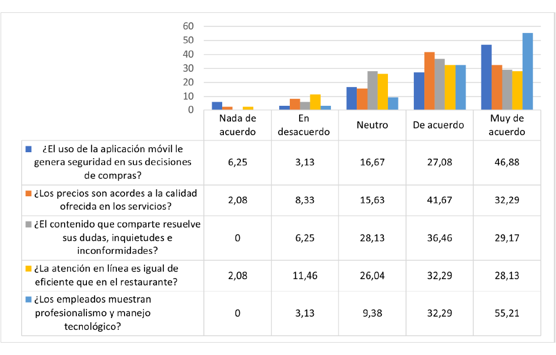
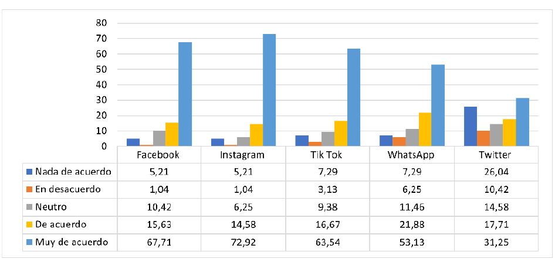

<header class="mb-4 text-sm no-indent">
    

        

            <a href="https://revistas.unjbg.edu.pe/index.php/eyn/issue/view/120" class="text-blue-600">Revista Economía & Negocios</a>
        

        
Vol. 6 Núm. 1, 2024

        

            <strong class="block pt-2">Articulo Original</strong>
        

    

    

        <h1 class="text-xl mb-0">
            Estrategia de marketing de contenido y la relación con la experiencia del cliente en “H Sport Café” de
            Bahía de Caráquez
        </h1>
        <h1>
            
                Content marketing strategy and the relationship with the customer experience at “H Sport Café” in
                Bahía de Caráquez
            
        </h1>
    

    

        

            Dayanara Monserrathe Andrade-Alvarado*  
            *Autor de correspondencia: 
            <a href="mailto:e1317042297@live.ulea.edu.ec" class="text-blue-600">e1317042297@live.ulea.edu.ec</a> - 
            <a href="https://orcid.org/0009-0008-2033-9139" class="text-blue-600">https://orcid.org/0009-0008-2033-9139</a>  
            Universidad Laica Eloy Alfaro de Manabí, Extensión Sucre. San Vicente, Ecuador
        

        

            Jenny Carolina Herrera-Bartolomé  
            <a href="mailto:Jenny.herrera@uleam.edu.ec" class="text-blue-600">Jenny.herrera@uleam.edu.ec</a> - 
            <a href="https://orcid.org/0000-0003-3576-3334" class="text-blue-600">https://orcid.org/0000-0003-3576-3334</a>  
            Universidad Laica Eloy Alfaro de Manabí, Extensión Sucre. San Vicente, Ecuador
        

        

            Esta obra está bajo una 
            <a href="https://creativecommons.org/licenses/by/4.0/" class="text-blue-600">Licencia Creative Commons Atribución 4.0 Internacional.</a>
        

        

            Como citar: Andrade-Alvarado, D.M., &amp; Herrera-Bartolomé, J.C. (2024). Estrategia de marketing de contenido y la relación con la experiencia del cliente en “H Sport Café” de Bahía de Caráquez. 
            <em>Economía &amp; Negocios, 6</em>(1), 125-136. 
            <a href="https://www.doi.org/10.33326/27086062.2024.1.1764" class="underline text-blue-600">https://www.doi.org/10.33326/27086062.2024.1.1764</a>
        

        

            CÓDIGO JEL:  
            M41, M42, M49
        

    

</header>

## RESUMEN

En la actualidad los negocios de restaurantes buscan alternativas de sostenibilidad bajo el contexto de
marketing de contenido para lograr mejores resultados económicos. El objetivo del presente estudio fue
direccionado a determinar estrategias de marketing de contenido en función del alcance y de los medios
digitales para lograr mayores niveles de afluencia de clientes. La metodología empleada desde el orden
investigativo fue cuantitativa la cual contribuyó al análisis estadístico e interpretación del objeto y
campo de estudio investigativo, que a través del método analítico descriptivo permitió generar criterios
que contribuyeron a la toma de decisiones de contenidos efectivos. Se aplicó una encuesta constituida
por 10 preguntas en la escala de Likert realizadas en una muestra de 96 clientes por medio de un
muestreo aleatorio no probabilístico. Se utilizó el software estadístico SPSS v.26 para procesar la
encuesta cuya fiabilidad arrojó el resultado .805 del alfa de Cronbach. Entre los resultados más
relevantes se obtiene que las estrategias de marketing de contenido fortalecen la relación con los
clientes que frecuentan en H Sport Café.

**_Palabras clave:_** calidad, servicio, satisfacción, estrategias, marketing

## ABSTRACT

Currently, restaurant businesses are looking for sustainability alternatives in the context of content
marketing to achieve better economic results. The objective of this study was aimed at determining
content marketing strategies based on reach and digital media to achieve higher levels of customer
influx. The methodology used from the investigative order was quantitative, which contributed to the
statistical analysis and interpretation of the object and field of investigative study, which through
the descriptive analytical method allowed the generation of criteria that contributed to effective
content decision-making. A survey consisting of 10 questions on the Likert scale was applied to a sample
of 96 clients through non-probabilistic random sampling. The statistical software SPSS v.26 to process
the survey whose confidence yielded the result .805 of Cronbach’s alpha. Among the most relevant
results, content marketing strategies strengthen the relationship with customers who frequent H Sport
Café.

**_Keywords:_** quality, service, satisfaction, strategies, marketing

## INTRODUCCIÓN

La tecnología en la actualidad cada vez exige estar más cerca de los consumidores, es por ello que se ha
convertido en el centro de estrategias de marketing que permite a los negocios mejorar su servicio y
brindar una información que esté al alcance del cliente con el fin de facilitar su compra. Con las
estrategias de marketing de contenido se crea valor para el cliente y se centran únicamente en la
promoción y las ventas de los productos o servicios a ofrecer. A través de los contenidos de marketing
los negocios o empresas pueden captar la atención del cliente, por esta razón es importante establecer
relaciones conjuntas.

El trabajo investigativo se realiza en la ciudad de Bahía de Caráquez en el restaurante H Sport Café,
donde se brindan desayunos, almuerzos, platos a la carta cocteles y heladería. No solo se encarga de
brindar servicios a clientes locales, sino a extranjeros que llegan a degustar la variedad de comida que
ofrece el lugar, con un toque mexicano y estadounidense, para que el cliente tenga una experiencia única
del lugar, lo cual ayuda a que el restaurante se posicione en el mercado y permite que el restaurante se
destaque ante la competencia siendo el único lugar en la ciudad de Bahía de Caráquez.

El marketing de contenido se ha convertido hoy en día en las mejores estrategias de marketing. Es por
ello que, Mendoza et al. (2020) argumentan que las estrategias de marketing han evolucionado rápidamente
en los últimos años y las empresas o negocios se enfrentan a grandes desafíos para evitar quedarse al
final de la fila. Comprender las estrategias y tendencias de marketing es clave para ganar el juego.
Como menciona Kool Lovers Blog (2019), puede ser utilizado por todo tipo de negocios, incluidos, por
supuesto, los restaurantes. Cada día la industria de restaurantes se ha dado cuenta de que la
comercialización de alimentos es la mejor manera de hacer crecer un negocio, abrir puertas a nuevos
clientes y retener a los clientes existentes. De acuerdo a ello es relevancia que los restaurantes
conozcan e investiguen acerca de los nuevos contenidos que se generan, las nuevas tendencias que se
están posicionando en la mente de los consumidores, esto hará que se acerquen más a los posibles
consumidores.

Actualmente, muchos negocios del rubro de restaurantes han tenido que cambiar su forma de pensar y actuar
dejando de lado a los medios tradicionales para generar ventas por medio de las estrategias de marketing
de contenido. En la actualidad se manejan con facilidad muchas herramientas con las que se puede generar
contenido y promocionar el servicio que se va a ofrecer subiendo contenidos como ejemplo, Flyer de menús
diarios, promociones de bebidas, cocteles entre otros.

Esto le permite al consumidor recibir una información muy clara y a la empresa conocer al consumidor
mediante la recopilación de información en línea, por ende, es favorable utilizar esa información para
después ofrecerles un servicio o producto más especializado como preferencias o gustos de cada
consumidor.

Bahía de Caráquez cuenta con una variedad de cafés, bares y restaurantes que son considerados la elección
de los turistas, que además ofrecen una variedad de ofertas y cuentan con un ambiente diferente y único
con una característica agradable y diferente de la ciudad.

Para Wearecontent (2022), el marketing de contenido proporciona la idea de variedades de contenidos
alrededor de una marca como proyecto o emprendimiento que vayamos a realizar, la cual sea pertinente y
concisa para atraer al posible consumidor.

Por ello, el marketing de contenido son las estrategias que se pueden enfocar en crear, producir y
mejorar contenidos relevantes para que los negocios establezcan mejoras continuas. Dado que el mundo de
hoy en día se encuentra más conectado a internet y todo lo que este conlleva, la implementación de
marketing de contenidos toma fuerza para ser utilizado dentro de todo tipo de negocio siendo así que
este se pueda adaptar a los servicios de restauración.

Por otra parte, para Giraldo (2019) las estrategias de marketing de contenido constituyen una forma de
involucrar al cliente final y hacer crecer las redes de leeds y clientes a través de la creación de
contenidos relevantes y valiosos, generando así valor para el público objetivo y de esta forma crear una
percepción positiva de la marca.

Es necesario que los contenidos que se vayan a publicar en los negocios como los restaurantes tengan
mayor relevancia con respecto a la información que proporcionan, ya que esto generará un mensaje claro
con el fin de que el público al que nos vamos a dirigir se sienta a gusto.

Velasquez (2019) manifiesta que uno de los errores principales de una estrategia de marketing de
contenidos, en los restaurantes que no puede ignorar uno de sus principales valores es la interactividad
en sus múltiples formas, desde la viralidad hasta la posibilidad de interacción directa con los
usuarios. Muchos restaurantes en esta zona costera aún no saben cómo crear contenido de calidad y
terminan haciendo un trabajo con falta de información clara y que se destaque ante su competencia. Este
es el error más importante que puede marcar la diferencia entre la publicación de contenidos y el
marketing.

Una definición de requisitos adecuada cubre todo el contenido identificado y el valor que aportará a los
usuarios; otro error es centrarse solo en los contenidos que se venden, este tipo de contenido no
agregará valor a los usuarios, no se distribuirá en las redes sociales ni cubrirá ninguna necesidad
específica de los visitantes y, por lo tanto, se convertirá en contenido inútil. La capacidad de captar
su atención con contenido de calidad es que proporcione un llamado a la acción para comprar o probar su
producto o servicio, el buen uso de contenidos publicitarios comerciales en redes sociales siga teniendo
las tendencias de la comunidad viral digital y realice comunicación e intercambio. Pues, al conseguir un
gran número de clientes se consigue un aumento de las ventas en un negocio (Zambrano et al., 2020).

Los turistas locales y extranjeros requieren tener una experiencia diferente a la que están
acostumbrados, es por ello que la relación con la experiencia en H Sport Café proporciona que el cliente
se sienta a gusto y satisfecho, no solo con el servicio, sino con la calidad ofrecida en cada uno de los
productos a ofrecer.

Desde el enfoque experiencial se han dado muchas versiones que están dirigidas a la conducta en cuanto a
la experiencia que tiene el cliente; cabe recalcar que, debido a la experiencia que obtiene a través de
un servicio, el cliente elige si es de su agrado o no para adquirir su servicio. En Bahía de Caráquez,
el enfoque de muchos de los negocios de restaurante es llegar al cliente de una forma muy creativa
consiguiendo vínculos que le permitan acercarse al cliente de forma fácil y segura.

En cuanto a la relación experiencial con el cliente, se han escrito muchos artículos que hablan de
marketing experiencial; por lo tanto, al dar respuesta de la experiencia del cliente se habla de una
experiencia vital, que conlleva ganar clientes. Además, ante esta experiencia los autores Farlnago et
al. (2020) manifiestan que “en este contexto, las empresas tienen que generar experiencias y emociones
significativas en los consumidores que se reflejen en los resultados económicos significativos”.

La experiencia del cliente está determinada en gran medida por la conexión del cliente hacia la marca. La
gran ventaja de este factor es la capacidad de atraer a los clientes hacia emociones más complejas, como
la empatía o el sentido de pertenencia como afronta Moréz (2022).

Es importante, además, crear un vínculo y conexión entre la empresa y el cliente como una forma de crear
valor en la experiencia y en las compras. Dada la importancia de varios medios técnicos de información,
los clientes se vinculan inmediatamente con el producto que mejor se adapta a estas necesidades, por lo
que las empresas buscan conexión de fluido a través de una dirección hacia el cliente final. Los
clientes actuales no solo se motivan para gastar, por cuanto las empresas deben lograr rentabilidad,
pero utilizando otras experiencias y  sentimientos; estos incluyen el consumo de bienes y servicios
(Suarez & Salazar, 2016).

La experiencia del cliente es una respuesta interna y subjetiva; es decir, cualquier contacto directo o
indirecto del cliente con la compañía. El contacto directo suele ocurrir o suele activarse durante el
proceso de compra, uso y servicio de la clientela (Christopher & Schwager, 2007)

La experiencia aporta en crear valor como sensorial, emocional, cognitivo, conductual y de relación, que
sustituyen al valor funcional de acuerdo a Schmitt (2000); es por ello que, según Gálmes et al. (2015),
mediante un relevamiento de las últimas técnicas en marketing experiencial, revela los criterios para
resolver el tema del cliente, así como la elección de herramientas para brindar una experiencia
específica en función de la sociedad a la que se dirige y cómo se brindará.

Entonces, se aborda lo referente a las marcas que tienen que ser percibidas de cierta manera que generen
una conexión directa e indirecta con los clientes. En este contexto, las empresas deben generar
experiencias y emociones significativas con los consumidores que se reflejen en resultados financieros
significativos como lo refleja Lemoine et al. (2021).

En otros estudios se observa que el marketing experiencial surge del cambio de hábitos de los
consumidores, por lo que los métodos de marketing tradicionales han perdido su eficacia. Los
consumidores se vuelven impredecibles, inteligentes y algo sensibles a las herramientas de marketing
tradicionales Lemoine et al. (2021).

Desde otra perspectiva, es importante enfatizar que los estudios de contexto son esenciales en su enfoque
para medir el comportamiento del consumidor en el marketing experiencial, donde el contexto espacial
asegura que la ubicación física es más o menos importante. El logro del marketing propuesto y otros
objetivos dependen de ciertos factores. En marketing, las decisiones de diseño de instalaciones pueden
centrarse en las necesidades y deseos de los empleados y clientes (Caridad et al., 2015)

El estudio se realiza para saber la experiencia que tiene el cliente hacia el restaurante a través de la
comunicación por medio de las redes sociales o degustando las variedades que brinda el restaurante de
manera presencial.

H Sport Café es el único lugar en la ciudad de Bahía de Caráquez que brinda variedades de menú como
desayunos, almuerzos, platos a la carta, área de heladería y barra bar. Sin embargo, permite destacar
que la tecnología en el restaurante es la herramienta más utilizada para órdenes de consumo por parte de
los clientes y valor total de las cuentas. Esto permite al restaurante la facilidad eficaz de dar una
atención excelente.

La presente investigación tiene como objetivo determinar las estrategias de marketing de contenido que le
permita al restaurante objeto estudio que el cliente tenga una experiencia única con la finalidad de
obtener su fidelización; por ello, con las estrategias de marketing de contenido se tiene la opción de
retener y facilitar a posibles clientes con la constancia de mejorar y cambiar el comportamiento del
consumidor a través de la creación de contenidos.

## MATERIALES Y MÉTODOS

La investigación tiene un precedente de orden cuantitativo que permitió el análisis estadístico referente
a la percepción que tiene el cliente externo con su experiencia en H Sport Café. El método empleado fue
el analítico descriptivo apoyado en Hernández et al. (2010), quienes afirman que este tipo de
investigación busca establecer propiedades y características importantes de cualquier fenómeno que se
analice para obtener un mejor resultado a nivel de la experiencia de los clientes sobre los servicios.

En la presente investigación se utilizó el muestreo aleatorio simple no probabilístico, en ese sentido,
Ortega (2023) menciona que “no todos los miembros de la población tienen la oportunidad de participar en
el estudio”.

Se implementó el uso de encuestas a clientes que frecuentan el restaurante en los días con mayor flujo de
clientes. Los días con más concurrencia fueron los jueves, viernes, sábados y domingos. Las edades de
los clientes fluctúan entre los 17 a 30 años de edad, de ambos géneros. Se logró encuestar a 96
turistas, luego se realizó un diagnóstico del resultado y se tabuló en el software SPSS v.25.

## RESULTADOS

La fiabilidad del instrumento arrojó el resultado de .805 considerado de bueno para un total de 25
elementos en la escala de Likert, representado en la tabla 1.

**Tabla 1**

*Estudio de fiabilidad*

| Alfa de Cronbach | Alfa de Cronbach basada en los elementos tipificados | N.º de elementos |
| ---------------- | ---------------------------------------------------- | ---------------- |
| ,805             | ,792                                                 | 25               |

El estudio realizado a nivel de resultados de la encuesta tuvo la finalidad de medir la experiencia del
cliente y la efectividad de la publicidad realizada en el negocio para una correlación de rentabilidad e
impacto del uso de los medios publicitarios, cuyos resultados se muestran a continuación en el figura 1
a partir de la guía desarrollada por Carvajal et al. (2017).

**Figura 1**

*Calidad en el servicio en H Sport Café*

De acuerdo con los datos obtenidos en la figura anteriormente reflejada en la investigación, se considera
que las personas que acuden al restaurante conocen sobre tecnología para la solicitud por medio del
código QR, pues son los mismos empleados quienes facilitan la información y, por ello, para el cliente
se genera la confianza de acceder sin inconvenientes al menú a partir de estrategias de marketing de
contenido efectiva (Mendoza, et al., 2020).

Lemoine et al. (2018) alegan la importancia de medir los servicios gastronómicos, donde en relación con
el precio los clientes consideran que el precio sí corresponde a la calidad del servicio y de los
productos. Es por ello que los contenidos que comparten resuelven sus dudas, esto generará seguridad en
el cliente; sin embargo, se puede mencionar que, sobre la atención en línea, los clientes indicaron que
están de acuerdo, ya que al momento de la comunicación obtienen respuestas instantáneas y esto permite
ser eficientes con cualquiera de las solicitudes que requiera el cliente y, finalmente, el personal
laboral está capacitado para cualquier inquietud que requiera el cliente con respecto al restaurante y
cumplen con el manejo tecnológico de cada una de las herramientas que se utilizan.

En la pregunta relacionada al reconocimiento, la estrategia de marketing de contenido respecto a si
fortalece la relación con los clientes que frecuenta en HSC, los resultados se muestran en la tabla 2.

**Tabla 2**

*Estrategia de marketing de contenido y su relación con los clientes*

|                |                 | Frecuencia | Porcentaje válido | Porcentaje acumulado |
| -------------- | --------------- | ---------- | ----------------- | -------------------- |
| Válido         | Nada de acuerdo | 4          | 4.2               | 4.2                  |
| En desacuerdo  | 2               | 2.1        | 6.3               |
| Neutro         | 7               | 7.3        | 13.5              |
| De acuerdo     | 25              | 26         | 39.6              |
| Muy de acuerdo | 58              | 60.4       | 100               |
| Total          | 96              | 100        |

A partir de los datos obtenidos, las personas mencionaron que las estrategias de marketing de contenido
de H Sport Café permiten que los clientes reciban cierto tipo de solicitudes, como centrarse en
promociones y descuentos. A través del contenido de marketing proporcionado por la empresa, los clientes
pueden ver el contenido que publican en las redes sociales. Por lo tanto, es muy importante construir
una relación común a partir de los niveles de preferencias de los clientes o consumidores como alega
Espinoza et al. (2021).

Los resultados de la pregunta ¿de las redes sociales cuáles consideraría para visualizar contenido
publicitario? Los se muestran en la siguiente figura.

**Figura 2**

*Redes sociales para contenido publicitario*

## DISCUSIÓN

Las estrategias de marketing de contenido que publican en los diferentes medios sociales influyen en el
cliente. En conclusión, las ventas de H Sport Café se han visto beneficiadas por la aplicación del
marketing de contenidos, puesto que logran un nivel de rentabilidad y fidelizan a sus clientes, atraen a
nuevos y proyectan una buena imagen de marca, donde los estudios han mostrado la importancia de la marca
y la correlación con su cliente (Carbache et al., 2020).

Cuando se hace referencia a la estrategia que utilizan los medios digitales para expandir su actividad
comercial, observamos en algunas colaboraciones y estudios pertinentes al anteriormente expuesto que
existen resultados favorables en relación a un número de incremento de consumidores reflejados en
plataformas digitales, donde el marketing desde sus dimensiones ha sido efectivo.

Respecto a lo anteriormente abordado, Lemoine et al. (2022) hace un estudio reflexivo referente a las
incidencias en las contradicciones sociales en el comportamiento del consumidor turístico, considerando
que los actores locales tienen un criterio fundamentado referente a las actividades comerciales, donde
Lemoine et al. (2018) aportan estrategias para lograr la sostenibilidad a través de publicidad efectiva
que, desde este contexto, aporta al presente estudio.

Es importante alegar que contribuciones como: Estrategia de marketing de contenido y la relación con la
experiencia del cliente en “H Sport Café” de Bahía de Caráquez referentes a cuestiones estratégicas, es
importante señalar que no se trata solo de centrarse en lo que la empresa debe hacer para avanzar, sino
se debe adoptar planteamientos estratégicos a través de herramientas de *management* (Ramírez et
al., 2020).

En las consideraciones de Santos et al. (2021), se  afirma que las empresas en la actualidad están dando
mayor énfasis al buen uso de las herramientas, lo cual contribuirá a brindar una mejor experiencia y así
también tener una mayor cantidad de clientes. Por tanto, Villacis et al. (2022) señala que al aplicar
estrategias de marketing, para responder de manera efectiva al mercado destacando una presencia en las
redes sociales para crear y compartir contenido para interactuar directamente con los usuarios.

H Sport Café actualmente es una empresa que está limitada en cuanto al presupuesto para las diferentes
estrategias de marketing, aunque se han realizado estudios pertinentes con la finalidad de lograr un
mejor posicionamiento en el mercado donde Lemoine et al. (2018) muestran cómo desarrollar un estudio de
contenido en las redes sociales a través de Facebook, demostrando la efectividad a nivel de plataforma.
Entonces, al optar por el marketing de contenidos H Sport Café busca optimizar sus recursos y utiliza
medios digitales para atraer a nuevos clientes.

Mediante el trabajo de campo, se pudo identificar que los clientes poseen ciertos conocimientos sobre el
manejo de herramientas tecnológicas; asimismo, el contenido que utilizan las empresas es atractivo para
los clientes, pero deben seleccionar apropiadamente los medios para hacer sus publicaciones y el
contenido que muestran deben ser de carácter coherente. En algunas ocasiones distorsionan la imagen que
publican y hacen que el cliente tenga dudas sobre dicha publicación, donde se debe tomar como referencia
el modelo para evaluar el comportamiento del consumidor del investigador (Lemoine et al., 2021).

## CONCLUSIONES

Con la investigación documental realizada se evidencia que el marketing de contenidos es una herramienta
poderosa en el marketing actual, sobre todo en estos momentos donde los medios digitales y las redes
sociales forman parte del diario vivir de las personas; por ello, se concluye que las estrategias que
deben emplear las empresas al aplicar marketing de contenidos, incluyan dentro de sus publicidades un
mensaje claro para su grupo objetivo y la información que permita instruir al consumidor o cliente
acerca del uso de algún producto o servicio.

De acuerdo a los datos obtenidos en la investigación realizada, la tecnología facilita el proceso al
momento de la comunicación entre cliente y negocio; es por ello que, los consumidores prefieren acceder
a través de las herramientas digitales a los servicios que ofrece el restaurante objeto estudio.

El objetivo de determinar una estrategia de marketing de contenidos, que permita al restaurante H Sport
Café brindar a los clientes una experiencia única y así lograr la fidelización que suela ser efectiva
dicha publicidad, es que esta sea en función del alcance geográfico y del medio de comunicación. Por tal
motivo, resulta factible retener y alentar a sus clientes potenciales a seguir aplicando las estrategias
de marketing de contenido que atraigan al consumidor con información de calidad.

## CONTRIBUCIÓN DE LOS AUTORES

Autor 1. Diseño de la estructura del artículo, propuesta de metodología, diseño de encuesta, análisis
estadísticos y su desarrollo.

Autor 2. Verificación, supervisión y revisión de la investigación. Validación del instrumento y
verificación de los resultados.

## CONFLICTOS DE INTERÉS

Los autores expresan que no existe conflicto de intereses.

## AGRADECIMIENTOS

A los gobiernos autónomos descentralizados del Cantón Sucre.

El presente trabajo contribuye al proyecto de vinculación: “Responsabilidad Social y liderazgo en los
emprendimientos familiares de las comunidades del Cantón Sucre”.

## REFERENCIAS

Carbache, C. A., Delgado, Y. y Villacis, L. (2020). Influencias del marketing experiencial para
posicionar la marca ciudad en bahía de caráquez. *Investigación & Negocios, 13*(22), 33-42.
<https://doi.org/10.38147/invneg.v13i22.98>.

Caridad, M., Castellano, M. y Hérnandez, M. F. (2015). Marketing experiencial para la promoción del
proceso. *Facultad de Ciencias Económicas; Investigación y Reflexión, 2*: 81-95.

Carvajal, G., Lemoine, F. y Pantaleón, Y. (2017). *Manual de servicio al cliente*. <https://www.researchgate.net/publication/315000209_Manual_de_servicio_al_cliente>

Christopher, M. y Schwager, A. (2007). Comprendiendo la experiencia del cliente. *Harvard Business
Review*, 4-5.

Espinoza, M., Lemoine, F., Villacis, L. y Wiliam, M. (2021). Adobo con productos endémicos: niveles de
aceptación en centros gastronómicos. *cipres.sanmateo*, <https://doi.org/10.52948/sosquua.v3i1.411>.

Farlnago, L., Villacis, L., Fernandez, N. y Lemoine, F. (2020). Marketing Experiencial como estrategia
para el fortalecimiento de imagen del servicio hotelero. *Revista de Investigación de la Ciencia
Turística*, RICIT, (14), 88-100.

Gálmes, C. y Maria, A. (2015). Comunicación y marketing experimental. *1. ISSN 1012-1587*, 974
-999.

Giraldo, V. (26 de junio de 2019). *Marketing de contenidos: la estrategia digital que debes conocer a
profundidad*. <https://rockcontent.com/es/blog/marketing-de-contenidos/>

Hernández, F. B. (2010). *Metodología de la investigación*. México: Mc Graw Hill. <https://www.uca.ac.cr/>.

Kook Lovers (22 de agosto de 2019). *5 claves del Marketing de Contenidos para restaurantes*. <https://www.wekookmarketing.com/5-claves-del-marketing-contenidos-restaurantes/#:~:text=El%20marketing%20de%20contenidos%20se,%2C%20incluyendo%20claro%2C%20los%20restaurantes>.

Lemoine, F. À., Andrade, A., Carvajal, G., Herrera, C., Pallaroso, E., García, J., Bailon. (2021).
*Posicionamiento de una marca: directrices emprendedoras desde la óptica estudiantil*. Munayi. <https://munayi.uleam.edu.ec/posicionamiento-de-una-marca/>

Lemoine, f., Fermandez, N. y Villacis, L. (2022). Incidencias de las contradicciones sociales en el
comportamiento del consumidor turístico del Ecuador. *Multidisciplinaria, 5*(1), 191-206 (2020).
<https://doi.org/10.25214/27114406.978>.

Lemoine, F., Gilces, W., Norma, H. y Villacis, L. (2021). Marketing Experiencial para gestionar la
comercialización del destino turístico Bahía San Vicente. *Ciencias Holguín*, 4.

Lemoine, F., Hérnandez, N., Castellano, G. y Yesenia, Z. (2021). Comportamiento del consumidor de
destinos turísticos de Ecuador. *Venezolana de Gerencia*, 96, 1336-1351, <https://doi.org/10.52080/rvgluz.26.96.21>.

Lemoine, F., López, G. y Vall, W. (2018). La publicidad en redes sociales como una alternativa sostenible
para el destino turístico Bahía de Caraquez-Ecuador. *Face, 9*(1), 22-32, <https://doi.org/10.24054/01204211.v1.n1.2018.3175>.

Lemoine, F., Navarrete, S., Valls, W., Carvaajal, V. y Villacis, L. (2018). Percepción de actores locales
sobre turismo sostenible en comunidades de Leonidas Plaza del cantón Sucre, Manabí. *ECA Sinergia,
9*(2), 55-67, <https://dialnet.unirioja.es/servlet/articulo?codigo=6726416>.

Lemoine, F., Otero, B., Carvajal, G. y Almeida, E. (2018). El servicio de gastronomía y su impacto para
el desarrollo turístico en Bahía de Caráquez. *Transitare Revista de Turismo, Economía y Negocios,
4*(1) ISSN:2395-9835. <http://transitare.anahuacoaxaca.edu.mx/index.php/Transitare/article/view/83/39>

Mendoza, L., Dominguez, A., Lemoine, F. y Hérnandez, N. (2020). Estrategia de marketing de contenido para
gerenciar productos turísticos en el destino Sucre - San Vicente. *Uleam Bahía Magazine*.

Mendoza, L., Domínguez, A., Lemoine, F. y Hérnandez, N. (2020). Estrategia de marketing de contenido para
gerenciar productos turísticos en el destino Sucre-San Vicente. *Uleam bahía magazine*, e-ISSN:
2600-6006.

Moréz, P. (2022). *La importancia de la relación entre satisfacción y experiencia del cliente*. <https://www.inbox.mx/blog/la-importancia-de-la-relacion-entre-satisfaccion-y-experiencia-del-cliente>

Ortega, C. (2023). *Muestreo no probabilístico: definición, tipos y ejemplo*. <https://www.questionpro.com/blog/es/muestreo-aleatorio-simple/>

Ramírez, E. y Wiliam, C. (2020). Microempresas en pandemia: una aproximación desde el discurso del
emprendedor. *Economía y Negocios*. <https://doi.org/10.33326/27086062.2020.2.968>

Santos, V. y Mendoza, J. (2021). Relación del marketing omnicanal y las comunicaciones integradas en una
empresa peruana. <https://doi.org/10.33326/27086062.2021.2.1180>

Schmitt, B. H. (2000). *Experiential Marketing*. Barcelona : Ilustrada.

Suarez, S. y Salazar, B. (2016). El marketing experiencial como herramienta para el fortalecimiento de la
imagen corporativa de las empresas del sector comercial Colobiano. *Dictamen Libre*, 97-109.

Velasque, B. y Hernandez, J. (2019). *Marketing de Contenidos.* México: Boletín Científico de la
Escuela Superior de Atotonilco de Tula.

Villacis, L., Espinoza, M., Meneses, W. y Macias, J. (2021). La consonancia de la cultura montubia, para
mantener las tradiciones de los pueblos manabitas. *Centro Sur Social Science Journal*. <https://doi.org/10.37955/cs.v5i1.100>

Villacis, L., Lemoine, F. y Hernández, N. (2022). Desarrollo de estrategias publicitarias para gestionar
la comercialización de la actividad comercial pos-COVID-19. *Economía & Negocios*. <https://doi.org/10.33326/27086062.2022.2.1462>

wearecontent. (2022). *Marketing de Contenidos en el 2022: ¿Qué es y para qué sirve?* <https://www.wearecontent.com/marketing-de-contenidos>

Zambrano, V., Jorge, M., Mejía, L. y Rynier, G. (2020). Marketing de contenidos como estrategia de
enfoque promocional en los establecimientos comerciales de la parroquia Leónidas Plaza, cantón Sucre.
*Sinapsis*, 11 ISSN 1390-9770.

