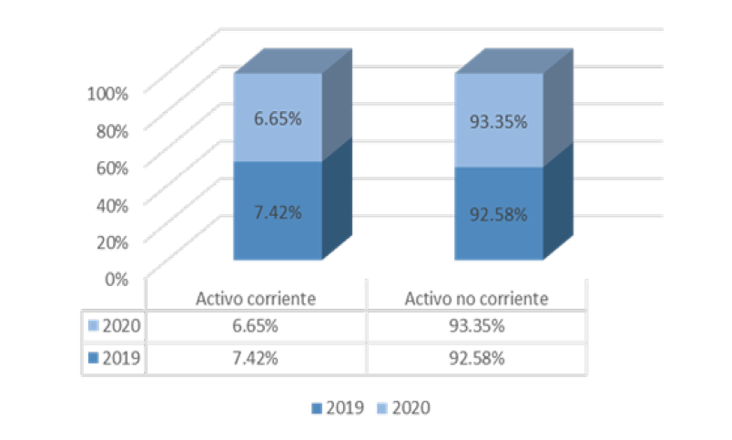

<header class="mb-4 text-sm no-indent">
    

        

            <a href="https://revistas.unjbg.edu.pe/index.php/eyn/issue/view/120" class="text-blue-600">Revista Economía & Negocios</a>
        

        
Vol. 6 Núm. 1, 2024

        

            <strong class="block pt-2">Articulo Original</strong>
        

    

    

        <h1 class="text-xl mb-0">
            Análisis de la rentabilidad en Colegios Peruanos SA que aplica normas internacionales de información
            financiera en el periodo 2019-2020
        </h1>
        <h1>
            
                Analysis of profitability in Colegios Peruanos SA that applies international financial reporting
                standards in the period 2019-2020
            
        </h1>
    

    

        

            Ana Cecilia Flores-Ramirez*  
            *Autor de correspondencia: 
            <a href="mailto:U17205721@utp.edu.pe" class="text-blue-600">U17205721@utp.edu.pe</a> - 
            <a href="https://orcid.org/0000-0002-3130-7350" class="text-blue-600">https://orcid.org/0000-0002-3130-7350</a>  
            Universidad Tecnológica del Perú. Chiclayo, Perú
        

        

            Maryori Paullet Flores-Ruiz  
            <a href="mailto:u17107279@utp.edu.pe" class="text-blue-600">u17107279@utp.edu.pe</a> - 
            <a href="https://orcid.org/0000-0002-7113-4650" class="text-blue-600">https://orcid.org/0000-0002-7113-4650</a>  
            Universidad Tecnológica del Perú. Chiclayo, Perú
        

        

            Esta obra está bajo una 
            <a href="https://creativecommons.org/licenses/by/4.0/" class="text-blue-600">Licencia Creative Commons Atribución 4.0 Internacional.</a>
        

        

            Como citar: Flores-Ramirez, A. C., Flores-Ruiz, M. P. (2024). Análisis de la rentabilidad en Colegios Peruanos SA que aplica normas internacionales de información financiera en el periodo 2019-2020. 
            <em>Economía &amp; Negocios, 6</em>(1), 104-124. 
            <a href="https://www.doi.org/10.33326/27086062.2024.1.1593" class="underline text-blue-600">https://www.doi.org/10.33326/27086062.2024.1.1593</a>
        

        

            CÓDIGO JEL:  
            M41, M42, M49
        

    

</header>

## RESUMEN

Analizar la rentabilidad de una empresa es importante porque va a permitir identificar la capacidad que
tiene para obtener ganancias o excedentes como resultado de la gestión de sus inversiones, también la
facultad que tiene para cumplir con sus derechos económicos a futuro inmediato. El objetivo principal
del estudio fue analizar el beneficio monetario de Colegios Peruanos SA, que aplican normas
internacionales de información financiera (NIIF), en el periodo 2019-2020. La investigación es
cuantitativa de alcance descriptivo transversal y diseño no experimental. La población analizada estuvo
conformada por los informes contables de la empresa del año 2019 y 2020. La técnica de análisis
documental se usó para recolectar la información y el instrumento fueron fichas de registros de datos
para realizar el diagnóstico de los reportes contables y el cálculo de los ratios de rendimiento. En el
resultado se apreció que la compañía ha tenido una utilidad negativa para los años 2019 y 2020, donde se
obtuvo: ROA negativo (6.72 %), ROE negativo (29.41 %), ROI negativo (106.72 %) y margen EBITDA (8.85 %);
las razones fueron: primero porque se encuentra en proceso de inversión a través de la construcción de
nuevas sedes (espera revertir dicha situación en años posteriores) y segundo la pandemia COVID-19 generó
impacto económico a razón de que disminuyeron los ingresos de las pensiones y matrículas y el costo de
venta aumentó específicamente porque se contrató más personal docente y administrativo. Asimismo, el
pasivo aumentó para el año 2020 en un 21.05 % y el patrimonio disminuyó en un 22.73 %.

**_Palabras clave:_** análisis financiero, estados financieros,
indicadores de rentabilidad, normas internacionales de información financiera

## ABSTRACT

Analyzing the profitability of a company is important because it will allow identifying the capacity it
has to obtain profits or surpluses as a result of the management of its investments, also the power it
has to fulfill its economic rights in the immediate future; the main objective of the study was to
analyze the monetary profit of Colegios Peruanos SA, that apply international financial reporting
standards (IFRS), in the period 2019-2020. The research is quantitative of cross-sectional descriptive
scope and non-experimental design. The population analyzed was made up of the company’s accounting
reports for the year 2019 and 2020. The documentary analysis technique was used to collect the
information and the instrument was data record cards to perform the diagnosis of the accounting reports
and the calculation of performance ratios. In the result it was appreciated that the company has had a
negative profit for the years 2019 and 2020 where it obtained: negative ROA (6.72%), negative ROE
(29.41%), negative ROI (106.72%), and EBITDA margin (8.85%. The reasons were: first, because it is in
the process of investment through the construction of new headquarters (it expects to reverse this
situation in subsequent years) and second, the COVID-19 epidemic generated economic impact because the
income from pensions and tuition decreased and the cost of sales increased specifically because more
teaching and administrative staff was hired. Likewise, liabilities increased by 21.05% in 2020 and
equity decreased by 22.73%.

**_Keywords:_** financial analysis, financial statements,
profitability indicators, international financial reporting standards

## INTRODUCCIÓN

Hoy en día la educación es la fuente para la prosperidad de las personas y de los países, ya que permite
generar emprendedores y profesionales que aportan al crecimiento económico del mundo, el proceso
educativo puede ser responsabilidad de una entidad privada o pública, cualquiera sea el caso debe
garantizar y asegurar la excelencia educativa (Sánchez García et al., 2017). El objetivo de un colegio
privado es ofrecer un servicio de excelencia que cubra las expectativas de la demanda y a su vez debe
garantizar su continuidad, por tal razón debe ser rentable, considerando que en el sector privado es más
exigente la calidad educativa y la misma impacta en la rentabilidad (Cervantes Atia et al., 2018).
Asimismo, la información contable indudablemente tiene que ser armonizada en los informes financieros
con el fin de mostrar transparencia, calidad y sean comparables con empresas del mismo rubro; por tal
motivo, las sociedades anónimas muestran su información contable homogeneizada, lo cual resulta
beneficioso para los usuarios internos, externos y accionistas al momento de tomar decisiones
(Iñiguez-López et al., 2020). Para homogeneizar la información financiera-contable, las compañías a
nivel mundial aplican las NIIF, en el siglo XXI fueron adoptadas en América Latina, en Argentina en el
año 2012 (compañías que coticen en bolsa de valores) y en el Perú en el año 2016 de carácter obligatorio
para entidades inscriptas en la SVM (Superintendencia del Mercado de Valores) (Pineda Calixto, 2013).
Las NIIF son directrices que transmiten y proveen información contable financiera, que sirve para
mostrar información fiable de las actividades empresariales que están relacionadas con el patrimonio,
los compromisos con proveedores y terceros (Encalada-Encarnación et al., 2018).

A nivel mundial, la COVID-19 afectó a muchas empresas en el año 2020 generando muchos problemas
económicos; hubo olas de contagios por lo que en muchos países hubieron cuarentenas con el objetivo de
mitigar la expansión del virus y también cerraron colegios, ante esta situación las instituciones
tuvieron que replantear la modalidad de enseñanza por la modalidad virtual, donde tuvieron que comprar
nuevos software, hardware y equipos multimedia para asegurar la calidad educativa y seguir educando a
los estudiantes. Todas estas compras significaron un desembolso de dinero no planeado y ocasionaron a su
vez la reducción de ingresos por descuentos otorgados bajo la modalidad virtual; por consiguiente, la
rentabilidad de las instituciones privadas se vieron afectadas, por ende se afectó también la
rentabilidad de los inversores. El Perú no fue ajeno a esta situación, pues permaneció durante todo el
año 2020 con los colegios totalmente cerrados (Wiegold Marilu et al., 2022). Por consiguiente, surge el
presente dilema: ¿en qué consiste el diagnóstico del rendimiento en Colegios Peruanos SA, que aplican
NIIF en el periodo 2019-2020?

Con base en ello se planteó el siguiente objetivo general: analizar la rentabilidad en Colegios Peruanos
SA, que aplican NIIF en el periodo 2019-2020 y los objetivos específicos fueron describir las normas
internacionales relevantes vinculadas con la rentabilidad de la institución; calcular las razones
financieras de rentabilidad con el apoyo de los informes financieros y aplicar el método horizontal y
vertical para identificar las partidas relevantes en los estados financieros. Este estudio resulta de
vital importancia porque busca aportar conocimiento e incita a utilizar KPI financieros para el
diagnóstico rentable, lo que va a permitir tomar decisiones eficientes y a su vez hallar los factores
que repercuten en la utilidad de una entidad.

Saurín Mori et al. (2020) investigó el dominio de la administración financiera en la utilidad económica y
financiera de una entidad dedicada al transporte, donde indica que la administración de las finanzas es
un método que permite controlar, administrar y proyectar eficientemente los activos que posee una
compañía con el fin de que todo lo planeado se cumpla en su totalidad; asimismo, este permite realizar
estimaciones financieras y proyecciones útiles para tomar decisiones, por consiguiente, el uso de este
método es importante para el funcionamiento y supervivencia de la institución (Salazar Tenelanda et al.,
2019).

Gurrola Ríos y Morales Castro (2021) indican que la rentabilidad varía cuando la actividad de la empresa
cambia, la pandemia de COVID-19 generó un impacto leve a las empresas de servicios, dichos cambios están
vinculados con el capital, activos e ingresos ligados directamente al crecimiento en temporada de
riesgos. Asimismo, el ROE y ROA decreció con la detención de la pandemia, mientras que el margen neto
aumentó, esto se debe a que las entidades con el objetivo de cumplir con las nuevas indicaciones
sanitarias tuvieron gastos imprevistos de los cuales probablemente han sido subvencionados con alguna
cuenta del capital.

En el presente las entidades se ven en la necesidad de ajustarse ante cualquier evento que puede
perjudicar su solvencia, es por ello que buscan alternativas de solución como: financiamiento, minimizar
gastos, mejorar procesos, maximizar ganancias, entre otros; por lo tanto, buscan aumentar la eficiencia
con el fin de lograr las metas proyectadas (Puente Riofrío et al., 2017). Para Morelo Pereira y Torres
Castro (2021), las técnicas más usadas para analizar los componentes externos como internos se encuentra
al análisis vertical, horizontal, índice de crecimiento de venta, porcentaje de tendencia, ganancia
operativa, bruta y neta, ROA, ROE, ROI, el uso de todas estas técnicas permite a la empresa realizar un
mejor diagnóstico de la institución y establecer proyecciones.

En el ámbito nacional, Laura Villanueva y Phala Turpo (2021) efectuaron un estudio relacionado con la
rentabilidad y liquidez de un colegio particular en Huancayo. Se pudo evidenciar que no existe vínculo
significativo entre el ratio de liquidez y rentabilidad por motivos que no existe valor significativo
(<0.05); por lo tanto, aquellas investigaciones que señalan que sí existen vínculo entre ambos
indicadores es debido a los objetivos de la empresa y al contexto económico. Para Ramirez Huamán y
Maldonado Guardamino (2020), el ratio de liquidez es importante porque permite identificar si la
institución dispone de liquidez para cumplir con los pasivos de futuro inmediato, siendo el efectivo el
activo más líquido. Según Huamán Espinoza et al. (2022), los retrasos de las cuotas (morosidad) de los
apoderados impacta en la liquidez y utilidad del colegio, hecho que se muestra en los informes
financieros al momento de calcular la ganancia, situación que puede llegar afectar la calidad educativa
porque el colegio puede llegar a no tener efectivo para cancelar sus obligaciones con proveedores y
empleados. Otras investigaciones como la de Contreras Gómez (2020) refieren que la morosidad y el ROA
influyen de forma positiva en la utilidad, a raíz de que cada vez que un cliente paga mora, incrementan
significativamente su rentabilidad.

### La rentabilidad y sus indicadores financieros

La rentabilidad es la competencia que tiene una institución para crear excedentes en sus inversiones
realizadas, por lo general, se presenta al final del proceso. Existen dos tipos de rentabilidad: la
financiera y económica. La rentabilidad es la facultad que posee la compañía para convertir sus activos
en efectivos, también se le conoce solvencia (Salazar Tenelanda et al., 2019). Mientras que, para Mera
Rivera y Ordoñez Vivero (2017) y Huamán Espinoza et al. (2022), es el efecto que permite evaluar la
eficiencia de la gestión financiera, por lo que si la rentabilidad se mantiene es porque tiene una buena
gestión administrativa.

La gestión financiera son instrumentos que se usan para realizar análisis financiero y poder determinar
el vínculo existente entre las cuentas de los reportes contables y la utilidad; gracias a este análisis
se puede conocer las debilidades y fortalezas de la compañía a través de la aplicación de probabilidades
y supuestos (Mayett Moreno et al., 2022). Busca planear, organizar, dirigir y controlar todas las
acciones económicas a raíz de las inversiones ejecutadas y por tipo de financiamiento. En conclusión, es
el conjunto de acciones ejecutadas para resolver problemas, administrar una institución o formalizar un
negocio (Puente Riofrío et al., 2017).

Entre los indicadores encontramos:

Liquidez: indicador que permite medir y saber la competencia que tiene una entidad para cumplir con sus
compromisos a corto tiempo (Mera Rivera & Ordoñez Vivero, 2017).

Capital de trabajo: mide el vínculo entre el pasivo y activo circulante, el resultado viene a ser lo que
dispone la entidad a corto plazo (Nogueira-Rivera et al., 2017); es decir, es el residuo entre el pasivo
corriente y el activo circulante, el resultado va a permitir identificar la liquidez general de la
entidad (Nava Rosillón, 2009).

Endeudamiento: este indicador permite analizar el financiamiento, es decir el grado de participación que
representa los prestamistas dentro de la inversión de la entidad, a su vez revela el porcentaje de
activos que la entidad ha necesitado para financiarse (Zambrano-Farías et al., 2021).

Los indicadores financieros son medios de gestión que permiten mostrar el desenvolvimiento de las cuentas
contables y al momento de compararse se pueden identificar las variaciones, con el fin de corregir o
tomar medidas preventivas (Párraga Franco et al., 2021).

ROA: competencia general que posee una entidad para generar ganancia con los activos disponibles, por lo
que permite medir los beneficios o productividad sobre el uso de los activos (Valencia Nuñez et al.,
2020).

ROE: competencia que posee una entidad para crear beneficio a raíz del financiamiento del patrimonio neto
o capital; es el cálculo del reembolso del capital de los accionistas (Valencia Nuñez et al., 2020).

ROI: es el vínculo que existe en las inversiones ejecutadas usadas para generar dicho ingreso (Cuevas
Villegas, 2001).

Margen EBITDA: es el vínculo entre el EBITDA y el total de ventas, representa el valor del dinero que
sirve para cumplir con los compromisos de la empresa (Narea Chumbi & Guamán Tenezaca, 2021).

Existen otros indicadores, según De la Hoz Suarez et al., (2008):

Margen de utilidad bruta (MUB), indicador que muestra el porcentaje de ingresos generados después de
cumplir con todos los pagos de la empresa.

Margen de utilidad operativa (MUO), indicador que muestra la utilidad de la entidad sin considerar los
impuestos y gastos financieros; permite identificar los gastos que impactan en mayor proporción en la
ganancia.

Margen de utilidad neta (MUN), indicador que muestra el tanto por ciento de ganancia que tendrá la
empresa luego de haber deducido todos los impuestos y gastos, este análisis es importante porque permite
que la empresa identifique si sus costos operativos son los adecuados y si está generando la ganancia
eficiente con respecto a los ingresos.

### Relación entre liquidez y rentabilidad

La liquidez es la facultad con la que cuenta un activo para transformarse a corto plazo en efectivo,
mientras que la rentabilidad es el grado de eficiencia que posee la gestión financiera para generar
utilidad a través de las inversiones; en resumen, ambos indicadores son necesarios para medir la salud
financiera de la empresa (Vázquez Carrazana et al., 2017). Existe un vínculo inverso entre ambos
indicadores, por motivos que a mayor liquidez de la entidad, la rentabilidad es menor y esto es porque
se hace complicado a la empresa convertir un activo en dinero, pero esto va acompañado de los objetivos
de la empresa (Laura Villanueva & Phala Turpo, 2021).

La fuente base del análisis financiero son los estados financieros, esto consiste en realizar un análisis
histórico que sirve para la planificación a largo, corto y mediano tiempo, gracias a este análisis las
empresas pueden identificar su debilidades y fortalezas (Barreto Granda, 2020). Los informes financieros
son escritos que presentan la realidad financiera de una compañía en un periodo específico, con el cual
se pueden realizar comparaciones (Fonseca Rodríguez et al., 2017).

El análisis vertical permite identificar la composición financiera interna de la empresa, hallar el grado
porcentual de cada cuenta que conforma los reportes financieros en un periodo específico; mientras que,
el análisis horizontal permite hallar las variaciones relativas y absolutas de los informes financieros
en el paso del tiempo (Castaño Ríos & Arias Pérez, 2013).

## MATERIALES Y MÉTODOS

El estudio fue cuantitativo dado que se usó una serie de procesos para recolectar la información con el
fin de medir la rentabilidad y analizar los estados financieros de Colegios Peruanos SA e identificar
los cambios suscitados de un año a otro. Su diseño fue no experimental a raíz de que no se realizó
manipulación a la variable. Su alcance es descriptivo transversal dado que se relató los hechos
hallados. Se analizaron los reportes financieros y los indicadores de rentabilidad en un determinado
momento (Hernández-Sampieri & Mendoza Torres-Christian Paulina, 2018).

La población estuvo compuesta por los informes financieros de Colegios Peruanos SA, los que fueron
descargados del sitio web de la SMV y la muestra estuvo conformada por los estados financieros de los
años 2019 y 2020. La técnica de investigación usada fue el análisis documental y el instrumento fue la
ficha de registro de datos. Como primer paso se descargaron los estados financieros de la SMV de los
años 2019 y 2020; en segundo lugar, se reconocieron las normas internacionales relacionadas con la
rentabilidad que aplica la compañía, en tercer lugar, se efectuó una análisis financiero (variación
vertical y variación horizontal) de los reportes contables y se realizó la interpretación de los
resultados hallados, para ello se utilizó el programa Microsoft office Excel.

## RESULTADOS

Colegios Peruanos SA pertenece al grupo Intercorp y fue constituida en el 2005 en la ciudad de Lima bajo
la denominación de Consorcio Educativo Transformador de la Educación Nacional SAC. Su objeto social es
el servicio educativo básico, preparación académica e institutos superiores. La empresa prepara sus
reportes financieros con base en las NIIF; dentro de las principales normas que aplican las relacionadas
con la rentabilidad son la NIIF 9, NIC 39, NIIF 15, NIIF 16 y NIC 16, cada una tiene su propio
tratamiento contable.

### NIIF 9 - Instrumentos financieros y NIC 39 - Reconocimiento y medición de instrumentos financieros

Colegios Peruanos SA tiene activos financieros clasificados a costo amortizado, forman parte las cuentas,
el efectivo y equivalente de efectivo, las pensiones por cobrar y otras cuentas por cobrar, la
diversificación va de la mano del giro o modelo del negocio y de las propiedades de los flujos de dinero
de cada instrumento financiero; posteriormente, dichos activos son medidos empleando el método del
interés efectivo sujeto al deterioro. Los que son dados de baja cuando culminan los derechos de los
contratos sobre los flujos de efectivo contractuales o en su defecto cuando los derechos han sido
derivados a un tercero en su totalidad, asumiendo los riesgos y beneficios de este y ejerciendo su
dominio totalmente. Los pasivos financieros al inicio se reconocen al costo razonable y de ser el caso
que sean reconocidos a costo amortizado, se toman en cuenta los costos que están vinculados directamente
al proceso de transacción, estas cuentas la conforman: las cuentas por pagar generales, los sueldos y
beneficios sociales por pagar, préstamos que devengan intereses, deudas a largo plazo y pasivos por
arrendamiento; posteriormente, los pasivos son medidos a costo amortizado empleando la tasa de efectivo
interés. Los pasivos financieros son dados de baja cuando estos hayan vencido o hayan sido cancelados,
existe el caso de un pasivo que es reemplazado por otro pasivo con el mismo cliente pero con condiciones
distintas o modificadas de manera sustancial, dicho cambio se registra como baja de pasivo y origina uno
nuevo, la diferencia generada es registrada en el estado de resultado integral.

### Provisiones, pasivos y activos contingentes

Los activos financieros: la empresa reconoce como pérdida de crédito esperado la reserva del desgaste,
siendo este el residuo entre el flujo de tesorería de un acuerdo y el flujo de tesorería que se espera
recibir, sin tener en cuenta la tasa original del interés.

La institución para las pensiones por cobrar y otras cuentas emplea de forma simplificada la pérdida de
crédito, esto refiere que la empresa no revisa modificaciones relacionadas con el riesgo de la
solvencia, sino reconoce solo la provisión del deterioro respecto a la pérdida de crédito programado de
la vida útil del instrumento, para ello la empresa ha tomado en cuenta la base histórica de las pérdidas
provisionada y ajustada a la situación coyuntural.

### NIIF 15- Ingresos de actividades ordinarios procedentes de contratos con clientes

Se considera ingreso cuando genera rendimiento económico para la institución y pueden ser medidos de
manera fiable, sin tener en cuenta el tiempo en que se realizará el pago, dichos montos se miden libre
de aranceles e impuestos. Para que sean considerados ingresos, la empresa utiliza los siguientes
criterios:

Prestación de servicios: incluye el pago de las matrículas y pensiones que son facturadas de manera
mensual y son reconocidas en el momento que se efectúa el servicio. Los pagos de la matrícula son
contemplados en el estado de resultados en el periodo en el que se genera dicho recibo.

Pagos de pensiones vencidas: corresponde a los ingresos de las penalidades relacionadas con los retrasos
en el pago de las pensiones. Se reconocen cuando se tiene la probabilidad de que la empresa cobrará
dicho beneficio y se pueda medir fiablemente con base en datos históricos de recuperación de pensiones
de años anteriores.

Otros conceptos se reconocen cuando suceden.

### NIIF 16 - Arrendamientos

Se considera un contrato cuando en él se detalla si tiene el derecho de utilizar el bien por un
determinado tiempo a cambio de una renta, para ello se debe tener en cuenta:

El contrato debe indicar de manera directa o indirecta el bien arrendado y el total en físico.

El arrendador tiene la facultad de usar el activo en su totalidad, el tiempo de uso y el beneficio
económico.

La entidad puede hacer cambios en el bien y la finalidad que tiene el activo.

La empresa adoptó por primera vez dicha norma en el año 2019 y aplicó el método retrospectivo modificado,
y revela sus datos en el informe de posición financiera de manera dividida. En los pasivos se presentan
los pagos del arrendamiento y en el activo, los derechos de uso.

La institución como arrendador reconoce pasivo financiero por arrendamiento o activo por derecho de uso
en el momento que inicia el arriendo. El activo por derecho de usar inicialmente se mide al costo, este
lo conforma el pago del arriendo ajustado por cualquier pago efectuado antes de la fecha de haber
iniciado el arrendamiento, incluido los costos de restauración del lugar o desmantelamiento del activo
sin tener en cuenta el pago recibido por arrendamiento. El activo es devaluado usando el método de línea
recta desde el principio al final, su periodo de uso o el fin del contrato, el inferior de ellos. La
institución mantiene activos por uso de derecho por contrato de alquileres de terrenos que sirven de
colegios, promedio estimado del contrato es de 20 a 30 años.

El pasivo financiero inicialmente se mide al valor presente del pago del arriendo que no han sido
canceladas al principio de la fecha descontando la tasa de interés, en el supuesto caso de no ser fácil
el cálculo de la tasa se tiene que aplicar la tasa incremental de deuda, la institución usa la tasa de
descuento como tasa incremental de deuda.

### NIC 16 - Propiedades, planta y equipo

Los equipos, plantas y propiedades de la entidad son registrados al costo de adquisición neto del
deterioro acumulado. Se mide al inicio al costo, que forma parte el coste de compra sumado a ello los
impuestos y aranceles de compra no reembolsables, y se tiene en cuenta el coste para dar condición de
uso y ubicación. Asimismo, también forma parte del costo el costo del financiamiento de largo plazo. En
el caso del inmueble, equipo, enseres o componente relevante es retirado antes de tiempo esperado o
después, se tiene que registrar la pérdida o ganancia el momento que suscita y se revela en el estado de
resultados integrales. El valor residual, los métodos de depreciación y vida útil de este rubro son
revisados y ajustados en base a la necesidad y se aplica cada fin de año. Es preciso indicar que los
terrenos no se deprecian, los demás bienes se deprecian en línea recta, por ejemplo:

Edificaciones propias: 44 años

Edificaciones arrendadas: entre 20 a 30 años

Equipos de cómputo: entre 3 a 4 años.

Muebles y enseres: 7 años

Para saber cómo ha sido la rentabilidad del colegio ha sido necesario la aplicación de ratios de
rentabilidad de los periodos 2019 y 2020:

**Tabla 1**

*Razones financieras de rentabilidad*

| Razones de rentabilidad | 2019      | 2020      |
| ----------------------- | --------- | --------- |
| MUB                     | 28.95 %   | 5.60 %    |
| MUO                     | 18.60 %   | -10.34 %  |
| MUN                     | -2.64 %   | -35.53 %  |
| ROA                     | -0.63 %   | -6.72 %   |
| ROE                     | -1.98 %   | -29.41 %  |
| ROI                     | -100.63 % | -106.72 % |
| Margen EBITDA           | 32.33 %   | 8.85 %    |

*Nota:* Resumen de las principales ratios financieros del periodo 2019 y 2020 de
Colegios Peruanos SA

El ROE, el ROI y el ROA de Colegios Peruanos SA han sido negativos para los dos años de estudios
(2019-2020), se apreció que la empresa ha tenido pérdidas económicas a consecuencia de las inversiones
que viene realizando en la construcción de nuevas sedes, ampliación de instalaciones, entre otros;
sumado a ello, en el periodo 2020 se presentó la pandemia de COVID-19, hecho que perjudicó los ingresos
de la empresa, generando que los padres de familia retiren a sus hijos del centro educativo, retrasos en
los pagos de las pensiones, situación que conllevó que la empresa tome medidas que ayuden a mitigar los
efectos, para lo cual tuvo que otorgar descuentos en las pensiones; el 20 % para los alumnos de inicial
y 15 % para los de nivel secundario y primario. Esto hasta que las clases sean dictadas de manera
virtual, realizó refinanciamiento de deudas tanto de corto como largo plazo, con el objetivo de obtener
capital de trabajo. Al tener estos indicadores en situación negativa el margen operativo y neto también
fue negativo. El margen EBITDA para el año 2019 fue de 32.33 % y para el 2020 fue de 8.85 %, dicha
reducción se debe precisamente al contexto económico suscitado por la COVID-19.

Asimismo, se ha desarrollado un cotejo entre los estados financieros de la institución Colegios Peruanos
SA, precisamente de los años 2019 y 2020, con el fin de describir las variaciones que ha existido en sus
activos, pasivos y patrimonio; dicha variación se ha expresado tanto en términos porcentuales y
monetarios. Los hallazgos descritos resultan de vital importancia para los clientes externos y
administrativos de la entidad para conocer la posición económica y financiera en la que se ubica la
entidad.

**Figura 1**

*Estructura del financiamiento del periodo 2019-2020*

En la figura 1 se observa la forma como está compuesta porcentualmente el financiamiento de la
institución, tanto en el año 2019 y 2020; en el año 2019 su pasivo fue 68.29 % y su patrimonio fue
31.71 %, y para el año 2020 su pasivo fue 71.14 % y su patrimonio fue 22.86 %; el pasivo incrementó
porcentualmente en un 21.05 % (S/157 488 000); esto está directamente relacionado con el financiamiento
que tuvo que realizar con sus relacionadas entidades bancarias con la finalidad de obtener capital de
trabajo y continuar su operatividad y el patrimonio decreció en 22.73 % (S/78 000 000) a consecuencia de
las pérdidas acopiadas de las inversiones que viene desarrollando y sumado a ello los ingresos decayeron
a causa de la COVID-19.

**Figura 2**

*Estructura del activo del periodo 2019-2020*

En la figura 2 se muestra que el activo no corriente en ambos años es superior al activo circulante. En
el año 2019, el activo circulante fue 7.42 % y en el 2020 fue 6.65 %, en tanto el activo no circulante
del año 2019 fue 92.58 % y del 2020 fue 93.35 %; justamente, esta situación se origina por la actividad
y giro del negocio donde se identifica que esta posee más activo fijo que son terrenos para las sedes
educativas, trabajos en curso y además se debe a las inversiones en construcción de sedes, ampliación de
las existentes y remodelaciones.

**Tabla 2**

*Análisis vertical y horizontal del efectivo equivalente de efectivo, fondos restringidos, pensiones por cobrar y cuentas por cobrar a relacionadas del periodo 2019-2020*

| Cuenta                              | 2019     | Variación vertical | 2020   | Variación vertical | Variación horizontal |          |
| ----------------------------------- | -------- | ------------------ | ------ | ------------------ | -------------------- | -------- |
| Absoluta                            | Relativa |
| Efectivo y Equivalentes al Efectivo | 4029     | 0.37 %             | 8687   | 0.74 %             | 4658                 | 115.61 % |
| Fondos restringidos                 | 41 319   | 3.77 %             | 36 476 | 3.11 %             | -4843                | -11.72 % |
| Pensiones por cobrar                | 19 316   | 1.76 %             | 23 603 | 2.01 %             | 4287                 | 22.19 %  |
| Cuentas por cobrar a relacionadas   | 6489     | 0.59 %             | 606    | 0.05 %             | -5883                | -90.66 % |

*Nota:* Resumen del análisis vertical y horizontal de las cuentas del activo
corriente del periodo 2019 y 2020 de Colegios Peruanos SA

El rubro de equivalente y equivalente de efectivo lo conforman las reservas que mantiene la entidad en
sus cuentas corrientes (soles), las cuales son de libre acceso y no originan renta, para el año 2020 ha
variado porcentualmente en un 115.61 %, que representa a S/4 658 000. La variación se debe a que la
empresa ha tenido que refinanciar sus deudas con el objetivo de asegurar su solvencia y liquidez; sumado
a ello, se debe a la venta que realizó de un inmueble por la aplicación de la NIIF 16 debido a las
estimaciones realizadas en base a la norma.

El rubro de fondos restringidos lo conforman las rentas, adicionando los intereses de las deudas; las que
están relacionadas con los bonos titularizados emitidos en oferta pública. La cuenta la conforman: la
cuenta recaudadora, las cuentas pagadoras y la cuenta de reserva. En el año 2020 tuvo una variación
negativa de 11.72 % y esto es a causa de la inhabilitación de la cuenta de reserva que mantenía la
empresa por el préstamo del BID, situación que trajo la liberación de S/9 700 000 y se creó una cuenta
de reserva para la segunda emisión del primer programa por S/3 900 000.

La cuenta de pensiones de cobrar la conforman los pagos de pensiones (soles) y su fecha de caducidad
estimado es de 30 días, para el año 2020 aumentó en un 22.19 % (S/4 287 000) a causa de que los
apoderados de los estudiantes incumplían con los pagos mensuales de las pensiones, lo que trajo consigo
el aumento de la morosidad y esto es porque los apoderados se vieron afectados económicamente por la
pandemia de COVID-19. Esta situación de aumento se niveló con la provisión de cobranza dudosa por S/19
286 000.

El rubro cuentas por cobrar a relacionadas para el año 2020 disminuyó en un 90.66 % (S/5 883 000) en
relación con el año 2019; esto se debe a que la entidad percibió de la Asociación Civil Perú el pago por
concepto de servicios de enseñanza.

**Tabla 3**

*Análisis vertical y horizontal de inmueble, mobiliario y equipo y activo por derecho de uso del periodo 2019-2020*

| Cuenta                         | 2019     | Variación vertical | 2020    | Variación vertical | Variación horizontal |         |
| ------------------------------ | -------- | ------------------ | ------- | ------------------ | -------------------- | ------- |
| Absoluta                       | Relativa |
| Inmuebles, mobiliario y equipo | 834 190  | 76.15 %            | 892 711 | 76.04 %            | 58 521               | 7.02 %  |
| Activo por derecho de uso      | 167 323  | 15.27 %            | 191 240 | 16.29 %            | 23 917               | 14.29 % |

*Nota:* Resumen del análisis vertical y horizontal de las cuentas del activo no
corriente del periodo 2019 y 2020 de Colegios Peruanos SA

El rubro de inmueble, mobiliario y equipo lo conforman los activos fijos que mantiene la institución para
su operatividad empresarial, siendo estos edificaciones e instalaciones, terrenos, muebles y enseres,
equipos diversos, mejoras realizadas en locales de alquiler, equipos de cómputos, unidades de
transportes y trabajos en curso, que en el año 2019 representó el 76.15 % y en el 2020 el 76.04 %
aumentó en un 7.02 % a razón de que la institución compró 2 terrenos y activos fijos para los 9 colegios
que se inauguraron en el año 2020.

La cuenta de activos por derecho a usar está conformada por los acuerdos de arriendo de terrenos,
instalaciones que se usan para la actividad educativa; estos contratos tienen un plazo estimado de 15 a
30 años. Para el año 2019 representó el 15.27 % y en el 2020 el 14.29 % aumentó en un 14.29 %, debido a
que la institución adquirió 3 arrendamientos ubicados en Lima, Chimbote y Chiclayo.

**Figura 3**

*Estructura del pasivo del periodo 2019-2020*

El pasivo no corriente para el año 2019 y 2020 es mayor al pasivo corriente. Para el año 2019 fue el
59.55 % y para el 2020 fue el 60.22 %, dado que la institución viene realizando inversiones en activos
por arrendamiento financiero y las deudas que mantiene a largo plazo, considerando que dichos
arrendamientos son en instalaciones y terrenos y tienen vencimiento promedio entre 15 a 30 años.

**Tabla 4**

*Análisis vertical y horizontal de cuentas por pagar y provisiones diversas, cuentas por pagar a relacionadas y deudas a largo plazo del periodo 2019-2020*

| Cuenta                                        | 2019     | Variación vertical | 2020    | Variación vertical | Variación horizontal |          |
| --------------------------------------------- | -------- | ------------------ | ------- | ------------------ | -------------------- | -------- |
| Absoluta                                      | Relativa |
| Cuentas por pagar y provisiones diversas      | 40 684   | 3.71 %             | 44 554  | 3.79 %             | 3870                 | 9.51 %   |
| Cuentas por pagar a relacionadas              | 1172     | 0.11 %             | 6744    | 0.57 %             | 5572                 | 475.43 % |
| Porción corriente de las deudas a largo plazo | 31 217   | 2.85 %             | 121 937 | 10.39 %            | 90 720               | 290.61 % |

*Nota:* Resumen del análisis vertical y horizontal de las cuentas del pasivo
corriente del periodo 2019 y 2020 de Colegios Peruanos SA

El rubro de cuentas por pagar y provisiones lo conforman los intereses de los préstamos, los fondos de
garantía, las facturas por pagar a las constructoras, depósitos en garantía, subsidios recibidos, entre
otros; para el año 2019 fue el 3.71 % y para el 2020 fue el 3.79 %; existió un incremento del 9.51 % a
razón de que recibieron una subvención por S/623 000 y provisionaron las devoluciones del pago del
derecho de ingreso que realizaron los padres de familia; esto con base en el Decreto de Urgencia N.º
002-2020.

El rubro de cuentas por pagar relacionadas en el año 2019 fue el 0.11 % y en el 2020 el 0.57 % incrementó
en 475.43 % (S/5 572 000); esto debido a los acuerdos por convenios de arrendamiento y a los intereses
que incrementaron por el aumento de los préstamos.

Las cuentas pendientes de pago de periodo largo en el año 2019 fue el 2.85 % y en el 2020 fue el 10.39 %,
varió en un 290.61 % debido a que la institución tuvo que financiarse con préstamos con entidades
bancarias con el fin de generar liquidez.

**Tabla 5**

*Análisis vertical y horizontal del pasivo por arrendamiento financiero y pasivo por impuesto a la renta del periodo 2019-2020*

| Cuenta                                  | 2019     | Variación vertical | 2020    | Variación vertical | Variación horizontal |          |
| --------------------------------------- | -------- | ------------------ | ------- | ------------------ | -------------------- | -------- |
| Absoluta                                | Relativa |
| Pasivo financiero por arrendamiento     | 172 136  | 15.71 %            | 216 037 | 18.40 %            | 43 901               | 25.50 %  |
| Pasivo por impuesto a la renta diferido | 12 575   | 1.15 %             | 5086    | 0.43 %             | -7489                | -59.55 % |

*Nota:* Resumen del análisis vertical y horizontal de las cuentas del pasivo no
corriente del periodo 2019 y 2020 de Colegios Peruanos SA

El rubro de pasivo por arrendamiento financiero lo conforman los acuerdos por arrendamiento de las
instalaciones y terrenos que son usados como colegios. En el año 2020 fue el 18.40 % y en el 2019 fue el
18.40 %; existe un aumento del 25.50 % precisamente por el arrendamiento de 2 terrenos.

El rubro de pasivo por impuesto a la renta en el año 2019 fue 1.15 % y en el 2020 fue 0.43 %; existe una
disminución del 59.55 %, esto es a consecuencia de que se registró en resultados la diferencia de las
depreciaciones de las edificaciones (S/3 747 000).

El patrimonio para el año 2019 lo conforma: el capital social con el 28.43 %, la prima de capital con el
11 % y las pérdidas acumuladas con el -7.72 %. A diferencia del año 2020, el capital social representa
el 26.52 %; la prima de capital, el 10.26 %, y las pérdidas acumuladas, el -13.92 %. Se puede apreciar
una mejor estructura del patrimonio en el año 2019 porque en el 2020, a raíz del impacto económico de la
COVID-19, se vieron afectados los ingresos y los costos, generando pérdidas a la institución; lo que
ocasiona que el patrimonio se vea afectado.

**Tabla 6**

*Análisis vertical y horizontal de estado de resultado del periodo 2019 y 2020 (expresado en miles de soles)*

| Cuenta                                | Variación vertical | Variación vertical | Variación horizontal |           |
| ------------------------------------- | ------------------ | ------------------ | -------------------- | --------- |
| Absoluta                              | Relativa           |
| Ingresos de actividades ordinarias    | 100 %              | 100 %              | -39 263              | -15.02 %  |
| Costo de ventas                       | -71.05 %           | -94.40 %           | -23 990              | 12.92 %   |
| Ganancia (pérdida) bruta              | 28.95 %            | 5.60 %             | -63 253              | -83.56 %  |
| Gastos de ventas y distribución       | -2.42 %            | -2.92 %            | -150                 | 2.37 %    |
| Gastos administrativos                | -10.58 %           | -14.84 %           | -5320                | 19.24 %   |
| Otros ingresos operativos             | 2.64 %             | 1.82 %             | -2863                | -41.44 %  |
| Ganancia (pérdida) operativa          | 18.60 %            | -10.34 %           | -71 586              | -147.22 % |
| Ingresos financieros                  | 0.09 %             | 0.01 %             | -204                 | -86.44 %  |
| Gastos financieros                    | -20.36 %           | -26.50 %           | -5635                | 10.58 %   |
| Diferencia en cambio                  | -0.02 %            | -2.08 %            | -4564                | 7868.97 % |
| Ganancia (pérdida) antes de impuestos | -1.70 %            | -38.90 %           | -81 989              | 1847.43 % |
| Ingreso (gasto) por impuesto          | -0.94 %            | 3.37 %             | 9945                 | -404.93 % |
| Ganancia (pérdida) neta del ejercicio | -2.64 %            | -35.53 %           | -72 044              | 1045.02 % |

*Nota:* Resumen del análisis vertical y horizontal de las cuentas del activo no
corriente del periodo 2019 y 2020 de Colegios Peruanos SA

La tabla 6 presenta el resultado del análisis financiero (variación vertical y variación horizontal) del
estado de pérdidas y ganancias del periodo 2019 y 2020, los hallazgos encontrados son:

En el año 2020, los ingresos disminuyeron en un 15.02 % en relación con el año anterior, dado que la
institución tuvo que otorgar descuentos a los apoderados de la plana estudiantil solo hasta que las
clases sean virtuales, 20 % para estudiantes de inicial y 15 % para estudiantes de secundaria y
primaria; asimismo, recibieron solicitudes de retiro del 26 % de alumnos. Todo lo mencionado
anteriormente fueron las consecuencias que generó la pandemia de COVID-19, hecho que afectó el sector
empresarial y la economía familiar.

El costo de venta incrementó en un 12.92 % en relación con el año 2019. Esto se debe al incremento del
costo de personal docente y a los gastos que se incurrieron con el fin de atender a la demanda
pronosticada de escuelas y alumnos, también se debe al incremento de la depreciación por motivos que
inauguraron nuevas sedes y a la reducción de los ingresos diversos provenientes del cobro de las
penalidades por impago de las cuotas mensuales del año 2020.

La ganancia bruta decreció en un 83.56 % en el periodo 2020 en comparación con el año 2019, a causa de
que se redujeron los ingresos y el incremento del costo de venta.

Los costos operativos incrementaron en un 19.24 % respecto al año 2019, por motivos que incrementó el
costo del personal administrativo, las provisiones de cuentas incobrables perteneciente al incremento de
la morosidad de las cuotas de los alumnos.

La ganancia operativa en el año 2020 se redujo en un 147.22 % en relación con el año anterior, por
motivos que incrementaron los costos operativos y la depreciación de la institución.

Los gastos financieros se incrementaron en un 10.50 % en el periodo 2020, por motivos que aumentó el
financiamiento a plazo largo con entidades financieras, lo que ocasionaron más intereses, los mismos que
fueron capitalizados.

La cuenta de diferencia de cambio incrementó en el año 2020 en un 7868.97 % en comparación al año 2019, a
raíz de la diferencia por tipo de cambio de las cuentas que mantiene la institución, dentro de estas
cuentas están: el pasivo financiero por arrendamiento financiero, las cuentas por pagar, las provisiones
diversas, las cuentas por pagar a relacionadas, el efectivo y equivalente de efectivo y otras cuentas
por cobrar.

Los gastos por impuestos en el año 2020 aumentaron en un 404.93 % en comparación con el periodo 2019, a
raíz de que se incrementaron las provisiones de cobranza dudosa y al activo producido por el pasivo por
arrendamiento.

## DISCUSIÓN

Después de hacer un análisis de la rentabilidad de la empresa Colegios Peruanos SA, se observa que hace
uso de las NIIF; por lo que, muchas de ellas impactan de manera relevante en las decisiones económicas,
financieras y tributarias, por ejemplo, encontramos que hacen uso de las normas NIIF 9 - Instrumentos
financieros, NIIF 15 - Ingresos de actividades ordinarios procedentes de contratos con clientes, NIIF
16 - Arrendamientos, NIC 39 - Reconocimiento y medición de instrumentos financieros, NIC 16 - Propiedad,
planta y equipo, las cuales se relacionan con la rentabilidad de la compañía, todo ello sirve para
lograr una óptima gestión financiera.

Para el segundo objetivo se logra identificar que en los cálculos obtenidos de los ratios de rentabilidad
existen variaciones entre los años 2019 y 2020, sobre todo en este último con la repercusión de la
COVID-19, desencadenando números negativos en sus resultados como en el ROE, el ROA, el ROI y otros,
todo esto como consecuencia de las medidas tomadas por la institución como ofrecer descuentos en sus
pensiones mensuales y eliminar las penalidades por retraso, sumado a ello la obtención de créditos y
refinanciamientos de obligaciones financieras con terceros, con la finalidad de tener un control sobre
las consecuencias perjudiciales de la pandemia. Se comparte la idea con el estudio de Saurín Mori et al.
(2020), quienes refieren que la gestión financiera permite administrar, proyectar y controlar de manera
eficiente e íntegra los recursos que posee una entidad con el fin de que se cumplan los objetivos
propuestos, además permite realizar estimaciones financieras y proyecciones.

Con respecto al tercer objetivo de aplicar el método vertical y horizontal para hallar las cuentas
relevantes en los estados financieros, se identificó que la cuenta por cobrar aumentó en un 22.19 % en
el año 2019 al 2020, debido a la COVID-19, por motivos que los padres de familia incumplían con el
cronograma de pago de las pensiones, situación que se contrarrestó  con la provisión de las cobranzas
dudosas, la cuenta de inmuebles, mobiliarias y equipo incrementó en un 7.02 % por la adquisición de 2
terrenos y la inauguración de 9 escuelas y la ampliación de 11 escuelas; el activo por derecho de uso
aumentó en un 14.29 % por la adquisición de 3 nuevos arrendamientos, las obligaciones por pagar a largo
plazo incrementó en un 291 % debido a los préstamos que se realizaron. Asimismo, el patrimonio neto en
el año 2020 decreció en un 22.7 % respecto al año 2019 a causa de las pérdidas acumuladas por
S/78 900 000.

Al respecto, la investigación de Huamán Espinoza et al. (2022) llegaron a la conclusión que la morosidad
se genera debido a la solvencia económica de los tutores o de los padres de los estudiantes, hecho que
se refleja en la rentabilidad y liquidez de la entidad, situación que se aprecia en los reportes
financieros cuando se calcula la ganancia o utilidad. Esta situación también puede afectar la calidad
educativa al no contar con liquidez para enfrentar los pagos que mantiene la empresa con los terceros
(proveedores, acreedores, etc.) y pago de remuneraciones, entre otros.

Se comparten las ideas con los autores con respecto a que toda empresa si realiza un estudio constante de
sus ratios de rentabilidad, puede adoptar acciones contingentes que ayuden a minimizar el impacto
desfavorable en los resultados, pero si bien es cierto, la empresa estudiada obtuvo datos negativos,
pero también ha sabido aprovechar algunos beneficios que obtuvo en la crisis de 2020, como ajustar sus
obligaciones financieras (tasas de interés) y llegar a nuevos acuerdos en sus contratos de
arrendamiento.

## CONCLUSIONES

Este trabajo tuvo como principal objetivo estudiar la rentabilidad de la entidad peruana Colegios
Peruanos SA del periodo 2019 y 2020, mostrar las variaciones significativas y algunas medidas que la
empresa adoptó durante dichos periodos. El análisis muestra los siguientes resultados: la empresa hace
uso de las NIIF, lo que lleva a ser determinante en sus decisiones de índole legal, financiera y
tributaria; de tal manera, le permite conseguir beneficios económicos como refinanciar sus deudas y
obtener préstamos, ambos con tasas especiales en el periodo 2020, lo cual le permitió aminorar los
resultados poco favorables en la rentabilidad a consecuencia de la pandemia de COVID-19. Aplicar las
normas de implicancia con la rentabilidad le ha concedido tener algunos beneficios financieros siempre
que sean usados de la manera ideal y correcta.

Se muestra que en el periodo 2020, producto de la pandemia, la empresa alcanzó pérdidas tal como lo
evidencia sus razones financieras: ROA negativo (-6.72 %), ROE negativo (-29.41 %), ROI negativo
(-106.72 %) y margen EBITDA (8.85 %); por lo tanto, su margen operativo y neto también fue negativo.
Teniendo en cuenta que la empresa se encuentra en un rubro ampliamente afectado a inicios de la
pandemia, lo que trajo consigo el cierre del colegio en su totalidad y cambiar la forma de enseñanza.

Existe una modificación significativa entre los años 2019 y 2020, como se puede evidenciar con los datos
hallados a través del cálculo del diagnóstico vertical y horizontal de los informes contables (situación
financiera y de resultados), por ejemplo, la cuenta por cobrar tiene una variación porcentual de
22.19 %, producto de los atrasos en el pago de pensiones por parte de los tutores por pérdidas de sus
empleos; otra cuenta que varió fue la cuenta por pagar a largo plazo, que aumentó un 296 % por los
préstamos obtenidos en consecuencia de las decisiones tomadas para hacer frente a la pandemia mundial y
tener un respiro económico y financiero.

## CONTRIBUCIÓN DE LOS AUTORES

Ana Cecilia Flores Ramirez, Marjorie Paullet Flores Ruiz: conceptualización, curación de datos, análisis
formal, adquisición de fondos, investigación, metodología, administración del proyecto, recursos,
software, supervisión, visualización, redacción: borrador original y redacción: revisión y edición.

## REFERENCIAS

Barreto Granda, N. B. (2020). Análisis financiero: Factor sustancial para la toma de decisiones en una
empresa del sector comercial. *Revista Científica de la Universidad de Cienfuegos, 12*(3),
129-134. <http://scielo.sld.cu/scielo.php?script=sci_arttext&pid=S2218-36202020000300129>

Castaño Ríos, C. E. y Arias Pérez, J. E. (2013). Análisis financiero integral de empresas colombianas
2009-2010: perspectivas de competitividad regional. *Entramado, 9*(1), 84-100. <http://www.scielo.org.co/scielo.php?script=sci_arttext&pid=S1900-38032013000100006>

Cervantes Atia, V., Stefanell Santiago, I. C., Peralta Miranda, P. y Salgado Herrera, R. P. (2018).
Calidad de servicio en una institución de educación superior en la Ciudad de Barranquilla. *Ciencias
Administrativas*, *11*, 27-40. <http://revistas.unlp.edu.ar/CADM>

Contreras Gómez, L. A. (2020). Morosidad de la cartera de crédito al consumo y su incidencia en la
rentabilidad y liquidez del Banco Mercantil, Banco Universal. *Revista Gestión y Desarrollo Libre,*5(9), 121-149. <https://revistas.unilibre.edu.co/index.php/gestion_libre/article/view/8109>

Cuevas Villegas, C. F. (2001). Medición del desempeño: retorno sobre inversión, ROI; ingreso residual,
IR; valor económico agregado, EVA; análisis comparado. *Estudios Gerenciales*, 13-22. <http://www.scielo.org.co/scielo.php?script=sci_arttext&pid=S0123-59232001000200001>

De la Hoz Suarez, B., Ferrer, M. A. y de la Hoz Suarez, A. (2008). Indicadores de rentabilidad:
herramientas para la toma de decisiones financieras en hoteles de categorías media ubicados en
Maracaibo. *Revista de Ciencia Sociales, 14*(1), 88-109. <http://ve.scielo.org/scielo.php?script=sci_arttext&pid=S1315-95182008000100008>

Encalada-Encarnación, V. R., Encarnación-Merchán, O. M. y Ruíz-Quesada, S. C. (2018). Norma internacional
de información financiera: diseño e implementación en las pequeñas y medianas empresas. *Revista
Internacional de Investigación e Innovación Tecnológica, 6*(35), 1–12. [www.riiit.com.mx](http://www.riiit.com.mx)

Fonseca Rodríguez, G., Valenzuela Rodríguez, C. R., Perrand Robert, M. V. y Cosme Casulo, J. (2017).
Términos económicos más utilizados en la salud (II parte). *Medisan, 21*(7), 933-959. <http://scielo.sld.cu/scielo.php?script=sci_arttext&pid=S1029-30192017000700019>

Gámez Adame, L. C., Ortiz Paniagua, M. L., Joya Arreola, R., Fernández Andrés y Rodríguez Pérez, H.
(2021). Hacia una definición de capital de trabajo desde la perspectiva social. *Retos de La
Dirección*, 15(1), 132-151. <https://orcid.org/0000-00017527-3095>

Gurrola Ríos, C. y Morales Castro, J. A. (2021). Actividad económica y rentabilidad: aprendizaje de las
crisis COVID-19 para empresas de consumo frecuente mexicanas. Contaduría y Administración, 66(5), 1-23.
<https://doi.org/10.22201/fca.24488410e.2021.3482>

Hernández-Sampieri, R. y Mendoza Torres-Christian Paulina. (2018). *Metodología de la investigación.
Las rutas cuantitativa, cualitativa y mixta* (McGraw-Hill).

Huamán Espinoza, C. H., Córdova Llacsahuache, A., Romero-Carazas, R. y Apaza Romero, I. (2022). Morosidad
y su incidencia en la rentabilidad de una institución básica regular. Ñeque-Revista de Investigación En
Ciencias Administrativas y Sociales, 5(12), 296-306. <https://doi.org/10.33996/revistaneque.v5i12.81>

Iñiguez-López, A. V., Narváez-Zurita, C. I. y Erazo-Álvarez, J. C. (2020). Impacto de las Normas
Internacionales de Información Financiera en las Unidades Educativas Particulares. *Revista Arbitrada
Interdisciplinaria Koinonía, 5*(10), 126–151. <https://doi.org/10.35381/r.k.v5i10.691>

Laura Villanueva, R. A. y Phala Turpo, N. R. (2021). Liquidez y rentabilidad en un colegio privado.
*Revista Hechos Contables, 1*(2), 115-124. <https://doi.org/10.52936/rhc.v1i2.79>

Martínez Berrones, J. L., Vela-Beltrán-del-Río, C. y Llanos Reynoso, L. F. (2020). El comportamiento
asimétrico de los costos y gastos pegajosos (2001-2017). *The Anáhuac Journal: Business and
Economics., 20*(1), 106-126. <https://doi.org/10.36105/theanahuacjour.2020v20n1.04>

Mayett Moreno, Y., Zuluaga Muñoz, W. y Guerrero Cabarcas, M. J. (2022). Gestión financiera y desempeño en
MiPyMes colombianas y mexicanas. *Investigación Administrativa, 51–2,* 1-21. <https://doi.org/10.35426/IAv51n130.06>

Mera Rivera, J. de créditos y cobranzas y su impacto en la liquidez y rentabilidad de la empresa M. &
S. S. A. M. y Ordoñez Vivero, R. E. (2017). Cartera de créditos y cobranzas y su impacto en la liquidez
y rentabilidad de la empresa Medic & Services S.A. *Revista Observatorio de La Economía
Latinoamericana*. [http://www.eumed.net/cursecon/ecolat/ec/2017/rentabilidad-medic&servicessa.html](http://www.eumed.net/cursecon/ecolat/ec/2017/rentabilidad-medic%26servicessa.html)

Montes Salazar, C. A., Montilla Galvis, O. de J. y Mejía Soto, E. (2006). Análisis del marco conceptual
para la preparación y presentación de estados financieros conforme al modelo internacional ISAB.
*Estudios Gerenciales, 22*(11), 61-83. <http://www.scielo.org.co/scielo.php?script=sci_arttext&pid=S0123-59232006000400003>

Morelo Pereira, D. J. y Torres Castro, D. (2021). Técnicas e indicadores de rendimiento financiero
aplicados al estado de resultados en empresas comerciales y de servicios colombianas. *Cuadernos de
Contabilidad, 22*, 1-21. <https://doi.org/10.11144/javeriana.cc22.tirf>

Narea Chumbi, P. F. y Guamán Tenezaca, G. A. (2021). Aplicación de Indicadores Financieros e inductores
de Valor como herramienta de optimización en las decisiones estratégicas empresariales. *Revista
Economía y Política, 34*, 951-111. <http://scielo.senescyt.gob.ec/scielo.php?script=sci_arttext&pid=S2477-90752021000100094&lang=es>

Nava Rosillón, M. A. (2009). Análisis financiero: una herramienta clave para una gestión financiera
eficiente. *Revista Venezolana de Gerencia, 14*(48), 606–628. <http://ve.scielo.org/scielo.php?script=sci_arttext&pid=S1315-99842009000400009&lng=es&nrm=iso&tlng=es>

Nogueira-Rivera, D., Medina-León, A., Hernández-Nariño, A., Comas-Rodíiguez, R. y Medina-Norgueira, D.
(2017). Análisis económico-financiero: talón de Aquiles de la organización. Caso de aplicación.
*Ingeniería Industrial, 38*(1), 106-115. <http://scielo.sld.cu/scielo.php?script=sci_arttext&pid=S1815-59362017000100010>

Párraga Franco, S. M., Pinargote Vázquez, N. F., García Álava, C. M. y Zamora Sornoza, J. C. (2021).
Indicadores de gestión financiera en pequeñas y medianas empresas en Iberoamérica: una revisión
sistemática. *Dilemas Contemporáneos: Educación, Política y Valores*, 1-23. <https://doi.org/10.46377/dilemas.v8i.2610>

Pineda Calixto, D. Y. (2013). Importancia de la intervención de la administración en el proceso de
transición a NIIF en las Pymes de Sogamoso, Boyacá. *Rev. Investig. Desarro. Innov, 3*, 58–71. <https://doi.org/doi.org/10.19053/20278306.2167>

Puente Riofrío, M. I., Solís Cabrera, D. E., Guerra Torres, C. M. y Carrasco Salazar, V. A. (2017).
Relación entre la gestión financiera y la rentabilidad empresarial. *Revista Contribuciones a La
Economía*. <http://eumed.net/ce/2017/2/gestion-rentabilidad.html>

Ramirez Huamán, S. Y. y Maldonado Guardamino, I. M. (2020). Influencia de la liquidez en la rentabilidad
financiera: Caso de la Compañía Goodyear S.A. *Revista de Investigación Valor Contable, 7*(1),
65–78. <https://revistas.upeu.edu.pe/index.php/ri_vc/article/view/1397>

Salazar Tenelanda, M. V., Alvear Haro, P. F. y Sampedro Redrobán, M. C. (2019). La planeación financiera
como herramienta de gestión para mejorar la rentabilidad en las instituciones financieras. *Ciencia
Digital, 3*(2), 78-97. <https://doi.org/10.33262/cienciadigital.v3i2.487>

Samón Cruz, J., Cautín Legrá, L., Mustelier Ramos, L. C. y Caraballo Fernández, L. (2018). *Necesidad
de estudios sobre costos en la Universidad de Ciencias Médicas Guantánamo. 97*(1), 76-85. <http://scielo.sld.cu/scielo.php?script=sci_arttext&pid=S1028-99332018000100076>

Sánchez García, J. C., Ward, A., Hernández, B. y Florez, J. L. (2017). Educación emprendedora: Estado del
arte. *Propósitos y Representaciones, 5*(2), 401-473. <https://doi.org/10.20511/pyr2017.v5n2.190>

Saurín Mori, K., Marin Schrader, K. K. y Villafuerte de la Cruz, A. S. (2020). Gestión financiera y su
incidencia en los resultados económicos-financieros de una empresa de transporte. Balance´s Tingo María,
8(12), 47-56. <https://revistas.unas.edu.pe/index.php/Balances/article/view/236>

Valencia Nuñez, E. R., Caiza Pastuña, E. C. y Bedoya Jara, M. P. (2020). Decisiones de inversión y
rentabilidad bajo la valoración financiera en las empresas industriales grandes de la provincia de
Cotopaxi, Ecuador. *Revista Universidad y Empresa, 22*(39), 1-29. <https://doi.org/10.12804/revistas.urosario.edu.co/empresa/a.8099>

Vásquez Villanueva, C. A., Terry Ponte, O. F., Huaman Tito, M. J. y Cerna Carrazco, C. S. (2021). Ratios
de liquidez y cuentas por cobrar: análisis comparativo de las empresas del sector lácteo que cotizan en
la bolsa de valores de Lima. *Visión de Futuro, 25, N.o 2 (julio-diciembre),* 195-214. <https://doi.org/10.36995/j.visiondefuturo.2021.25.02R.006.es>

Vazquez Carrazana, X. E., Rech, I. J., Miranda, G. J. y Tavares, M. (2017). Convergencias entre la
rentabilidad y la liquidez en el sector del agronegocio. *Cuadernos de Contabilidad, 18*(45). <https://doi.org/10.11144/Javeriana.cc18-45.crls>

Wiegold Marilu, Esquén Sandra, Úrsula Elsa y Ramos Consuelo. (2022). *COVID-19: más de 635 millones de
estudiantes siguen afectados por el cierre de escuelas*. UNICEF.

Zambrano-Farías, F. J., Sánchez-Pacheco, M. E. y Correa-Soto, S. R. (2021). Análisis de rentabilidad,
endeudamiento y liquidez de microempresas en Ecuador. *Revista de Ciencias de La Administración y
Economía, 11*(22), 235-249. <https://doi.org/10.17163/ret.n22.2021.03>

