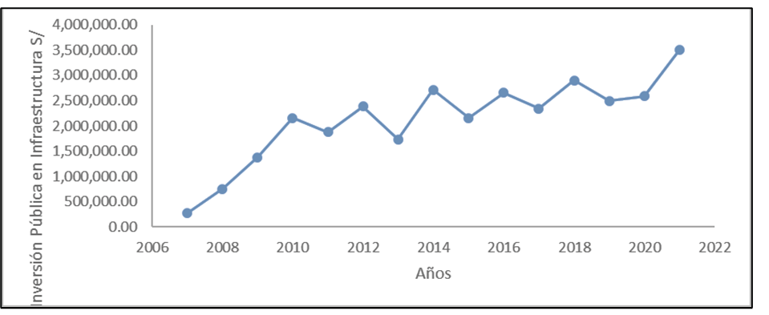
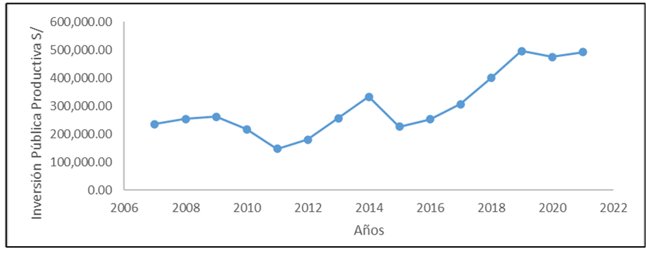
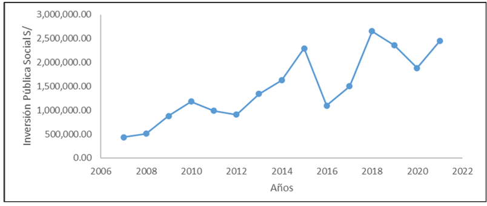
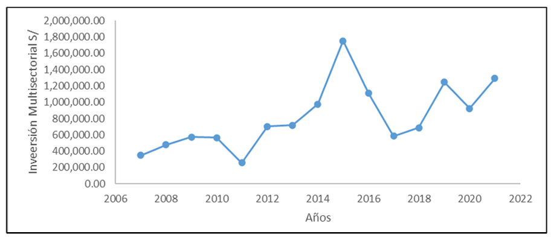
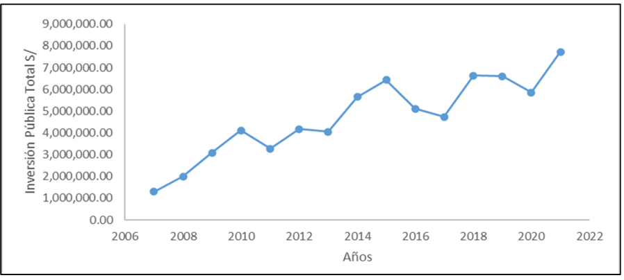
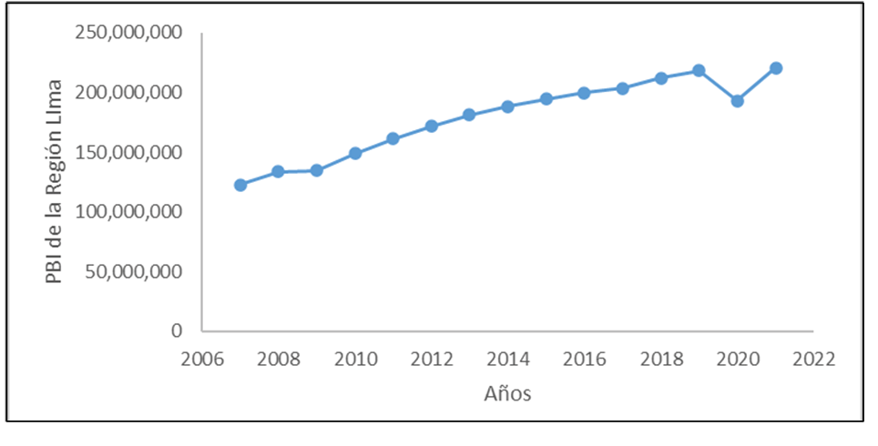

<header class="mb-4 text-sm no-indent">
    

        
<a href="https://revistas.unjbg.edu.pe/index.php/eyn/issue/view/120" class="text-blue-600">Revista Economía & Negocios</a>

        
Vol. 6 Núm. 1, 2024

        
<strong class="block pt-2">Articulo Original</strong>

    

    

        <h1 class="text-xl mb-0">Desequilibrio social, desigualdad distributiva y desempleo en el Perú, 2004 - 2017</h1>
        <h1>Social disequilibrium, distributive inequality and unemployment in Peru, 2004 - 2017</h1>
    

    

        

            Eloy Ávalos*  
            *Autor de correspondencia: <a href="mailto:eavalosa@unmsm.edu.pe" class="text-blue-600">eavalosa@unmsm.edu.pe</a> - <a target="_blank" href="https://orcid.org/0000-0002-9521-9552" class="text-blue-600">https://orcid.org/0000-0002-9521-9552</a> 
            Universidad Nacional Mayor de San Marcos, Departamento Académico de Economía. Lima, Perú
        

        
Esta obra está bajo una <a target="_blank" href="https://creativecommons.org/licenses/by/4.0/" class="text-blue-600">Licencia Creative Commons Atribución 4.0 Internacional.</a>

        

            Como citar: Ávalos, E. (2024). Desequilibrio social, desigualdad distributiva y desempleo en el Perú, 2004 - 2017. <em>Economía & Negocios, 6</em>(1), 24-44. <a target="_blank" href="https://www.doi.org/10.33326/27086062.2024.1.1842" class="text-blue-600">https://www.doi.org/10.33326/27086062.2024.1.1842</a>
        

        

            CÓDIGO JEL:  
            D63, O11, O15
        

    

</header>

## RESUMEN

La inversión pública es esencial para lograr el crecimiento económico de un determinado territorio; en
ese sentido, el objetivo de la investigación fue determinar el impacto de la inversión pública sobre el
crecimiento económico en la región Lima, 2007-2021. La investigación es explicativa lo que indica que no
solo describe diferentes escenarios, sino que establece un vínculo entre ellos. El diseño de la
investigación es no experimental y longitudinal. El método utilizado fue el método estadístico que
consiste en recolectar datos, organizarlos, presentarlos, describirlos y, en este caso, hacer
inferencias sobre los resultados. Los resultados descriptivos obtenidos muestran que ha existido una
relación positiva entre la inversión pública, en sus diferentes dimensiones, y el tiempo; es decir, la
inversión pública incrementó con respecto al primer año de investigación. De acuerdo con las pruebas de
hipótesis realizadas, se pudo comprobar que existió un impacto significativo de la inversión pública, en
sus diferentes dimensiones, sobre el crecimiento económico en la región Lima, 2007-2021. La principal
conclusión del estudio es que existe un impacto significativo de la inversión pública sobre el
crecimiento económico en la región Lima, 2007-2021. Asimismo, el impacto de cada una de las dimensiones
de la inversión pública con respecto al crecimiento económico de la región Lima resultó también
significativo en el periodo 2007-2021.

**_Palabras clave:_** crecimiento económico, inversión pública

## ABSTRACT

The objective of the research was to determine the impact of public investment on economic growth in the
Lima Region 2007-2021. The research is explanatory, indicating that it not only describes different
scenarios, but also establishes a link between them. The research design is non-experimental and
longitudinal. The method used was the statistical method that consists of collecting data, organizing
it, presenting it, describing it and, in this case, making inferences about the results. The descriptive
results obtained show that there has been a positive relationship between public investment, in its
different dimensions, and time, that is, public investment increased with respect to the first year of
research. According to the hypothesis tests carried out, it was possible to verify that there was a
significant impact of public investment, in its different dimensions, on economic growth in the Lima
region 2007-2021. The main conclusion of the study is that there is a significant impact of public
investment on economic growth in the Lima Region, 2007-2021. Likewise, the impact of each of the
dimensions of public investment with respect to the economic growth of the Lima Region was also
significant in the period 2007-2021.

**_Keywords:_** economic growth, public investment

## INTRODUCCIÓN

La inversión pública en los últimos años ha sufrido transformaciones, pensando siempre en mejorar la
calidad del servicio; en este sentido, en el año 2016 se dejó de lado al Sistema Nacional de Inversión
Pública (SNIP), el cual fue creado en el año 2000 mediante la Ley N.º 27293. Este sistema tenía como
finalidad optimizar el uso de los recursos públicos destinados a la inversión, estableciendo principios,
procesos y normas técnicas afines con las fases de los proyectos de inversión. Asimismo, especifica que
todos los proyectos se rigen por las prioridades establecidas en los diferentes niveles de gobierno y,
además, por los principios de economía, eficacia y eficiencia en todas sus fases y por el adecuado
mantenimiento de la infraestructura física para asegurar que sea útil en el tiempo.

A finales del año 2016 se da por concluida la etapa del SNIP para darle paso a un nuevo sistema, el
Invierte.Pe, creado mediante Decreto Legislativo N.º 1252, que tiene como finalidad orientar el uso de
recursos públicos destinados a la inversión para una eficiente prestación de servicios y además proveer
de infraestructura necesaria para el desarrollo del país. En este caso, los objetivos son diferentes que
en el anterior Sistema de Inversión Pública, ya que su objetivo principal es el cierre de brechas de
infraestructura o de acceso a servicios públicos para la población; además, relaciona el proceso
presupuestario con el Marco Macroeconómico Multianual, permitiendo una mejor articulación entre las
entidades para garantizar una inversión eficiente, resaltando además que los recursos destinados a la
inversión deben procurar el mayor impacto en la sociedad. En este sentido, con una mejora en las normas
que rigen el destino de los fondos para la inversión pública se espera también una mejora en la economía
no solo de la región Lima, sino a nivel nacional.

En Perú se ha visto un crecimiento anual promedio de 4.4 % desde el año 2007 al 2021. En este sentido, el
PBI de la región Lima ha pasado de S/122 852 280 en el 2007 a S/220 383 891 en el año 2021, con un
incremento del 79.39 %, considerando incluso la abismal caída del año 2020 provocada por la pandemia de
COVID-19, año en que el crecimiento del PBI de la región Lima fue de -11.4 %.

En cuanto, la inversión pública como aporte del PBI pasó de conformar un 1.05 % en el año 2007 a 3.51 %
en el 2021.

De acuerdo con el Ministerio de Economía y Finanzas (MEF, 2021), el total de la inversión pública en el
país en el año 2007 fue de S/8046 millones, incrementándose en el año 2021 a S/39 103 millones; es
decir, la inversión pública se incrementó en 385.99 % en el periodo de estudio.

Se puede apreciar que en la región Lima existe carencia de algún tipo de servicio. Esto mantiene las
brechas de infraestructura y sociales aún vigentes a pesar del incremento en la inversión, por lo cual
se debe poner atención en los sectores que contribuyen más al cierre de estas brechas; mejorando de esta
forma los indicadores económicos de nuestro país.

Los recursos utilizados a nivel nacional y los transferidos a nivel regional y local deben ser utilizados
eficientemente con la finalidad de cerrar las brechas existentes y contribuir al desarrollo.

Se puede apreciar una falta de vías asfaltadas, considerando la geografía de cada localidad y el clima
predominante, teniendo en cuenta que al cerrar la brecha en el servicio de transporte estaríamos
contribuyendo a un mayor alcance para facilitar el comercio, la agricultura, la minería, etc.,
considerando que el transporte es básico para el abastecimiento de bienes y servicios a nivel nacional.
Muñoz (2022) manifiesta que el sector que mantiene una mayor brecha es el transporte, siendo la brecha
en infraestructura alrededor del 75 %.

Además, en cuanto a los proyectos productivos, existe un déficit de atención, lo que se podría incentivar
el turismo, el comercio, la pesca y la agricultura; así como, brindar conocimientos a las personas que
se dedican a uno de los rubros antes mencionados; además, de otorgar material para un mejor desarrollo
de sus actividades. Ruitón et al. (2022), en su investigación, se plantearon el objetivo de determinar
la relación que existe entre la inversión pública en infraestructura de riego y el crecimiento económico
del producto agrario en el Perú, en el periodo 2001-2015, llegando a la conclusión que existe una
relación positiva y significativa entre la inversión pública en infraestructura de riego y el PBI
agrario. Esto nos indicaría que una mayor inversión productiva en el sector agrícola resulta en
crecimiento económico del sector.

En cuanto al aspecto social también se aprecian deficiencias, un gran porcentaje de la población aún no
tiene acceso a los servicios básicos de agua y alcantarillado; esto sin mencionar el deplorable uso de
las aguas residuales, las que tienen como destino final los ríos o canales de riego, contribuyendo a la
contaminación de las aguas, los suelos y el ambiente. En los indicadores de la Superintendencia Nacional
de Servicios de Saneamiento (SUNASS, 2023) se observa que, entre los años 1992 y 2021, se ha logrado
reducir la brecha de la población con acceso a servicios de saneamiento, agua y alcantarillado en un
15 %; en ese sentido, se incrementó de 75 % al 90 % el acceso a agua potable y de 65 % al 85 % el
servicio de alcantarillado.

Además, es importante considerar la fuente de financiamiento de los proyectos de inversión pública; en
ese sentido, en la investigación de Manrique y Narváez (2020), el objetivo fue analizar la relación que
existe entre la recaudación tributaria y la inversión pública a nivel departamental, llegando a la
conclusión de que los impuestos resultan beneficiosos para aumentar la inversión pública.

Asimismo, es importante mencionar que la gestión de las inversiones públicas forma parte importante y
fundamental en el crecimiento económico. Es así que, Escobar et al. (2021) manifiestan que en su
investigación llegaron a obtener resultados que indican que los gobiernos locales presentan un
deficiente desempeño en la gestión de las inversiones públicas por diversos componentes como, por
ejemplo, la capacidad de gestión, lo que estaría siendo causado por el inadecuado perfil del personal
encargado, puesto que existen brechas notorias en la ejecución del gasto de inversión.

La Comisión Económica para América Latina y el Caribe (Cepal, 2021) considera la importancia de la
planificación en la inversión pública, tomando como referencia a países desarrollados y una muestra de
218 países; de los cuales, el 38 % tiene un plan de inversiones, un 6 % tiene estrategias de
infraestructura y un 56 % no tiene ni planes ni estrategias. Para el caso de América Latina, el 70 % de
países analizados tiene un plan nacional de inversiones, siendo la región con mayor porcentaje. Se puede
apreciar que en América Latina se ha avanzado bastante en la planificación de la inversión pública. La
planificación es sumamente importante en la inversión, ya que guía las estrategias que permiten hacer
una gestión transparente. Dicho esto, se puede afirmar que nuestro actual sistema de inversión pública
trabaja de forma correcta siendo un referente para muchos países en la región.

Andía et al. (2020) mencionan en su investigación que las inversiones son reguladas a través del Sistema
Nacional de programación Multianual y Gestión de Inversiones, teniendo como objetivo principal
administrar los recursos destinados para la inversión, considerando como eje principal para el
desarrollo del país a las inversiones en saneamiento, agua potable y alcantarillado.

El objetivo general de la investigación es conocer el impacto que tiene la inversión pública en la región
Lima, en el periodo 2007-2021; asimismo, el fin principal de la investigación es demostrar que
verdaderamente la inversión pública es un impulso para el crecimiento económico de la región Lima,
siendo esta fundamental no solo para cerrar las brechas de acceso a servicios públicos por parte de la
población, sino para mejorar la calidad de vida de las personas. En ese sentido, se planteó como
hipótesis general que ha existido un impacto significativo de la inversión pública sobre el crecimiento
económico en la región Lima, 2007-2021.

Revisión de la literatura

Respecto a la inversión pública, Zárate, como se cita en Huanchi (2017, p. 16), define la inversión
pública como “todo gasto de recursos de origen público destinado a incrementar, mejorar o reponer las
existencias de capital físico de dominio público y capital humano, con el objeto de ampliar la capacidad
del país para la prestación de servicios”.

El Ministerio de Economía y Finanzas (MEF, 2010) afirma que la inversión pública es toda repartición de
recursos de origen público destinado a crear, aumentar, mejorar o restablecer las existencias de capital
físico de dominio público y/o de capital humano, con el objeto de ampliar la capacidad del país para la
prestación de servicios y/o producción de bienes.

El Banco Central de Reserva del Perú (BCRP, 2011) sostiene que la inversión pública “corresponde a todo
gasto de recursos destinado a incrementar, mejorar o reponer las existencias de capital físico de
dominio público y/o de capital humano” (p. 114).

El Banco Interamericano de Desarrollo (BID, 2019) menciona que el gasto en inversión pública es más
difícil de manejar que el gasto corriente; por ello, se requiere de sistemas especializados para una
gestión eficiente en cada etapa del proyecto.

En cuanto al crecimiento económico, Pérez (2016) menciona que el crecimiento económico es el aumento
cuantitativo de la renta y el valor de los bienes producidos en un determinado periodo de tiempo, lo
cual es medido a través de la tasa de crecimiento del Producto Bruto Interno (PBI), pero más allá de la
definición considera que el crecimiento económico se consigna a relaciones sociales y de producción y
este se encuentra encausado por la política económica y otros instrumentos gubernamentales.

El Instituto Peruano de Economía (IPE, 2013) indica que el término crecimiento económico hace referencia
a la variación porcentual positiva del PBI de una economía para un determinado periodo de tiempo, el
cual depende principalmente de la productividad generada por los factores productivos y la acumulación
de capital.

Cuadrado (2010) define el crecimiento económico como la expansión del PBI en una zona determinada, lo
cual representaría ampliar la frontera de posibilidades de producción en el territorio considerado (p.
204).

Parkin (2018) considera que el crecimiento económico es una expansión sostenida de las posibilidades de
producción medidas por un incremento real del Producto Interno Bruto en un periodo de tiempo determinado
(p. 540).

Brue y Grant (2016) definen el crecimiento económico como el incremento real en la producción de una
nación durante un periodo de tiempo. Este crecimiento depende de las cantidades de recursos naturales,
humanos y capital, la mejor calidad de los recursos y los avances tecnológicos que aumentan la
productividad (p. 505).

En el marco conceptual se glosan las siguientes teorías sobre el crecimiento económico: la teoría
clásica, el modelo de Harrod, el modelo keynesiano, el modelo Solow, el modelo de Barro y la Ley de
Wagner.

La teoría clásica sostiene que el crecimiento está determinado por la dinámica de la acumulación de
capital y la paulatina amplificación de la división del trabajo, la cual hace referencia de la
organización de los procesos de producción y significativamente a la estructura del sector industrial y
la división del trabajo depende directamente de la expansión del mercado que, a su vez, depende del
crecimiento de la producción (Ricoy, 2005).

El modelo de Harrod explica que existe una condición para el equilibrio estático, en el cual, los planes
de inversión y de ahorro son iguales, en otras palabras, este modelo propone una función de inversión
que depende de las expectativas de los capitalistas que guarda una relación directa con el uso de la
capacidad productiva, es decir, la relación capital-producto está dada por las expectativas de los
capitalistas. La finalidad de este modelo es determinar las condiciones necesarias para el equilibrio
entre el ahorro agregado y la inversión agregada de forma tal que la inversión juegue un doble papel,
como determinante de la utilización de la capacidad productiva a corto plazo y como factor que crea
capacidad de producción (Jiménez, 2011).

El modelo keynesiano sostiene que la renta y el empleo deben determinarse simultáneamente partiendo de la
demanda global; de esta forma, Keynes se oponía al pensamiento clásico y su tendencia de que una
economía de mercado nos lleva al pleno empleo proponiendo la intervención estatal a través de la
política económica. Para Keynes se tiene que invertir el ahorro, considerando este como la diferencia
entre la renta y el consumo, es decir, el ahorro es igual a la inversión, considerando esta última como
un multiplicador del empleo, en caso la inversión privada no sea suficiente para mantener el pleno
empleo, es tarea del estado intervenir a través del gasto público; dicho esto, la principal idea de
Keynes es que el gasto público no interfieren con la inversión privada, por el contrario es un
complemento para llegar al pleno empleo (Petit, 2013).

Robert Solow critica al modelo Keynesiano mencionando que se deberían descartar las proporciones fijas,
pues estas hacen al modelo más inestable, en este sentido, introduce una función de producción que
permite la sustitución de factores, es decir, se puede reemplazar capital por trabajo y viceversa.
Partiendo del equilibrio macroeconómico entre el ahorro y la inversión, Solow adiciona al capital físico
como un activo acumulable, la mano de obra como un activo reproducible, al ahorro real como función del
ingreso, la tasa de depreciación y el crecimiento poblacional. El modelo de Solow es considerado como un
modelo neoclásico por su postura opuesta al modelo keynesiano (Antúnez, 2009).

Robert Barro propone un modelo de crecimiento endógeno, el cual incorpora el gasto público y los
impuestos. Este modelo permite analizar el tamaño óptimo del gobierno, así como la relación que guarda
este con el crecimiento y la tasa de ahorro. Bajo ciertos supuestos teóricos que reflejan las
condiciones primordiales para su correcto funcionamiento, se muestra un modelo que emplea una función
con rendimientos constantes a escala; asimismo, considera que el capital privado es consecuencia de la
inversión productiva y que el estado realiza inversión pública en bienes públicos puros. Por ello, un
incremento de la inversión pública no debe disminuir la inversión privada; además, asume que el gobierno
financia su gasto con un impuesto sobre la renta (Cornelio & Tun, 2015).

Asimismo, es importante mencionar la Ley de Wagner, que plantea que el crecimiento del gasto público
impacta positivamente en el PBI; dicha ley fue analizada para el caso peruano comprobando que esta se
cumple en el periodo en estudio (Valenzuela et al., 2020).

## MATERIALES Y MÉTODOS

El propósito de esta investigación es analizar el impacto de la inversión pública en el crecimiento
económico de la región Lima en el periodo 2007-2021. Con ese fin se reunieron los datos sobre los
indicadores de las variables utilizando como fuente las publicaciones del Ministerio de Economía y
Finanzas y del Instituto Nacional de Estadística e Informática.

Con esos datos se elaboró una base de datos que me permitió realizar la estadística descriptiva de la
investigación (organización, presentación y descripción de los datos) y las pruebas de hipótesis
correspondientes.

La investigación es de tipo explicativa. Hernández-Sampieri y Mendoza (2018) sostienen que la
investigación explicativa es aquella que no solo describe fenómenos, conceptos o variables o establece
relaciones entre ellas. Este tipo de estudio está dirigido a responder por los eventos; su interés se
centra en explicar por qué ocurre el evento y/o por qué estas dos o más variables tienen relación
(p. 110).

En efecto, en la investigación se ha medido el impacto de la inversión pública y cada uno de sus
componentes sobre el crecimiento de la región Lima.

El diseño de la investigación es no experimental y longitudinal. Hernández et al. (2014) sostienen que la
investigación no experimental es la “que se realiza sin manipular deliberadamente variables” (p. 152).
Los datos longitudinales son aquellos que se recolectan “en diferentes momentos o periodos para hacer
inferencias respecto al cambio, sus determinantes y consecuencias” (p. 159).

En consecuencia, en la investigación no se han manipulado las variables y los datos corresponden a
diferentes momentos en el tiempo, en este caso, en el periodo 2007-2021.

El método de investigación utilizado fue el método hipotético-deductivo. López y Ramos (2021),
manifiestan que el principio de este método es la formulación de hipótesis basada en teorías o datos
empíricos y a partir de ello se siguen pautas lógicas de deducción para corroborar la validez de la
hipótesis. El resultado de este método es la derivación de afirmaciones a partir de las cuales se puede
formular un mayor número de hipótesis y con ello deducir conclusiones e incluso predecir eventos.

En la medida que los datos utilizados en la investigación ya existen, no será necesario distinguir entre
los conceptos de población y muestra. Para efectos de la investigación, la muestra estará constituida
por los datos de cada uno de los indicadores de las dimensiones de las variables que corresponden a la
región Lima, durante el periodo 2007-2021.

La investigación utilizó la técnica documental. Yuni y Urbano (2014) refieren que la investigación
documental permite volver al pasado para comprender el presente e incluso hacer pronósticos de un
futuro. En ese sentido, la investigación documental permite ampliar el campo de la exploración y
encuadra la realidad en un contexto histórico lo que nos permite tener una apreciación general de lo que
ocurre y puede ocurrir más adelante (p. 100). Se utilizó la técnica documental puesto que los datos son
*ex post facto* y nos limitamos a recogerlos de los sitios web de instituciones oficiales del
Perú que los proveen como son:

El Instituto Nacional de Estadística e Informática (INEI) y el Ministerio de Economía y Finanzas (MEF).

En la medida que la técnica utilizada es la documental, el instrumento ha sido la ficha documental. De
acuerdo con Bernal (2006), la ficha documental es usada para examinar la información encontrada en
diferentes documentos. En ese sentido se consultó material de diversas fuentes para elaborar el trabajo
de investigación.

Operacionalización de variables

Para operacionalizar la variable inversión pública, se ha desagregado en cuatro dimensiones: inversión en
infraestructura, inversión productiva, inversión social e inversión pública multisectorial.

Para medir la inversión en infraestructura se utilizó como indicador el valor real de la inversión en
infraestructura.

Para medir la inversión productiva se utilizó como indicador el valor real de la inversión en inversión
productiva.

Para medir la inversión social se utilizó como indicador el valor real en inversión social.

Para medir la inversión multisectorial se utilizó como indicador el valor real de la inversión en otros
sectores.

Para operacionalizar la variable crecimiento económico, se utilizó como indicador el valor real del PBI
de la región Lima. Tal como se muestra en la siguiente tabla de operacionalización de variables.

**Tabla 1**

*Operacionalización de variables*

<table>
    <thead>
        <tr>
            <th>Variables</th>
            <th>Dimensiones</th>
            <th>Indicadores</th>
            <th>Tipo de variable</th>
        </tr>
    </thead>
    <tbody>
        <tr>
            <td rowspan="4" class="align-middle">Inversión pública</td>
            <td>en infraestructura</td>
            <td>Valor real de la inversión en infraestructura</td>
            <td rowspan="4" class="align-middle">Variable independiente</td>
        </tr>
        <tr>
            <td>productiva</td>
            <td>Valor real de la inversión productiva</td>
        </tr>
        <tr>
            <td>social</td>
            <td>Valor real de la inversión social</td>
        </tr>
        <tr>
            <td>multisectorial</td>
            <td>Valor real de la inversión en otros sectores</td>
        </tr>
    </tbody>
    <tfoot class="border-t-1 border-t-black dark:border-t-gray-200">
        <tr>
            <td>Crecimiento económico</td>
            <td></td>
            <td>Valor real del PBI de la región Lima</td>
            <td>Variable dependiente</td>
        </tr>
    </tfoot>
</table>

Una vez obtenidos los datos se utilizó el método estadístico para procesarlos. En ese sentido, se
organizaron los datos (a través de cuadros), se presentaron (a través de gráficos de línea), se
describieron (a través de números estadísticos) y se estimaron los modelos que permitieron medir el
impacto de una variable sobre la otra; asimismo, se aplicó la prueba de hipótesis para la significancia
estadística de los resultados. En ese sentido, un modelo económico es la representación del contexto
económico mediante fórmulas matemáticas y ecuaciones, con el objetivo de observar y estudiar cómo se
interrelacionan las variables y poder predecir los efectos de la aplicación de alguna disposición
(Instituto Internacional de Investigaciones Empresas y Cambio, 1998, p. 182). Asimismo, se considera la
importancia del modelo de regresión lineal, Rodríguez y Gonzales (2017). Este modelo es el inicio de los
estudios econométricos, el modelo de regresión lineal relaciona dos vectores de información buscando que
tanto un vector explica al otro, también se le conoce como función de X o variable independiente que se
relaciona o explica una variable Y o variable dependiente. En la investigación se estimaron modelos
individuales, teniendo como variable dependiente al crecimiento económico y variables independientes a
la inversión pública en sus diferentes dimensiones (infraestructura, social, productiva y
multisectorial).

## RESULTADOS

En la tabla 2 se presenta la inversión en infraestructura de la región Lima, durante el periodo
2007-2021, expresado en miles de soles (S/) del año 2007.

**Tabla 2**

*Inversión en infraestructura de la región Lima, durante el periodo 2007-2021, en S/, año 2007*

| Años | Inversión en infraestructura |
| ---- | ---------------------------- |
| 2007 | 271,639.37                   |
| 2008 | 756,533.03                   |
| 2009 | 1,380,272.75                 |
| 2010 | 2,153,793.85                 |
| 2011 | 1,879,422.71                 |
| 2012 | 2,382,999.95                 |
| 2013 | 1,730,275.31                 |
| 2014 | 2,711,531.08                 |
| 2015 | 2,156,400.34                 |
| 2016 | 2,652,127.32                 |
| 2017 | 2,341,799.49                 |
| 2018 | 2,898,348.14                 |
| 2019 | 2,495,939.26                 |
| 2020 | 2,584,648.02                 |
| 2021 | 3,498,990.35                 |

En dicha tabla se aprecia que la inversión en infraestructura tuvo fluctuaciones año a año, aunque se
nota un cierto aumento en términos generales, tal como se ilustra en la figura 1.

**Figura 1**

*Inversión en infraestructura de la región Lima, durante el periodo 2007-2021, en S/, año 2007*

Si se estima la línea de tendencia de los datos, se obtienen los siguientes resultados:

*y* = 158815*x* - 3E+08

*r*² = 0.7318

Donde *y* es la inversión en infraestructura, *x* es el tiempo y *r*2 es el
coeficiente de determinación.

Dichos resultados muestran una relación positiva entre la inversión en infraestructura y el tiempo, con
un ajuste alto de la regresión a los datos, lo que se interpreta en el sentido que hubo una tendencia
definida de la inversión en infraestructura durante el periodo 2010-2019.

En la tabla 3 se presenta la inversión productiva de la región Lima, durante el periodo 2007-2021,
expresado en miles de soles (S/) del año 2007

**Tabla 3**

*Inversión productiva de la región Lima, 2007-2021, en soles S/, año 2007*

| Años | Inversión productiva |
| ---- | -------------------- |
| 2007 | 234,839.76           |
| 2008 | 253,600.75           |
| 2009 | 261,450.15           |
| 2010 | 216,311.22           |
| 2011 | 147,237.57           |
| 2012 | 179,707.41           |
| 2013 | 256,328.43           |
| 2014 | 332,299.37           |
| 2015 | 226,226.91           |
| 2016 | 252,422.70           |
| 2017 | 305,853.03           |
| 2018 | 400,015.38           |
| 2019 | 496,042.47           |
| 2020 | 474,342.38           |
| 2021 | 491,336.45           |

En dicha tabla se aprecia que la inversión productiva disminuyó en los años 2010, 2011 y 2012, creció en
los años 2013, 2014, disminuyó en el 2015, aumentó en el 2016; volvió a crecer en los años 2017 y 2018;
finalmente, creció el año 2019, disminuyó en el año 2020 y se recuperó en el año 2021. A pesar de las
fluctuaciones, la inversión en el año 2021 casi duplicó la inversión del año 2007, tal como se ilustra
en la figura 2.

**Figura 2**

*Inversión productiva de la región Lima, 2007-2021, en soles S/, año 2007*

Si se estima la línea de tendencia de los datos, se obtienen los siguientes resultados:

*y*= 20067*x* - 4E+07

*r*² = 0.6307

Donde *y* es la inversión productiva, *x* es el tiempo y *r*2 es el
coeficiente de determinación.

Dichos resultados muestran una relación positiva entre la inversión productiva y el tiempo, con un ajuste
moderado de la regresión a los datos, lo que se interpreta en el sentido que hubo una tendencia
creciente de la inversión productiva durante el periodo 2007-2021.

En la tabla 4 se presenta la inversión social de la región Lima, durante el periodo 2007-2021, expresada
en miles de soles (S/) del año 2007.

**Tabla 4**

*Inversión social de la región Lima, durante el periodo 2007-2021, en S/, año 2007*

| Años | Inversión social |
| ---- | ---------------- |
| 2007 | 437,849.04       |
| 2008 | 507,683.84       |
| 2009 | 878,737.25       |
| 2010 | 1,179,347.98     |
| 2011 | 985,524.32       |
| 2012 | 907,911.09       |
| 2013 | 1,338,917.99     |
| 2014 | 1,628,803.49     |
| 2015 | 2,294,120.63     |
| 2016 | 1,097,364.19     |
| 2017 | 1,503,556.20     |
| 2018 | 2,654,588.46     |
| 2019 | 2,357,545.77     |
| 2020 | 1,880,805.23     |
| 2021 | 2,449,014.83     |

En dicha tabla se aprecia que la inversión social aumentó en los años 2008, 2009 y 2010, disminuyó en los
años 2011 y 2012, creció en los años 2013, 2014 y 2015, disminuyó en el 2016, aumentó en el 2017; volvió
a crecer en los años 2018 y 2019, se redujo en el año 2020 y, finalmente, creció el año 2021. A pesar de
las fluctuaciones, la inversión social tuvo una variación de 459.33 %, entre el 2007 al 2021, tal como
se ilustra en la figura 3.

**Figura 3**

*Inversión social de la región Lima, durante el periodo 2007-2021, en S/, año 2007*

Si se estima la línea de tendencia de los datos, se obtienen los siguientes resultados:

**Tabla 5**

*Inversión multisectorial de la región Lima, 2007-2021, en S/, año 2007*

| Años | Inversión multisectorial |
| ---- | ------------------------ |
| 2007 | 348,878.96               |
| 2008 | 477,645.80               |
| 2009 | 573,442.16               |
| 2010 | 565,712.36               |
| 2011 | 258,335.08               |
| 2012 | 702,428.01               |
| 2013 | 719,309.61               |
| 2014 | 977,257.95               |
| 2015 | 1,753,731.47             |
| 2016 | 1,111,848.05             |
| 2017 | 585,421.64               |
| 2018 | 686,193.55               |
| 2019 | 1,247,853.17             |
| 2020 | 923,718.39               |
| 2021 | 1,290,370.88             |

En dicha tabla se aprecia que la inversión multisectorial aumentó en los años 2008, 2009, disminuyó en
los años 2010 y 2011, creció en los años 2012, 2013, 2014 y 2015, disminuyó en el 2016 y 2017, aumentó
levemente en el año 2018, creció en el año 2019; volvió a caer en el año 2020 y, finalmente, creció el
año 2021. A pesar de las fluctuaciones, la inversión multisectorial tuvo una variación de 269.86 % entre
el 2007 al 2021, tal como se ilustra en la figura 4.

**Figura 4**

*Inversión multisectorial de la región Lima, 2007-2021, en S/, año 2007*

Si se estima la línea de tendencia de los datos, se obtienen los siguientes resultados:

**Tabla 6**

*Inversión pública total de la región Lima, 2007-2021, en S/, año 2007*

| Años | Inversión pública |
| ---- | ----------------- |
| 2007 | 1,293,207.13      |
| 2008 | 1,995,463.42      |
| 2009 | 3,093,902.31      |
| 2010 | 4,115,165.41      |
| 2011 | 3,270,519.68      |
| 2012 | 4,173,046.46      |
| 2013 | 4,044,831.34      |
| 2014 | 5,649,891.89      |
| 2015 | 6,430,479.35      |
| 2016 | 5,113,762.26      |
| 2017 | 4,736,630.37      |
| 2018 | 6,639,145.53      |
| 2019 | 6,597,380.67      |
| 2020 | 5,863,514.02      |
| 2021 | 7,729,712.51      |

En dicha tabla se aprecia que la inversión pública total aumentó en los años 2008, 2009 y 2010, disminuyó
en el año 2011, creció en el año 2012, se redujo levemente en el año 2013, se incrementó en los años
2014 y 2015, disminuyó en el 2016 y 2017, aumentó nuevamente en el año 2018, bajó en el año 2019 y 2020
y, finalmente, creció el año 2021. A pesar de las fluctuaciones, la inversión multisectorial tuvo una
variación de 497.72 % entre el 2007 al 2021, tal como se ilustra en la figura 5.

**Figura 5**

*Inversión pública total de la región Lima, 2007-2021, en S/, año 2007*

Si se estima la línea de tendencia de los datos, se obtienen los siguientes resultados:

*y* = 373366*x* - 7E+08

*r*² = 0.8385

Donde *y* es la inversión pública total, *x* es el tiempo y *r*2 es el
coeficiente de determinación.

Dichos resultados muestran una relación positiva entre la inversión productiva y el tiempo, con un ajuste
alto de la regresión a los datos, lo que se interpreta en el sentido que hubo una tendencia creciente de
la inversión productiva durante el periodo 2007-2021.

En la tabla 7 se presenta el PBI de la región Lima, durante el periodo 2007-2021, expresado en miles de
soles (S/) del año 2007.

**Tabla 7**

*PBI de la región Lima, 2007-2021, en S/, año 2007*

| Años | PBI         |
| ---- | ----------- |
| 2007 | 122,852,280 |
| 2008 | 133,788,565 |
| 2009 | 134,621,250 |
| 2010 | 148,934,506 |
| 2011 | 161,179,073 |
| 2012 | 171,527,238 |
| 2013 | 181,204,492 |
| 2014 | 188,194,014 |
| 2015 | 194,260,274 |
| 2016 | 199,550,467 |
| 2017 | 203,291,654 |
| 2018 | 212,204,653 |
| 2019 | 218,109,041 |
| 2020 | 193,232,149 |
| 2021 | 220,383,891 |

En dicha tabla se aprecia que el PBI de la región Lima estuvo creciendo durante todo el periodo de
análisis, excepto en el año 2020 a causa de la pandemia del COVID-19, crisis que afectó a nivel mundial,
tal como se ilustra en la figura 6.

**Figura 6**

*PBI de la región Lima, 2007-2021, en S/, año 2007*

Si se estima la línea de tendencia de los datos, se obtienen los siguientes resultados:

*y* = 7E+06*x* - 1E+10

*r*² = 0.9051

Donde *y* es la inversión pública total, *x* es el tiempo y *r*2 es el
coeficiente de determinación.

Dichos resultados muestran una relación positiva entre el PBI y el tiempo, con un ajuste muy elevado de
la regresión a los datos, lo que se interpreta en el sentido que hubo una tendencia creciente del PBI,
durante el periodo 2007-2021.

Resultados inferenciales:

Criterios de evaluación de las pruebas de hipótesis

En la medida que los datos son cuantitativos y continuos y tienen una distribución normal, se ha
utilizado el Método de Cuadrados Mínimos Ordinarios para medir el impacto de la variable explicativa
sobre la variable explicada.

No fue posible realizar una regresión múltiple porque los tipos de inversión pública considerados tienen
una elevada relación entre ellas; es decir, que se presentaría el fenómeno de la multicolinealidad entre
las variables explicativas.

Los resultados obtenidos de la regresión nos permitieron comparar el valor de p (p-value) con el nivel de
significación que se ha establecido.

En este caso, se ha considerado un nivel de significación del 5 %, lo que nos da una seguridad del 95 %
de que el resultado es válido. Siendo α = 0.05, las opciones son las siguientes:

Si p < α = 0.05, se rechaza la hipótesis nula (H0) y, en consecuencia, se acepta la
hipótesis alternativa (H1).

Si p > α = 0.05, se acepta la hipótesis nula (H0) y, en consecuencia, se rechaza la
hipótesis alternativa (H1).

Prueba de hipótesis específica 1:

Se contrastan las siguientes hipótesis:

H0: No ha existido un impacto significativo de la inversión pública en infraestructura sobre
el crecimiento económico de la región Lima, 2007-2021.

H1: Ha existido un impacto significativo de la inversión pública en infraestructura sobre el
crecimiento económico de la región Lima, 2007-2021.

En la tabla 8 se presentan los datos de la inversión pública en infraestructura y el PBI de la región
Lima para el periodo 2007-2021, expresado en S/, del año 2007.

**Tabla 8**

*Inversión pública en infraestructura y PBI de la región Lima, 2007-2021, en S/, año 2007*

| Años | Inversión en infraestructura | PBI         |
| ---- | ---------------------------- | ----------- |
| 2007 | 271,639.37                   | 122,852,280 |
| 2008 | 756,533.03                   | 133,788,565 |
| 2009 | 1,380,272.75                 | 134,621,250 |
| 2010 | 2,153,793.85                 | 148,934,506 |
| 2011 | 1,879,422.71                 | 161,179,073 |
| 2012 | 2,382,999.95                 | 171,527,238 |
| 2013 | 1,730,275.31                 | 181,204,492 |
| 2014 | 2,711,531.08                 | 188,194,014 |
| 2015 | 2,156,400.34                 | 194,260,274 |
| 2016 | 2,652,127.32                 | 199,550,467 |
| 2017 | 2,341,799.49                 | 203,291,654 |
| 2018 | 2,898,348.14                 | 212,204,653 |
| 2019 | 2,495,939.26                 | 218,109,041 |
| 2020 | 2,584,648.02                 | 193,232,149 |
| 2021 | 3,498,990.35                 | 220,383,891 |

*Nota:* MEF e INEI

Con los datos de dicha tabla, se estima la regresión que permita probar si la inversión pública en
infraestructura tuvo un impacto significativo sobre el PBI de la región Lima, durante el periodo
2007-2021.

En la tabla 9 se presentan los resultados de la prueba de la regresión y la prueba de hipótesis.

**Tabla 9**

*Resultados de la prueba de hipótesis del impacto de la inversión pública en infraestructura sobre el PBI de la región Lima, 2007-2021*

| Estadísticas de la regresión        |                    |                   |                           |               |                    |
| ----------------------------------- | ------------------ | ----------------- | ------------------------- | ------------- | ------------------ |
| Coeficiente de correlación múltiple | 0.874788304        |                   |                           |               |                    |
| Coeficiente de determinación R2     | 0.765254577        |                   |                           |               |                    |
| R2 ajustado                         | 0.747197236        |                   |                           |               |                    |
| Error típico                        | 16,083,381.63      |                   |                           |               |                    |
| Observaciones                       | 15                 |                   |                           |               |                    |
| **Análisis de la varianza**         |                    |                   |                           |               |                    |
|                                     | Grados de libertad | Suma de cuadrados | Promedio de los cuadrados | F             | Valor crítico de F |
| Regresión                           | 1                  | 1.09624E+16       | 1.09624E+16               | 42.37914145   | 1.97281E-05        |
| Residuos                            | 13                 | 3.36278E+15       | 2.58675E+14               |               |                    |
| Total                               | 14                 | 1.43252E+16       |                           |               |                    |
| **Prueba de hipótesis individual**  |                    |                   |                           |               |                    |
|                                     |                    | Coeficientes      | Error típico              | Estadístico t | Probabilidad       |
| Intercepción                        |                    | 107223730.2       | 11765809.62               | 9.113162096   | 5.22608E-07        |
| Variable X1                         |                    | 33.70393472       | 5.177314267               | 6.509926378   | 1.97281E-05        |

De acuerdo con los criterios establecidos y los resultados de la prueba de hipótesis, se observa que:

p = 0.0000197 < α = 0.05

Por lo tanto, se rechaza la hipótesis nula (H0) y, en consecuencia, se acepta la hipótesis
alternativa (H1).

Prueba de hipótesis específica 2:

Se contrastan las siguientes hipótesis:

H0: No ha existido un impacto significativo de la inversión pública productiva sobre el
crecimiento económico de la región Lima, 2007-2021.

H1: Ha existido un impacto significativo de la inversión pública productiva sobre el
crecimiento económico de la región Lima, 2007-2021.

En la tabla 10 se presentan los datos de la inversión pública productiva y el PBI de la región Lima para
el periodo 2007-2021, expresado en S/ del año 2007.

**Tabla 10**

*Inversión pública productiva y PBI de la región Lima, 2007-2021, en S/, año 2007*

| Años | Inversión productiva | PBI         |
| ---- | -------------------- | ----------- |
| 2007 | 234,839.76           | 122,852,280 |
| 2008 | 253,600.75           | 133,788,565 |
| 2009 | 261,450.15           | 134,621,250 |
| 2010 | 216,311.22           | 148,934,506 |
| 2011 | 147,237.57           | 161,179,073 |
| 2012 | 179,707.41           | 171,527,238 |
| 2013 | 256,328.43           | 181,204,492 |
| 2014 | 332,299.37           | 188,194,014 |
| 2015 | 226,226.91           | 194,260,274 |
| 2016 | 252,422.70           | 199,550,467 |
| 2017 | 305,853.03           | 203,291,654 |
| 2018 | 400,015.38           | 212,204,653 |
| 2019 | 496,042.47           | 218,109,041 |
| 2020 | 474,342.38           | 193,232,149 |
| 2021 | 491,336.45           | 220,383,891 |

*Nota:* MEF e INEI

Con los datos de dicha tabla, se estima la regresión que permita probar si la inversión pública
productiva tuvo un impacto significativo sobre el PBI de la región Lima, durante el periodo
2007-2021.

**Tabla 11**

*Resultados de la prueba de hipótesis del impacto de la inversión pública productiva sobre el PBI de la región Lima, 2007-2021*

| Estadísticas de la regresión        |                   |                           |               |                    |              |
| ----------------------------------- | ----------------- | ------------------------- | ------------- | ------------------ | ------------ |
| Coeficiente de correlación múltiple | 0.656730051       |                           |               |                    |              |
| Coeficiente de determinación R2     | 0.43129436        |                           |               |                    |              |
| R2 ajustado                         | 0.387547772       |                           |               |                    |              |
| Error típico                        | 25,033,557.31     |                           |               |                    |              |
| Observaciones                       | 15                |                           |               |                    |              |
| **Análisis de la varianza**         |                   |                           |               |                    |              |
| Grados de libertad                  | Suma de cuadrados | Promedio de los cuadrados | F             | Valor crítico de F |              |
| Regresión                           | 1                 | 6.17838E+15               | 6.17838E+15   | 9.858925737        | 0.007822378  |
| Residuos                            | 13                | 8.14683E+15               | 6.26679E+14   |                    |              |
| Total                               | 14                | 1.43252E+16               |               |                    |              |
| **Prueba de hipótesis individual**  |                   |                           |               |                    |              |
|                                     | Coeficientes      | Error típico              | Estadístico t | Probabilidad       | Inferior 95% |
| Intercepción                        | 122,771,031.7     | 19,005,432.23             | 6.459786349   | 2.13351E-05        | 81712291.58  |
| Variable X1                         | 185.9022692       | 59.20656882               | 3.139892632   | 0.007822378        | 57.99425364  |

De acuerdo con los criterios establecidos y los resultados de la prueba de hipótesis, se observa que:

p = 0.0078 < α = 0.05

Por lo tanto, se rechaza la hipótesis nula (H0) y, en consecuencia, se acepta la hipótesis
alternativa (H1).

Prueba de hipótesis específica 3:

Se contrastan las siguientes hipótesis:

H0: No ha existido un impacto significativo de la inversión pública social sobre el
crecimiento económico de la región Lima, 2007-2021.

H1: Ha existido un impacto significativo de la inversión pública social sobre el crecimiento
económico de la región Lima, 2007-2021.

En la tabla 12 se presentan los datos de la inversión pública social y el PBI de la región Lima para el
periodo 2007-2021, expresado en S/ del año 2007.

**Tabla 12**

*Inversión pública social y PBI de la región Lima, 2007-2021, en S/, año 2007*

| Años | Inversión social | PBI         |
| ---- | ---------------- | ----------- |
| 2007 | 437,849.04       | 122,852,280 |
| 2008 | 507,683.84       | 133,788,565 |
| 2009 | 878,737.25       | 134,621,250 |
| 2010 | 1,179,347.98     | 148,934,506 |
| 2011 | 985,524.32       | 161,179,073 |
| 2012 | 907,911.09       | 171,527,238 |
| 2013 | 1,338,917.99     | 181,204,492 |
| 2014 | 1,628,803.49     | 188,194,014 |
| 2015 | 2,294,120.63     | 194,260,274 |
| 2016 | 1,097,364.19     | 199,550,467 |
| 2017 | 1,503,556.20     | 203,291,654 |
| 2018 | 2,654,588.46     | 212,204,653 |
| 2019 | 2,357,545.77     | 218,109,041 |
| 2020 | 1,880,805.23     | 193,232,149 |
| 2021 | 2,449,014.83     | 220,383,891 |

*Nota:* MEF e INEI

Con los datos de dicha tabla, se estima la regresión que permita probar si la inversión pública social
tuvo un impacto significativo, sobre el PBI de la región Lima, durante el periodo 2007-2021.

En la tabla 13 se presentan los resultados de la prueba de la regresión y la prueba hipótesis.

**Tabla 13**

*Resultados de la prueba de hipótesis del impacto de la inversión pública social sobre el PBI de la región Lima, 2007-2021*

| Estadísticas de la regresión        |                    |                   |                           |              |                    |
| ----------------------------------- | ------------------ | ----------------- | ------------------------- | ------------ | ------------------ |
| Coeficiente de correlación múltiple | 0.86389283         |                   |                           |              |                    |
| Coeficiente de determinación R2     | 0.746310821        |                   |                           |              |                    |
| R2 ajustado                         | 0.726796269        |                   |                           |              |                    |
| Error típico                        | 16,719,749.7       |                   |                           |              |                    |
| Observaciones                       | 15                 |                   |                           |              |                    |
| **Análisis de la varianza**         |                    |                   |                           |              |                    |
|                                     | Grados de libertad | Suma de cuadrados | Promedio de los cuadrados | F            | Valor crítico de F |
| Regresión                           | 1                  | 1.06911E+16       | 1.0691E+16                | 38.24380968  | 3.30162E-05        |
| Residuos                            | 13                 | 3.63415E+15       | 2.7955E+14                |              |                    |
| Total                               | 14                 | 1.43252E+16       |                           |              |                    |
| **Prueba de hipótesis individual**  |                    |                   |                           |              |                    |
|                                     | Coeficientes       | Error típico      | Estadístico t             | Probabilidad | Inferior 95%       |
| Intercepción                        | 121,935,517.7      | 10,171,169.99     | 11.9883472                | 2.11425E-08  | 99962040.82        |
| Variable X1                         | 38.65304772        | 6.250333184       | 6.18415796                | 3.30162E-05  | 25.15002381        |

De acuerdo con los criterios establecidos y los resultados de la prueba de hipótesis, se observa que:

p = 0.000033 < α = 0.05

Por lo tanto, se rechaza la hipótesis nula (H0) y, en consecuencia, se acepta la hipótesis
alternativa (H1).

Prueba de hipótesis específica 4:

Se contrastan las siguientes hipótesis:

H0: No ha existido un impacto significativo de la inversión pública multisectorial sobre el
crecimiento económico de la región Lima, 2007-2021.

H1: Ha existido un impacto significativo de la inversión pública multisectorial sobre el
crecimiento económico de la región Lima, 2007-2021.

En la tabla 14 se presentan los datos de la inversión pública multisectorial y el PBI de la región Lima
para el periodo 2007-2021, expresado en S/ del año 2007.

**Tabla 14**

*Inversión pública multisectorial y PBI de la región Lima, 2007-2021, en S/, año 2007*

| Años | Inversión multisectorial | PBI         |
| ---- | ------------------------ | ----------- |
| 2007 | 348,878.96               | 122,852,280 |
| 2008 | 477,645.80               | 133,788,565 |
| 2009 | 573,442.16               | 134,621,250 |
| 2010 | 565,712.36               | 148,934,506 |
| 2011 | 258,335.08               | 161,179,073 |
| 2012 | 702,428.01               | 171,527,238 |
| 2013 | 719,309.61               | 181,204,492 |
| 2014 | 977,257.95               | 188,194,014 |
| 2015 | 1,753,731.47             | 194,260,274 |
| 2016 | 1,111,848.05             | 199,550,467 |
| 2017 | 585,421.64               | 203,291,654 |
| 2018 | 686,193.55               | 212,204,653 |
| 2019 | 1,247,853.17             | 218,109,041 |
| 2020 | 923,718.39               | 193,232,149 |
| 2021 | 1,290,370.88             | 220,383,891 |

*Nota:* MEF e INEI

Con los datos de dicha tabla, se estima la regresión que permita probar si la inversión pública
multisectorial tuvo un impacto significativo, sobre el PBI de la región Lima, durante el periodo
2007-2021.

En la tabla 15 se presentan los resultados de la prueba de la regresión y la prueba hipótesis.

**Tabla 15**

*Resultados de la prueba de hipótesis del impacto de la inversión pública multisectorial sobre el PBI de la región Lima, 2007-2021*

| Estadísticas de la regresión        |                    |                   |                           |              |                    |
| ----------------------------------- | ------------------ | ----------------- | ------------------------- | ------------ | ------------------ |
| Coeficiente de correlación múltiple | 0.667180093        |                   |                           |              |                    |
| Coeficiente de determinación R2     | 0.445129276        |                   |                           |              |                    |
| R2 ajustado                         | 0.402446913        |                   |                           |              |                    |
| Error típico                        | 24,727,186.57      |                   |                           |              |                    |
| Observaciones                       | 15                 |                   |                           |              |                    |
| **Análisis de la varianza**         |                    |                   |                           |              |                    |
|                                     | Grados de libertad | Suma de cuadrados | Promedio de los cuadrados | F            | Valor crítico de F |
| Regresión                           | 1                  | 6.37657E+15       | 6.37657E+15               | 10.42888073  | 0.006584481        |
| Residuos                            | 13                 | 7.94864E+15       | 6.11434E+14               |              |                    |
| Total                               | 14                 | 1.43252E+16       |                           |              |                    |
| **Prueba de hipótesis individual**  |                    |                   |                           |              |                    |
|                                     | Coeficientes       | Error típico      | Estadístico t             | Probabilidad | Inferior 95%       |
| Intercepción                        | 135,735,769.3      | 14,809,571.31     | 9.165408406               | 4.89737E-07  | 103741635.7        |
| Variable X1                         | 52.96098975        | 16.39975056       | 3.229377761               | 0.006584481  | 17.53148267        |

*Nota:* Nota de pie

De acuerdo con los criterios establecidos y los resultados de la prueba de hipótesis, se observa que:

p = 0.0065 < α = 0.05

Por lo tanto, se rechaza la hipótesis nula (H0) y, en consecuencia, se acepta la hipótesis
alternativa (H1).

Prueba de hipótesis general:

Se contrastan las siguientes hipótesis:

H0: No ha existido un impacto significativo de la inversión pública sobre el crecimiento
económico de la región Lima, 2007-2021.

H1: Ha existido un impacto significativo de la inversión pública sobre el crecimiento
económico de la región Lima, 2007-2021.

En la tabla 16 se presentan los datos de la inversión pública y el PBI de la región Lima para el periodo
2007-2021, expresado en S/ del año 2007.

**Tabla 16**

*Inversión pública y PBI de la región Lima, 2007-2021, en S/, año 2007*

| Años | Inversión pública | PBI         |
| ---- | ----------------- | ----------- |
| 2007 | 1,293,207.13      | 122,852,280 |
| 2008 | 1,995,463.42      | 133,788,565 |
| 2009 | 3,093,902.31      | 134,621,250 |
| 2010 | 4,115,165.41      | 148,934,506 |
| 2011 | 3,270,519.68      | 161,179,073 |
| 2012 | 4,173,046.46      | 171,527,238 |
| 2013 | 4,044,831.34      | 181,204,492 |
| 2014 | 5,649,891.89      | 188,194,014 |
| 2015 | 6,430,479.35      | 194,260,274 |
| 2016 | 5,113,762.26      | 199,550,467 |
| 2017 | 4,736,630.37      | 203,291,654 |
| 2018 | 6,639,145.53      | 212,204,653 |
| 2019 | 6,597,380.67      | 218,109,041 |
| 2020 | 5,863,514.02      | 193,232,149 |
| 2021 | 7,729,712.51      | 220,383,891 |

*Nota:* MEF e INEI

Con los datos de dicha tabla, se estima la regresión que permita probar si la inversión pública tuvo un
impacto significativo, sobre el PBI de la región Lima, durante el periodo 2007-2021.

En la tabla 17 se presentan los resultados de la prueba de la regresión y la prueba hipótesis.

**Tabla 17**

*Resultados de la prueba de hipótesis del impacto de la inversión pública sobre el PBI de la región Lima, 2007-2021*

| Estadísticas de la regresión        |                    |                   |                           |              |                    |
| ----------------------------------- | ------------------ | ----------------- | ------------------------- | ------------ | ------------------ |
| Coeficiente de correlación múltiple |                    | 0.925141863       |                           |              |                    |
| Coeficiente de determinación R2     |                    | 0.855887467       |                           |              |                    |
| R2 ajustado                         |                    | 0.844801887       |                           |              |                    |
| Error típico                        |                    | 12,601,715.66     |                           |              |                    |
| Observaciones                       |                    | 15                |                           |              |                    |
| **Análisis de la varianza**         |                    |                   |                           |              |                    |
|                                     | Grados de libertad | Suma de cuadrados | Promedio de los cuadrados | F            | Valor crítico de F |
| Regresión                           | 1                  | 1.2261E+16        | 1.22608E+16               | 77.20728256  | 7.89252E-07        |
| Residuos                            | 13                 | 2.0644E+15        | 1.58803E+14               |              |                    |
| Total                               | 14                 | 1.4325E+16        |                           |              |                    |
| **Prueba de hipótesis individual**  |                    |                   |                           |              |                    |
|                                     | Coeficientes       | Error típico      | Estadístico t             | Probabilidad | Inferior 95%       |
| Intercepción                        | 102,345,521.6      | 9,299,036.07      | 11.00603556               | 5.85268E-08  | 82256175.58        |
| Variable X1                         | 16.22904667        | 1.84698716        | 8.786767469               | 7.89252E-07  | 12.23887351        |

De acuerdo con los criterios establecidos y los resultados de la prueba de hipótesis, se observa que:

p = 0.000000789 < α = 0.05

Por lo tanto, se rechaza la hipótesis nula (H0) y, en consecuencia, se acepta la hipótesis
alternativa (H1).

## DISCUSIÓN

**Contrastación de la hipótesis específica 1 con los resultados**

De acuerdo con los resultados de la prueba de hipótesis, se tuvo que p = 0.0000197 < α = 0.05, por lo
cual se rechazó la hipótesis nula (H0) y se aceptó la hipótesis alternativa (H1).

Esto significa, en primer lugar, que existe un impacto significativo de la inversión en infraestructura
sobre el PBI de la región Lima, durante el periodo 2007-2021.

En segundo lugar, que la regresión estimada:

PBI = 107223730.25 + 33.70x

Donde PBI (Y) es la variable dependiente y X es la variable independiente, en este caso, la inversión en
infraestructura, esto significa que, por cada sol de inversión en infraestructura en promedio, el PBI
aumentó S/33.70.

**Contrastación de la hipótesis específica 2 con los resultados**

De acuerdo con los resultados de la prueba de hipótesis, se tuvo que p = 0.0078 < α = 0.05; por lo que
se rechazó la hipótesis nula (H0) y se aceptó la hipótesis alternativa (H1).

Esto significa, en primer lugar, que existe un impacto significativo de la inversión productiva sobre el
PBI de la región Lima, durante el periodo 2007-2021.

En segundo lugar, que la regresión estimada:

PBI = 122771031.7 + 185.90x

Donde PBI (Y) es la variable dependiente y X es la variable independiente, en este caso, la inversión
productiva. Esto significa que, por cada sol de inversión productiva en promedio, el PBI aumentó
S/185.90.

**Contrastación de la hipótesis específica 3 con los resultados**

De acuerdo con los resultados de la prueba de hipótesis, se tuvo que p = 0.000033 < α = 0.05, por lo
cual se rechazó la hipótesis nula (H0) y se aceptó la hipótesis alternativa (H1).

Esto significa, en primer lugar, que existe un impacto significativo de la inversión social sobre el PBI
de la región Lima, durante el periodo 2007-2021.

En segundo lugar, que la regresión estimada:

PBI = 121935517.7 + 38.65x

Donde PBI (Y) es la variable dependiente y X es la variable independiente, en este caso, la inversión
social. Esto significa que, por cada sol de inversión social en promedio el PBI aumentó S/38.65.

**Contrastación de la hipótesis específica 4 con los resultados**

De acuerdo con los resultados de la prueba de hipótesis, se tuvo que p = 0.0065 < α = 0.05, por lo
cual se rechazó la hipótesis nula (H0) y se aceptó la hipótesis alternativa (H1).

Esto significa, en primer lugar, que existe un impacto significativo de la inversión multisectorial sobre
el PBI de la región Lima, durante el periodo 2007-2021.

En segundo lugar, que la regresión estimada:

PBI = 135735769.3 + 52.96x

Donde PBI (Y) es la variable dependiente y X es la variable independiente, en este caso, la inversión
multisectorial. Esto significa que, por cada sol de inversión multisectorial en promedio, el PBI aumentó
S/52.96.

**Contrastación de la hipótesis general con los resultados**

De acuerdo con los resultados de la prueba de hipótesis, se tuvo que p = 0.000000789 < α = 0.05, por
lo cual se rechazó la hipótesis nula (H0) y se aceptó la hipótesis alternativa
(H1).

Esto significa, en primer lugar, que existe un impacto significativo de la inversión pública sobre el PBI
de la región Lima, durante el periodo 2007-2021.

En segundo lugar, que la regresión estimada:

PBI = 102345521.3 + 16.23x

Donde PBI (Y) es la variable dependiente y X es la variable independiente, en este caso, la inversión
pública. Esto significa que, por cada sol de inversión pública en promedio el PBI aumentó S/16.23.

**Otros resultados**

Los resultados de la investigación coinciden con los de Esquivel (2019), quien concluye que en el Perú la
inversión pública influyó significativa y positivamente en el crecimiento económico durante el periodo
1990-2015.

Asimismo, los resultados de la investigación concuerdan con los de Paredes (2019), quien concluye que ha
existido una relación significativa entre la gestión de proyectos de inversión pública y el crecimiento
económico del sector agrícola arrocero en la provincia de Bellavista, en el 2018.

Por otra parte, los resultados armonizan con los de Cuéllar (2019) quien concluye que existió una
relación significativa entre la inversión pública en infraestructura y el crecimiento económico en el
departamento de Huánuco, durante el periodo 2007-2017

Asimismo, los resultados de la investigación guardan relación con los de Brida, Carve y Lanzilotta
(2020), quienes concluyen que en el periodo 1988-2014 existe una relación significativa entre la
inversión pública en infraestructura vial y el crecimiento económico de Uruguay.

En esa misma línea, los resultados concuerdan con los de Villanueva y García (2021) quienes afirman que
se puede observar que la relación entre la inversión pública y el crecimiento económico en los países de
América Latina es positiva.

Del mismo modo, los resultados coinciden con los de Peláez et al. (2019), quienes afirman que la
inversión pública realizada a través de los planes anuales de inversión tiene una relación directa con
el PBI.

## CONCLUSIONES

De acuerdo con los resultados de la investigación, ha existido un impacto significativo de la inversión
pública sobre el crecimiento económico en la región Lima, 2007-2021. Asimismo, se puede apreciar que lo
propio ocurre en cada una de las dimensiones de la inversión pública, tanto la inversión en
infraestructura, productiva, social y multisectorial impactan significativamente en el crecimiento
económico de la región Lima en el periodo de estudio.

Los resultados obtenidos en la investigación han sido contrastados con diversos estudios a nivel nacional
e internacional, de los cuales se puede apreciar que coinciden en cuanto a la relación que existe entre
la inversión pública y el crecimiento económico, siendo en todos los casos una relación positiva.

## CONTRIBUCIÓN DE LOS AUTORES

Álvaro Eduardo Gamio Pino: Conceptualización, curación de datos análisis formal, investigación,
investigación, metodología, recursos, visualización, redacción: borrador original.

Carlos Alberto Choquehuanca Saldarriaga: Conceptualización, curación de datos, análisis formal,
investigación, metodología, administración del proyecto, software, supervisión, validación, redacción:
revisión y edición.

## FUENTE DE FINANCIAMIENTO

Se utilizaron recursos propios para el financiamiento del estudio.

## CONFLICTOS DE INTERÉS

Los autores expresan que no existe conflicto de intereses.

## PROCESO DE REVISIÓN

Este estudio ha sido revisado por pares externos en modalidad de doble ciego.

## DECLARACIÓN DE DISPONIBILIDAD DE DATOS

Los datos se encuentran alojados junto a los demás archivos de este artículo, también se pueden pedir al
autor de correspondencia.

## REFERENCIAS

Andía, W., Velásquez, J. y Villena, J. (2020). La evaluación de proyectos de inversión en el sector
Saneamiento del Perú: análisis metodológico. *Domino de las Ciencias, 6*(3), 224–241. <https://doi.org/10.23857/dc.v6i3.1394>

Antúnez, C. (2009). *Crecimiento Económico (Modelos de Crecimiento Económico)*. <https://ies813pabloluppi-chu.infd.edu.ar/sitio/material-de-estudio-para-estudiantes/upload/modelos-crecimiento-economico.pdf>

Banco Interamericano de Desarrollo (2019). El gasto en inversión pública en América Latina: cuánto, quién
y qué. *Sector de instituciones para el desarrollo*. <https://publications.iadb.org/es/el-gasto-en-inversion-publica-de-america-latina-cuanto-quien-y-en-que>

BCRP (2011). *Glosario de términos económicos*. Lima. <https://www.bcrp.gob.pe/docs/Publicaciones/Glosario/Glosario-BCRP.pdf>

Bernal, C. (2006). *Metodología de la investigación, para administración, economía, humanidades y
ciencias sociales* (2 a ed.). Pearson Educación de México, S. A. de C. V.

Brida, J., Carve, V. y Lanzilotta, B. (2020). La relación entre la inversión pública en infraestructura
vial y el crecimiento económico de Uruguay. *Revista de Estudios Regionales* (118). <http://www.revistaestudiosregionales.com/documentos/articulos/pdf-articulo-2596.pdf>

Brue, S. y Grant, R. (2016). *Historia del pensamiento económico* (8.a ed.) Cengage
Learning Editores, S. A. de C. V.

Cepal (2021). Notas de planificación para el desarrollo N.º 11, los planes nacionales de inversión
pública en América Latina y el Caribe. *Observatorio Regional de Planificación para el Desarrollo de
América Latina y el Caribe*. [https://observatorioplanificacion.cepal.org/sites/default/files/note/files/Nota %20de %20Planificaci %C3 %B3n %20N11\_0.pdf](https://observatorioplanificacion.cepal.org/sites/default/files/note/files/Nota%E2%80%85%20de%E2%80%85%20Planificaci%E2%80%85%EF%BF%BD%E2%80%85%EF%BF%BDn%E2%80%85%20N11_0.pdf)

Cuadrado, J. R. (2010). *Política Económica: Elaboración, Objetivos e Instrumentos*
(4.a ed.) Madrid, España: McGraw-Hill/Interamericana de España, S. L

Cornelio, J. y Tun, A. (2015). Crecimiento económico y gobierno. Una aplicación empírica del modelo de
Barro para seis países de América Latina. *Revista de Desarrollo Económico. 2*(3), 191-205. <https://www.ecorfan.org/bolivia/researchjournals/Desarrollo_Economico_3/Revista%20de%20Desarrollo%20Econ%C3%B3mico%20V2%20N3_1.pdf>

Cuéllar, M. (2019) *La inversión pública en infraestructura y su impacto en el crecimiento económico
en la región Huánuco, período 2007 - 2017* [Tesis de maestría, Universidad Nacional Hermilio
Valdizán]. <http://repositorio.unheval.edu.pe/bitstream/handle/UNHEVAL/5062/PGPDS00037C95.pdf?sequence=3&isAllowed=y>

Escobar, K., Terry, O., Zavaleta, W. y Zarate, G. (2021). Desempeño de los gobiernos subnacionales en la
gestión de inversión pública del Perú. *Revista Venezolana de Gerencia, 26*(95), 595-609. <https://dialnet.unirioja.es/servlet/articulo?codigo=8890474>

Esquivel, H. (2019). *Impacto de la Inversión Pública sobre el crecimiento de la economía peruana
periodo 1990-2015* [Tesis de maestría, Universidad Nacional Agraria de la Selva]. <http://repositorio.unas.edu.pe/bitstream/handle/UNAS/1603/HEA_2019.pdf?sequence=1&isAllowed=y>

Hernández, R., Fernández, C. y Baptista, M. del P. (2014). *Metodología de la investigación*. (6.ª
ed.). McGraw-Hill; Interamericana Editores, S. A. de C. V.

Hernández-Sampieri, R. y Mendoza, C. P. (2018). *Metodología de la Investigación, las rutas
cuantitativa, cualitativa y mixta*. McGraw-Hill; Interamericana Editores, S. A. de C. V.

Huanchi, L. E. (2017). *Impacto de la inversión pública en el crecimiento económico de las regiones
del Perú periodo 2001-2013* [Tesis de maestría, Universidad Nacional del Altiplano]. <http://repositorio.unap.edu.pe/handle/UNAP/8797>

Instituto Internacional de Investigaciones empresas & cambio. (1998). *Diccionario Económico
Empresarial*. E&C.

Instituto Peruano de Economía (2013). *Crecimiento económico*. <https://www.ipe.org.pe/portal/crecimiento-economico/>

Jiménez, F. (2011). Crecimiento económico: enfoques y modelos. <https://repositorio.pucp.edu.pe/index/handle/123456789/46611>

López, A. L. y Ramos, G. (2021). Acerca de los métodos teóricos y empíricos de investigación:
significación para la investigación educativa. *Revista Conrado*, 17(S3), 22-31. <https://conrado.ucf.edu.cu/index.php/conrado/article/view/2133/2079>

Manrique, C. y Narváez, J. (2020). Niveles de recaudación tributaria e inversión pública a nivel
departamental en el Perú, 2008-2017. *Revista Ciencia UNEMI*, 13(33), 108-119. <https://dialnet.unirioja.es/servlet/articulo?codigo=8375326>

MEF (2010). *Balance de la inversión pública: avances y desafíos para consolidar la competitividad y
el bienestar de la población*. <https://www.mef.gob.pe/contenidos/inv_publica/docs/estudios_documentos/estudios/Estudio_Balance_de_la_Inversion_Publica.pdf>

MEF (2021). *Boletín anual de inversión pública, edición especial 2021*. <https://www.mef.gob.pe/contenidos/inv_publica/boletin/boletin_Anual_Inversion_Publica_2021.pdf>

Muñoz Estrada, D. E. (2022). La inversión en infraestructura pública y crecimiento económico en la región
Huancavelica, periodo 2000-2018. *Revista Oeconomicus UNH*, 2(1), 14-21. <https://doi.org/10.54943/revoec.v2i1.138>

Paredes, C. (2019). *Gestión de los Proyectos de Inversión Pública y su relación con el Crecimiento
Económico del sector agrícola desde la perspectiva de los agricultores arroceros en la provincia de
Bellavista, 2018* [Tesis de maestría, Universidad César Vallejo]. <https://repositorio.ucv.edu.pe/bitstream/handle/20.500.12692/34519/Paredes_SMCJ.pdf?sequence=1&isAllowed=y>

Parkin, M. (2018). Economía. (12.a ed.). Pearson Educación de México, S. A de C. V.

Peláez, L. Achupallas, J., Vallejo, J. y Moreno, R. (diciembre, 2019). Estudio de los factores
determinantes de la Inversión Pública en Ecuador 2007-2017. En P. Navarrete (Ed.), *Un Espacio Para
la Ciencia, 2*(1), 33-58. <https://www.revistas-manglareditores.com/index.php/espacio-para-la-ciencia/article/view/11>

Pérez, I. (2016). Las teorías del crecimiento económico: notas críticas para incursionar en un debate
inconcluso. *Revista Latinoamericana de Desarrollo Económico*, (25), 73-125. <http://www.scielo.org.bo/scielo.php?pid=S2074-47062016000100004&script=sci_arttext>

Petit, J. (2013). La teoría económica del desarrollo desde Keynes hasta el nuevo modelo neoclásico del
crecimiento económico. *Revista Venezolana de Análisis de Coyuntura*. 19(1). <https://www.redalyc.org/pdf/364/36428605012.pdf>

Ricoy, C. (2005). *La teoría del crecimiento económico de Adam Smith*. Universidad de la Habana,
<https://www.redalyc.org/pdf/4255/425541308001.pdf>

Rodríguez, D. y Gonzales, G. (2017). *Principios de Econometría*. Instituto Tecnológico
Metropolitano. <https://repositorio.itm.edu.co/handle/20.500.12622/1899>

Ruitón, J., Hidalgo, I. y Figueroa, A. (2022). La inversión pública en riego y el crecimiento económico
del sector agrario en el Perú, en el periodo 2001-2015. *Revista Gobierno y Gestión Pública*,
5(1). <https://www.aulavirtualusmp.pe/ojs/index.php/RevistaGobiernoyG/article/view/2337/0>

Superintendencia Nacional de Servicios de Saneamiento (2023, 9 de febrero). *Sunass: cierre de brechas
en agua y saneamiento requiere aproximadamente 95 mil millones de soles de inversión*.
[Comunicado de prensa] <https://www.gob.pe/institucion/sunass/noticias/698254-sunass-cierre-de-brechas-en-agua-y-saneamiento-requiere-aproximadamente-95-mil-millones-de-soles-de-inversion>

Valenzuela, A., Choquehuanca, C. A., Torres, J., Kaqui, M. y Huamán, S. E. (2020). Elasticidad del gasto
público en Perú periodo 1980-2018. *Revista de investigación científica y tecnológica Llamkasun*.
1(03). <https://llamkasun.unat.edu.pe/index.php/revista/article/view/20/26>

Villanueva, S. y García, P. (2021). ¿Inversión pública propulsora de crecimiento? *Serie Ideas y
Reflexiones* (2). Universidad Católica Bolivariana. <http://repositorio.ucb.edu.bo/xmlui/bitstream/handle/20.500.12771/430/17062021_HSS_VILLANUEVA_GARCIAL.pdf?sequence=1&isAllowed=y>

Yuni, J. y Urbano, C. (2014). *Técnicas para investigar, recursos metodológicos para la preparación de
proyectos de investigación*, vol 2. Editorial Brujas.

