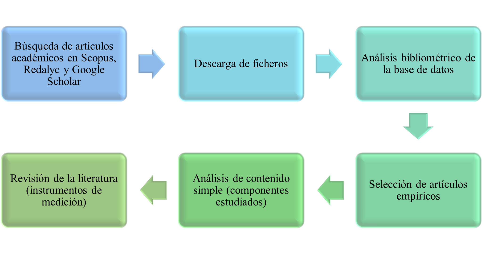
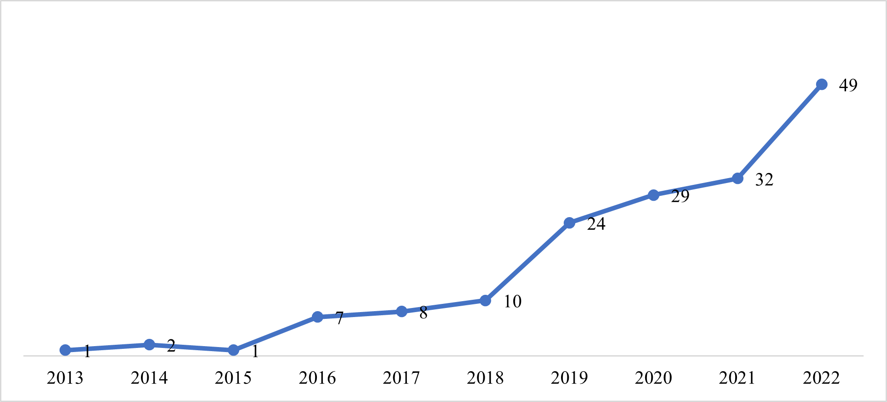

<header class="mb-4 text-sm no-indent">
    

        

            <a href="https://revistas.unjbg.edu.pe/index.php/eyn/issue/view/120" class="text-blue-600">Revista Economía & Negocios</a>
        

        
Vol. 6 Núm. 1, 2024

        

            <strong class="block pt-2">Articulo Original</strong>
        

    

    

        <h1 class="text-xl mb-0">Capacidades de análisis de big data en las empresas: una revisión sistemática de la literatura</h1>
        <h1>
            Big data analysis capabilities in companies: a systematic review of the literature
        </h1>
    

    

        

            Raul Rengifo L.*  
            *Autor de correspondencia: 
            <a href="mailto:rrengifoln@uanl.edu.mx" class="text-blue-600">rrengifoln@uanl.edu.mx</a>
        

        

            Esta obra está bajo una 
            <a href="https://creativecommons.org/licenses/by/4.0/" class="text-blue-600 underline">Licencia Creative Commons Atribución 4.0 Internacional.</a>
        

        

            Como citar: Rengifo L., R. (2024). Capacidades de análisis de big data en las empresas: una revisión sistemática de la literatura. 
            <em>Economía &amp; Negocios, 6</em>(1), 195-222. 
            <a href="https://www.doi.org/10.33326/27086062.2024.1.1946" class="underline text-blue-600">https://www.doi.org/10.33326/27086062.2024.1.1946</a>
        

        

            CÓDIGO JEL:  
            M15, O30, O33
        

    

</header>

## RESUMEN

El objetivo de la presente investigación fue realizar una revisión sistemática de los manuscritos
publicados en Scopus durante el período 2013 al 2022 sobre las BDAC en el entorno empresarial. La
presente investigación tiene un enfoque mixto con un diseño anidado concurrente en varios niveles. Se
realizó una revisión bibliométrica con el fin de revisar la evolución de las publicaciones relacionadas
con las BDAC, también se realizó una revisión documental para conocer la evolución de los componentes e
instrumentos utilizados por la literatura para abordar la medición de las BDAC en el entorno
empresarial. Los resultados muestran una tendencia creciente en la producción de publicaciones con el
término académico en estudio. Asimismo, se encontró los componentes de las BDAC más utilizados en la
literatura académica. Finalmente, el presente estudio muestra un análisis de los instrumentos de
medición para las BDAC.

**_Palabras clave:_** análisis de big data, capacidades de
análisis de big data, entorno empresarial, revisión de la literatura, revisión sistemática

## ABSTRACT

The objective of this research was to carry out a systematic review of the manuscripts published in
Scopus during the period 2013 to 2022 on BDAC in the business environment. The present research has a
mixed approach with a concurrent nested design at several levels. A bibliometric review was carried out
in order to review the evolution of publications related to the BDAC, a documentary review was also
carried out to know the evolution of the components and instruments used by the literature to address
the measurement of the BDAC in the business environment. The results show a growing trend in the
production of publications with the academic term under study. Likewise, the components of the BDAC most
used in academic literature were found. Finally, the present study shows an analysis of the measurement
instruments for the BDAC.

**_Keywords:_** big data analysis, big data analysis capabilities,
business environment, literature review, systematic review

## INTRODUCCIÓN

El big data es una de las tantas tecnologías que está en evolución constante, implementada por las
empresas con el fin de generar ventajas competitivas, valor agregado, rendimiento económico,
posicionamiento de mercado y otros (Elia et al., 2022; Liu & Mehandjiev, 2020; Yasmin et al., 2020).
Para poder entender cómo funciona el big data, surgió el análisis de big data (BDA, por sus siglas en
inglés). El BDA es un concepto que se encuentra en la cotidianidad; el concepto maneja las 5V: volumen,
velocidad, variedad, veracidad y valor de la información (Fosso et al., 2017).

La historia del BDA comienza con el almacenamiento de los datos empresariales (ADE). Esto ha desatado que
en el procesamiento de datos, que llega a gran velocidad, entre en juego varias herramientas en el
ámbito de la inteligencia empresarial y el aprendizaje automático. Sin embargo, el valor de los datos se
ha quedado en las áreas funcionales y tareas específicas, por lo que aún faltan propuestas para integrar
las actividades de big data con la gestión estratégica que permitan mejorar el rendimiento financiero de
la empresa en su conjunto. El BDA se ha aplicado a diferentes dominios de la empresa, como la gestión de
la cadena de suministro, la gestión de marketing y la gestión contable y financiera (Janssen et al.,
2017; Nguyen et al., 2018; Gepp et al., 2018; Raguseo, 2018; Cao et al., 2019; Ghasemaghaei y Calic,
2019).

De la mencionada técnica se desglosan ciertas capacidades que deben desarrollar las empresas con el fin
de optimizar el uso del big data y así generar ventajas frente a su competencia. Gupta y George (2016)
definen las capacidades de análisis de big data (BDAC, por sus siglas en inglés) como la capacidad de
una empresa para ensamblar, integrar y desplegar sus recursos específicos de big data. Van de Wetering,
Mikalef y Krogstie (2019) mencionan que estas capacidades son consideradas competencias múltiples y
complementarias que permiten a las empresas transformar sus modelos comerciales actuales y procesos de
valor agregado.

En las últimas décadas la implementación de las TIC, dentro de ellas el big data, han generado grandes
ventajas competitivas en el sector empresarial. A nivel mundial, el desarrollo del big data ha crecido
significativamente. Según Rezaee y Wang (2017) proyectaban que la industria de la tecnología y los
servicios de big data (BDA) llegarían a una tasa anual de 26.4 %, con un valor total de 41 500 millones
de dólares, presumiendo unas seis veces la tasa de crecimiento del mercado global de la tecnología de la
información. En el último informe de Finance Online (2022) se menciona que, en el periodo 2020 y 2021,
las empresas que usaron big data incrementaron sus ganancias de 8 a 10 %. Asimismo, se encontró que
aproximadamente el 60 % de empresas habría implementado las BDAC.

En este contexto, las BDAC se han vuelto más importantes tanto en el entorno empresarial como académico.
En efecto, con el fin de profundizar y ampliar las investigaciones sobre las BDAC, la academia ha
realizado revisiones de la literatura examinando el potencial e importancia que tienen las BDAC en el
entorno empresarial. Las revisiones de la literatura que se han realizado hasta el momento han revisado
las definiciones del BDA y han propuesto definiciones para las BDAC. Otras investigaciones han revisado
cuáles son las variables relacionadas a las BDAC, mientras que otras han revisado los componentes.
Asimismo, hasta el momento no se han analizado solo publicaciones que contengan el término académico en
estudio, hasta el momento no existe una revisión en español que les permita saber más sobre el término a
los países latinoamericanos.

La presente investigación busca realizar una revisión sistemática de los manuscritos publicados en Scopus
durante el período 2013 al 2022 sobre las BDAC en el entorno empresarial. Por medio de la revisión
sistemática y el análisis documentario se busca identificar los recursos más importantes cuando se
investiga las BDAC. Este artículo tiene tres bloques, en el primer bloque se realizó un análisis
cuantitativo de la búsqueda estructurada de la literatura entre 2013-2022 en las bases de Scopus,
Redalyc y Google Scholar; se identificó la tendencia, la cantidad de artículos por revista, los autores
con más publicaciones y el artículo más citado. En el segundo se realizó un análisis temático basado en
90 artículos publicados en revistas indizadas en Scopus. Finalmente, se analizó y compiló la
investigación y se mostraron los componentes y los instrumentos más utilizados para medir las BDAC en
las empresas.

Algunos autores han definido las BDAC como un enfoque holístico de análisis y procesamiento de big data
para la creación de valor en las organizaciones (Shamin et al., 2020; Fosso et al., 2017). En esta
línea, Wang et al. (2018) menciona que las BDAC se basan en la capacidad que tiene una empresa para
obtener, almacenar, procesar y analizar una gran cantidad de datos. Sabharwal y Miah (2021) agregan que
es una capacidad combinada de almacenar, procesar y analizar grandes cantidades de datos que
proporcionan información significativa a los usuarios (diversas áreas de la empresa).

Otros autores consideran las BDAC como recursos. Por su parte, Garmaki, Boughzala y Fosso (2016) indican
que es la capacidad que tiene una empresa para movilizar y utilizar los recursos de BDA de manera
efectiva, y alinear la planificación de BDA con la estrategia de la empresa para obtener una ventaja
competitiva y mejorar el desempeño de la empresa. Gupta y George (2016) agregan que es la capacidad que
tienen las empresas para realizar la combinación de recursos tangibles, humanos e intangibles para
ensamblar, integrar y desplegar sus recursos específicos de big data.

Mikalef et al. (2018) menciona que las BDAC son la capacidad de una empresa para proporcionar información
utilizando la gestión de datos, la infraestructura y el talento para transformar el negocio en una
fuerza competitiva. Dubey, Gunasekaran y Childe (2019) agregan que deben ser consideradas como
herramientas, técnicas y procesos que permiten a la organización procesar, visualizar y analizar datos,
produciendo así conocimientos que permiten la planificación operativa, la toma de decisiones y la
ejecución basadas en datos.

## MATERIAL Y MÉTODOS

La presente investigación tiene un enfoque mixto con un diseño anidado concurrente en varios niveles. Se
realizó una revisión bibliométrica con el fin de revisar la evolución de las publicaciones relacionadas
con las BDAC, también se realizó una revisión documental para conocer la evolución de los componentes e
instrumentos utilizados por la literatura para abordar la medición de las BDAC en el entorno
empresarial. En la Figura 1, se muestra el procedimiento que se empleó para el desarrollo de la revisión
sistemática y de la literatura.

  

**Figura 1**

*Proceso de recolección y análisis de información*

#### Búsqueda de artículos académicos

Para obtener los documentos que corresponden a la variable de estudio, se realizó la búsqueda en la
página de Scopus (<https://www.scopus.com/>) y se utilizó el
algoritmo: TITLE-ABS-KEY “BIG DATA ANALYTICS CAPABILITIES”. Los trabajos académicos ascendieron a 163
artículos académicos publicados en el periodo 2013 al 2022. También, se revisó si existían artículos
académicos en el Sistema de Información Científica Redalyc (<https://www.redalyc.org/>), se utilizó la herramienta de búsqueda
y se pusieron los términos: “BIG DATA ANALYTICS CAPABILITIES” y “Capacidades de Análisis de Big Data”,
periodo 2013 al 2022, el resultado ascendió a 3 artículos. Por otro lado, se consideró el motor de
búsqueda Google Académico (<https://scholar.google.es>); para la
búsqueda se utilizó la herramienta de búsqueda donde se ingresó el algoritmo: allintitle: “BIG DATA
ANALYTICS CAPABILITIES”, se filtró por año de publicación, la cantidad de publicaciones ascendió a 103
investigaciones.

#### Análisis bibliométrico

Los artículos encontrados fueron descargados en formato CSV para ser sistematizados. En un inicio se
utilizó el software Vosviewer; sin embargo, no se encontraron resultados que marcaran tendencia, esto se
debe a que el término académico recién está tomando interés académico. En este contexto, se consideró
utilizar tablas de frecuencia y gráficos de series de tiempo.

Se realizó una revisión para conocer la evolución y tendencia de la publicación de los artículos
académicos. Asimismo, se revisó qué revistas han publicado más artículos, autores con más cantidad de
publicaciones y artículos más citados. También, se consideró ver las publicaciones por países y con qué
otras variables de investigación han sido relacionadas.

#### Selección de artículos empíricos

Los artículos académicos publicados por revistas indizadas en Scopus fueron descargados para ser
revisados y diferenciados. Se revisó que los artículos cumplieran con un formato IMRD, con el fin de que
brindaran la mayor información posible. La cantidad de artículos seleccionados fueron 94.

#### Análisis de contenido simple y revisión de la literatura

Una vez seleccionados se procedió a extraer la información para la revisión de la literatura. Se procedió
a revisar las definiciones y los componentes utilizados. Asimismo, se eligieron investigaciones que
tuvieran validaciones psicométricas de los instrumentos.

## RESULTADOS

#### Análisis bibliométrico

En el 2013, se publicó un manuscrito que mencionaba por primera vez el término académico Capacidades de
Análisis de Big Data (BDAC, por sus siglas en inglés), a partir de este manuscrito en los siguientes 2
años otros académicos seguirían investigando sobre las BDAC. Sin embargo, es a partir del 2016 las
cifras de publicaciones aumentaron de forma sostenida ascendiendo a 163 artículos en total, tal como se
evidencia en el registro de Scopus (figura 2). Por otro lado, tenemos al Sistema de Información
Científica Redalyc, en este caso solo se han encontrado tres publicaciones que mencionan las BDAC, 1
artículo publicado en el 2019 y 2 publicadas en el 2020 (Redalyc, 2022).

  

**Figura 2**

*Niveles de la gestión rentable y sus dimensiones*

Nota: algoritmo utilizado TITLE-ABS-KEY (“BIG DATA
ANALYTICS CAPABILITIES”)

Las BDAC es un término académico que tiene menos de una década en la literatura académica publicada en
Scopus. En la tabla 1, se muestran las revistas académicas que tienen la mayor cantidad de artículos con
el término académico en estudio. La Technological Forecasting and Social Change es la que encabeza la
lista, la mencionada revista publica artículos que tratan directamente de la previsión tecnológica y
herramientas de planificación, ya que interrelacionan factores sociales, ambientales y tecnológicos.
Otro aspecto importante corresponde a las autorías. Hasta el momento, los autores que han investigado
las BDAC han sido Krogstie y Mikalef, cada uno con 10 artículos indizados en revistas Scopus (tabla 2).

  

**Tabla 1**

*Revistas académicas indizadas en Scopus que publicaron más estudios sobre BDAC*

| N.º | Revista                                     | Editorial     | Cantidad de artículos |
| --- | ------------------------------------------- | ------------- | --------------------- |
| 1   | Technological Forecasting and Social Change | Elsevier Inc. | 10                    |
| 2   | Journal of Business Research                | Elsevier Inc. | 9                     |
| 3   | Sustainability                              | MDPI          | 7                     |
| 4   | Information & Management                    | Elsevier B.V. | 6                     |
| 5   | Annals of Operations Research               | Springer      | 5                     |

*Nota:* algoritmo utilizado TITLE-ABS-KEY (“BIG DATA ANALYTICS
CAPABILITIES”)

  

**Tabla 2**

*Revistas académicas indizadas en Scopus que publicaron más estudios sobre BDAC*

| N.º | Autores         | Cantidad de artículos |
| --- | --------------- | --------------------- |
| 1   | Krogstie, J.    | 10                    |
| 2   | Mikalef, P.     | 10                    |
| 3   | Dubey, R.       | 7                     |
| 4   | Fosso, S.       | 7                     |
| 5   | Gunasekaran, A. | 6                     |

*Nota:* algoritmo utilizado TITLE-ABS-KEY (“BIG DATA ANALYTICS
CAPABILITIES”)

Por otro lado, tenemos el buscador académico Google Scholar; este buscador es utilizado en gran medida y
permite saber qué publicaciones son las más citadas. Utilizando el algoritmo allintitle: “BIG DATA
ANALYTICS CAPABILITIES” se encontraron 103 investigaciones. En la tabla 3, se muestran las 10
investigaciones con mayor cantidad de citas. La investigación con más citas es la de Fosso et al.
(2017); estudio empírico completo que determina el efecto de las BDCA sobre el rendimiento empresarial
en un modelo estructural.

  

**Tabla 3**

*Publicaciones sobre BDCA más citadas en Google Scholar*

| N.º | Autores                                        | Título                                                                                                                                                                                     | Revista                                       | Año  | Citas |
| --- | ---------------------------------------------- | ------------------------------------------------------------------------------------------------------------------------------------------------------------------------------------------ | --------------------------------------------- | ---- | ----- |
| 1   | Fosso, Gunasekaran, Akter, Ren, Dubey y Childe | Big data analytics and firm performance: Effects of dynamic capabilities                                                                                                                   | Journal of Business Research                  | 2017 | 1347  |
| 2   | Wang, Kung y Byrd                              | Big data analytics: Understanding its capabilities and potential benefits for healthcare organizations                                                                                     | Technological forecasting and social change   | 2018 | 1229  |
| 3   | Mikalef, Pappas, Krogstie y Giannakos          | Big data analytics capabilities: a systematic literature review and research agenda                                                                                                        | Information Systems and e-Business Management | 2018 | 604   |
| 4   | Mikalef, Krogstie, Pappas y Pavlou             | Exploring the relationship between big data analytics capability and competitive performance: The mediating roles of dynamic and operational capabilities                                  | Information & Management                      | 2020 | 364   |
| 5   | Arunachalam, Kumar y Kawalek                   | Understanding big data analytics capabilities in supply chain management: Unravelling the issues, challenges, and implications for practice                                                | Logistics and Transportation Review           | 2018 | 355   |
| 6   | Ferraris, Mazzoleni, Devalle y Couturier       | Big data analytics capabilities and knowledge management: impact on firm performance                                                                                                       | Management Decision                           | 2018 | 322   |
| 7   | Mikalef, Boura, Lekakos y Krogstie             | Big data analytics capabilities and innovation: the mediating role of dynamic capabilities and moderating effect of the environment                                                        | British Journal of Management                 | 2019 | 256   |
| 8   | Bag, Pretorius, Gupta y Dwivedi                | Role of institutional pressures and resources in the adoption of big data analytics powered artificial intelligence, sustainable manufacturing practices and circular economy capabilities | Technological Forecasting and Social Change   | 2021 | 173   |
| 9   | Rialti, Zollo, Ferraris y Alon                 | Big data analytics capabilities and performance: Evidence from a moderated multi-mediation model                                                                                           | Technological Forecasting and Social Change   | 2019 | 160   |
| 10  | Ciampi, Demi, Magrini, Marzi y Papa            | Exploring the impact of big data analytics capabilities on business model innovation: The mediating role of entrepreneurial orientation                                                    | Journal of Business Research                  | 2021 | 124   |

*Nota:* algoritmo utilizado allintitle: “BIG DATA ANALYTICS CAPABILITIES”

Se encontró 163 artículos publicados en el periodo 2013 - 2022 en Scopus. De los cuales 4 artículos no se
encontraron: 2 eran conferencias sin autor, 1 artículo del 2014 y 1 artículo del 2022. Por tanto, se
consideró realizar el análisis temático en base a los 159 artículos restantes. Se encontraron 115
artículos empíricos, 21 artículos que plantean propuestas de aplicaciones en empresas y 23 artículos que
han realizado revisiones de la literatura.

La academia internacional ha evidenciado cómo actúan las BDAC en diferentes tipos de empresas (grandes,
medianas y pequeñas empresas) y en diversos sectores económicos (educación, salud, energía,
telecomunicaciones, finanzas, turismo y otros). Asimismo, se han realizado investigaciones empíricas,
las cuales han analizado datos en diversos países como: Alemania, Estados Unidos, Grecia, Italia, Japón,
Noruega, Reino Unido, China, India, Jordania, Pakistán, Sudáfrica, y Tailandia (tabla 4).

  

**Tabla 4**

*Investigaciones empíricas según países*

| Países         | Autores                                                                                                   |
| -------------- | --------------------------------------------------------------------------------------------------------- |
| Alemania       | Van De Wetering, Mikalef y Krogstie (2019a)                                                               |
| China          | Zhang et al. (2022), Cai, Lu y Chen (2022), Song et al. (2022); Sun y Liu (2020); Liu y Mehandjiev (2020) |
| Estados Unidos | Hao, Zhang y Song (2019), Akter et al. (2016)                                                             |
| Grecia         | Mikalef et al. (2019a), (2019b)                                                                           |
| India          | Singh et al. (2021), Dubey, Gunasekaran y Childe (2019)                                                   |
| Italia         | Ferraris et al. (2019)                                                                                    |
| Japón          | Kamioka, Hosoya y Tapanainen (2017)                                                                       |
| Jordania       | Al-Jaafreh y Fayoumi (2017), Fosso et al. (2017)                                                          |
| Malasia        | Munodawafa y Johl (2019)                                                                                  |
| Noruega        | Slettli (2022)                                                                                            |
| Pakistán       | Naz, Ul Haq y Nasir (2022)                                                                                |
| Reino Unido    | Rialti et al. (2019)                                                                                      |
| Sudáfrica      | Moseneke y Brown (2022)                                                                                   |
| Tailandia      | Limpeeticharoenchot et al. (2020), Sutduean, Sutduean y Jermsittiparsert (2019), Kerdpitak et al. (2019)  |

*Nota:* algoritmo utilizado allintitle: “BIG DATA ANALYTICS CAPABILITIES”

Por otro lado, las BDAC, en los últimos años, están siendo ampliamente reconocidas por cumplir un papel
importante en el entorno empresarial. Las BDAC se han aplicado a diferentes dominios de la empresa, como
la gestión de la cadena de suministro, la gestión de marketing y la gestión contable y financiera. La
academia hasta el momento ha evidenciado la relación de las BDAC con la innovación, cadena de
suministro, desempeño de la empresa y las ventajas competitivas, en mayor proporción (tabla 5). Sin
embargo, también han visto el desempeño de mercado, creación de valor, estrategias organizacionales,
desarrollo competitivo y otros temas de forma esporádica.

  

**Tabla 5**

*Principales variables relacionadas a las BDAC*

| Términos de búsqueda                                           | Cant. | Algunos autores                                                                                                                                   |
| -------------------------------------------------------------- | ----- | ------------------------------------------------------------------------------------------------------------------------------------------------- |
| BDAC AND Innovation (Trad. Innovación)                         | 26    | AL-Jaafreh y Fayoumi (2017), Mikalef et al. (2018), Mikalef et al. (2019b), (2020), Ji et al. (2022).                                             |
| BDAC AND “Supply Chain” (Trad: Cadena de suministros)          | 28    | Dubey et al. (2019), Bhatti et al. (2021), Srimarut, y Mekhum (2020), Dubey et al. (2022), Zhu et al. (2022).                                     |
| BDAC AND “Firm Performance” (Trad: Desempeño de la empresa)    | 12    | Akter et al. (2016), Fosso et al. (2017), Ferraris et al. (2019), Liu y Mehandjiev (2020), Gu et al. (2021), Naz, Ul Haq y Nasir (2022).          |
| BDAC AND “competitive advantage” (Trad: Ventajas competitivas) | 5     | Kamioka, Hosoya y Tapanainen (2017), Sutduean, Sutduean, y Jermsittiparsert (2019), Akter et al. (2020), Behl et al. (2022), Horng et al. (2022). |

*Nota:* allintitle: “BIG DATA ANALYTICS CAPABILITIES”

#### Análisis Temático

##### Estudios previos de las BDAC

Como se ha mencionado las BDAC se han aplicado en diversos entornos empresariales, siendo los temas más
investigados cómo las BDAC inciden en el desempeño empresarial, cadena de suministros y ventajas
competitivas.

**Desempeño empresarial**

Después de elaborar un análisis de acuerdo con los estudios realizados por Akter et al. (2016), Mikalef
et al. (2019a) y Naz (2022), se puede decir que las BDAC son una herramienta cada vez más importante
para mejorar el rendimiento de las empresas, las cuales son utilizadas para compilar, obtener, almacenar
y analizar grandes cantidades de datos para ayudar a las organizaciones a tener una mejor comprensión de
los mercados, sus clientes y sus procesos de negocio. Este es un factor que les permite a las empresas
tomar decisiones mejor informadas y de la misma manera su rendimiento progresa. Investigaciones
recientes como las de Gu et al. (2021) y Yasmin et al. (2020) han demostrado que el uso adecuado de las
BDAC y la alineación de estas, con una herramienta de estrategia de negocio eficaz, puede provocar un
efecto significativo en el rendimiento de la empresa. Por lo tanto, se muestra la importancia de tener
en cuenta los beneficios potenciales que puede traer las BDAC al implementarla para favorecer el
rendimiento de las capacidades dinámicas de la compañía.

En ese mismo sentido, el uso de las BDAC puede mejorar el rendimiento de la empresa alineando la
estrategia de negocios. Esto se debe a que una vez que una empresa tenga acceso a la capacidad de
análisis de datos sin precedentes ofrecida por las BDAC, podrá obtener información y conocimiento que le
permitirá tomar decisiones informadas y mejorar su beneficio (Garmaki et al., 2016; Ferraris et al.,
2019). Además, las BDAC también pueden ayudar a las empresas a desarrollar sus capacidades dinámicas
para adaptarse mejor al entorno comercial cambiante (Fosso et al., 2020). Estas capacidades dinámicas
mejoran la capacidad de la empresa para manejar conocimientos clave, lo que a su vez puede mejorar la
utilidad de esta. Las BDAC también pueden ayudar a las empresas a aprovechar la innovación (Arias-Pérez
et al., 2022).

De acuerdo con los razonamientos que se han venido realizando, se puede aseverar que las bondades de las
BDAC se logran mediante el uso de las capacidades dinámicas de análisis de datos, capacidades de
marketing estratégico, capacidades de gestión de conocimiento y un enfoque de toma de decisiones
multicriterio, en el desarrollo de las empresas (Liu & Mehandjiev, 2020). Estas capacidades pueden
ayudar a las compañías a optimizar su rendimiento al desarrollar relaciones con sus proveedores, adoptar
una innovación abierta y aprovechar los entornos dinámicos (Arias-Pérez et al., 2022).

De manera semejante, las BDAC han demostrado ser una herramienta valiosa para mejorar los resultados
financieros, la innovación y el desempeño estratégico de una empresa. Estudios recientes han demostrado
que el nivel de las BDAC de una empresa puede tener un impacto significativo en su desempeño, ya que les
permite tomar decisiones informadas y mejorar su eficiencia operativa (Anfer & Fosso, 2019). Además,
el desarrollo de proveedores, la innovación abierta y la dinámica ambiental pueden también tener un
impacto en el desempeño de la empresa a través de las BDAC (Elazhary & Morelli, 2020).

**Cadena de Suministro**

En este mismo orden y dirección, las BDAC son una herramienta fundamental para mejorar la cadena de
suministros, esto se debe a que proporciona una capacidad para el análisis de grandes cantidades de
datos, lo que permite a las empresas tomar decisiones informadas sobre el diseño, la implementación y el
mantenimiento de la cadena de suministro (Shahzad et al., 2022; Singh et al., 2021; Yu et al., 2021b).
Esto se puede lograr mediante el uso de técnicas de análisis avanzadas como el aprendizaje automático y
la minería de datos. Las BDAC también se pueden utilizar para mejorar la eficiencia de la cadena de
suministro, aumentar la velocidad de entrega, reducir los costos de inventario y aumentar la
satisfacción del cliente.

Además, las BDAC pueden ayudar a las empresas a identificar y gestionar los riesgos de la cadena de
suministro, lo que contribuye a la resiliencia de la cadena de suministro en la economía global (Dubey
et al., 2022). Por último, las BDAC también pueden contribuir a la sostenibilidad de la cadena de
suministro, ya que permiten a las empresas monitorear y mejorar el desempeño ambiental y social (Dubey,
2021). En resumen, las BDAC son una herramienta importante para mejorar la cadena de suministros, ya que
proporciona capacidades para el análisis de grandes cantidades de datos, lo que permite a las empresas
tomar decisiones informadas, mejorar la eficiencia de la cadena de suministro, identificar y gestionar
riesgos y contribuir a la sostenibilidad de la cadena de suministro (Jaouadi, 2022).

Con referencia a lo anterior, las capacidades clave de las BDAC según los artículos mencionados incluyen:
análisis de datos, colaboración, rápida confianza, flexibilidad organizacional, gestión de las cadenas
de suministro externas, excelencia operacional, responsabilidad social corporativa, gestión de cadenas
de suministro verdes, teoría de capacidades dinámicas, alineación de información, finanzas de las
cadenas de suministro, cultura de toma de decisiones basada en datos, integración de cadenas de
suministro verdes, capital intelectual verde, satisfacción de la planificación de la cadena de
suministro, rendimiento de la cadena de suministro, inteligencia artificial, resiliencia de la cadena de
suministro, innovación de la cadena de suministro, producción verde, reputación corporativa y cadenas de
suministro agroalimentarias circulares (Perçin, 2022; Waqas &Tan, 2022; Yu, 2021a; Zhu et al.,
2022).

**Ventajas Competitivas**

Resulta oportuno mencionar que las BDAC ofrecen una serie de beneficios a las empresas. En primer lugar,
permite a las empresas tomar decisiones mejor informadas con una mayor premura, así como aprovechar las
oportunidades en el mercado con mayor rapidez (Akter et al., 2020). Además, mejora la innovación, la
eficiencia empresarial y por consecuencia el desempeño de la empresa a largo plazo (Behl et al., 2022) y
ayuda a las empresas a identificar tendencias en el mercado y descubrir nuevas maneras de mejorar sus
productos y servicios. (Horng et al., 2022).

De la misma manera, Kamioka et al. (2017) establece que las capacidades de los usuarios han pasado a
ocupar una posición integral en la ventaja competitiva de las empresas, y las ha denominado “capacidades
informáticas de los usuarios”. Las BDAC se han relacionado con el rendimiento y la ventaja competitiva
de las empresas (Fosso et al. 2017). Según Kamioka et al. (2017), las BDAC tienen una relación positiva
con el rendimiento de la analítica de bases de datos y la ventaja competitiva y esto es aplicable a
cualquier tipo de empresa. El big data permite a las empresas explorar los patrones imprevistos de sus
clientes, negocios y mercados, al tiempo que mejoran su comprensión del comportamiento de los clientes,
que es uno de los elementos que le permite incrementar su ventaja competitiva (Horng et al., 2022).

##### Componentes de las BDAC

Es importante considerar que las BDAC han sido estudiadas con diferentes componentes. A lo largo del
tiempo de estudio, se observa que los autores han intentado definir los componentes básicos de las BDAC
de las empresas, es decir, los recursos que son necesarios para construirlas.

Los académicos se han dividido en dos grandes grupos. Por un lado, tenemos a los académicos que
consideran que las BDAC que requieren las empresas son las de gestión, tecnológica o infraestructura y
talento humano (tabla 6). Mientras que otro grupo de académicos consideran que las BDAC se deben dividir
en capacidades tangibles, habilidades humanas e intangibles (tabla 7). Cabe resaltar que estas
capacidades han sido construidas basándose en su mayor parte por la Teoría Basada en Recursos.

  

**Tabla 6**

*Autores que consideran los componentes de gestión, tecnología y/o talento humano*

| Autor                                  | Gestión | Tecnológica / infraestructura | Talento humano |
| -------------------------------------- | ------- | ----------------------------- | -------------- |
| Akter et al. (2016)                    | x       | x                             | x              |
| Garmaki et al. (2016)                  | x       | x                             | x              |
| Fosso et al. (2017)                    | x       | x                             | x              |
| Al-Jaafreh y Fayoumi (2017)            |         | x                             | x              |
| Kamioka, Hosoya y Tapanainen (2017)    | x       | x                             | x              |
| Hooi, Abu y Rahim (2018)               | x       | x                             | x              |
| Dubei et al. (2019a)                   |         | x                             |                |
| Kerdpitak et al. (2019)                | x       |                               |                |
| Dubey, Gunasekaran y Childe (2019)     |         | x                             |                |
| Ferratis et al. (2019)                 | x       | x                             |                |
| Bag y Telukdarie (2019)                | x       |                               | x              |
| Hao, Zhang y Song (2019)               |         | x                             | x              |
| Munodawafa y Johl (2019)               | x       | x                             | x              |
| Rialti et al. (2019)                   | x       | x                             | x              |
| Lin y Kunnathur (2019)                 |         | x                             |                |
| Bag et al. (2020)                      | x       |                               | x              |
| Kumar, Maher y Ngai (2020)             |         | x                             | x              |
| Wang, Zhang y Zhang (2020)             |         | x                             |                |
| Yasmin et al. (2020)                   | x       | x                             | x              |
| Ramadan et al. (2020)                  |         | x                             |                |
| Zhang, Song y He (2020)                |         | x                             |                |
| Shamim et al. (2020)                   |         |                               | x              |
| Sun y Liu (2020)                       | x       | x                             |                |
| Lee (2020)                             | x       | x                             | x              |
| Limpeeticharoenchot et al. (2020)      | x       | x                             | x              |
| Upadhyay y Kumar (2020)                | x       | x                             |                |
| Park, Noh y Lee (2020)                 |         | x                             |                |
| Albergaria y Chiappetta (2020)         | x       | x                             | x              |
| Akter et al. (2020)                    | x       | x                             | x              |
| Dubey et al. (2021)                    |         | x                             |                |
| Yu et al. (2021a)                      |         | x                             |                |
| Yu et al (2021b)                       |         | x                             |                |
| Razaghi y Shokouhyar (2021)            | x       |                               |                |
| Teoh et al. (2021)                     | x       | x                             |                |
| Gu et al. (2021)                       |         | x                             |                |
| Awan et al. (2021)                     |         |                               | x              |
| Bhatti et al. (2021)                   |         | x                             |                |
| Islam et al. (2021)                    |         |                               | x              |
| Stekelorum et al. (2021)               |         | x                             |                |
| Dubey et al. (2021)                    |         | x                             |                |
| Khamis et al. (2021)                   |         | x                             | x              |
| Dubey et al. (2022)                    |         | x                             |                |
| Al-Khatib y Shuhaiber (2022)           | x       | x                             | x              |
| Song et al. (2022)                     | x       | x                             |                |
| Bahrami y Shokouhyar (2022)            |         | x                             |                |
| Shahzad et al. (2022)                  | x       | x                             | x              |
| Bhatti et al. (2022)                   |         | x                             |                |
| Mohamed (2022)                         | x       | x                             | x              |
| Nisar et al. (2022)                    | x       | x                             | x              |
| Arias, Coronado y Perdomo (2022)       |         |                               | x              |
| Ciasullo, Montera y Douglas (2022)     |         | x                             | x              |
| Khan, Tao y Li (2022)                  |         | x                             | x              |
| Yu et al. (2022)                       |         | x                             | x              |
| Moseneke y Brown (2022)                |         | x                             | x              |
| Al-Darras y Tanova (2022)              | x       | x                             | x              |
| Uddin, Cetindamar y Chakraborty (2022) | x       | x                             | x              |
| Chen et al. (2022)                     |         |                               | x              |
| Edu (2022)                             | x       |                               |                |
| Song et al. (2022)                     |         | x                             | x              |
| Mehta y Shukla (2022)                  | x       | x                             | x              |
| Behl et al. (2022)                     | x       | x                             | x              |
| Horng et al. (2022)                    | x       |

**Fuente:** [Google Scholar](https://scholar.google.com/scholar?hl=es&as_sdt=0%2C5&q=autores+de+la+regi%C3%B3n+Lima&btnG=)

  

**Tabla 7**

*Autores que consideran los componentes tangibles, habilidades humanas e intangibles*

| Autor                                       | Tangibles | Habilidades humanas | Intangibles |
| ------------------------------------------- | --------- | ------------------- | ----------- |
| Gupta y George (2016)                       | x         | x                   | x           |
| Mikalef et al. (2018)                       | x         | x                   | x           |
| Lozada, Arias-Pérez y Perdomo-Charry (2019) | x         | x                   | x           |
| Mikalef et al. (2019a)                      | x         | x                   | x           |
| Mikalef et al. (2019b)                      | x         | x                   | x           |
| Srimarut, y Mekhum (2020)                   | x         | x                   | x           |
| Liu y Mehandjiev (2020)                     | x         | x                   | x           |
| Mikalef et al. (2020a)                      | x         | x                   | x           |
| Schlegel, Birkel y Hartmann (2020)          | x         | x                   | x           |
| Mikalef et al. (2020b)                      | x         | x                   | x           |
| Ciampi et al. (2021)                        | x         | x                   | x           |
| Henao-García, Arias-Pérez y Lozada (2021)   | x         | x                   | x           |
| Danielsen, Olsen, Augustin (2021)           | x         | x                   | x           |
| Elia et al. (2022)                          | x         | x                   | x           |

**Fuente:** [Google Scholar](https://scholar.google.com/scholar?hl=es&as_sdt=0%2C5&q=autores+de+la+regi%C3%B3n+Lima&btnG=)

  
Por otro lado, tenemos al grupo de investigadores que han estudiado otras capacidades. Estas BDAC varían
de acuerdo con el contexto en el que fueron aplicadas y/o acompañadas de las BDAC más conocidas
(gestión, tecnológica o infraestructura, talento humano tangibles, habilidades humanas, e intangibles).
Cabe resaltar que las BDAC operacionales han sido utilizadas por otros investigadores (Hooi, Abu &
Rahim, 2018; Kerdpitak et al., 2019; Lin & Kunnathur, 2019; Al-Khatib & Shuhaiber, 2022; Edu,
2022) y acompañadas de otras BDAC más conocidas en la literatura (tabla 8).

  

**Tabla 8**

*Otros componentes propuestos por la academia*

| Autores                                  | Otras capacidades                                           |
| ---------------------------------------- | ----------------------------------------------------------- |
| Garmaki et al. (2016)                    | Red relacional                                              |
| AL-Jaafreh y Fayoumi (2017)              | Infraestructura de relaciones                               |
| Kamioka, Hosoya y Tapanainen (2017)      | Utilizados con otros nombres                                |
| Wang y Hajli (2017)                      | Trazabilidad, analítica, apoyo a la decisión, predictiva    |
| Wang et al. (2018)                       | Trazabilidad, analítica, apoyo a la decisión, predictiva    |
| Kerdpitak et al. (2019)                  | Financiera, relaciones intangibles                          |
| Madhlangobe y Wang (2019)                | Percibida, entrenamiento, experiencia, educación            |
| Lin y Kunnathur (2019)                   | De estrategia                                               |
| Kumar, Maher y Ngai (2020)               | Política organizacional, integración global, sostenibilidad |
| Elazhary y Morelli (2020)                | De detección, De respuesta                                  |
| Limpeeticharoenchot et al. (2020)        | Medio ambiente                                              |
| Danielsen, Olsen, Augustin (2021)        | Operacional                                                 |
| Khan, Tao y Li (2022)                    | Negociación                                                 |
| Moseneke y Brown (2022)                  | Inversión y tiempo, cultura, estrategia, gobernanza         |
| Olabode, Boso, Hultman y Leonidou (2022) | Volumen, variedad y velocidad                               |
| Al-Darras y Tanova (2022)                | Cultura de manejo de datos, aprendizaje organizacional      |
| Mehta y Shukla (2022)                    | Relacional                                                  |

**Fuente:** [Google Scholar](https://scholar.google.com/scholar?hl=es&as_sdt=0%2C5&q=autores+de+la+regi%C3%B3n+Lima&btnG=)
  

##### Mediciones de las BDAC

Hasta el momento, la literatura ha encontrado que las BDAC han sido medidas en su mayoría por
instrumentos desarrollados por Gupta y George (2016), Akter et al. (2016) y Fosso et al. (2017).

En la tabla 9 se muestra el resumen de los instrumentos de medición más utilizados hasta el momento.
Asimismo, se presentan algunas características de los instrumentos.

  

**Tabla 9**

*Instrumentos de medición*

<table>
    <thead>
        <tr>
            <th scope="col" rowspan="2">Autores</th>
            <th scope="col" rowspan="2">Dimensiones</th>
            <th scope="col" rowspan="2">N.º de ítems</th>
            <th scope="col" rowspan="2">Fiabilidad</th>
            <th scope="col" colspan="2">Validez</th>
            <th scope="col" rowspan="2">Participantes</th>
        </tr>
        <tr>
            <th scope="col">Convergente</th>
            <th scope="col">Discriminante</th>
        </tr>
    </thead>
    <tbody>
        <tr>
            <td rowspan="3">Gupta y George (2016)</td>
            <td>Recursos tangibles</td>
            <td>10</td>
            <td>α &gt; .706</td>
            <td>R2 = 0.84</td>
            <td rowspan="3">Evaluados mediante el criterio de Fornell-Larcker y cargas cruzadas</td>
            <td rowspan="3">232 representantes de diversas industrias (director de información, director
                de tecnología, vicepresidente de tecnología, director de TI y gerentes de análisis)</td>
        </tr>
        <tr>
            <td style="text-align: center;">Recursos humanos</td>
            <td>11</td>
            <td>α &gt; .706</td>
            <td>R2 = 0.91</td>
        </tr>
        <tr>
            <td style="text-align: center;">Recursos intangibles</td>
            <td>10</td>
            <td>α &gt; .706</td>
            <td>R2 = 0.88</td>
        </tr>
        <tr style="border-top: 1px solid #000;">
            <td rowspan="3">Akter et al. (2016)</td>
            <td>Capacidad de gestión</td>
            <td>16</td>
            <td>α = .96</td>
            <td>AVE = .635</td>
            <td rowspan="3">Evaluados mediante el criterio de Fornell-Larcker y cargas cruzadas</td>
            <td rowspan="3">152 analistas y profesionales que utilizan big data</td>
        </tr>
        <tr>
            <td style="text-align: center;">Capacidad tecnológica</td>
            <td>12</td>
            <td>α = .93</td>
            <td>AVE = .600</td>
        </tr>
        <tr>
            <td style="text-align: center;">Capacidad de talento humano</td>
            <td>16</td>
            <td>α = .97</td>
            <td>AVE = .722</td>
        </tr>
        <tr style="border-top: 1px solid #000;">
            <td rowspan="3">Fosso et al. (2017)</td>
            <td>Capacidad de infraestructura</td>
            <td>11</td>
            <td>α &gt; .706</td>
            <td>R2 = 0.92</td>
            <td rowspan="3">Evaluados mediante el criterio de Fornell-Larcker</td>
            <td rowspan="3">297 gerentes de tecnología de información y analistas de negocios chinos
            </td>
        </tr>
        <tr>
            <td style="text-align: center;">Capacidad de gestión</td>
            <td>21</td>
            <td>α &gt; .706</td>
            <td>R2 = 0.86</td>
        </tr>
        <tr>
            <td style="text-align: center;">Capacidad del experticia del personal</td>
            <td>17</td>
            <td>α &gt; .706</td>
            <td>R2 = 0.93</td>
        </tr>
        <tr style="border-top: 1px solid #000;">
            <td>Dubey et al. (2018)</td>
            <td>Unidimensional</td>
            <td>5</td>
            <td>α &gt; .70</td>
            <td>AVE = .58</td>
            <td>No presenta</td>
            <td>173 analistas, gerentes, directores y vicepresidentes</td>
        </tr>
        <tr style="border-top: 1px solid #000;">
            <td>Lin y Kunnathur (2019)</td>
            <td>Unidimensional</td>
            <td>16</td>
            <td>α &gt; .70</td>
            <td colspan="2">No especifica. Sin embargo, muestra datos de un AFC del modelo completo.
            </td>
            <td>251 gerentes de diversas áreas</td>
        </tr>
        <tr style="border-top: 1px solid #000;">
            <td>Hao, Zhang y Song (2019)</td>
            <td>Unidimensional</td>
            <td>5</td>
            <td>α &gt; .706</td>
            <td>Cargas factoriales: EE. UU. = .785 a .824 China = .656 a .787</td>
            <td>No presenta</td>
            <td>477 proyectos de innovación de servicios en EEUU y 632 proyectos de innovación de
                servicios en China</td>
        </tr>
        <tr style="border-top: 1px solid #000;">
            <td rowspan="3">Upadhyay y Kumar (2020)</td>
            <td>Capacidad de infraestructura</td>
            <td>11</td>
            <td>α = .98</td>
            <td rowspan="3">AVE = .80</td>
            <td rowspan="3">No presenta</td>
            <td rowspan="3">400 estudiantes con más de 6 años de experiencia laboral relacionada con BDA
                y 400 gerentes de TI y analistas comerciales de diferentes empresas</td>
        </tr>
        <tr>
            <td>Capacidad de gestión</td>
            <td>20</td>
            <td>CR = .95</td>
        </tr>
    </tbody>
    <tfoot>
    </tfoot>
</table>

*Fuente:* Politecnico de Madrid

  
El instrumento propuesto por Gupta y George (2016) consta de 31 ítems. Los autores consideran que la
variable BDAC es una variable multidimensional y está compuesta por tres dimensiones: recursos tangibles
(10 ítems), recursos humanos (11 ítems) y recursos intangibles (10 ítems). Asimismo, explican que la
variable BDAC es una variable de tercer orden y es formativa, compuesta por los recursos tangibles,
humanos e intangibles, las cuales son consideradas variables de segundo orden, ya que los recursos
tangibles están compuestos por la data, la tecnología y los recursos básicos y son consideradas
subdimensiones formativas; los recursos humanos están conformadas por subdimensiones reflectivas
(habilidades gerenciales y habilidades técnicas), al igual que los recursos intangibles (cultura de
manejo de datos e intensidad del aprendizaje organizacional). Por medio de la técnica estadística del
SEM-PLS se revisó la fiabilidad de los constructos reflectivos: habilidades gerenciales (α = .87),
habilidades técnicas (α = .89), cultura de manejo de datos (α = .86), e intensidad del aprendizaje
organizacional (α = .92). Asimismo, se realizó la validez discriminante en los mencionados constructos,
mediante el criterio de Fornell-Larcker y cargas cruzadas. Por otro lado, se evaluó la validez
convergente de los constructos formativos: data (R2 = 0.78), tecnología (R2 = 0.70), recursos básicos
(R2 = 0.88), así como de las dimensiones de segundo orden: recursos tangibles (R2 = 0.84), recursos
humanos (R2 = 0.91) y recursos intangibles (R2 = 0.88). Cabe resaltar que el documento presenta todos
los ítems en el apéndice A.

Por otro lado, tenemos el instrumento que propone Akter et al. (2016), que está compuesto por 44 ítems,
el cual mide las capacidades de gestión, tecnología y talento humano. Los constructos del modelo se
midieron utilizando escalas Likert de 7 puntos. Los autores consideraron que la variable BDAC es una
variable multidimensional de tercer orden, compuesta por la capacidad de gestión, tecnología y talento
humano. A su vez, estas dimensiones son de segundo orden. La capacidad de gestión la componen cuatro
subdimensiones: planeación (4 ítems), toma de decisiones (4 ítems), coordinación (4 ítems) y control (4
ítems); la capacidad tecnológica está compuesta por: conectividad (4 ítems), compatibilidad (4 ítems) y
modularidad (4 ítems), y la capacidad de talento humano también se compone de cuatro subdimensiones:
conocimiento técnico (4 ítems), conocimientos de gestión tecnológica (4 ítems), conocimiento del negocio
(4 ítems) y conocimiento relacional (4 ítems). Por medio de la técnica estadística SEM-PLS, se evaluaron
los 11 constructos por separado, la fiabilidad por medio del alfa de Cronbach; los alfa estuvieron por
encima del mínimo esperado (α > .706), la validez convergente fue medida con el AVE, en todos los
casos se superó el mínimo esperado (AVE = .50), los valores estuvieron entre .60 y .72; en el caso de la
validez discriminante los constructos cumplieron los criterios del Fornell - Larcker.

El instrumento propuesto por Fosso et al. (2017) estuvo conformado por 49 ítems, los constructos del
modelo se midieron utilizando escalas Likert de 7 puntos (totalmente en desacuerdo - totalmente de
acuerdo). Los autores consideraron que la variable BDAC es una variable multidimensional de tercer
orden, compuesta por la capacidad de infraestructura, gestión y experticia del personal. A su vez estas
dimensiones son de segundo orden: la capacidad de infraestructura está compuesta por: conectividad (4
ítems), compatibilidad (3 ítems) y modularidad (4 ítems); la capacidad de gestión la componen cuatro
subdimensiones: planeación (4 ítems), toma de decisiones (5 ítems), coordinación (4 ítems) y control (8
ítems), y la capacidad de experticia del personal también se compone de cuatro subdimensiones:
conocimiento técnico (5 ítems), conocimientos de gestión tecnológica (4 ítems), conocimiento del negocio
(4 ítems) y conocimiento relacional (4 ítems). Por medio de la técnica estadística SEM-PLS se evaluó la
fiabilidad y validez de los constructos. Los autores evaluaron los 11 constructos por separado, la
fiabilidad por medio del alfa de Cronbach; los alfa estuvieron por encima del mínimo esperado
(α > .706), la validez convergente fue medida con el R2, en todos los casos se superó el 80 %, los
valores estuvieron entre .71 y .83; en el caso de la validez discriminante, los constructos cumplieron
los criterios del Fornell - Larcker. El instrumento utilizado en la investigación se encuentra en la
tabla 3 del documento.

Otro instrumento de medición que es muy utilizado en la literatura es el de Dubey et al. (2018), que
proponen 5 ítems para medir las BDAC. Cabe resaltar que los ítems fueron obtenidos de la investigación
de Akter et al. (2016) y Srinivasan y Swink (2017). El constructo fue unidimensional y se enfocaba en la
dimensión de tecnología. Los autores utilizaron la técnica estadística SEM-PLS para determinar la
fiabilidad, validez convergente y validez discriminante del constructo de la variable. Para mejorar la
validez convergente, las cargas factoriales eran significativas, excepto por 2 ítems. Retirando los
ítems se encontró un AVE de 0.58

Lin y Kunnathur (2019) crearon una escala de 16 ítems que midieron las operaciones de big data, la
actualización de la infraestructura de TI, el análisis avanzado y los usos estratégicos de big data. La
escala mostró unidimensionalidad; la fiabilidad del constructo reportó valores α = 0.92 y fiabilidad
compuesta = 0.93, ambos valores sobrepasaron el mínimo esperado. Por otro lado, Hao, Zhang y Song (2019)
plantearon un instrumento de 5 ítem, el cual se basó en la investigación de Gupta y George (2016). Los
ítems tenían una escala de medición de 10 puntos (0 = sin capacidad; 10 = nivel muy alto de capacidad).
En cuanto, a la fiabilidad del instrumento, los coeficientes alfa de BDAC reportados fueron de .803 para
la muestra de EE. UU. y 0.767 para la muestra de China. En cuanto a la validez convergente, los ítems
reportaron cargas factoriales de .785 a .824 en la muestra de EE. UU. y .656 a .787 en la muestra de
China.

## CONCLUSIONES

El análisis de big data está en constante evolución y se ha convertido en una herramienta vital para las
empresas que buscan generar ventajas competitivas y mejorar su rendimiento financiero. Las capacidades
de análisis de big data son competencias múltiples y complementarias que permiten a las empresas
transformar sus modelos comerciales y procesos de valor agregado. La importancia de las capacidades de
análisis de big data se ha vuelto cada vez más evidente tanto en el entorno empresarial como académico,
lo que ha llevado a un mayor interés en la investigación y el desarrollo de estas capacidades.

El objetivo de la presente investigación fue realizar una revisión sistemática de los manuscritos
publicados en Scopus durante el período 2013 al 2022 sobre las BDAC en el entorno empresarial. Por medio
de la revisión sistemática y el análisis documentario para identificar los recursos y/o componentes más
utilizados para el estudio de las BDAC en las empresas.

Se encontró que en el periodo 2013 al 2022, se han publicado 163 artículos con el término académico “Big
Data Analitics Capabilities” en la base de datos de Scopus. Cabe resaltar que el término traducido al
español se utiliza esporádicamente. Asimismo, se ha encontrado que la investigación de Fosso et al.
(2017) es la más citada según el buscador Google Scholar; esto tiene coherencia ya que hay artículos
empíricos que han basado sus instrumentos de medición en esta investigación y también es utilizada como
referencia debido a la profundización del desarrollo de las definiciones de cada capacidad de BDA.

En cuanto a las variables de investigación que se relacionan con las BDAC, se encontraron las variables:
innovación, cadena de suministro, rendimiento empresarial y ventajas competitivas. En este sentido las
investigaciones han encontrado que existe un impacto positivo de las BDAC sobre la cadena de suministro,
rendimiento empresarial y ventajas competitivas. Mientras que por el lado de la variable innovación se
ha revisado la causalidad de la innovación sobre las BDAC y viceversa.

En este sentido, se desarrolló un análisis de estudios previos. Los artículos sugieren que las BDAC son
una herramienta importante para alcanzar el éxito en proyectos de desarrollo sostenible y estas están
relacionadas con un rendimiento de mercado mejorado, un mejor desempeño organizacional, una mejor toma
de decisiones y una mayor agilidad. Además, las BDAC se consideran una clave para mejorar el desempeño
competitivo y la eficiencia operacional. Por lo tanto, las empresas deben desarrollar y mejorar sus
capacidades de análisis de big data para alcanzar el éxito en sus proyectos de desarrollo sostenible
(Islam et al., 2021; Mikalef et al., 2020; Song et al., 2022).

Otro punto importante del presente estudio es la revisión de componentes que han utilizado las
investigaciones. Se encontró que hay dos enfoques al momento de estudiar las BDAC. Un enfoque lo inició
Gupta y George (2016), el cual dividió las BDAC como recursos; estos recursos son tangibles, humanos e
intangibles. Mientras que otra línea, es la que inició Akter et al. (2016), que menciona que las BDAC
están compuestas por tres capacidades: gestión, tecnológica y talento humano. En este sentido, también
se encontró que los instrumentos de medición propuestos por las mencionadas investigaciones han servido
como fuentes para crear nuevos instrumentos de medición y son los más utilizados hasta el momento.

## REFERENCIAS

Akter, S., Fosso, S., Gunasekaran, A., Dubey, R. y Childe, S. (2016). How to improve firm performance
using big data analytics capability and business strategy alignment? *International Journal of
Production Economics, 182*, 113-131. <https://doi.org/10.1016/j.ijpe.2016.08.018>

Akter, S., Gunasekaran, A., Fosso, S.F., Babu, M. y Hani, U. (2020). Reshaping competitive advantages
with analytics capabilities in service systems. *Technological Forecasting and Social Change,
159*. <https://doi.org/10.1016/j.techfore.2020.120180>

Albergaria, M. y Chiappetta, C. (2020). The role of big data analytics capabilities (BDAC) in
understanding the challenges of service information and operations management in the sharing economy:
Evidence of peer effects in libraries. *International Journal of Information Management, 51*. <https://doi.org/10.1016/j.ijinfomgt.2019.10.008>

Al-Darras, O. y Tanova, C. (2022). From Big Data Analytics to Organizational Agility: What Is the
Mechanism? *SAGE Open, 12*(2). <https://doi.org/10.1177/21582440221106170>

Al-Jaafreh, A. y Fayoumi, A. (2017). The role of big data analytics in innovation: A study from the
telecom industry. *Proceedings of the 28th Australasian Conference on Information Systems, ACIS
2017*. <https://eprints.lancs.ac.uk/id/eprint/89060/1/The_role_of_big_data_in_innovation.pdf>

Al-Khatib, A. y Shuhaiber, A. (2022). Green Intellectual Capital and Green Supply Chain Performance: Does
Big Data Analytics Capabilities Matter? *Sustainability (Switzerland), 14*(16), 10054. <https://doi.org/10.3390/su141610054>

Anfer, O. y Fosso, S. (2019). Big data analytics and strategic marketing capabilities: Impact on firm
performance: Research in progress. *Advances in Intelligent Systems and Computing, 931*, 633-640,
<https://doi.org/10.1007/978-3-030-16184-2_60>

Arias-Pérez, J., Coronado-Medina, A. y Perdomo-Charry, G. (2022). Big data analytics capability as a
mediator in the impact of open innovation on firm performance. *Journal of Strategy and Management,
15*(1), 1-15. <https://doi.org/10.1108/JSMA-09-2020-0262>

Arunachalam, D., Kumar, N. y Kawalek, J. (2017). Understanding Big Data Analytics capabilities in supply
chain management: Unravelling the issues, challenges and implications for practice. *Transportation
Research Part E: Logistics and Transportation Review, 114*, 416-436. <https://doi.org/10.1016/j.tre.2017.04.001>

Awan, U., Shamim, S., Khan, Z., Zia, N., Shariq, S., y Khan, M. (2021) Big data analytics capability and
decision-making: The role of data-driven insight on circular economy performance, *Technological
Forecasting and Social Change, 168*. <https://doi.org/10.1016/j.techfore.2021.120766>

Bag, S. y Telukdarie, A. (2019). Impact of big data analytics on innovation and learning performance.
Proceedings of the International Conference on Industrial Engineering and Operations Management,
314-318.

Bag, S., Wood, L., Xu, L., Dhamija, P. y Kayikci, Y. (2020). Big data analytics as an operational
excellence approach to enhance sustainable supply chain performance. *Resources, Conservation and
Recycling, 153*. <https://doi.org/10.1016/j.resconrec.2019.104559>

Bahrami, M. y Shokouhyar, S. (2022). The role of big data analytics capabilities in bolstering supply
chain resilience and firm performance: a dynamic capability view. *Information Technology and People,
35*(5), <https://doi.org/10.1108/ITP-01-2021-0048>

Behl, A., Gaur, J., Pereira, V., Yadav, R. y Laker, B. (2022). Role of big data analytics capabilities to
improve sustainable competitive advantage of MSME service firms during COVID-19 - A multi-theoretical
approach. Journal of Business Research, 148, 378-389. <https://doi.org/10.1016/j.jbusres.2022.05.009>

Bhatti, A., Malik, H., Kamal, A., Aamir, A., Alaali, L. y Ullah, Z. (2021). Much-needed business digital
transformation through big data, internet of things and blockchain capabilities: implications for
strategic performance in telecommunication sector. *Business Process Management Journal, 27*(6),
1854-1873. <https://doi.org/10.1108/BPMJ-12-2020-0553>

Bhatti, S., Hussain, W., Khan, J., Sultan, S. y Ferraris, A. (2022). Exploring data-driven innovation:
What’s missing in the relationship between big data analytics capabilities and supply chain innovation?
*Annals of Operations Research*. <https://doi.org/10.1007/s10479-022-04772-7>

Cai, L., Lu, S. y Chen, B. (2022). Constructing Technology Commercialization Capability: The Critical
Role of User Engagement and Big data Analytics Capability. *Journal of Organizational and End User
Computing, 34*(9). <https://doi.org/10.4018/JOEUC.303677>

Chen, L., Liu, H., Zhou, Z., Chen, M. y Chen, Y. (2022). IT-business alignment, big data analytics
capability, and strategic decision-making: Moderating roles of event criticality and disruption of
COVID-19. *Decision Support Systems, 161*. <https://doi.org/10.1016/j.dss.2022.113745>

Ciampi, F., Demi, S., Magrini, A., Marzi, G. y Papa, A. (2021). Exploring the impact of big data
analytics capabilities on business model innovation: The mediating role of entrepreneurial orientation.
*Journal of Business Research, 123*(1). <https://doi.org/10.1016/j.jbusres.2020.09.023>

Ciasullo, M.V., Montera, R. y Douglas, A. (2022). Building SMEs’ resilience in times of uncertainty: the
role of big data analytics capability and co-innovation. *Transforming Government: People, Process
and Policy, 16*(2), 203-217. <https://doi.org/10.1108/TG-07-2021-0120>

Danielsen, F., Olsen, D. y Augustin, V. (2021). Toward an Understanding of Big Data Analytics and
Competitive Performance. *Scandinavian Journal of Information Systems, 33*(1), 155-192.

Dubey, R., Bryde, D., Foropon, C., Tiwari, M., Dwivedi, Y. y Schiffling, S. (2021). An investigation of
information alignment and collaboration as complements to supply chain agility in humanitarian supply
chain. *International Journal of Production Research, 59*(5), 1586-1605. <https://doi.org/10.1080/00207543.2020.1865583>

Dubey, R., Bryde, D., Graham, G., Foropon, C., Kumari, S. y Gupta, O. (2021). The role of alliance
management, big data analytics and information visibility on new-product development capability.
*Annals of Operations Research*. <https://doi.org/10.1007/s10479-021-04390-9>

Dubey, R., Bryde, D.J., Dwivedi, Y.K., Graham, G. y Foropon, C. (2022). Impact of artificial
intelligence-driven big data analytics culture on agility and resilience in humanitarian supply chain: A
practice-based view. *International Journal of Production Economics*. <https://doi.org/10.1016/j.ijpe.2022.108618>

Dubey, R., Gunasekaran, A. y Childe, S. (2018). Big data analytics capability in supply chain agility:
The moderating effect of organizational flexibility. *Management Decision, 57* (8). <https://doi.org/10.1108/MD-01-2018-0119>

Dubey, R., Gunasekaran, A., Childe, S., Roubaud, D., Fosso, S., Giannakis, M. y Foropon, C. (2019). Big
data analytics and organizational culture as complements to swift trust and collaborative performance in
the humanitarian supply chain. *International Journal of Production Economics,    210*, 120-136.
<https://doi.org/10.1016/j.ijpe.2019.01.023>

Edu, A. (2022). Positioning big data analytics capabilities towards financial service agility. Aslib
Journal of Information Management, 74(4), 569-588. https://doi.org/10.1108/AJIM-08-2021-0240

Elazhary, M. y Morelli, F. (2020). Dynamic capabilities of big data analytics and its impact on firm
performance. *Proceedings of the 24th Pacific Asia Conference on Information Systems: Information
Systems (IS) for the Future, PACIS 2020*.

Elia, G., Raguseo, E., Solazzo, G. y Pigni, F. (2022). Strategic business value from big data analytics:
An empirical analysis of the mediating effects of value creation mechanisms. *Information and
Management, 59*(8). <https://doi.org/10.1016/j.im.2022.103701>

Ferraris, A., Mazzoleni, A., Devalle, A. y Couturier, J. (2019). Big data analytics capabilities and
knowledge management: impact on firm performance. *Management Decision, 57*(8), 1923-1936. <https://doi.org/10.1108/MD-07-2018-0825>

Fosso, S., Gunasekaran, A., Akter, S., Ren, S., Dubey, R. y Childe, S. (2017). Big data analytics and
firm performance: Effects of dynamic capabilities. *Journal of Business Research, 70*, 356-365.
<https://doi.org/10.1016/j.jbusres.2016.08.009>

Fosso, S.F., Akter, S. y Guthrie, C. (2020). Making big data analytics perform: the mediating effect of
big data analytics dependent organizational agility. *Systemes d’ Information et Management,
25*(2), 7-31. <https://doi.org/10.3917/SIM.202.0007>

Google Scholar. (10 de octubre de 2022). *Búsqueda con algoritmo allintitle: “BIG DATA ANALYTICS
CAPABILITIES”*. Google Scholar. Recuperado el 10/10/2022 de <https://scholar.google.com/>

Gu, V., Zhou, B., Cao, Q. y Adams, J. (2021). Exploring the relationship between supplier development,
big data analytics capability, and firm performance. *Annals of Operations Research, 302*(1),
151-172. <https://doi.org/10.1007/s10479-021-03976-7>

Gupta, M. y George, J. (2016). Toward the development of a big data analytics capability. *Information
and Management, 53*(8), 1049-1064. <https://doi.org/10.1016/j.im.2016.07.004>

Hao, S., Zhang, H. y Song, M. (2019). Big Data, Big Data Analytics Capability, and Sustainable Innovation
Performance. *Sustainability (Switzerland)*, 11-24. <https://doi.org/10.3390/su11247145>

Henao-García, E., Arias-Pérez, J. y Lozada, N. (2021). Fostering big data analytics capability through
process innovation: Is management innovation the missing link? Business Information Review, 38(1),
28-39. <https://doi.org/10.1177/0266382120984716>

Hooi, T., Abu, N. y Rahim, M. (2018). Relationship of big data analytics capability and product
innovation performance using smartPLS 3.2.6: Hierarchical component modelling in PLS-SEM.
*International Journal of Supply Chain Management, 7*(1), 51-64.

Horng, J.-S., Liu, C.-H., Chou, S.-F., Yu, T. y Hu, D. (2022). Role of big data capabilities in enhancing
competitive advantage and performance in the hospitality sector: Knowledge-based dynamic capabilities
view. *Journal of Hospitality and Tourism Management, 51*, 22-38. <https://doi.org/10.1016/j.jhtm.2022.02.026>

Islam, A., Ahmad, K., Rafi, M. y JianMing, Z. (2021). Performance-based evaluation of academic libraries
in the big data era. *Journal of Information Science, 47*(4), 458-471. <https://doi.org/10.1177/0165551520918516>

Jaouadi, M. (2022). Investigating the influence of big data analytics capabilities and human resource
factors in achieving supply chain innovativeness. *Computers and Industrial Engineering, 168*. <https://doi.org/10.1016/j.cie.2022.108055>

Ji, G., Yu, M., Tan, K.H., Kumar, A. y Gupta, S. (2022). Decision optimization in cooperation innovation:
the impact of big data analytics capability and cooperative modes. *Annals of Operations
Research*. <https://doi.org/10.1007/s10479-022-04867-1>

Kamioka, T., Hosoya, R. y Tapanainen, T. (2017). Effects of user it capabilities and organized big data
analytics on competitive advantage. PACIS 2017 *Proceedings, 36*. <https://aisel.aisnet.org/pacis2017/36>

Kerdpitak, C., Somjai, S., Aeknarajindawat, N. y Thongrawd, C. (2019). Collaborative performance and
swift trust in tourism industry of Thailand: Role of big data analytics capability and external supply
chain management. *International Journal of Supply Chain Management, 8*(5), 610-621.

Khan, A., Tao, M. y Li, C. (2022). Knowledge absorption capacity’s efficacy to enhance innovation
performance through big data analytics and digital platform capability. *Journal of Innovation and
Knowledge, 7*(3). <https://doi.org/10.1016/j.jik.2022.100201>

Lee, S. (2020). Impact of Big Data Analytics Capability and Strategic Alliances on Financial Performance.
*Advances in Intelligent Systems and Computing, 49*(63). <https://doi.org/10.1007/978-3-030-46828-6_6>

Limpeeticharoenchot, S., Cooharojananone, N., Chavarnakul, T., Tuaycharoen, N. y Atchariyachanvanich, K.
(2020). Innovative Mobile Application for Measuring Big Data Maturity: Case of SMEs in Thailand.
*International Journal of Interactive Mobile Technologies, 14*(18), 87-106. <https://doi.org/10.3991/ijim.v14i18.16295>

Lin, C. y Kunnathur, A. (2019). Strategic orientations, developmental culture, and big data capability.
*Journal of Business Research, 105*, 49-60. <https://doi.org/10.1016/j.jbusres.2019.07.016>

Liu, C. y Mehandjiev, N. (2020). The effect of big data analytics capability on firm performance: A pilot
study in China. *Lecture Notes in Business Information Processing, 381*, 594-608. <https://doi.org/10.1007/978-3-030-44322-1_44>

Liu, C. y Mehandjiev, N. (2020). The effect of big data analytics capability on firm performance: A pilot
study in China. *Lecture Notes in Business Information Processing, 381*, 594-608. <https://doi.org/10.1007/978-3-030-44322-1_44>

Lozada, N., Arias-Pérez, J. y Perdomo-Charry, G. (2019). Big data analytics capability and co-innovation:
An empirical study     2019. *Heliyon, 5*(10), e02541. <https://doi.org/10.1016/j.heliyon.2019.e02541>

Madhlangobe, W. y Wang, L. (2019). Assessment of Factors Influencing Intent-to-Use Big Data Analytics in
an Organization: Pilot Study. *Proceedings - 20th International Conference on High Performance
Computing and Communications, 16th International Conference on Smart City and 4th International
Conference on Data Science and Systems, HPCC/SmartCity/DSS 2018*, 1710-1715. <https://doi.org/10.1109/HPCC/SmartCity/DSS.2018.00277>

Mehta, N. y Shukla, S. (2022). Value and organisational implications of big data and advanced analytics
in healthcare: a case survey analysis. *International Journal of Healthcare Technology and
Management, 19*(1), 15-36. <https://doi.org/10.1504/IJHTM.2022.123578>

Mikalef, P., Boura, M., Lekakos, G. y Krogstie, J. (2018). Complementarities between information
governance and big data analytics capabilities on innovation. *26th European Conference on
Information Systems: Beyond Digitization - Facets of Socio-Technical Change, ECIS 2018*.

Mikalef, P., Boura, M., Lekakos, G. y Krogstie, J. (2019a). Big data analytics and firm performance:
Findings from a mixed-method approach. *Journal of Business Research, 98*, 261-276. <https://doi.org/10.1016/j.jbusres.2019.01.044>

Mikalef, P., Boura, M., Lekakos, G. y Krogstie, J. (2020a). The role of information governance in big
data analytics driven innovation. *Information and Management, 57*(7), 103361. <https://doi.org/10.1016/j.im.2020.103361>

Mikalef, P., Boura, M., Lekakos, G. y Krogstie, J. (2019b). Big Data Analytics Capabilities and
Innovation: The Mediating Role of Dynamic Capabilities and Moderating Effect of the Environment.
*British Journal of Management, 30*(2), 272-298. <https://doi.org/10.1111/1467-8551.12343>

Mikalef, P., Frammes, V., Danielsen, F., Krogstie, J. y Olsen, D. (2017). Big Data Analytics Capability:
Antecedents and business Value. *PACIS 2017 Proceedings*, 136. <https://aisel.aisnet.org/pacis2017/136>

Mikalef, P., Krogstie, J., Pappas, I. y Pavlou, P. (2020b). Exploring the relationship between big data
analytics capability and competitive performance: The mediating roles of dynamic and operational
capabilities. *Information and Management, 57*(2), 103169. <https://doi.org/10.1016/j.im.2019.05.004>

Moseneke, F. y Brown, I. (2022). Big data analytics capabilities and value creation at the work-practice
level: A South African case study. *EPiC Series in Computing, 85*, 196-213. <https://doi.org/10.29007/c23q>

Munodawafa, R. y Johl, S. (2019). Big data analytics capabilities and eco-innovation: A study of energy
companies. *Sustainability (Switzerland)*, 11-15. <https://doi.org/10.3390/su11154254>

Naz, S., Ul Haq, N. y Nasir, S. (2022). Capabilities pathway to firm performance: moderating role of
environmental dynamism in the food manufacturing firms of Pakistan. *International Journal of
Innovation Management*. <https://doi.org/10.1142/S136391962250030X>

Nisar, Q., Haider, S., Ameer, I., Hussain, M., Gill, S. y Usama, A. (2022). Sustainable supply chain
management performance in post COVID-19 era in an emerging economy: a big data perspective.
*International Journal of Emerging Markets*. <https://doi.org/10.1108/IJOEM-12-2021-1807>

Olabode, O.E., Boso, N., Hultman, M. y Leonidou, C. (2022). Big data analytics capability and market
performance: The roles of disruptive business models and competitive intensity. *Journal of Business
Research, 139*, 1218-1230. <https://doi.org/10.1016/j.jbusres.2021.10.042>

Park, B., Noh, M. y Lee, C. (2020). The relationships between capabilities and values of big data
analytics. *ACM International Conference Proceeding Series*, 132-134. <https://doi.org/10.1145/3426020.3426052>

Park, M. y Singh, N. (2022). Predicting supply chain risks through big data analytics: role of risk alert
tool in mitigating business disruption. *Benchmarking*. <https://doi.org/10.1108/BIJ-03-2022-0169>

Perçin, S. (2022). Evaluating the circular economy–based big data analytics capabilities of circular
agri-food supply chains: the context of Turkey. *Environmental Science and Pollution Research*.
<https://doi.org/10.1007/s11356-022-21680-2>

Ramadan, M., Shuqqo, H., Qtaishat, L., Asmar, H. y Salah, B. (2020). Sustainable competitive advantage
driven by big data analytics and innovation. *Applied Sciences (Switzerland)*. <https://doi.org/10.3390/app10196784>

Razaghi, S. y Shokouhyar, S. (2021). Impacts of big data analytics management capabilities and supply
chain integration on global sourcing: a survey on firm performance. *Bottom Line, 34*(2),
198-223. <https://doi.org/10.1108/BL-11-2020-0071>

Redalyc. (10 de octubre de 2022). *Búsqueda con algoritmo “BIG DATA ANALYTICS CAPABILITIES”*.
Redalyc. Recuperado el 10 / 10 / 2022 de <https://www.redalyc.org/>

Rialti, R., Zollo, L., Ferraris, A. y Alon, I. (2019). Big data analytics capabilities and performance:
Evidence from a moderated multi-mediation model. *Technological Forecasting and Social Change,
149*. <https://doi.org/10.1016/j.techfore.2019.119781>

Sabharwal, R. y Miah, S. (2021) A new theoretical understanding of big data analytics capabilities in
organizations: a thematic analysis. *Journal of Big Data, 8*(159), <https://doi.org/10.1186/s40537-021-00543-6>

Schlegel, A., Birkel, H. y Hartmann, E. (2020). Enabling integrated business planning through big data
analytics: a case study on sales and operations planning. *International Journal of Physical
Distribution and Logistics Management, 51*(6), 607-63. <https://doi.org/10.1108/IJPDLM-05-2019-0156>

Scopus. (10 de octubre de 2022). *Búsqueda con algoritmo TITLE-ABS-KEY (“BIG DATA ANALYTICS
CAPABILITIES”)*. Scopus. Recuperado el 10/10/2022 de <https://www.scopus.com/>

Shahzad, F., Du, J., Khan, I. y Wang, J. (2022). Decoupling Institutional Pressure on Green Supply Chain
Management Efforts to Boost Organizational Performance: Moderating Impact of Big Data Analytics
Capabilities. *Frontiers in Environmental Science, 10*. <https://doi.org/10.3389/fenvs.2022.911392>

Shamim, S., Zeng, J., Khan, Z. y Ul, N. (2020). Big data analytics capability and decision-making
performance in emerging market firms: The role of Contractual and Relational Governance Mechanisms.
*Technological Forecasting and Social Change*, 161. <https://doi.org/10.1016/j.techfore.2020.120315>

Singh, G., Dadhich, M., Chouhan, V. y Sharma, A. (2021). Impact of Big Data Analytics &amp;
Capabilities on Supply Chain Management (SCM) - An Analysis of Indian Cement Industry. *Proceedings -
2021 3rd International Conference on Advances in Computing, Communication Control and
Networking*, 313-318. <https://doi.org/10.1109/ICAC3N53548.2021.9725531>

Slettli, V. K. (2022). Developing big data analytics capability in a focal firm of a digital business
ecosystem: the case of the Norwegian swine breeding industry. *Handbook on Digital Business
Ecosystems: Strategies, Platforms, Technologies, Governance and Societal Challenges*, 697-713.
<https://doi.org/10.4337/9781839107191.00053>

Song, J., Xia, S., Vrontis, D., Sukumar, A., Liao, B., Li, Q., Tian, K. y Yao, N. (2022). The Source of
SMEs’ Competitive Performance in COVID-19: Matching Big Data Analytics Capability to Business Models.
*Information Systems Frontiers*. <https://doi.org/10.1007/s10796-022-10287-0>

Srimarut, T. y Mekhum, W. (2020). From supply chain connectivity (SCC) to supply chain agility (SCA),
adaptability and alignment: Mediating role of big data analytics capability. *International Journal
of Supply Chain Management, 9*(1), 183-189.

Stekelorum, R., Laguir, I., Lai, K.-H., Gupta, S. y Kumar, A. (2021). Responsible governance mechanisms
and the role of suppliers’ ambidexterity and big data predictive analytics capabilities in circular
economy practices improvements. *Logistics and Transportation Review, 155*. <https://doi.org/10.1016/j.tre.2021.102510>

Su, X., Zeng, W., Zheng, M., Jiang, X., Lin, W. y Xu, A. (2022).. Big data analytics capabilities and
organizational performance: the mediating effect of dual innovations. *European Journal of Innovation
Management*, 25 (4), p. 1142-1160. <https://doi.org/10.1108/EJIM-10-2020-0431>

Sun, B. y Liu, Y. (2020). Business model designs, big data analytics capabilities and new product
development performance: evidence from China. *European Journal of Innovation Management, 24*(4),
1162-1183. <https://doi.org/10.1108/EJIM-01-2020-0004>

Sutduean, J., Sutduean, C. y Jermsittiparsert, K. (2019). Finding determinants of big data and internet
of things driven competitive advantage: An empirical study of pharmaceutical sector of Thailand.
*Systematic Reviews in Pharmacy, 10*(2), 372-382. <https://doi.org/10.5530/srp.2019.2.48>

Tan, K. (2018). Managerial perspectives of big data analytics capability towards product innovation.
*Strategic Direction, 34*(8), 33-35. <https://doi.org/10.1108/SD-06-2018-0134>

Teoh, B., Chong, C.-L., Yeoh, C. y Choong, H. (2021). The Impact of Organizational Big Data Analytics
Capabilities on Supply Chain Planning Satisfaction and Supply Chain Performance. *International
Conference on Research and Innovation in Information Systems.* <https://doi.org/10.1109/ICRIIS53035.2021.9617098>

Uddin, M., Cetindamar, D. y Chakraborty, S. (2022). Identifying the Key Big Data Analytics Capabilities
in Bangladesh’s Healthcare Sector. *Sustainability (Switzerland)*. <https://doi.org/10.3390/su14127077>

Upadhyay, P. y Kumar, A. (2020). The intermediating role of organizational culture and internal
analytical knowledge between the capability of big data analytics and a firm’s performance.
*International Journal of Information Management*, 52. <https://doi.org/10.1016/j.ijinfomgt.2020.102100>

Van De Wetering, R., Mikalef, P. y Krogstie, J. (2019a). Strategic value creation through big data
analytics capabilities: A configurational approach. *Proceedings - 21st IEEE Conference on Business
Informatics*, 268-275. <https://doi.org/10.1109/CBI.2019.00037>

Van De Wetering, R., Mikalef, P. y Krogstie, J. (2019b). Big data is power: Business value from a
process-oriented analytics capability. *Lecture Notes in Business Information Processing, 339*,
468-480. <https://doi.org/10.1007/978-3-030-04849-5_41>

Wang, C., Zhang, Q. y Zhang, W. (2020). Corporate social responsibility, green supply chain management
and firm performance: The moderating role of big-data analytics capability. *Research in
Transportation Business and Management,* 37. <https://doi.org/10.1016/j.rtbm.2020.100557>

Wang, Y. y Hajli, N. (2017). Exploring the path to big data analytics success in healthcare. *Journal
of Business Research, 70*, 287-299. <https://doi.org/10.1016/j.jbusres.2016.08.002>

Wang, Y., Kung, L. y Byrd, T. (2018). Big data analytics: Understanding its capabilities and potential
benefits for healthcare organizations. *Technological Forecasting and Social Change, 126*, 3-13.
<https://doi.org/10.1016/j.techfore.2015.12.019>

Wang, Y., Kung, L., Wang, W. y Cegielski, C. (2018). An integrated big data analytics-enabled
transformation model: Application to health care. *Information and Management, 55*(1), 64-79. <https://doi.org/10.1016/j.im.2017.04.001>

Waqas, M. y Tan, L. (2022). Big data analytics capabilities for reinforcing green production and
sustainable firm performance: the moderating role of corporate reputation and supply chain
innovativeness. *Environmental Science and Pollution Research*. <https://doi.org/10.1007/s11356-022-23082-w>

Xu, B., Alampalayam, S. y Kumar, M. (2013). Cloud Based Architecture for Enabling Intuitive Decision
Making, *2013 IEEE Ninth World Congress on Services*, 60-66. <https://ieeexplore.ieee.org/document/6655676>

Yasmin, M., Tatoglu, E., Kilic, H., Zaim, S. y Delen, D. (2020). Big data analytics capabilities and firm
performance: An integrated MCDM approach. *Journal of Business Research, 114*, 1-15. <https://doi.org/10.1016/j.jbusres.2020.03.028>

Yu, D., Tao, S., Hanan, A., Ong, T.S., Latif, B. y Ali, M. (2022). Fostering Green Innovation Adoption
through Green Dynamic Capability: The Moderating Role of Environmental Dynamism and Big Data Analytic
Capability. *International Journal of Environmental Research and Public Health, 19*(16). <https://doi.org/10.3390/ijerph191610336>

Yu, W., Wong, C.Y., Chavez, R. y Jacobs, M. (2021a). Integrating big data analytics into supply chain
finance: The roles of information processing and data-driven culture. *International Journal of
Production Economics*, 236. <https://doi.org/10.1016/j.ijpe.2021.108135>

Yu, W., Zhao, G., Liu, Q. y Song, Y. (2021b). Role of big data analytics capability in developing
integrated hospital supply chains and operational flexibility: An organizational information processing
theory perspective. *Technological Forecasting and Social Change, 163*. <https://doi.org/10.1016/j.techfore.2020.120417>

Zhang, D., Pan, S., Yu, J. y Liu, W. (2022). Orchestrating big data analytics capability for
sustainability: A study of air pollution management in China. *Information and Management,
59*(5). <https://doi.org/10.1016/j.im.2019.103231>

Zhang, H., Song, M. y He, H. (2020). Achieving the success of sustainability development projects through
big data analytics and artificial intelligence capability. *Sustainability (Switzerland)*,
*12*(3). <https://doi.org/10.3390/su12030949>

Zhu, C., Du, J., Shahzad, F. y Wattoo, M. (2022). Environment Sustainability Is a Corporate Social
Responsibility: Measuring the Nexus between Sustainable Supply Chain Management, Big Data Analytics
Capabilities, and Organizational Performance. *Sustainability (Switzerland), 14*(6). <https://doi.org/10.3390/su14063379>

